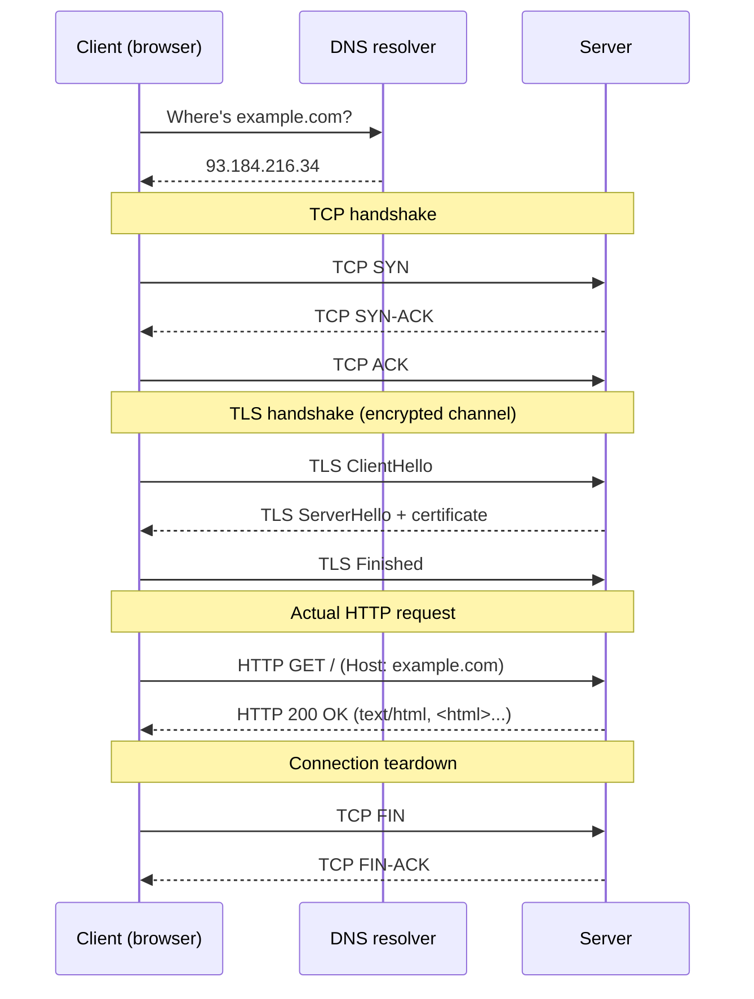

# The Client–Server Model

<AudioPlayer
  src="/lectures/foundations/01-client-server.mp3"
  transcript="/lectures/foundations/01-client-server.txt"
  title="Listen: The Client–Server Model"
/>

> **In one line:** The web is just two computers talking — one asks ("client"), one answers ("server"). Everything else is decoration.

:::tip[In plain English]
When you open Instagram, your phone is the **client**. Instagram's computer in some data center is the **server**. Your phone *asks* the server for the latest posts; the server *replies* with the data. That single back-and-forth — repeated billions of times per second across the planet — is the entire web.
:::

## The core idea

Every interaction on the web is a conversation between two computers:

- A **client** sends a **request**.
- A **server** sends a **response**.

That's the entire model. Every feature you've ever used — Gmail, Netflix, TikTok, your bank's website — is built from this one primitive, repeated billions of times per day.

## What is a client?

A client is whatever sends a request. Most often it's a **web browser** (Chrome, Safari, Firefox, Edge), but it can also be:

- A mobile app making API calls to a backend
- A command-line tool like `curl` or `wget`
- A smart TV, refrigerator, or IoT device
- Another server (servers regularly call other servers)
- An AI agent (increasingly common in 2026)

A client doesn't need to be a "user" — it's just whatever initiates the conversation.

## What is a server?

A server is a long-running program on a computer somewhere on the internet that **listens** for incoming requests and decides how to respond. It's "the server" both as software (the program) and as hardware (the machine it runs on).

A single physical machine can run many server programs. A single server program can handle thousands of simultaneous clients. Modern cloud infrastructure abstracts this further — "your server" might actually be a virtual machine inside a container inside a Kubernetes pod inside a data center.

:::info[Highlight: "Server" is overloaded vocabulary]
You'll hear "server" used to mean four different things:

1. **The physical machine** — a computer in a data center.
2. **The software program** — your Express/Django/Rails process listening for requests.
3. **The whole stack** — "our server" meaning the whole backend system.
4. **A role** — when computer A talks to computer B, B is "the server" of *that* conversation.

Context usually makes it clear. When in doubt, ask "the program, the machine, or the role?"
:::

## A real conversation, end-to-end

When you type `example.com` into a browser, an elaborate dance unfolds in milliseconds. Before reading the diagram, a quick jargon primer:

:::info[Jargon you'll see in the diagram below]
- **DNS** (Domain Name System) — the internet's phone book; translates a name like `example.com` into a numerical IP address.
- **TCP** (Transmission Control Protocol) — the underlying protocol that splits your data into reliable, ordered packets between two machines.
- **SYN / SYN-ACK / ACK** — the three messages of TCP's "handshake," a quick hello/hello-back/got-it that opens a connection.
- **TLS** (Transport Layer Security) — the encryption layer that turns `http://` into `https://`. The browser and server exchange a `ClientHello` and `ServerHello` to agree on keys.
- **HTTP** (HyperText Transfer Protocol) — the actual request/response language ("GET this page," "200 OK here you go") that runs on top of TCP+TLS.
- **FIN** — the polite "I'm done, you can close the connection now" signal.
:::

> **Reading this diagram:** Each arrow is one network round-trip. Notice how *three* separate handshakes (DNS, TCP, TLS) happen before a single byte of your actual webpage is requested. That's why "first paint" feels slow on flaky networks — you're paying for all those handshakes upfront.

That's just the first request. Loading a modern webpage typically involves dozens or hundreds of additional requests for CSS, JavaScript, images, fonts, and API data.

:::note[Try it yourself]
Open your browser's **DevTools → Network** tab and refresh any page. You'll see the entire client–server conversation laid out: every request, every response, every header, every status code. This is the single best debugging skill you can develop early.

Try this on `https://example.com` — the simplest page on the web. You'll see ~1 request. Then try it on `https://nytimes.com` — you'll see 100+ requests for a single page.
:::

## Why this matters

Once you internalize the client–server model, everything else makes sense:

| What people call it          | What it actually is                                          |
|-----------------------------|--------------------------------------------------------------|
| "A REST API"                | A server that responds in a specific style                   |
| "A database connection"     | A client (your backend) talking to a server (the database)   |
| "Server-side rendering"     | HTML built by the server before being sent                   |
| "Client-side rendering"     | HTML built by the browser after the server sends it          |
| "Microservices"             | Many tiny servers, each talking to others as clients         |
| "AI integration"            | Your server is a client of an AI provider's server           |

It's all just clients and servers, all the way down.

:::info[Highlight: If you only remember one thing]
The web is a **conversation between computers**. Every problem you'll ever debug can be reframed as: *"Whose turn was it to talk, and what did they actually say?"* — and DevTools shows you that conversation in real time.
:::

## Common mistakes

:::caution[Where people commonly trip up]
- **Treating "server" as a fixed identity instead of a role.** Your backend is a server to the browser AND a client to Stripe in the same second. When debugging, always ask: *in this conversation, which side started it?*
- **Confusing the machine, the program, and the role.** "The server is down" might mean the box died, the process crashed, or the load balancer pulled it out — three completely different fixes. Be specific about which one you mean.
- **Thinking the server can speak first.** It can't. Even real-time features (chat, push notifications, live scores) start with the *client* opening a connection. Once open, the server can keep talking — but the client always initiates.
- **Skipping the Network tab.** Beginners stare at `console.log` and source code. Most webapp bugs are visible immediately in DevTools → Network — wrong URL, wrong status, missing header. Look at the conversation before reading the code.
:::

## Page checkpoint

<Quiz id="client-server-page" title="Did client/server stick?" sampleSize={2}>

<Question
  prompt="In the client/server model, what initiates the conversation?"
  options={[
    { text: "The server, by polling clients for work" },
    { text: "The client, by sending a request" },
    { text: "The DNS resolver, by broadcasting addresses" },
    { text: "Both sides simultaneously" }
  ]}
  correct={1}
  explanation="The client always starts the conversation. The server is passive — it sits and listens, then responds when asked."
  revisit={{ to: "/docs/foundations/client-server#the-core-idea", label: "Client/server — the core idea" }}
/>

<Question
  prompt="When your backend calls Stripe's API, which role is your backend playing?"
  options={[
    { text: "Server only" },
    { text: "Client (it's the side initiating the request to Stripe)" },
    { text: "Both — it's a peer connection" },
    { text: "Neither — it's a database query" }
  ]}
  correct={1}
  explanation="Client and server are roles per conversation, not fixed identities. Your backend is a server to the browser AND a client to Stripe."
  revisit={{ to: "/docs/foundations/client-server#what-is-a-client", label: "What is a client?" }}
/>

<Question
  prompt="Why does the FIRST request to a brand-new site feel slow even on fast networks?"
  options={[
    { text: "The server is far away" },
    { text: "Three round-trip handshakes (DNS, TCP, TLS) happen before any HTTP byte moves" },
    { text: "Browsers throttle the first request to save battery" },
    { text: "The HTML is always large" }
  ]}
  correct={1}
  explanation="Before the browser can even ask for the HTML, it pays for DNS lookup + TCP handshake + TLS handshake. Each is a network round-trip — on flaky networks, those stack up."
  revisit={{ to: "/docs/foundations/client-server#a-real-conversation-end-to-end", label: "A real conversation, end-to-end" }}
/>

<Question
  prompt="What's the most useful single browser tool for debugging client/server conversations?"
  options={[
    { text: "The Console tab" },
    { text: "The Network tab in DevTools" },
    { text: "The Memory profiler" },
    { text: "The Performance recorder" }
  ]}
  correct={1}
  explanation="The Network tab shows every request and response — method, status, headers, body, timing. Most webapp bugs become obvious here within seconds."
  revisit={{ to: "/docs/foundations/client-server#a-real-conversation-end-to-end", label: "Try it in DevTools" }}
/>

</Quiz>

## What's next

→ Continue to [HTTP & HTTPS Basics](./http-basics) where we'll look at the *language* clients and servers use to talk.
