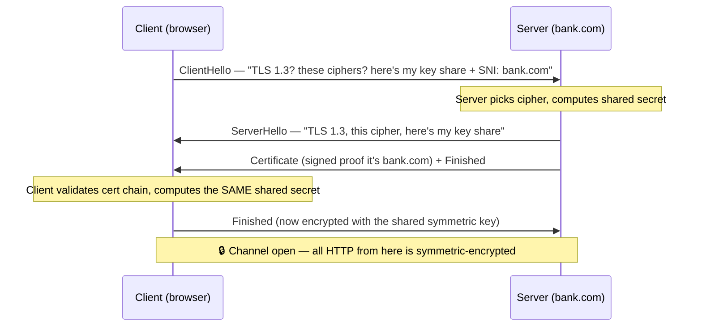
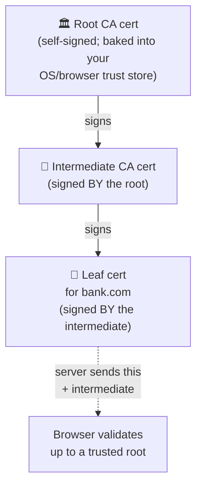

# TLS & HTTPS internals: the handshake, certificates, and trust

> **In one line:** TLS is the layer that turns a wide-open internet connection into a private, tamper-proof, *verified-who-you're-talking-to* channel — and it does it in a few milliseconds before your first byte of HTTP ever moves.

:::tip[In plain English]
Imagine mailing a postcard. Anyone who handles it — the mail carrier, the sorting office, a nosy neighbor — can read it, and could even scribble on it before it arrives. Plain **HTTP** is a postcard. **HTTPS** seals that same message in an envelope that *only the recipient can open*, that *can't be altered without you noticing*, and that comes with *proof the recipient is who they claim to be*. The clever part is how two strangers who have never met agree on a secret envelope in the open, with eavesdroppers watching the whole conversation. That trick is the **TLS handshake**, and this lesson takes it apart.
:::

You met HTTPS one paragraph at a time in [HTTP & HTTPS Basics](./http-basics): *"HTTPS is HTTP wrapped in TLS."* That sentence is true but it hides everything interesting. This lesson opens the box. By the end you'll be able to explain, from first principles, exactly what happens between typing `https://` and seeing a page — and why the cert errors every junior developer hits look the way they do.

## The three things TLS gives you

**TLS (Transport Layer Security)** is an encryption protocol that sits *between* the raw network connection and HTTP. (You'll still hear it called **SSL (Secure Sockets Layer)** — that's the old name for TLS's predecessor; SSL itself is long dead and insecure, but the word stuck, which is why certificates are still called "SSL certificates." When someone says SSL today, they almost always mean TLS.)

TLS provides exactly three guarantees. Every one matters, and each fails differently:

| Guarantee | Plain English | What breaks without it |
|-----------|---------------|------------------------|
| **Confidentiality** | Only you and the server can read the data. | Eavesdroppers (your ISP, a coffee-shop Wi-Fi snoop) read your passwords and cookies. |
| **Integrity** | Nobody can change the data in flight without detection. | An attacker on the network injects ads, malware, or rewrites your bank transfer. |
| **Authentication** | The server *is* `bank.com`, not an impostor. | You connect to a perfect-looking fake; encryption to the *wrong* server is worthless. |

The third one is the one people forget. Encryption alone is useless if you've encrypted your secrets *to the attacker*. Authentication — proving the server's identity — is what certificates are for, and it's half of what makes TLS hard.

## Two kinds of cryptography (the one idea you must hold)

Before the handshake makes sense, you need one concept. There are two families of encryption, and TLS uses **both, for different jobs**.

- **Symmetric encryption** — one shared secret key both encrypts and decrypts. Think of a single physical key that locks and unlocks the same box. It's **fast** — modern CPUs encrypt gigabytes per second. Its problem: both sides need the *same* key, and you can't just send the key over the wire, because an eavesdropper would grab it.

- **Asymmetric encryption** (also called **public-key cryptography**) — a *pair* of keys: a **public key** anyone can have, and a **private key** the owner keeps secret. Anything locked with the public key can only be unlocked with the private key. It's the opposite trade-off: it solves "how do strangers agree on a secret in the open," but it's **slow** — far too slow to encrypt a whole video stream.

> **The whole TLS strategy in one sentence:** use the slow-but-stranger-safe *asymmetric* crypto **once**, at the start, only to agree on a shared *symmetric* key — then switch to the fast symmetric key for all the actual data. Asymmetric-to-establish, symmetric-to-transfer.

That single design decision is why the handshake exists and why it happens only at connection setup.

## The TLS handshake, step by step

When your browser (the **client**) connects to a server over HTTPS, a short negotiation happens *before any HTTP*. Here it is for **TLS 1.3**, the modern version (released 2018, now the default everywhere). TLS 1.3 deliberately trimmed the older 1.2 handshake from two round trips to one — it's faster *and* simpler, so we teach it.

Walk through each message:

1. **ClientHello.** The browser opens with: the highest TLS version it supports, a list of **cipher suites** it can use (a cipher suite is just a named bundle of algorithms — "use *this* key-exchange + *this* symmetric cipher + *this* hash"), and a **key share** — the client's half of the key-agreement math. It also includes **SNI** (more on that below): the hostname it's trying to reach, e.g. `bank.com`.

2. **ServerHello.** The server replies: "Agreed, TLS 1.3, let's use *this* cipher suite," and sends *its* key share. At this exact moment, both sides have each other's key shares — and through a bit of math called **Diffie–Hellman key exchange**, each can independently compute the *same* shared secret **without that secret ever crossing the wire**. (Diffie–Hellman is the genius trick: two people mix public values with their own private values and arrive at an identical result an eavesdropper can't reproduce. You don't need the math — just the outcome: a shared symmetric key, agreed in the open.)

3. **Certificate.** The server sends its **certificate** — a signed digital document proving it really is `bank.com` (we dissect this in the next section). Crucially, the server also signs part of the handshake with its **private key**. Only the true owner of `bank.com`'s private key could produce that signature, so this step is what stops an impostor: they could *copy* the certificate, but they can't forge the signature without the matching private key.

4. **Client validates.** The browser checks the certificate: Is it signed by a trusted authority? Does the name match `bank.com`? Is it still in date? (Next sections cover each check.) If anything fails, *this is where the scary browser warning comes from* — the handshake aborts before any data moves.

5. **Finished, both ways.** Both sides confirm they derived the identical symmetric key by sending a **Finished** message encrypted with it. From here, the asymmetric machinery is retired and **every byte of HTTP rides the fast symmetric key.**

:::info[Highlight: why your data is fast but setup has a cost]
The handshake is the *one* expensive part — a network round trip plus some asymmetric math. That's why connection reuse, **keep-alive**, HTTP/2 multiplexing, and TLS **session resumption** (skip the full handshake on a repeat visit) all matter for performance: they amortize that one-time cost over many requests. TLS 1.3 even offers **0-RTT** ("zero round-trip time") resumption, sending early data on the very first packet to a server you've seen before.
:::

## The certificate: what's actually in it

A **TLS certificate** (the file your hosting platform provisions) is a small signed document. The essential fields:

- **Subject** — who the cert is *for*: the domain name(s), e.g. `bank.com`, `www.bank.com`, or a wildcard `*.bank.com`. (The modern field is **SAN — Subject Alternative Name** — which lists all covered hostnames.)
- **Public key** — the server's public key (the partner to the private key it guards).
- **Issuer** — *who vouched for it*: the authority that signed it.
- **Validity period** — "not before" and "not after" dates. Past "not after," the cert is **expired** and browsers reject it.
- **Signature** — the issuer's cryptographic signature over all of the above.

The browser's job in handshake step 4 is to answer: *do I trust this document?* The answer comes from the **certificate chain**.

## The certificate chain: root → intermediate → leaf

No single document proves a server's identity in isolation. Trust is a **chain**, and it has three links:

- **Leaf certificate** (a.k.a. end-entity cert) — the one *for your domain*, `bank.com`. This is what the server sends. It's signed by an intermediate.
- **Intermediate certificate** — owned by the **Certificate Authority**, signs leaf certs day-to-day. It's signed by the root. Servers send the intermediate alongside the leaf (forgetting to is a classic misconfiguration — see pitfalls).
- **Root certificate** — the **Certificate Authority's** ultimate identity. It's **self-signed** (it vouches for itself) and, critically, it is **pre-installed in your operating system and browser** in a list called the **trust store** (also "root store"). Apple, Microsoft, Mozilla, and Google curate these lists and ship them with updates.

**Why does the browser trust `bank.com`?** It walks the chain upward: the leaf is signed by an intermediate, the intermediate is signed by a root — and *that root is already in the trust store the browser shipped with*. The chain terminates at something the browser was told to trust before you ever opened it. If the chain reaches a known root, ✅; if it dead-ends at an unknown signer, ❌ — that's the `NET::ERR_CERT_AUTHORITY_INVALID` error.

:::note[Why a chain at all, instead of the root signing everything directly?]
Roots are *too valuable to use daily*. A root's private key is kept offline in a vault; if it ever leaked, every cert it signed would be compromised and the root would have to be yanked from billions of devices. So roots sign a handful of **intermediates** once, then go back in the vault. Intermediates do the high-volume signing. If an intermediate is compromised, the CA revokes just that intermediate — the root survives. The chain is a blast-radius limiter.
:::

## Certificate Authorities: who gets to vouch

A **Certificate Authority (CA)** is an organization the browser/OS vendors trust to verify domain ownership and issue certificates. Examples: Let's Encrypt, DigiCert, Google Trust Services, Sectigo. Before a CA issues you a cert for `bank.com`, it makes you **prove you control that domain** — typically by asking you to place a specific file at a URL on the domain, or a specific DNS record. Only then does it sign your leaf cert.

The entire security of the web's identity layer rests on CAs doing this honestly, which is why CAs that misissue certificates get **distrusted** — removed from the root stores — and effectively go out of business overnight. (This has happened: Symantec's CA business was distrusted by browsers in 2018 after misissuance problems.)

## SNI: many sites, one IP address

One server (or one CDN edge node) commonly hosts *thousands* of HTTPS sites on a single IP address. But the certificate is chosen *during* the handshake — before any HTTP `Host:` header is sent. So how does the server know *which* site's certificate to present?

**SNI (Server Name Indication)** solves this. It's a field in the very first **ClientHello** that says, in the clear, *which hostname* the client wants — e.g. `bank.com`. The server reads SNI, picks the matching certificate, and presents it. Without SNI, a shared-IP server couldn't know which cert to serve, and modern HTTPS hosting (every CDN, every shared host) would be impossible.

:::caution[The privacy footnote from HTTP & HTTPS Basics]
SNI is sent **before** encryption is established, so it's visible on the network — this is exactly the "your ISP can see you visited `bank.com`, just not what you read" point from [HTTP & HTTPS Basics](./http-basics#common-mistakes). A newer extension, **Encrypted Client Hello (ECH)**, encrypts SNI too, but it isn't universal yet in 2026.
:::

## Let's Encrypt and ACME: certificates that renew themselves

For most of the web's history, getting a cert meant paying $50–$300/year and installing it by hand. **Let's Encrypt** (a free, nonprofit CA launched in 2015) changed that by issuing certs for free and **automating the whole process** with a protocol called **ACME (Automatic Certificate Management Environment)**.

ACME automates the domain-control proof: a client on your server (Certbot, Caddy, or your hosting platform's built-in agent) asks Let's Encrypt for a cert, gets a **challenge** ("prove you own this domain — place *this* token at `/.well-known/acme-challenge/...` or in *this* DNS record"), satisfies it automatically, and receives the signed cert — no human in the loop.

The catch you must internalize: **Let's Encrypt certs are valid for only 90 days.** That short lifetime is deliberate (it limits damage if a key leaks and forces automation), and it's *why renewal must be automatic*. The ACME client re-runs the challenge and reinstalls a fresh cert well before expiry — typically every 60 days. On managed platforms (Vercel, Netlify, Cloudflare, AWS ACM), this is invisible: you point a domain, they provision and silently renew forever. The cert errors happen when someone runs their *own* server and the renewal cron job dies — see pitfalls.

## HTTPS vs HTTP, recapped at the byte level

Now that you've seen the machinery, the difference from [HTTP & HTTPS Basics](./http-basics) sharpens:

| | HTTP | HTTPS |
|---|------|-------|
| Default port | 80 | 443 |
| Before any data | TCP connect | TCP connect **+ TLS handshake** |
| On the wire | Plaintext (readable) | Ciphertext (symmetric-encrypted) |
| Identity proof | None | Server cert validated against trust store |
| Tamper detection | None | Integrity-checked; tampering breaks the connection |

Same HTTP messages, same methods and status codes — TLS is a **wrapper underneath**, transparent to your application code. Your `fetch()` looks identical either way.

## Traced worked example: what happens when you hit `https://bank.com`

Let's trace one address-bar entry, end to end, naming the layer at each step. This is the whole chapter so far in motion:

1. **DNS resolution.** The browser asks "what's the IP for `bank.com`?" and gets back, say, `203.0.113.10`. (Covered in [DNS](./dns).) *No TLS yet — DNS is its own lookup.*
2. **TCP connection.** The browser opens a **TCP** connection to `203.0.113.10` on **port 443** (the HTTPS port). This is the raw pipe — still unencrypted at this instant.
3. **TLS handshake — ClientHello.** Over that pipe, the browser sends ClientHello: "TLS 1.3, here are my cipher suites, my key share, **SNI: bank.com**."
4. **TLS handshake — ServerHello + Certificate.** The server (it hosts many sites, so it reads SNI to know it's `bank.com`) replies with its cipher choice, its key share, and `bank.com`'s **leaf certificate + the intermediate**.
5. **Certificate validation.** The browser checks the chain: leaf → intermediate → root. The root is in the **trust store** → trusted. It confirms the **SAN** lists `bank.com` (name matches), that *today* is inside the validity window (not expired), and that the server's handshake signature proves it holds the matching private key. ✅ All pass.
6. **Shared key derived.** Via Diffie–Hellman on the two key shares, both sides now hold the same **symmetric** session key — which never crossed the wire. **Finished** messages confirm it.
7. **Encrypted HTTP at last.** *Now* the browser sends the actual HTTP request — `GET / HTTP/1.1`, `Host: bank.com`, cookies, the lot — but symmetric-encrypted. An eavesdropper on the coffee-shop Wi-Fi sees only that you connected to `bank.com` (from SNI/IP) and a stream of ciphertext. The server decrypts, runs your request, encrypts the response, sends it back.

If step 5 had failed — say the cert expired yesterday — the browser would **stop at step 5** and show a full-page warning. No HTTP request is ever sent to an untrusted server. That ordering is why an expired cert takes a whole site down even though "the server is fine": the handshake never completes.

## mTLS: when the *client* must prove itself too

In everything above, only the **server** presents a certificate — the browser stays anonymous (you log in with a password/token at the HTTP layer, not with a cert). **mTLS (mutual TLS)** adds the mirror image: the **client also presents a certificate**, and the server validates *it* before completing the handshake. Now both ends are cryptographically authenticated.

You won't use mTLS for normal public websites — you can't hand every visitor a certificate. Its home is **service-to-service** traffic inside a system: microservice A calling microservice B, where you *can* issue each service its own cert. Service meshes (Istio, Linkerd) and zero-trust networks use mTLS so that even *inside* the network, a service must prove its identity before another will talk to it — there's no implicit trust just for being on the same network. It's the same handshake you learned, run in both directions.

## Why it matters

- **The cert errors every junior hits are now legible.** `ERR_CERT_DATE_INVALID` = expired (renewal failed). `ERR_CERT_AUTHORITY_INVALID` = chain doesn't reach a trusted root (self-signed, or missing intermediate). `ERR_CERT_COMMON_NAME_INVALID` = the SAN doesn't list the hostname you typed. Each maps to one validation check from step 5.
- **CDNs and edge depend on all of this.** A CDN ([CDN & edge](./cdn-and-edge)) terminates TLS at thousands of edge locations, each holding your cert and using SNI to serve the right one. Understanding the handshake explains why edge TLS termination is a feature, not magic.
- **It's the floor of every security conversation.** [Web security](./web-security) lists HTTPS + HSTS as table stakes — and the **HSTS** header you'll meet there ("always use HTTPS for this domain") only makes sense once you know what a downgrade-to-HTTP attack would expose.
- **You'll configure it for real.** The moment you deploy to your own server (not a managed platform), ACME renewal, intermediate bundling, and SNI become *your* job. Knowing the parts is the difference between fixing a dead site in five minutes and guessing for an hour.

## Common mistake

:::caution[Where people commonly trip up]
- **Letting a cert expire.** The single most common production outage of its class. A Let's Encrypt cert lives 90 days; if your renewal cron dies silently, the site goes fully dark at expiry — handshake aborts, every visitor sees a warning. Fix: monitor cert expiry (alert at 14 days left), and let a managed platform or a *tested* auto-renewal handle it. Never renew by hand on a calendar reminder.
- **Mixed content.** Your page loads over `https://`, but a `<script src="http://...">` or `` loads a sub-resource over plain HTTP. Browsers **block** active mixed content (scripts/stylesheets) and warn on passive — your page breaks or shows "not fully secure." Fix: load every sub-resource over HTTPS (use protocol-relative or absolute `https://` URLs).
- **Self-signed certificates in production.** A cert you signed yourself isn't chained to any trusted root, so every browser rejects it with `ERR_CERT_AUTHORITY_INVALID`. Self-signed is fine for *local* development; in production, get a real cert from a CA (free, via Let's Encrypt). Telling users to "click through the warning" trains them to ignore the exact alarm that protects them.
- **Forgetting to send the intermediate certificate.** The server sends only the leaf, not the intermediate that signed it. It works in *your* browser (which happens to have cached that intermediate) but fails for others — the classic "works on my machine, broken cert for half my users." Fix: serve the **full chain** (leaf + intermediate); most ACME clients bundle it automatically (`fullchain.pem`).
- **Believing "HTTPS = secure."** TLS protects data *in transit* — confidentiality, integrity, server identity. It does **nothing** about what happens at either end: XSS, CSRF, SQL injection, broken auth, and a phishing site with a perfectly valid Let's Encrypt cert all live happily *inside* the encrypted tunnel. A green padlock means "the connection is private," **not** "this site is trustworthy." HTTPS is necessary, never sufficient — see [Web security](./web-security).
:::

## Page checkpoint

<Quiz id="foundations-tls-https-internals-page" title="Did TLS internals stick?" sampleSize={3}>

<Question
  prompt="TLS uses asymmetric (public-key) crypto AND symmetric crypto. Why both?"
  options={[
    { text: "Asymmetric is more secure, so it's used for everything important" },
    { text: "Asymmetric crypto safely lets two strangers agree on a shared key in the open, but it's slow — so it's used once at handshake to establish a fast symmetric key, which then encrypts all the actual data" },
    { text: "Symmetric is used for the handshake and asymmetric for the data" },
    { text: "They're alternatives; a connection picks one or the other" }
  ]}
  correct={1}
  explanation="The core TLS design: asymmetric-to-establish, symmetric-to-transfer. Public-key math solves 'agree on a secret in public' but is too slow for bulk data, so it's only used at setup to derive a shared symmetric key that does the heavy lifting."
  revisit={{ to: "/docs/foundations/tls-https-internals#two-kinds-of-cryptography-the-one-idea-you-must-hold", label: "Two kinds of cryptography" }}
/>

<Question
  prompt="Why does a browser trust the leaf certificate presented by bank.com?"
  options={[
    { text: "Because the certificate is encrypted" },
    { text: "Because bank.com signed it itself" },
    { text: "Because it chains up — leaf signed by an intermediate, intermediate signed by a root — and that root is already in the browser's pre-installed trust store" },
    { text: "Because the browser asks Google to verify it on every request" }
  ]}
  correct={2}
  explanation="Trust is a chain that must terminate at a root the browser already shipped with. Leaf → intermediate → root; if the root is in the trust store, the cert is trusted. A self-signed cert dead-ends at an unknown signer, which is why browsers reject it."
  revisit={{ to: "/docs/foundations/tls-https-internals#the-certificate-chain-root--intermediate--leaf", label: "The certificate chain" }}
/>

<Question
  prompt="A site's HTTPS suddenly breaks for everyone with ERR_CERT_DATE_INVALID, though the server is running fine. Most likely cause?"
  options={[
    { text: "A DDoS attack" },
    { text: "The TLS certificate expired — automatic renewal (e.g. the 90-day Let's Encrypt cert via ACME) failed, so cert validation now fails and the handshake aborts before any HTTP is sent" },
    { text: "The database is down" },
    { text: "Mixed content on the homepage" }
  ]}
  correct={1}
  explanation="ERR_CERT_DATE_INVALID maps directly to the validity-window check in handshake validation. Let's Encrypt certs live 90 days and must auto-renew; a dead renewal job means the cert lapses and the handshake fails for every visitor — the server being 'up' is irrelevant because no HTTP is exchanged on an untrusted connection."
  revisit={{ to: "/docs/foundations/tls-https-internals#lets-encrypt-and-acme-certificates-that-renew-themselves", label: "Let's Encrypt & ACME" }}
/>

<Question
  prompt="One server hosts thousands of HTTPS sites on a single IP. How does it know which certificate to present, given the handshake happens before any HTTP Host header?"
  options={[
    { text: "It presents all certificates and the browser picks one" },
    { text: "SNI (Server Name Indication) — the client states the target hostname in the ClientHello, in the clear, so the server can pick the matching certificate" },
    { text: "It guesses from the IP address" },
    { text: "The browser sends the Host header first, then the handshake starts" }
  ]}
  correct={1}
  explanation="SNI carries the hostname inside the very first ClientHello, before encryption, so a shared-IP server (or CDN edge) can choose the right cert. Because it's pre-encryption, SNI is visible on the network — which is why your ISP can see *which* site you visited even over HTTPS."
  revisit={{ to: "/docs/foundations/tls-https-internals#sni-many-sites-one-ip-address", label: "SNI" }}
/>

<Question
  prompt="A page served over HTTPS shows a valid padlock and a real Let's Encrypt certificate. What does that padlock guarantee?"
  options={[
    { text: "The site is safe and trustworthy" },
    { text: "The connection is private and integrity-checked, and the server is the named domain — but it says nothing about XSS, CSRF, injection, or whether the site itself is malicious" },
    { text: "The site has no security vulnerabilities" },
    { text: "Your data is encrypted at rest in the server's database" }
  ]}
  correct={1}
  explanation="HTTPS = confidentiality + integrity + server identity, in transit only. A phishing site can hold a perfectly valid free cert. The padlock means 'the connection is private,' never 'this site is trustworthy or bug-free.' HTTPS is necessary but not sufficient."
  revisit={{ to: "/docs/foundations/tls-https-internals#common-mistake", label: "HTTPS ≠ secure" }}
/>

</Quiz>

## Going deeper & cross-links

- ← Back to the on-ramp: [HTTP & HTTPS Basics](./http-basics) — the request/response shape TLS wraps.
- → The attacks TLS *doesn't* stop: [Web security](./web-security) — XSS, CSRF, CSP, HSTS, and why HTTPS is the floor, not the strategy.
- → Where certs get terminated at scale: [CDN & edge](./cdn-and-edge).

## What's next

→ Continue to [HTTP Methods & Status Codes](./http-methods-and-status) — the *verbs* (GET, POST, PUT…) and numeric *replies* (200, 404, 500…) that now ride inside your encrypted channel.
