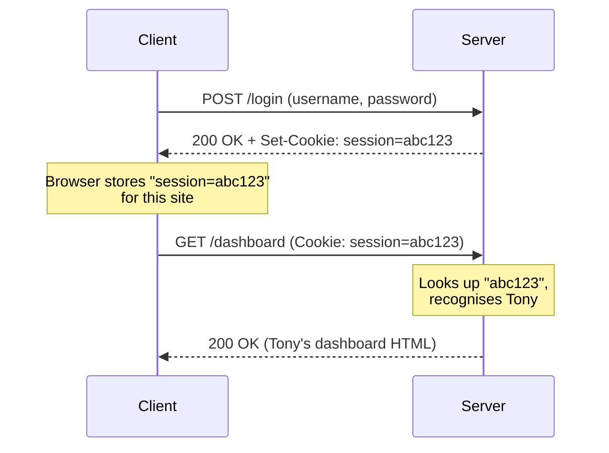

# HTTP Headers & Cookies

> **In one line:** Headers are the envelope on the HTTP letter. Cookies are the server's note to itself, sealed inside the envelope and re-sent on every visit.

:::tip[In plain English]
The body of an HTTP message is the *content* — the JSON, the HTML, the image data. The **headers** are everything else: who you are, what format you want, what language you speak, whether you'll accept compressed data, what site sent you. A **cookie** is just one specific header (`Cookie`) that holds tokens the server wrote and is sending back. That's it.
:::

## What headers are

Headers are key-value pairs of metadata attached to every HTTP request and response. There are hundreds of standard headers. You'll use a few dozen regularly.

### The most important request headers

- `Host` — Which site at this IP you want (a single IP can serve many domains).
- `User-Agent` — What browser/client you are.
- `Accept` — What content types you can handle (`application/json`, `text/html`).
- `Accept-Language` — Preferred languages (e.g., `en-US,en;q=0.9`).
- `Authorization` — Auth credentials (typically `Bearer <token>`).
- `Cookie` — Stored cookies for this domain.
- `Content-Type` — Type of the request body.
- `Content-Length` — Size of the request body.
- `Origin` / `Referer` — Where the request came from (used for CORS and analytics).

### The most important response headers

- `Content-Type` — Type of the response body.
- `Content-Length` — Size of the response body.
- `Set-Cookie` — "Hey browser, store these cookies."
- `Cache-Control` — How to cache this response.
- `ETag` — A version identifier for caching.
- `Location` — Where to redirect to (used with 3xx codes).
- `Access-Control-Allow-Origin` — CORS permissions.
- `Content-Security-Policy` — Security restrictions for the page.

:::note[Worked example: read a real response]
```http
HTTP/2 200 OK
content-type: application/json; charset=utf-8
content-length: 1289
cache-control: public, max-age=300, stale-while-revalidate=60
etag: W/"509-h6k8t"
set-cookie: session=abc123; HttpOnly; Secure; SameSite=Lax
access-control-allow-origin: https://example.com
content-security-policy: default-src 'self'
```

In English: "I'm returning 200 OK with a JSON response of 1289 bytes. Cache me for 5 minutes, and you can serve stale-while-revalidating for another minute. The content version is `509-h6k8t` — re-ask me later with this tag to check. Also, please store this session cookie (which JavaScript cannot read, only sent over HTTPS, and only on same-site requests). **CORS** (Cross-Origin Resource Sharing — the browser rule that lets one site read responses from another) is allowed only from `example.com`. By the way, **CSP** (Content Security Policy — a browser-enforced allowlist of what scripts/images/etc. a page may load) restricts resource loads to the page's own origin."
:::

## Cookies — adding state to a stateless protocol

HTTP is **stateless** (each request is independent — the server has no memory of past requests by default). But your bank needs to remember you between requests. That's what cookies do.

A **cookie** is a small piece of data the server tells the browser to store and re-send on every subsequent request to the same domain. The full flow:



> **Reading this diagram:** The `Set-Cookie` response header is the *one-time hand-off*. After that, the `Cookie` request header rides on every future request automatically — that's how the server keeps recognizing you without you logging in again. The cookie made an otherwise stateless conversation feel like an ongoing session.

## Important cookie attributes

When the server sends `Set-Cookie`, it can attach modifiers that control how the cookie behaves:

| Attribute        | What it does                                                       | Why you care                              |
|------------------|--------------------------------------------------------------------|-------------------------------------------|
| `HttpOnly`       | JavaScript on the page can't read it                               | Prevents XSS attacks from stealing tokens |
| `Secure`         | Only sent over HTTPS                                               | Prevents leakage on insecure networks     |
| `SameSite=Strict` | Cookie *never* sent on cross-site requests                        | Strongest CSRF protection                 |
| `SameSite=Lax`   | Sent on top-level navigations, not on embedded requests            | Reasonable default                        |
| `SameSite=None`  | Sent on all cross-site requests (requires `Secure`)                | Needed for third-party embeds             |
| `Max-Age=N`      | Cookie lives for N seconds                                         | Short tokens are safer                    |
| `Expires=DATE`   | Cookie lives until a specific date                                 | Older style; `Max-Age` is preferred       |
| `Domain` / `Path`| Restricts which URLs the cookie is sent to                         | Useful for multi-subdomain apps           |

:::info[Highlight: the four-attribute "safe cookie" recipe]
For an authentication cookie in 2026, you almost always want:

```
Set-Cookie: session=abc123; HttpOnly; Secure; SameSite=Lax; Max-Age=3600
```

- `HttpOnly` → JavaScript can't read it (XSS-safe).
- `Secure` → Only sent over HTTPS.
- `SameSite=Lax` → Reasonable CSRF protection without breaking common flows.
- `Max-Age` → Expires automatically; don't keep an auth token alive forever.

Set those four things and you've already avoided ~95% of the common cookie security mistakes.
:::

## Sessions vs JWTs (the two flavors of tokens)

After authentication, the server needs to recognize the user on future requests. There are two dominant approaches — both delivered via cookies, but with very different mechanics:

**Session tokens** (server-stored):

1. Server generates a random string, stores it in DB/Redis along with the user ID.
2. Sends it to the client as a cookie.
3. On each request, server looks up the token to find the user.

Pros: Easy to revoke (delete the row); small cookie size.
Cons: Requires storage and a lookup per request.

**JWTs (JSON Web Tokens)** (self-contained):

1. Server creates a JSON payload (user ID, expiration, etc.) and signs it with a secret.
2. Sends it to the client.
3. On each request, server verifies the signature — no DB lookup needed.

Pros: Stateless, scales horizontally without shared session storage.
Cons: Hard to revoke before expiration; larger cookie size.

In 2026, **session tokens are making a comeback** because their downsides matter less with modern Redis/edge KV, and they're simpler to reason about. JWTs are still appropriate for microservices and APIs where stateless auth is valuable.

:::note[Try it yourself]
Open any logged-in website you use. In DevTools, go to **Application → Storage → Cookies**. You'll see every cookie that site has set on your browser. Pick one labeled `session` or `auth` — note the `HttpOnly`, `Secure`, and `SameSite` flags. Now check a site you suspect is older or less secure — you'll often see cookies missing those flags.
:::

## What's next

→ Continue to [DNS: The Internet's Phone Book](./dns) where we'll see how `google.com` actually becomes an IP address.
