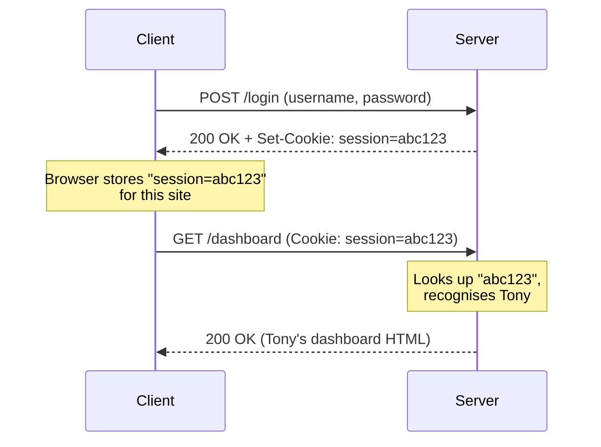

# HTTP Headers & Cookies

> **In one line:** Headers are the envelope on the HTTP letter. Cookies are a note the server wrote, sealed inside the envelope, and re-sent on every visit.

<PageAudience level="beginner">
**New here?** Read top to bottom — every concept on this page builds on the previous one. The two ideas to take away: (1) headers are metadata, (2) cookies are how the web remembers you.
</PageAudience>

<PageAudience level="reader">
**Comfortable with HTTP basics?** Skim the headers tables, then focus on the cookie attributes table and the "safe cookie recipe."
</PageAudience>

<PageAudience level="advanced">
**Reference mode.** This page collapses to: (1) common headers, (2) the four cookie security attributes, (3) sessions vs JWTs. Jump straight to whichever you need.
</PageAudience>

<ReaderLevel show="beginner">

:::tip[In plain English]
The **body** of an HTTP message is the *content* — the JSON, the HTML, the image data. The **headers** are everything else: who you are, what format you want, what language you speak, whether you'll accept compressed data, what site sent you. A **cookie** is just one specific header (`Cookie`) that holds tokens the server wrote and is sending back. That's it.
:::

</ReaderLevel>

## What headers are

<ReaderLevel show="beginner reader">

Headers are key-value pairs of metadata attached to every HTTP request and response. There are hundreds of standard headers. You'll use a few dozen regularly.

</ReaderLevel>

<ReaderLevel show="advanced">

Key-value metadata on requests/responses. The ones below are the high-frequency set.

</ReaderLevel>

### The most important request headers

- `Host` — Which site at this IP you want (a single IP can serve many domains).
- `User-Agent` — What browser/client you are.
- `Accept` — What content types you can handle (`application/json`, `text/html`).
- `Accept-Language` — Preferred languages (e.g., `en-US,en;q=0.9`).
- `Authorization` — Auth credentials (typically `Bearer <token>`).
- `Cookie` — Stored cookies for this domain.
- `Content-Type` — Type of the request body.
- `Content-Length` — Size of the request body.
- `Origin` / `Referer` — Where the request came from (used for CORS and analytics).

### The most important response headers

- `Content-Type` — Type of the response body.
- `Content-Length` — Size of the response body.
- `Set-Cookie` — "Hey browser, store these cookies."
- `Cache-Control` — How to cache this response.
- `ETag` — A version identifier for caching.
- `Location` — Where to redirect to (used with 3xx codes).
- `Access-Control-Allow-Origin` — CORS permissions.
- `Content-Security-Policy` — Security restrictions for the page.

<Quiz id="headers-mq1" variant="micro">
  <Question
    prompt="Which header tells the server what content type your browser PREFERS in the response?"
    options={[
      { text: "Content-Type" },
      { text: "Accept" },
      { text: "Authorization" },
      { text: "Host" }
    ]}
    correct={1}
    explanation="Accept describes what you can RECEIVE. Content-Type describes what you're SENDING (in the request body)."
    revisit={{ to: "/docs/foundations/http-headers-cookies#the-most-important-request-headers", label: "Common request headers" }}
  />
</Quiz>

<ReaderLevel show="beginner reader">

:::note[Worked example: read a real response]
```http
HTTP/2 200 OK
content-type: application/json; charset=utf-8
content-length: 1289
cache-control: public, max-age=300, stale-while-revalidate=60
etag: W/"509-h6k8t"
set-cookie: session=abc123; HttpOnly; Secure; SameSite=Lax
access-control-allow-origin: https://example.com
content-security-policy: default-src 'self'
```

In English: "I'm returning 200 OK with a JSON response of 1289 bytes. Cache me for 5 minutes, and you can serve stale-while-revalidating for another minute. The content version is `509-h6k8t` — re-ask me later with this tag to check. Also, please store this session cookie (which JavaScript cannot read, only sent over HTTPS, and only on same-site requests). **CORS** (Cross-Origin Resource Sharing — the browser rule that lets one site read responses from another) is allowed only from `example.com`. By the way, **CSP** (Content Security Policy — a browser-enforced allowlist of what scripts/images/etc. a page may load) restricts resource loads to the page's own origin."
:::

</ReaderLevel>

## Cookies — adding state to a stateless protocol

<ReaderLevel show="beginner">

HTTP is **stateless**, which means each request is independent — the server has no memory of past requests by default. But your bank obviously needs to remember you between requests, otherwise you'd be re-logging in every time you click a link. That's what cookies do.

A **cookie** is a small piece of data the server tells the browser to store and re-send on every subsequent request to the same domain.

</ReaderLevel>

<ReaderLevel show="reader">

HTTP is **stateless** (each request is independent — the server has no memory of past requests by default). But your bank needs to remember you between requests. That's what cookies do.

A **cookie** is a small piece of data the server tells the browser to store and re-send on every subsequent request to the same domain. The full flow:

</ReaderLevel>

<ReaderLevel show="advanced">

Cookies are how stateless HTTP gets a session. Server sends `Set-Cookie`; browser auto-attaches `Cookie` on subsequent same-domain requests.

</ReaderLevel>

<ReaderLevel show="beginner reader">



</ReaderLevel>

<ReaderLevel show="beginner">

> **Reading this diagram:** The `Set-Cookie` response header is the *one-time hand-off* — it happens once, right after login. After that, the `Cookie` request header rides on every future request automatically, without you doing anything. That's how the server keeps recognizing you without you logging in again. The cookie made an otherwise stateless conversation feel like an ongoing session.

</ReaderLevel>

<ReaderLevel show="reader">

> **Reading this diagram:** The `Set-Cookie` response header is the *one-time hand-off*. After that, the `Cookie` request header rides on every future request automatically — that's how the server keeps recognizing you without you logging in again.

</ReaderLevel>

<Quiz id="headers-mq2" variant="micro">
  <Question
    prompt="On the very first request to a site (no prior cookies), which header is NOT sent?"
    options={[
      { text: "Host" },
      { text: "User-Agent" },
      { text: "Cookie" },
      { text: "Accept" }
    ]}
    correct={2}
    explanation="The Cookie header only appears when the server has previously sent a Set-Cookie that the browser stored. First request = no cookies yet."
    revisit={{ to: "/docs/foundations/http-headers-cookies#cookies--adding-state-to-a-stateless-protocol", label: "Cookies — the round trip" }}
  />
</Quiz>

## Important cookie attributes

<ReaderLevel show="beginner reader">

When the server sends `Set-Cookie`, it can attach modifiers that control how the cookie behaves:

</ReaderLevel>

| Attribute        | What it does                                                       | Why you care                              |
|------------------|--------------------------------------------------------------------|-------------------------------------------|
| `HttpOnly`       | JavaScript on the page can't read it                               | Prevents XSS attacks from stealing tokens |
| `Secure`         | Only sent over HTTPS                                               | Prevents leakage on insecure networks     |
| `SameSite=Strict` | Cookie *never* sent on cross-site requests                        | Strongest CSRF protection                 |
| `SameSite=Lax`   | Sent on top-level navigations, not on embedded requests            | Reasonable default                        |
| `SameSite=None`  | Sent on all cross-site requests (requires `Secure`)                | Needed for third-party embeds             |
| `Max-Age=N`      | Cookie lives for N seconds                                         | Short tokens are safer                    |
| `Expires=DATE`   | Cookie lives until a specific date                                 | Older style; `Max-Age` is preferred       |
| `Domain` / `Path`| Restricts which URLs the cookie is sent to                         | Useful for multi-subdomain apps           |

:::info[Highlight: the four-attribute "safe cookie" recipe]
For an authentication cookie in 2026, you almost always want:

```
Set-Cookie: session=abc123; HttpOnly; Secure; SameSite=Lax; Max-Age=3600
```

- `HttpOnly` → JavaScript can't read it (XSS-safe).
- `Secure` → Only sent over HTTPS.
- `SameSite=Lax` → Reasonable CSRF protection without breaking common flows.
- `Max-Age` → Expires automatically; don't keep an auth token alive forever.

Set those four things and you've already avoided ~95% of the common cookie security mistakes.
:::

<Quiz id="headers-mq3" variant="micro">
  <Question
    prompt="An attacker injects malicious JavaScript via an XSS bug. Which cookie flag specifically prevents that script from stealing your session cookie?"
    options={[
      { text: "Secure" },
      { text: "HttpOnly" },
      { text: "SameSite=Strict" },
      { text: "Max-Age=60" }
    ]}
    correct={1}
    explanation="HttpOnly blocks JavaScript from reading the cookie via document.cookie or any JS API. Secure stops plaintext leaks; SameSite stops CSRF; Max-Age limits lifespan."
    revisit={{ to: "/docs/foundations/http-headers-cookies#important-cookie-attributes", label: "Cookie attributes" }}
  />
</Quiz>

## Sessions vs JWTs (the two flavors of tokens)

<ReaderLevel show="beginner">

After you log in, the server needs some way to recognize you on every following request. There are two common ways to do this — both arrive in the browser as cookies, but they work very differently under the hood.

**Session tokens** (server-stored):

1. The server makes up a random string and writes it down in its database (or Redis) along with your user ID.
2. It sends that string to your browser as a cookie.
3. On each request, the server takes the string out of your cookie, looks it up, and finds your user account.

Think of it like a coat-check ticket. The ticket itself is meaningless — the *server* has the coat with your name on it.

Pros: Easy to log someone out (just delete the row); the cookie is tiny.
Cons: Every request requires a database lookup.

**JWTs (JSON Web Tokens)** (self-contained):

1. The server builds a small JSON object (your user ID, expiration, etc.) and *signs* it cryptographically with a secret only it knows.
2. It sends the whole signed JSON to your browser.
3. On each request, the server just checks the signature. If the signature is valid, it trusts the user ID inside — no database lookup.

Think of it like a stamped event ticket. Anyone with the stamp can verify it's real, no central list needed.

Pros: No shared session storage, scales horizontally for free.
Cons: Hard to invalidate before the expiration date; bigger cookie.

In 2026, **session tokens are making a comeback** because their downsides matter less with modern Redis/edge KV, and they're simpler to reason about. JWTs are still appropriate for microservices and APIs where stateless auth is valuable.

</ReaderLevel>

<ReaderLevel show="reader">

After authentication, the server needs to recognize the user on future requests. There are two dominant approaches — both delivered via cookies, but with very different mechanics:

**Session tokens** (server-stored):

1. Server generates a random string, stores it in DB/Redis along with the user ID.
2. Sends it to the client as a cookie.
3. On each request, server looks up the token to find the user.

Pros: Easy to revoke (delete the row); small cookie size.
Cons: Requires storage and a lookup per request.

**JWTs (JSON Web Tokens)** (self-contained):

1. Server creates a JSON payload (user ID, expiration, etc.) and signs it with a secret.
2. Sends it to the client.
3. On each request, server verifies the signature — no DB lookup needed.

Pros: Stateless, scales horizontally without shared session storage.
Cons: Hard to revoke before expiration; larger cookie size.

In 2026, **session tokens are making a comeback** because their downsides matter less with modern Redis/edge KV, and they're simpler to reason about. JWTs are still appropriate for microservices and APIs where stateless auth is valuable.

</ReaderLevel>

<ReaderLevel show="advanced">

| | Session token | JWT |
|---|---|---|
| Storage | Server (DB/Redis) | Client only |
| Per-request cost | 1 lookup | Signature verify |
| Revocation | Delete row | Hard (needs deny-list) |
| Size | Small (~32 bytes) | Larger (300+ bytes) |
| Best for | Most webapps in 2026 | Microservices, stateless APIs |

2026 default: session tokens. JWTs where statelessness is load-bearing.

</ReaderLevel>

<ReaderLevel show="beginner reader">

:::note[Try it yourself]
Open any logged-in website you use. In DevTools, go to **Application → Storage → Cookies**. You'll see every cookie that site has set on your browser. Pick one labeled `session` or `auth` — note the `HttpOnly`, `Secure`, and `SameSite` flags. Now check a site you suspect is older or less secure — you'll often see cookies missing those flags.
:::

</ReaderLevel>

<Quiz id="headers-mq4" variant="micro">
  <Question
    prompt="You're shutting down a stolen user session right now. Which token style lets you do it instantly with one DB write?"
    options={[
      { text: "JWT (self-contained signed token)" },
      { text: "Server-side session token (random string looked up in Redis/DB)" },
      { text: "Both can be instantly revoked the same way" },
      { text: "Neither — both need to wait for natural expiration" }
    ]}
    correct={1}
    explanation="A session token is just a DB row — delete it and the next request fails the lookup. JWTs are verified by signature without a lookup, so you need a separate deny-list to kill one early."
    revisit={{ to: "/docs/foundations/http-headers-cookies#sessions-vs-jwts-the-two-flavors-of-tokens", label: "Sessions vs JWTs" }}
  />
</Quiz>

## Common mistakes

:::caution[Where people commonly trip up]
- **Storing JWTs in `localStorage`.** Every script on the page can read `localStorage`, including any compromised third-party tag. Put auth tokens in an `HttpOnly; Secure; SameSite=Lax` cookie instead — JavaScript literally can't see it, so XSS can't exfiltrate it.
- **Mixing up `Content-Type` and `Accept`.** `Content-Type` describes what you're *sending* in the body. `Accept` describes what you'll *receive*. Setting `Content-Type: application/json` on a GET request is meaningless (no body) and won't make the server respond in JSON.
- **Setting `SameSite=None` "to be safe."** `None` is *less* safe — it allows cross-site CSRF. It's only needed when you genuinely embed your cookie-bearing endpoint inside someone else's site (third-party widgets). For your own app, `Lax` is the right default.
- **Treating JWTs as logout-friendly.** A JWT is valid until it expires, signature alone. "Logging out" by deleting the token client-side does nothing if a copy already leaked — the server will still accept it. If you need real revocation, use server-side sessions or maintain a deny-list.
- **Forgetting that cookies are sent on *every* request to the domain.** Setting a 4KB cookie means every image, every CSS file, every API call ships those 4KB upstream. Cookies are for identity, not for app state — for app state, use `localStorage`, IndexedDB, or in-memory.
:::

## Quick check

<Quiz id="http-headers-cookies-page" title="Did headers & cookies stick?" sampleSize={3}>

<Question
  prompt="Which header tells the browser to store a cookie?"
  options={[
    { text: "Cookie" },
    { text: "Set-Cookie" },
    { text: "Content-Type" },
    { text: "Authorization" }
  ]}
  correct={1}
  explanation="Set-Cookie is the response header that hands off the cookie. Cookie is the request header that re-sends it on every subsequent request."
  revisit={{ to: "/docs/foundations/http-headers-cookies#cookies--adding-state-to-a-stateless-protocol", label: "Cookies — adding state to a stateless protocol" }}
/>

<Question
  prompt="You're setting an authentication cookie. Which combination is the safest 2026 default?"
  options={[
    { text: "Just Secure" },
    { text: "HttpOnly + Secure + SameSite=Lax + Max-Age" },
    { text: "Domain + Path + Expires" },
    { text: "SameSite=None + Secure" }
  ]}
  correct={1}
  explanation="HttpOnly blocks JavaScript reads (XSS), Secure forces HTTPS, SameSite=Lax mitigates CSRF, Max-Age expires the cookie. Those four together stop ~95% of common cookie mistakes."
  revisit={{ to: "/docs/foundations/http-headers-cookies#important-cookie-attributes", label: "Important cookie attributes" }}
/>

<Question
  prompt="Which is harder to revoke before its expiration date?"
  options={[
    { text: "A server-side session token (random string looked up in Redis)" },
    { text: "A JWT (self-contained signed payload)" },
    { text: "Both can be revoked instantly" },
    { text: "Neither — neither is revocable" }
  ]}
  correct={1}
  explanation="A session token is just a row you delete. A JWT is verified by signature, so without a separate deny-list it remains valid until it expires."
  revisit={{ to: "/docs/foundations/http-headers-cookies#sessions-vs-jwts-the-two-flavors-of-tokens", label: "Sessions vs JWTs" }}
/>

<Question
  prompt="What does the HttpOnly flag do?"
  options={[
    { text: "Sends the cookie only over HTTPS" },
    { text: "Stops JavaScript on the page from reading the cookie" },
    { text: "Blocks cross-site requests from sending it" },
    { text: "Makes the cookie session-only (deleted on tab close)" }
  ]}
  correct={1}
  explanation="HttpOnly hides the cookie from document.cookie / JS APIs, blunting XSS-based token theft. HTTPS-only is the Secure flag; cross-site is SameSite."
  revisit={{ to: "/docs/foundations/http-headers-cookies#important-cookie-attributes", label: "Important cookie attributes" }}
/>

<Question
  prompt="Which header carries the bearer token on most API requests?"
  options={[
    { text: "Cookie" },
    { text: "Authorization" },
    { text: "X-Auth" },
    { text: "Token" }
  ]}
  correct={1}
  explanation="Authorization: Bearer <token> is the standard. Cookies can also carry sessions for browser-driven apps, but API SDKs almost always use Authorization."
  revisit={{ to: "/docs/foundations/http-headers-cookies#the-most-important-request-headers", label: "Common request headers" }}
/>

<Question
  prompt="Which SameSite mode is the most common safe default in 2026?"
  options={[
    { text: "SameSite=None" },
    { text: "SameSite=Strict" },
    { text: "SameSite=Lax" },
    { text: "Omit SameSite entirely" }
  ]}
  correct={2}
  explanation="Lax is sent on top-level navigations but blocked on cross-site embeds — strong CSRF protection without breaking common flows. Strict is even stricter but breaks links from emails; None requires Secure and is only for genuine 3rd-party embeds."
  revisit={{ to: "/docs/foundations/http-headers-cookies#important-cookie-attributes", label: "Important cookie attributes" }}
/>

<Question
  prompt="What does the Content-Type request header tell the server?"
  options={[
    { text: "What format the request BODY is in" },
    { text: "What format the response should be in" },
    { text: "The size of the request" },
    { text: "Which user is logged in" }
  ]}
  correct={0}
  explanation="Content-Type describes the BODY you're sending (e.g. application/json). To negotiate the RESPONSE format, use Accept. Size is Content-Length; user identity is Cookie or Authorization."
  revisit={{ to: "/docs/foundations/http-headers-cookies#the-most-important-request-headers", label: "Common request headers" }}
/>

<Question
  prompt="Why is HTTP described as 'stateless'?"
  options={[
    { text: "Because TLS encrypts the body so it has no readable state" },
    { text: "Because each request is independent — the server has no built-in memory of past ones" },
    { text: "Because requests have no body" },
    { text: "Because servers don't keep databases" }
  ]}
  correct={1}
  explanation="HTTP itself doesn't carry per-user memory across requests. Cookies (and tokens in Authorization) are how we layer state on top of this stateless model."
  revisit={{ to: "/docs/foundations/http-headers-cookies#cookies--adding-state-to-a-stateless-protocol", label: "State on top of stateless HTTP" }}
/>

<Question
  prompt="A response includes Cache-Control: public, max-age=300, stale-while-revalidate=60. What does the stale-while-revalidate=60 part mean?"
  options={[
    { text: "After 300s, refuse to serve the response" },
    { text: "After 300s, the cache may serve the stale copy for up to 60 more seconds while it fetches a fresh one in the background" },
    { text: "The browser must revalidate every 60 seconds" },
    { text: "Only logged-in users can use the cached copy" }
  ]}
  correct={1}
  explanation="stale-while-revalidate trades a tiny bit of freshness for a much faster perceived response — the cached copy returns instantly while a refresh happens in the background."
  revisit={{ to: "/docs/foundations/http-headers-cookies#the-most-important-response-headers", label: "Common response headers" }}
/>

</Quiz>

## What's next

→ Continue to [DNS: The Internet's Phone Book](./dns) where we'll see how `google.com` actually becomes an IP address.
