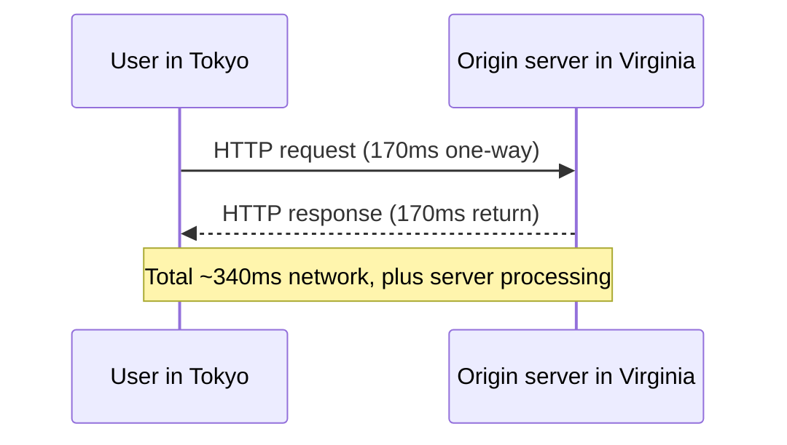
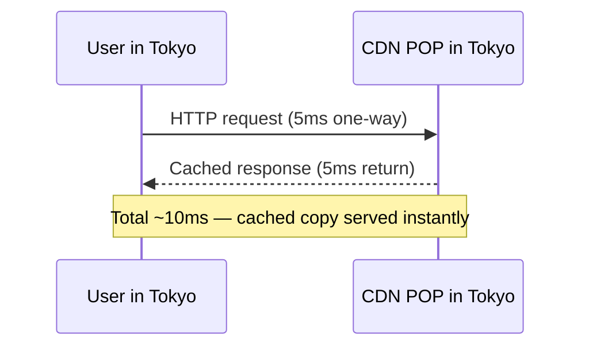

# CDNs and the Edge

> **In one line:** A CDN puts copies of your site near users so each request travels meters instead of thousands of miles. The "edge" is the same idea, but for *code*, not just files.

:::tip In plain English
Imagine you sell books online from a warehouse in New York. A customer in Tokyo orders a book — it takes 10 days to arrive. Now you open small distribution centers in 200 cities globally that each keep copies of your most popular books. Tokyo orders the same book — arrives next day. That's a **CDN** for the web.

Now imagine those distribution centers also have a few employees who can run errands locally — "check the customer's address," "verify their coupon," "stamp the package." That's **edge computing**.
:::

## Why CDNs exist

A few terms first: **origin server** = your one real backend; **POP** (Point of Presence) = a small CDN data center close to the user; **TTL** (Time To Live) = how long a cached copy is allowed to live before being refreshed.

Without a CDN, every request travels all the way to your origin server:

With a CDN cached copy in Tokyo:

That difference — 340ms vs 10ms — is the gap between "this feels broken" and "this feels native."

:::info Highlight: a CDN is also a force shield
Beyond speed, CDNs protect your origin server from traffic spikes and attacks. When 100,000 users hit your homepage simultaneously, the CDN serves them all from cache; your origin server might only see *one* request to refresh the cache. Without a CDN, that traffic would crush a small backend in seconds.
:::

## The major CDNs in 2026

| CDN                  | Reputation                                                      |
|----------------------|-----------------------------------------------------------------|
| **Cloudflare**       | Largest, generous free tier, strong edge runtime (Workers)      |
| **AWS CloudFront**   | Integrated with the AWS ecosystem; standard enterprise pick     |
| **Fastly**           | Very developer-friendly, fast cache invalidation                |
| **Akamai**           | Oldest and largest by reach; common in legacy enterprise        |
| **Google Cloud CDN** | Integrated with GCP; less commonly chosen on its own            |

If you're starting fresh, **Cloudflare** is usually the right default — free tier covers most personal projects, integration with their edge runtime is best-in-class.

## What gets cached

CDNs cache **static assets** (images, videos, fonts, JS/CSS bundles) by default. They can *also* cache HTML responses for sites that don't personalize per user.

Modern CDNs cache aggressively and support **stale-while-revalidate** — serving the cached version instantly while fetching a fresh one in the background. The next user gets the fresh copy; the current user never waits.

:::note Worked example: how a request flows through a CDN
A user in Tokyo requests `https://example.com/logo.png`:

1. Their request hits the Cloudflare POP in Tokyo.
2. Cloudflare checks: "is `/logo.png` in the cache?"
   - **Hit:** Returns the cached image instantly. ~5ms total.
   - **Miss:** Forwards the request to your origin in Virginia, gets the image, stores it locally, and returns it. ~350ms this time. Every Tokyo user after that gets ~5ms.
3. Cloudflare respects the `Cache-Control` header your origin sent. `max-age=86400` → cache for a day.

Read that loop a few times — every CDN works this way. Once it clicks, CDN debugging becomes obvious: "Is it cached? Is the TTL right? Did the origin send the right cache headers?"
:::

## The edge — running code, not just serving files

**Edge computing** extends CDNs from caching to *executing code*. Cloudflare Workers, Vercel Edge Functions, AWS Lambda@Edge, and Deno Deploy let you run JavaScript (or WebAssembly) at edge locations.

Why this matters:

- **Authentication** can run at the edge — reject unauthorized requests before they touch your main servers.
- **Personalization** can happen at the edge — modify HTML based on the user's country, device, or cookies.
- **API responses** can come from the edge — never hitting a centralized server.

The trade-off: edge runtimes are usually constrained (smaller CPU/memory limits, no filesystem, limited Node APIs). They're great for small handlers, not full applications.

:::info Highlight: the biggest 2026 architectural pattern
**Edge-first apps** — most logic runs at the edge, with a regional database (or globally distributed database like Cloudflare D1, Turso, or Spanner) for state. This pattern dominates new green-field apps in 2026, replacing the older "single region, scale vertically" default.
:::

## What's next

→ Continue to [The Browser as a Runtime](./browser-runtime) where we'll look inside the most-used application platform on Earth — the browser on your laptop or phone.
