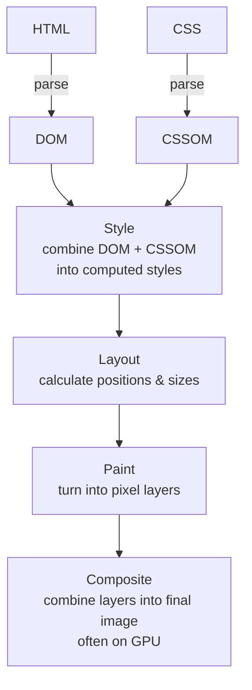

# The Rendering Pipeline

> **In one line:** HTML and CSS become pixels through a five-step pipeline. Knowing which step each CSS change triggers is the difference between a 60fps interface and a janky one.

:::tip[In plain English]
Imagine the browser is a chef preparing a meal:
1. Read the recipe (parse HTML → build DOM).
2. Read the seasoning chart (parse CSS → build CSSOM).
3. Plan out the plate (combine DOM + CSSOM → style + layout).
4. Cook each component (paint).
5. Plate it (composite layers).

A small recipe change (color of the parsley) only redoes step 4. A big change (size of the main dish) sends you back to step 3. The same is true in browsers, and it determines whether your UI feels smooth or stutters.
:::

## The pipeline

When a browser receives HTML, it executes a multi-step pipeline. Quick jargon: **DOM** = Document Object Model (an in-memory tree of HTML elements); **CSSOM** = the same idea for CSS rules; **composite** = stitching together pre-painted layers, typically on the GPU.



> **Reading this diagram:** Two inputs (HTML and CSS) merge at the "Style" step, then the flow is strictly linear. Each downstream step is cheaper if the steps above didn't change — that's why some animations are 60fps and others stutter.

## Which step does your change trigger?

Understanding this pipeline is essential for performance:

| You change…           | Pipeline triggered                       | Cost     |
|-----------------------|-------------------------------------------|----------|
| `width`, `height`     | **Layout** (recalculate positions everywhere) | Expensive |
| `font-size`, `padding`| **Layout**                                | Expensive |
| `color`, `background` | **Paint** (no layout change)              | Cheaper   |
| `border-color`        | **Paint**                                 | Cheaper   |
| `transform`, `opacity`| **Composite only** (GPU does it)          | Very cheap |

This is why CSS animations using `transform` are 60fps smooth and animations using `top`/`left` often stutter.

:::note[Worked example: animate a card sliding in]
**Slow (triggers layout every frame):**
```css
.card {
  transition: left 300ms ease;
}
.card.in { left: 0; }
.card.out { left: 100%; }
```

**Fast (only composite):**
```css
.card {
  transition: transform 300ms ease;
}
.card.in  { transform: translateX(0); }
.card.out { transform: translateX(100%); }
```

The two look identical to the user. The second is dramatically smoother — the GPU handles the entire animation without involving the main thread.
:::

## The critical rendering path

The **critical rendering path** is what the browser must do before it can show the user *anything*. Optimizing this path is the foundation of fast-loading sites.

Things that block rendering:

- **Render-blocking CSS** — The browser must parse all CSS before first paint.
- **Render-blocking JavaScript** — `<script>` tags without `async` or `defer` block parsing.
- **Synchronous fonts** — The browser may wait for fonts before painting text (FOIT = Flash of Invisible Text).
- **Large HTML** — Larger documents take longer to parse.

Modern best practices:

- **Inline critical CSS** for above-the-fold content (put the styles your initial view needs directly in the HTML).
- Use `<script defer>` or `<script type="module">` (which defers by default).
- **Preload key resources** with `<link rel="preload" as="font" ...>`.
- Use `font-display: swap` to show fallback text immediately while custom fonts load.
- **Lazy-load images below the fold** with `loading="lazy"`.

The framework you choose largely handles this for you, but understanding what's underneath matters when things go wrong.

:::info[Highlight: the LCP shortcut]
The most important performance metric in 2026 is **LCP (Largest Contentful Paint)** — how long until the largest above-the-fold element (usually a hero image or headline) is visible. Google ranks sites on it.

To make LCP fast, ensure:
1. Your HTML returns quickly (server-rendered, not blank shell with JS).
2. The LCP element's resource (hero image, hero CSS) is **preloaded** so it starts downloading the moment the HTML arrives.
3. No JavaScript blocks the page's initial render.

Most LCP problems trace to violating #1, #2, or #3.
:::

:::note[Try it yourself]
Open any site and run Chrome DevTools → **Lighthouse** → Analyze page load. The "Performance" section will tell you your LCP, FID, CLS, and TBT scores, and *exactly* which resources are blocking rendering. Run it on your own site (or any side project) — the suggestions are often the highest-leverage performance wins you'll find.
:::

## What's next

→ Continue to [Rendering Strategies Overview](./rendering-strategies) where the question shifts from *how* HTML becomes pixels to *who* builds the HTML in the first place — and when.
