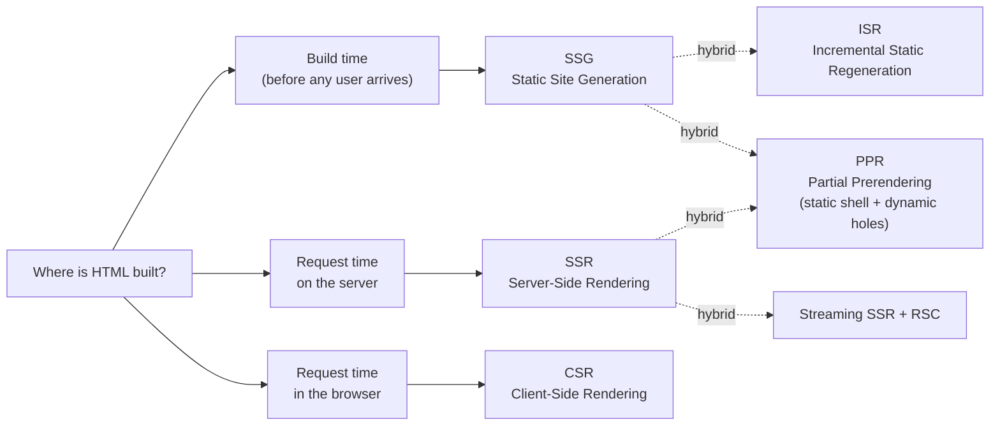
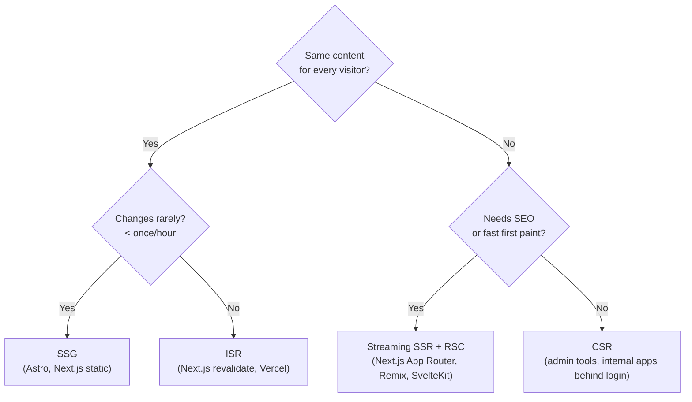

# Rendering Strategies Overview

> **In one line:** "Rendering strategy" answers one question: *who builds the HTML, and when?* Three possible answers — at build time, at request time on the server, or in the browser — give you SSG, SSR, and CSR. Modern apps mix them.

:::tip[In plain English]
Every web page is just HTML. The browser only knows how to display HTML. So somebody, somewhere, has to *build* that HTML. There are exactly three places it can happen:

1. **At build time** (the developer's laptop or CI server, before any user shows up)
2. **At request time, on a server**
3. **At request time, in the user's browser**

Each choice has dramatic consequences for speed, SEO, freshness of data, cost, and complexity. The next few pages walk through each option in detail.
:::

## The three core strategies (and the hybrids on top)

> **Reading this diagram:** The top row is the *three pure choices* — every page has to be built somewhere. The dotted "hybrid" lines show how modern frameworks like Next.js mix those pure choices on the same page (e.g., a mostly-static page with one live "hole" served per request).

## A first-glance comparison

| Strategy | When HTML is built | Speed of first paint | Data freshness   | Hosting needed   | Best for                          |
|----------|--------------------|----------------------|-------------------|------------------|-----------------------------------|
| SSG      | Build time         | ⚡⚡⚡ Fastest         | Stale until rebuild | CDN only         | Blogs, docs, marketing            |
| SSR      | Per request, server | ⚡⚡ Fast              | Fresh             | Running server   | E-commerce, dashboards            |
| CSR      | In the browser     | ⚡ Slow first load     | Fresh (after API) | CDN only         | Internal tools, admin             |
| ISR      | Build + occasional rebuild | ⚡⚡⚡ Fastest cached | Stale up to TTL | Vercel/Netlify   | Large catalogs                    |
| Streaming SSR + RSC | Per request, streamed | ⚡⚡ Fast progressive | Fresh           | Running server   | Most new full-stack apps          |
| PPR      | Static shell + dynamic holes | ⚡⚡⚡ Best of both | Mixed         | Vercel-class     | The 2026 leading edge             |

Don't try to memorize the table. Read it once. The next six pages explain each row in detail with diagrams and worked examples.

:::info[Highlight: this is the single most-overcomplicated topic in modern web dev]
You'll see endless blog posts, conference talks, and Twitter threads arguing about rendering strategies. **You don't need a strong opinion on day one.** Pick what your framework defaults to:

- **Next.js** defaults to a smart mix of Streaming SSR and SSG.
- **Astro** defaults to SSG with selective "islands" of client-side JS.
- **Remix** defaults to SSR.
- **SvelteKit** defaults to a smart mix.

Each is a reasonable default. Only optimize away from the default when you have a *specific* problem the default doesn't solve.
:::

## A quick decision tree

Use this when you have to choose for a specific page:

## What's next

→ Continue to [SSG — Static Site Generation](./ssg) for the simplest and oldest strategy: pre-build everything, serve from a CDN.
