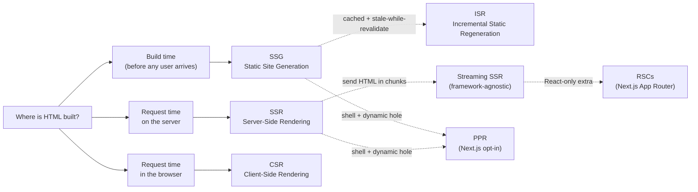
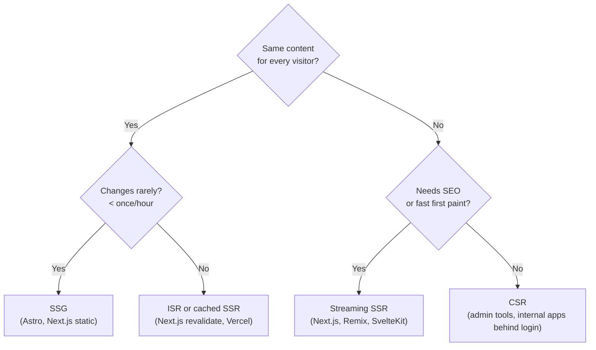

# Rendering Strategies Overview

> **In one line:** Rendering strategy answers two related questions — *when is the first useful HTML produced?* and *how much JavaScript is needed afterward to make the page interactive?* The classic answers are SSG, SSR, and CSR. Modern frameworks rarely pick just one.

:::tip[In plain English]
Every web page is HTML. The browser only knows how to display HTML. So somebody, somewhere, has to *build* that HTML — and then JavaScript usually has to come along behind it to make buttons, forms, and widgets actually work.

There are **three baseline moments** when the HTML can be built:

1. **Build time** — on the developer's laptop or CI server, before any user shows up.
2. **Request time, on a server** — when a real user asks for the page.
3. **Request time, in the user's browser** — JavaScript builds the HTML after the empty shell loads.

Real apps don't pick just one. They mix static shells, cached data, streamed sections, server components, and client-side islands depending on the page. The next few pages walk through each pure choice — and the hybrids that combine them.
:::

## Rendering vs hydration — the distinction beginners miss

Two things happen on a typical modern page load, and beginners often conflate them:

| Step          | What it does                                              | When the user can…             |
|--------------|-----------------------------------------------------------|--------------------------------|
| **Rendering** | Produces the HTML/DOM the user can *see*.                 | …read content.                  |
| **Hydration** | Attaches JavaScript behavior to the existing DOM.         | …click buttons, submit forms, see widgets update. |

A page can be **rendered but not yet hydrated** — visible but inert. A button shows on screen; clicking it does nothing for a moment. This is the source of the famous "uncanny valley" feeling on slow modern apps.

- **SSR + hydration** ships HTML first, then JS hydrates it. The page is visible early and becomes interactive later.
- **CSR** delays both rendering *and* hydration until the JS bundle loads — slower first paint, but they happen close together.
- **SSG** ships pre-built HTML; hydration is optional (Astro for example skips hydration for components that don't need it).

When someone says "server-rendered," ask: *and does it also need hydration?* For almost every React/Vue/Svelte app, the answer is yes.

## The three pure strategies (and the hybrids on top)

> **Reading this diagram:** The top row is the *three baseline moments* — every page has to be built somewhere. The dotted lines show how modern frameworks stack hybrids on top. Note that **streaming SSR is framework-agnostic** (Next.js, Remix, SvelteKit, Nuxt all do it), while **RSCs and PPR are Next.js-specific** flavors layered on top.

## A first-glance comparison

| Strategy | When HTML is built | First useful paint | JS sent to browser | Data freshness | Server cost per req | Main risk |
|----------|--------------------|---------------------|--------------------|----------------|----------------------|-----------|
| **SSG** | Build time | Very fast (CDN hit) | Optional / minimal | Stale until rebuild | $0 (CDN only) | Long build for big sites; can't personalize |
| **SSR** | Per request, server | Depends on data speed — usually fast, sometimes slow | Hydration bundle | Always fresh | Linear with traffic | Slow data = slow first paint |
| **CSR** | In the browser | Slow (blank until JS loads) | Largest (whole app) | Fresh after API call | $0 (CDN only) | Bad SEO / LCP; bad on slow networks |
| **ISR** | Build + rebuild on TTL | Very fast (CDN hit) | Same as SSG | Stale up to TTL | $0 normally; rebuild traffic | Eventual consistency; surprise stale data |
| **Streaming SSR** | Per request, sent in chunks | Fast for above-the-fold | Hydration bundle | Always fresh | Linear with traffic | Suspense / boundary bugs hard to debug |
| **RSCs** (React, on top of streaming SSR) | Per request, server-only components | Fast | *Less* than plain SSR (server components ship 0 JS) | Always fresh | Linear with traffic | "Server vs client" boundary is subtle |
| **PPR** (Next.js, opt-in) | Static shell + per-request holes | Very fast (shell is CDN) | Hydration bundle | Mixed (static parts stale; holes fresh) | Cheap (only the holes hit origin) | Newer, opt-in, less ecosystem coverage |

> **A note on "fast first paint":** SSR is often described as "fast" — but it can be slow when data is slow. CSR can *feel* fast after the first load but typically loses on LCP. Speed isn't a single number — it's a curve that depends on data, network, and how much JS you ship.

:::info[Highlight: these are not competing options — they stack]
A common misconception is that RSC, SSR, ISR, and PPR are alternatives you must choose between. They're not. On a single Next.js page you can have:

- A **statically prerendered** header and footer (SSG / PPR shell).
- A **streamed server component** rendering the main content (streaming SSR + RSC).
- A **cached server component** that ISR-revalidates every hour.
- A **client component** with `"use client"` running an interactive widget (CSR).

The skill is matching the right strategy to the right *section of the page*, not to the whole app.
:::

## A concrete real-world stack

Imagine you're building a typical SaaS app. Different pages have different needs:

| Page                          | Sensible strategy                          | Why                                              |
|-------------------------------|--------------------------------------------|--------------------------------------------------|
| Marketing homepage            | **SSG** (or PPR shell)                     | Content rarely changes; SEO critical             |
| Pricing / about / blog        | **SSG**                                    | Same as marketing                                |
| Product catalog listing       | **ISR** or cached server rendering         | Changes occasionally; SEO matters; thousands of pages |
| Single product page (price/inventory) | **SSR** or streamed dynamic section | Must be live; SEO matters                        |
| Cart drawer                   | **CSR / client component**                 | Personalized, no SEO, needs instant updates      |
| Checkout                      | **SSR** with client islands                | Personalized; some live validation               |
| User dashboard                | **SSR** (behind auth) or CSR               | Personalized; usually no SEO                     |
| Admin panel                   | **CSR**                                    | Behind auth; SEO irrelevant; complex UI          |

The marketing homepage and the admin panel use **completely different strategies** even though they're the same app. That's normal — and good.

## A quick decision tree

Use this when you have to choose for a specific page:

## Common mistakes

:::caution[Where people commonly trip up]
- **Using CSR for public SEO pages.** Google's crawler runs JS inconsistently, and most other crawlers — Slack, Discord, Twitter link previews — don't run it at all. If a human will arrive via search or a shared link, don't ship them a blank `
`.
- **Treating "server-rendered" as "no JavaScript."** Almost every React/Vue/Svelte SSR setup still ships a hydration bundle the same size as a SPA. If you actually need zero JS, look at Astro or HTMX — vanilla SSR is *not* that.
- **Treating RSC, SSR, ISR, and PPR as competing options.** They stack on the same page — a static shell, a streamed server component, a cached server component, and a client island can all live in one route. The question is which mode fits each *section*, not the whole app.
- **Picking a strategy before picking a framework.** The framework you adopt makes most of these choices for you — Next.js App Router defaults to server components with streaming, Astro defaults to SSG, Remix defaults to SSR. Choose the framework first; the strategy falls out.
- **Optimizing for a problem you don't have.** PPR and selective caching are real wins at scale, but if you have 50 users a day, vanilla framework defaults will be fine for years. Don't burn complexity on traffic you don't yet see.
:::

:::info[Highlight: this is the single most-overcomplicated topic in modern web dev]
You'll see endless blog posts, conference talks, and Twitter threads arguing about rendering strategies. **You don't need a strong opinion on day one.** Pick what your framework defaults to:

- **Next.js (App Router)** — server components by default, with streaming and selective caching.
- **Astro** — SSG by default, with selective "islands" of client-side JS.
- **Remix / React Router v7** — SSR by default, with `loader`-based data.
- **SvelteKit** — a smart mix; SSR with prerender opt-in.

Each is a reasonable default. Only optimize away from the default when you have a *specific* problem the default doesn't solve.
:::

## Page checkpoint

<Quiz id="rendering-strategies-page" title="Did rendering strategies stick?" sampleSize={3}>

<Question
  prompt="What are the three baseline moments at which HTML can be built?"
  options={[
    { text: "Compile time, link time, run time" },
    { text: "Build time, request time on the server, request time in the browser" },
    { text: "Deploy time, build time, request time" },
    { text: "Server time, client time, edge time" }
  ]}
  correct={1}
  explanation="SSG builds at build time, SSR builds per request on the server, CSR builds in the browser via JavaScript. The hybrids (ISR, streaming, PPR) layer on top of those three."
  revisit={{ to: "/docs/foundations/rendering-strategies#the-three-pure-strategies-and-the-hybrids-on-top", label: "The three pure strategies" }}
/>

<Question
  prompt="What's the difference between 'rendering' and 'hydration' on a modern page load?"
  options={[
    { text: "They mean the same thing — different names for the same step" },
    { text: "Rendering produces the visible HTML/DOM; hydration attaches JavaScript so buttons and forms work" },
    { text: "Rendering happens on the client; hydration happens on the server" },
    { text: "Hydration is for CSS; rendering is for HTML" }
  ]}
  correct={1}
  explanation="Rendering = users can SEE content. Hydration = users can INTERACT with it. A page can be rendered but not yet hydrated — that's the 'visible but inert' uncanny-valley feeling."
  revisit={{ to: "/docs/foundations/rendering-strategies#rendering-vs-hydration--the-distinction-beginners-miss", label: "Rendering vs hydration" }}
/>

<Question
  prompt="You're choosing a strategy for a marketing homepage — content rarely changes, SEO matters a lot, and traffic is global. What's the most natural fit?"
  options={[
    { text: "Pure CSR" },
    { text: "Per-request SSR" },
    { text: "SSG (or a static PPR shell)" },
    { text: "WebSockets" }
  ]}
  correct={2}
  explanation="Marketing pages are the textbook SSG use case: pre-build once, serve from a CDN. CSR is bad for SEO; SSR is wasteful when nothing changes; WebSockets aren't a rendering strategy."
  revisit={{ to: "/docs/foundations/rendering-strategies#a-concrete-real-world-stack", label: "A concrete real-world stack" }}
/>

<Question
  prompt="Which of these is the most common BEGINNER misconception about rendering strategies?"
  options={[
    { text: "That CSR is faster than SSR after the initial load" },
    { text: "That RSC, SSR, ISR, and PPR are competing options you must choose between, when in fact they stack on the same page" },
    { text: "That CDNs only cache static images" },
    { text: "That SSG sites can't be deployed without a server" }
  ]}
  correct={1}
  explanation="A single Next.js page can mix a static shell, a streamed server component, a cached server component, and a client component. The skill is matching the right strategy to each section, not picking one for the whole app."
  revisit={{ to: "/docs/foundations/rendering-strategies#common-mistakes", label: "Common mistakes" }}
/>

</Quiz>

## What's next

→ Continue to [SSG — Static Site Generation](./ssg) for the simplest and oldest strategy: pre-build everything, serve from a CDN.
