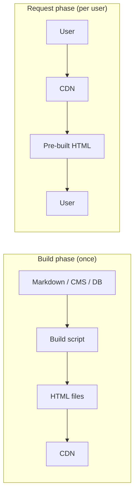

# SSG — Static Site Generation

> **In one line:** Pre-build every page once, dump them on a CDN, serve them in 10ms forever. The web's oldest and still cheapest strategy.

:::tip[In plain English]
You write your site, then run `npm run build`. The build script produces a folder full of plain `.html` files — one per page — plus images and CSS. You upload that folder to a CDN. Done. Users get instant page loads because the CDN already has the HTML; there's no server doing work per request. The trade-off: if your data changes, you have to rebuild and redeploy.
:::

## How SSG works

HTML is generated at **build time**. Every URL becomes a pre-built `.html` file that lives on a CDN.

**Flow:**

1. Developer (or CI) runs `npm run build`.
2. Build process queries any data sources (CMS, database, markdown files), renders every page, writes static files to a `build/` or `dist/` folder.
3. Files are uploaded to a CDN.
4. Users request URLs; CDN serves cached HTML instantly.



> **Reading this diagram:** The origin server only does work in the top half, *once*, at build time. The bottom half — what users actually experience — is just file serving from the CDN. That asymmetry is the whole reason SSG is fast and cheap.

## Pros

- **Fastest possible response** (it's already on the CDN edge).
- **Cheapest hosting** (no servers needed, just file storage).
- **Most secure** (no server-side code to exploit at request time).
- **Easy to scale** (CDNs scale infinitely).
- **Deployable to anything that serves files** (Vercel, Netlify, Cloudflare Pages, GitHub Pages, S3, even a USB drive on a Raspberry Pi).

## Cons

- **Stale data** unless rebuilt.
- **Long build times for large sites** (10,000 pages → 30+ minutes).
- **Hard to personalize per user** — every visitor gets the same HTML.

## When to use SSG

| Site type        | SSG fit?              |
|------------------|------------------------|
| Personal blog    | ✅ Perfect              |
| Documentation    | ✅ Perfect (this site is SSG!) |
| Marketing site   | ✅ Perfect              |
| Portfolio        | ✅ Perfect              |
| E-commerce       | ⚠️  OK for the catalog, but checkout/cart needs SSR |
| Dashboard        | ❌ Use SSR or CSR       |
| Real-time chat   | ❌ Use CSR + WebSockets |

:::note[Worked example: this site is SSG]
This very documentation site is built with Docusaurus. When the maintainer pushes to the main branch:

1. GitHub Actions runs `npm run build`.
2. Docusaurus reads every markdown file in `docs/` and produces a folder of `.html` files (one per page).
3. The folder is uploaded to GitHub Pages.
4. When you visit a page, GitHub's CDN serves you the pre-built HTML in ~30ms.

No server runs at request time. Everything you're reading is a static file. That's why it loads instantly.
:::

## The tools

| Tool            | Best for                                                          |
|----------------|-------------------------------------------------------------------|
| **Astro**       | Purest SSG framework in 2026. Selective "islands" of JS for interactivity. |
| **Next.js**     | (in static mode) — biggest ecosystem, easy to move to SSR later  |
| **Hugo**        | Very fast (Go-based). Massive sites compile in seconds.         |
| **Eleventy (11ty)** | Minimal JavaScript, very flexible templating.                  |
| **Jekyll**      | Original; powers GitHub Pages by default. Ruby.                  |
| **Hexo / Gatsby** | Older choices, still in use.                                    |

:::info[Highlight: Astro is the 2026 default for content sites]
If you're starting a new blog, doc site, or portfolio in 2026, **Astro** is the default recommendation. It generates fully static HTML by default, lets you embed components from any framework (React, Vue, Svelte) for the interactive bits, and ships almost no JavaScript by default. Page weight is tiny; Lighthouse scores are near-perfect out of the box.
:::

:::note[Try it yourself]
```bash
npm create astro@latest
# pick the "Empty" template
cd my-astro-site
npm run dev    # local dev server
npm run build  # produces ./dist with pure HTML files
ls dist/       # see your generated static site
```

Open one of the generated `.html` files in your editor. There's no JavaScript framework runtime in there. It's just HTML. That's SSG.
:::

## Common mistakes

:::caution[Where people commonly trip up]
- **Trying to put per-user data on a static page.** "Hi, Tony" can't live in pre-built HTML — every visitor would see "Tony." Either render that section on the client after the static shell loads, or move the page to SSR. Don't try to bend SSG into personalization.
- **Letting build times balloon silently.** 200 markdown files build in 8 seconds; 50,000 product pages take 35 minutes and your CI starts failing on timeout. Watch your build time per page like you watch P95 latency — if it's trending up, plan the move to ISR or on-demand rendering before the next CMS dump kills you.
- **Forgetting that "any data change requires a redeploy."** A marketing team that wants to fix a typo at 9pm on a Friday cannot if the site is pure SSG and no one knows how to trigger the build. Either give them an on-demand revalidation hook (Vercel, Netlify) or accept the manual deploy cost — but make that choice consciously.
- **Shipping a fat JS bundle on a static site.** SSG sites are often *theoretically* zero-JS but in practice they ship a 250KB React runtime because that's the framework default. If you picked SSG for speed, audit `Network → JS` and consider Astro for genuinely-tiny pages.
- **Skipping a sitemap and `<link rel="canonical">`.** SSG gives you SEO-friendly HTML for free, but search engines still need to find the URLs and know which is canonical when query strings vary. Most static frameworks have a plugin — turn it on.
:::

## Page checkpoint

<Quiz id="ssg-page" title="Did SSG stick?" sampleSize={3}>

<Question
  prompt="When is HTML actually generated in a pure SSG setup?"
  options={[
    { text: "On every user request, on the server" },
    { text: "In the user's browser, after the JS bundle downloads" },
    { text: "Once at build time, before any user shows up" },
    { text: "Continuously, every few seconds in the background" }
  ]}
  correct={2}
  explanation="SSG renders every page once at build time and uploads the .html files to a CDN. At request time, there's no server doing work — the CDN just serves the prebuilt files."
  revisit={{ to: "/docs/foundations/ssg#how-ssg-works", label: "How SSG works" }}
/>

<Question
  prompt="Which use case is the WORST fit for SSG?"
  options={[
    { text: "A personal blog" },
    { text: "A documentation site" },
    { text: "A real-time chat app with live presence" },
    { text: "A static marketing page" }
  ]}
  correct={2}
  explanation="SSG produces the same HTML for every visitor and doesn't update until you rebuild. Real-time chat needs live, personalized, constantly-changing data — that's a job for CSR + WebSockets (or SSR), not SSG."
  revisit={{ to: "/docs/foundations/ssg#when-to-use-ssg", label: "When to use SSG" }}
/>

<Question
  prompt="What's the biggest practical downside of SSG for a large site?"
  options={[
    { text: "It's bad for SEO" },
    { text: "It requires expensive servers" },
    { text: "Build times grow with the number of pages — 10,000 pages can mean a 30+ minute build, and data is stale until the next rebuild" },
    { text: "It can't be deployed to a CDN" }
  ]}
  correct={2}
  explanation="SSG is fast and cheap at request time, but expensive at BUILD time. Big sites take long to rebuild, and any data change requires a redeploy. ISR was invented exactly to fix this."
  revisit={{ to: "/docs/foundations/ssg#cons", label: "SSG cons" }}
/>

<Question
  prompt="Which 2026 framework is most associated with 'pure SSG with optional islands of interactivity'?"
  options={[
    { text: "Next.js" },
    { text: "Remix" },
    { text: "Astro" },
    { text: "Angular" }
  ]}
  correct={2}
  explanation="Astro defaults to fully static HTML, ships almost no JS, and lets you opt-in 'islands' of interactivity per component. That's why it's the 2026 default for content sites — blogs, docs, marketing."
  revisit={{ to: "/docs/foundations/ssg#the-tools", label: "The tools" }}
/>

</Quiz>

## What's next

→ Continue to [SSR — Server-Side Rendering](./ssr) where HTML is built fresh on the server for every single request, giving up speed for freshness and personalization.
