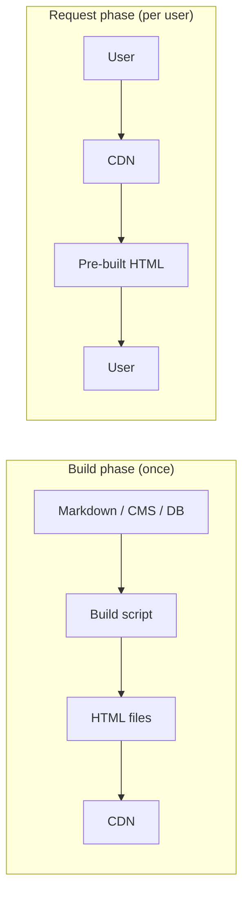

# SSG — Static Site Generation

> **In one line:** Pre-build every page once, dump them on a CDN, serve them in 10ms forever. The web's oldest and still cheapest strategy.

:::tip In plain English
You write your site, then run `npm run build`. The build script produces a folder full of plain `.html` files — one per page — plus images and CSS. You upload that folder to a CDN. Done. Users get instant page loads because the CDN already has the HTML; there's no server doing work per request. The trade-off: if your data changes, you have to rebuild and redeploy.
:::

## How SSG works

HTML is generated at **build time**. Every URL becomes a pre-built `.html` file that lives on a CDN.

**Flow:**

1. Developer (or CI) runs `npm run build`.
2. Build process queries any data sources (CMS, database, markdown files), renders every page, writes static files to a `build/` or `dist/` folder.
3. Files are uploaded to a CDN.
4. Users request URLs; CDN serves cached HTML instantly.



> **Reading this diagram:** The origin server only does work in the top half, *once*, at build time. The bottom half — what users actually experience — is just file serving from the CDN. That asymmetry is the whole reason SSG is fast and cheap.

## Pros

- **Fastest possible response** (it's already on the CDN edge).
- **Cheapest hosting** (no servers needed, just file storage).
- **Most secure** (no server-side code to exploit at request time).
- **Easy to scale** (CDNs scale infinitely).
- **Deployable to anything that serves files** (Vercel, Netlify, Cloudflare Pages, GitHub Pages, S3, even a USB drive on a Raspberry Pi).

## Cons

- **Stale data** unless rebuilt.
- **Long build times for large sites** (10,000 pages → 30+ minutes).
- **Hard to personalize per user** — every visitor gets the same HTML.

## When to use SSG

| Site type        | SSG fit?              |
|------------------|------------------------|
| Personal blog    | ✅ Perfect              |
| Documentation    | ✅ Perfect (this site is SSG!) |
| Marketing site   | ✅ Perfect              |
| Portfolio        | ✅ Perfect              |
| E-commerce       | ⚠️  OK for the catalog, but checkout/cart needs SSR |
| Dashboard        | ❌ Use SSR or CSR       |
| Real-time chat   | ❌ Use CSR + WebSockets |

:::note Worked example: this site is SSG
This very documentation site is built with Docusaurus. When the maintainer pushes to the main branch:

1. GitHub Actions runs `npm run build`.
2. Docusaurus reads every markdown file in `docs/` and produces a folder of `.html` files (one per page).
3. The folder is uploaded to GitHub Pages.
4. When you visit a page, GitHub's CDN serves you the pre-built HTML in ~30ms.

No server runs at request time. Everything you're reading is a static file. That's why it loads instantly.
:::

## The tools

| Tool            | Best for                                                          |
|----------------|-------------------------------------------------------------------|
| **Astro**       | Purest SSG framework in 2026. Selective "islands" of JS for interactivity. |
| **Next.js**     | (in static mode) — biggest ecosystem, easy to move to SSR later  |
| **Hugo**        | Very fast (Go-based). Massive sites compile in seconds.         |
| **Eleventy (11ty)** | Minimal JavaScript, very flexible templating.                  |
| **Jekyll**      | Original; powers GitHub Pages by default. Ruby.                  |
| **Hexo / Gatsby** | Older choices, still in use.                                    |

:::info Highlight: Astro is the 2026 default for content sites
If you're starting a new blog, doc site, or portfolio in 2026, **Astro** is the default recommendation. It generates fully static HTML by default, lets you embed components from any framework (React, Vue, Svelte) for the interactive bits, and ships almost no JavaScript by default. Page weight is tiny; Lighthouse scores are near-perfect out of the box.
:::

:::note Try it yourself
```bash
npm create astro@latest
# pick the "Empty" template
cd my-astro-site
npm run dev    # local dev server
npm run build  # produces ./dist with pure HTML files
ls dist/       # see your generated static site
```

Open one of the generated `.html` files in your editor. There's no JavaScript framework runtime in there. It's just HTML. That's SSG.
:::

## What's next

→ Continue to [SSR — Server-Side Rendering](./ssr) where HTML is built fresh on the server for every single request, giving up speed for freshness and personalization.
