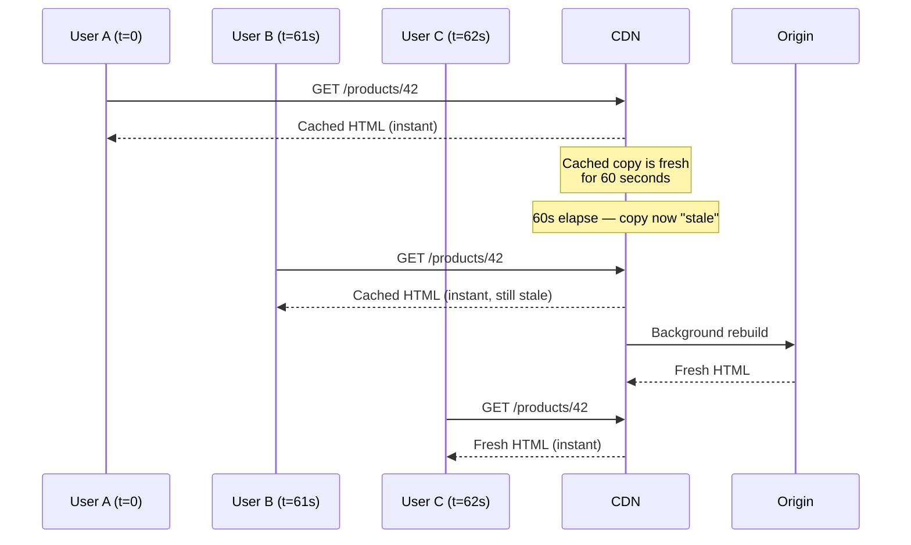
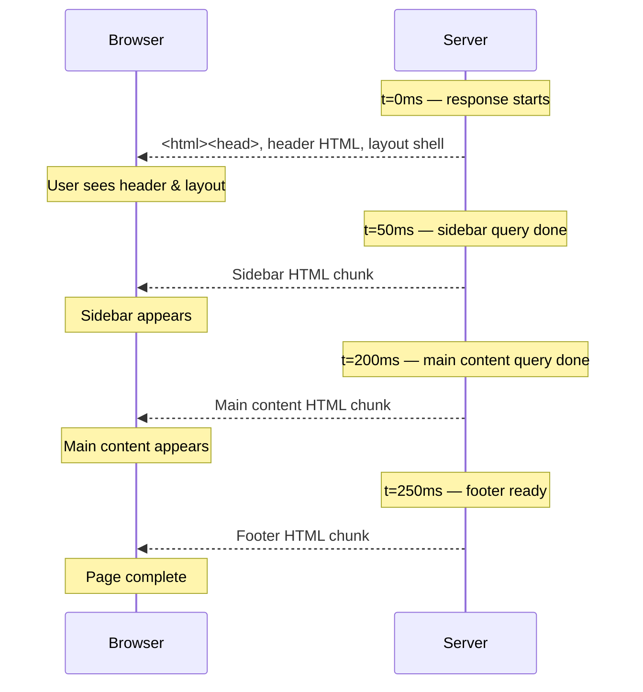
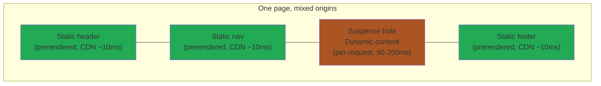

# ISR, Streaming SSR & PPR — The Hybrids

> **In one line:** Real-world apps need both speed *and* freshness. ISR, Streaming SSR, and PPR are progressively cleverer hybrids that try to give you both.

:::tip In plain English
SSG is fastest but stale. SSR is fresh but slower. CSR is snappy after first load but slow to start. The hybrids in this page are inventions of the last 5 years aimed at *not having to choose*. Each one gives up a little simplicity in exchange for more speed-and-freshness on a single page.
:::

## ISR — Incremental Static Regeneration

A hybrid invented by Next.js: build pages statically, but regenerate them on a schedule or on-demand.

**Flow:**

1. Initial build generates the most popular pages.
2. Pages have a `revalidate: 60` setting (the **TTL**, or time-to-live, before the cached copy is considered stale) — after 60 seconds, the *next* request triggers a background rebuild.
3. User always gets the static page instantly; the next user gets the fresh version.

> **Reading this diagram:** Nobody ever waits for a rebuild — User B "pays" with one slightly-stale page in exchange for User C getting a fresh page just as fast as the cached one.

**Pros:**
- Speed of SSG + freshness of SSR (sort of).
- Reduces build times (only build the homepage at first; build others on demand).

**Cons:**
- **Eventual consistency** — some users see stale data for up to `revalidate` seconds.
- More complex to debug than pure SSG.
- Requires a hosting platform that supports it (Vercel, Netlify, Cloudflare Pages).

**Best for:** Large catalogs (products, articles) that change occasionally.

:::note Worked example: e-commerce catalog
You have 50,000 products. SSG would mean a 30-minute build every time anything changes. SSR would mean every page request hits your DB.

With ISR (`revalidate: 3600`):
- Each product page is cached as static HTML for 1 hour.
- After 1 hour, the next request triggers a quiet background rebuild.
- Users never wait for a rebuild. The CDN always has *something* to serve.
:::

## Streaming SSR + React Server Components — the 2026 Default

The current state-of-the-art, pioneered by React 18+ and the Next.js App Router.

**How it works:**

- The page is split into components, some of which run *only* on the server (**RSCs** — React Server Components, components that execute on the server and ship zero JavaScript to the browser).
- The server starts streaming HTML chunks as soon as each piece is ready.
- Client components hydrate progressively.
- Slow data fetches don't block the rest of the page — they stream in with `<Suspense>` boundaries (a React feature that lets you mark a part of the UI as "OK to show a fallback while you wait").

> **Reading this diagram:** Instead of waiting 200ms for *everything*, the user sees progress from 0ms onward. The same response stays "open" the whole time — the server keeps writing chunks into it as data becomes available.

**Pros:**
- Best of all worlds: SSR's SEO, SSG-like initial render speed, CSR-like interactivity.
- Less JavaScript shipped to the client (RSCs run only on the server, ship zero JS).
- Built-in async data fetching (RSCs can `await` data directly with no `useEffect`).

**Cons:**
- **Steep learning curve** — when does code run on server vs client? The boundaries are subtle.
- Ecosystem still catching up (some libraries assume client-only).
- Requires careful thinking about boundaries.

**Best for:** Most new full-stack apps in 2026.

**Tools:** Next.js App Router (most mature), Remix, SvelteKit, Nuxt (with Nitro).

:::info Highlight: "use client" is a serious boundary
In Next.js App Router, putting `"use client"` at the top of a component means it runs in the browser. Without it, the component is a server component — it never ships to the browser at all.

This single line determines whether your code can use `useState` (client-only), or `await` a database query (server-only). Mastering this boundary is the biggest part of learning the modern React stack. It will feel unnatural for the first few projects, then become second nature.
:::

## PPR — Partial Prerendering (the bleeding edge)

The newest evolution (Next.js 15+): a static "shell" of the page is prerendered at build time, with dynamic "holes" that stream in per request.

> **Reading this diagram:** Green blocks come from the CDN in ~10ms; the orange block is the per-request "hole" that streams in shortly after. The user sees the shell almost instantly and the dynamic part fills in seconds later — same page, two delivery mechanisms.

This is the leading edge in 2026 — many teams haven't adopted it yet, but it's where things are heading. The mental model: **one page, mixed origins, no compromise**.

**Best for:** Pages where 90% is static (template, header, footer) but a few key parts must be live (current price, user-specific content).

:::info Highlight: don't chase the bleeding edge on day one
If you're brand new to web dev, **don't** start with PPR or even RSC. Start with vanilla Next.js or Astro. Get something deployed. Add ISR if you need it. Add streaming SSR if you need it. Add PPR if you need it. Each step adds complexity that's only justified by a specific need.

The industry oscillates between simplifying and complicating. The frameworks will look different in 2030 too. The fundamentals from the [client-server model](./client-server) won't.
:::

## What's next

→ Continue to [SPA vs MPA vs Hybrid](./spa-mpa-hybrid) where we look at a *related but distinct* question: are you a single-page app or a multi-page app? (The answer in 2026 is usually "both.")
