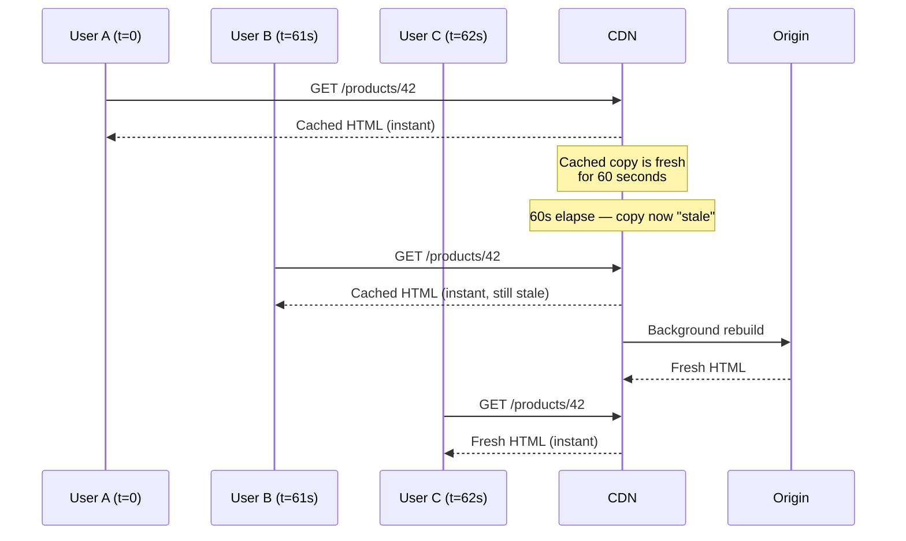
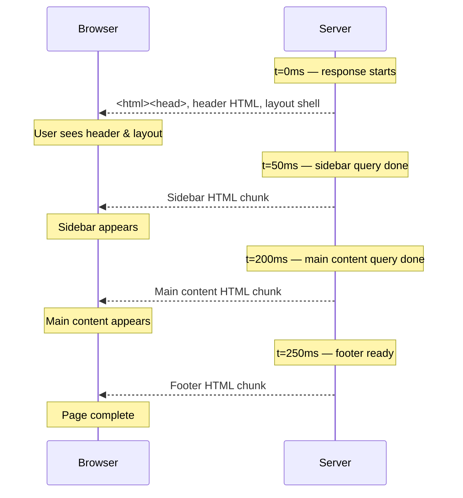
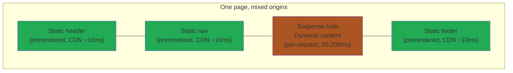

# ISR, Streaming SSR & PPR — The Hybrids

> **In one line:** Real-world apps need both speed *and* freshness. ISR, Streaming SSR, and PPR are progressively cleverer hybrids that try to give you both.

:::tip[In plain English]
SSG is fastest but stale. SSR is fresh but slower. CSR is snappy after first load but slow to start. The hybrids in this page are inventions of the last 5 years aimed at *not having to choose*. Each one gives up a little simplicity in exchange for more speed-and-freshness on a single page.
:::

## ISR — Incremental Static Regeneration

A hybrid invented by Next.js: build pages statically, but regenerate them on a schedule or on-demand.

**Flow:**

1. Initial build generates the most popular pages.
2. Pages have a `revalidate: 60` setting (the **TTL**, or time-to-live, before the cached copy is considered stale) — after 60 seconds, the *next* request triggers a background rebuild.
3. User always gets the static page instantly; the next user gets the fresh version.

> **Reading this diagram:** Nobody ever waits for a rebuild — User B "pays" with one slightly-stale page in exchange for User C getting a fresh page just as fast as the cached one.

**Pros:**
- Speed of SSG + freshness of SSR (sort of).
- Reduces build times (only build the homepage at first; build others on demand).

**Cons:**
- **Eventual consistency** — some users see stale data for up to `revalidate` seconds.
- More complex to debug than pure SSG.
- Requires a hosting platform that supports it (Vercel, Netlify, Cloudflare Pages).

**Best for:** Large catalogs (products, articles) that change occasionally.

:::note[Worked example: e-commerce catalog]
You have 50,000 products. SSG would mean a 30-minute build every time anything changes. SSR would mean every page request hits your DB.

With ISR (`revalidate: 3600`):
- Each product page is cached as static HTML for 1 hour.
- After 1 hour, the next request triggers a quiet background rebuild.
- Users never wait for a rebuild. The CDN always has *something* to serve.
:::

## Streaming SSR — the 2026 default

The current state-of-the-art. Two things are happening at once and beginners often conflate them:

1. **Streaming SSR** (the general technique). The server starts sending HTML *as soon as the first chunk is ready*, without waiting for slow data. This works in **any** modern framework — Next.js, Remix / React Router v7, SvelteKit, Nuxt, Astro server output. The browser keeps writing into one open response.
2. **React Server Components (RSCs)** (the React-specific feature on top). A *React-only* programming model where some components run *only* on the server, ship zero JavaScript to the browser, and can `await` data inline. Pioneered by React 18+ and matured in the Next.js App Router. Remix, SvelteKit, and Nuxt have their own analogous-but-different patterns (e.g. SvelteKit's `+page.server.ts`/`load` functions, Nuxt's server `useFetch`, Remix's `loader`), but they're **not RSCs** — calling them that conflates a React feature with a general capability.

If you're not on React, you can still get streaming SSR; you just won't have the specific RSC programming model.

**How streaming SSR works (framework-agnostic):**

- The page is split into pieces. Some have fast data, some have slow data.
- The server flushes the fast pieces immediately so the browser can start painting.
- The slow pieces stream in later. In React, you mark them with `<Suspense>` boundaries (a React feature that lets you show a fallback while waiting). Other frameworks have equivalents (`{#await}` in Svelte, `<Suspense>` in Vue 3).

**How RSCs add to that (React only):**

- Components marked as server components (the default in Next.js App Router) never ship to the browser at all.
- They can `await` databases, file systems, and secret-bearing APIs directly — without writing a separate API endpoint.
- Client components (those with `"use client"` at the top) hydrate progressively after the server HTML arrives.

> **Reading this diagram:** Instead of waiting 200ms for *everything*, the user sees progress from 0ms onward. The same response stays "open" the whole time — the server keeps writing chunks into it as data becomes available.

**Pros (streaming SSR generally):**
- Best of all worlds: SSR's SEO, SSG-like time-to-first-byte, CSR-like interactivity.
- Slow data doesn't block fast paint.

**Extra pros if you're on React + RSCs:**
- Less JavaScript shipped to the client (server components stay on the server).
- Built-in async data fetching (`await` data directly with no `useEffect` and no separate API route).

**Cons:**
- **Steep learning curve** — when does code run on server vs client? The boundaries are subtle, especially with RSCs.
- Ecosystem still catching up (some libraries assume client-only).
- Requires careful thinking about boundaries.

**Best for:** Most new full-stack apps in 2026.

**Tools — streaming SSR is a feature in all of these:**

- **Next.js App Router** — streaming SSR + RSCs (the React-specific extra).
- **Remix / React Router v7** — streaming SSR + a `loader`/`action` model. *No RSCs as of early 2026, though they're on the roadmap.*
- **SvelteKit** — streaming SSR via `load` and `+page.server.ts`. Not RSCs (Svelte has its own model).
- **Nuxt (with Nitro)** — streaming SSR via server `useFetch`. Not RSCs.
- **Astro** — server output with streaming, plus its own "islands" model on top.

:::info[Highlight: "use client" is a serious boundary]
In Next.js App Router, putting `"use client"` at the top of a component means it runs in the browser. Without it, the component is a server component — it never ships to the browser at all.

This single line determines whether your code can use `useState` (client-only), or `await` a database query (server-only). Mastering this boundary is the biggest part of learning the modern React stack. It will feel unnatural for the first few projects, then become second nature.
:::

## PPR — Partial Prerendering (Next.js-specific, opt-in)

**A note on framing:** PPR is **not a universal pattern** — it's a Next.js-specific hybrid that builds on RSCs. It became the default behavior in Next.js when **Cache Components** are enabled, but Cache Components themselves are opt-in. You won't find PPR in Remix, SvelteKit, Nuxt, or Astro (though some have their own "islands"/"static shell" variations). Don't introduce PPR thinking it's an industry standard — it's leading-edge inside the Next ecosystem.

The idea (Next.js 15+): a static "shell" of the page is prerendered at build time, with dynamic "holes" that stream in per request.

> **Reading this diagram:** Green blocks come from the CDN in ~10ms; the orange block is the per-request "hole" that streams in shortly after. The user sees the shell almost instantly and the dynamic part fills in seconds later — same page, two delivery mechanisms.

This is the emerging hybrid default in some Next.js setups in 2026 — many teams haven't adopted it yet, and it's not (and may never be) a cross-framework standard. The mental model: **one Next.js page, mixed origins, no compromise**.

**Best for:** Pages where 90% is static (template, header, footer) but a few key parts must be live (current price, user-specific content).

:::info[Highlight: don't chase the bleeding edge on day one]
If you're brand new to web dev, **don't** start with PPR or even RSC. Start with vanilla Next.js or Astro. Get something deployed. Add ISR if you need it. Add streaming SSR if you need it. Add PPR if you need it. Each step adds complexity that's only justified by a specific need.

The industry oscillates between simplifying and complicating. The frameworks will look different in 2030 too. The fundamentals from the [client-server model](./client-server) won't.
:::

## Common mistakes

:::caution[Where people commonly trip up]
- **Setting `revalidate: 60` and treating the page as "live."** ISR is *eventually* consistent — a user can see data up to 60 seconds stale, and during a rebuild different POPs may serve different versions for a few seconds. If "live" matters (price, inventory, auth state), use SSR or pull that one piece into a dynamic hole.
- **Calling everything "RSC" because it's on the server.** Streaming SSR is framework-agnostic — Remix `loader`, SvelteKit `+page.server.ts`, Nuxt `useFetch` are *not* React Server Components. RSC is the specific React feature where the component itself never ships to the browser. Mixing the vocabulary will confuse code reviews.
- **Putting `"use client"` at the top of every file "to be safe."** That defeats the entire RSC benefit — the component now ships JS to the browser, can't directly query the database, and you've turned an RSC app back into a hybrid SSR + CSR app. Default to server components; opt into client only where you need state, effects, or browser APIs.
- **Forgetting that `<Suspense>` boundaries gate the stream.** A heavy component without a Suspense boundary blocks the entire page from streaming until its data resolves. The whole point of streaming is to wrap slow sections in Suspense so fast sections can flush early.
- **Adopting PPR on day one of a project.** PPR is a Next.js-specific opt-in that builds on RSCs. If you don't yet understand the server/client component boundary, layering PPR on top just makes the bugs harder to track down. Get the basics working first; reach for PPR when you have a *specific* page with a clear static-shell-plus-dynamic-hole shape.
:::

## Page checkpoint

<Quiz id="isr-streaming-ppr-page" title="Did ISR, streaming & PPR stick?" sampleSize={3}>

<Question
  prompt="With ISR using revalidate: 60, what does a user who arrives 61 seconds after the last build experience?"
  options={[
    { text: "They wait while the page rebuilds, then receive the fresh version" },
    { text: "They see a 503 until the rebuild finishes" },
    { text: "They get the stale cached page instantly, while the CDN kicks off a background rebuild so the NEXT visitor gets the fresh copy" },
    { text: "They are redirected to the homepage" }
  ]}
  correct={2}
  explanation="With ISR, no user ever waits for a rebuild. The cached page is served instantly even when stale; the background rebuild swaps in the fresh copy for subsequent visitors. That's the speed-plus-freshness trick."
  revisit={{ to: "/docs/foundations/isr-streaming-ppr#isr--incremental-static-regeneration", label: "ISR — Incremental Static Regeneration" }}
/>

<Question
  prompt="Which statement about React Server Components (RSCs) is most accurate?"
  options={[
    { text: "They're a universal pattern available in any modern framework" },
    { text: "They're a React-specific feature; streaming SSR works in many frameworks but RSCs themselves are only in React (mainly Next.js App Router)" },
    { text: "They run primarily on the client, not the server" },
    { text: "They make all server-side rendering unnecessary" }
  ]}
  correct={1}
  explanation="Streaming SSR is framework-agnostic — Next, Remix, SvelteKit, Nuxt all support it. RSCs are the React-only programming model layered on top: components that run only on the server and ship zero JS to the browser."
  revisit={{ to: "/docs/foundations/isr-streaming-ppr#streaming-ssr--the-2026-default", label: "Streaming SSR & RSCs" }}
/>

<Question
  prompt="In Next.js App Router, what does 'use client' at the top of a component mean?"
  options={[
    { text: "The component runs only at build time" },
    { text: "The component is a client component — it ships to the browser and can use things like useState, but can't directly await a database query" },
    { text: "It disables hydration for that component" },
    { text: "It marks the file as deprecated" }
  ]}
  correct={1}
  explanation="Without 'use client', a component is a server component — it runs only on the server, can await DB queries directly, and ships zero JS. 'use client' moves it to the browser, enabling hooks like useState but losing direct server data access."
  revisit={{ to: "/docs/foundations/isr-streaming-ppr#streaming-ssr--the-2026-default", label: "use client boundary" }}
/>

<Question
  prompt="Partial Prerendering (PPR) is best described as…"
  options={[
    { text: "An industry-standard pattern across every modern framework" },
    { text: "A Next.js-specific hybrid where a static shell is prerendered and dynamic 'holes' stream in per request" },
    { text: "A way to disable JavaScript entirely on a page" },
    { text: "A new CDN protocol" }
  ]}
  correct={1}
  explanation="PPR is opt-in and Next.js-specific. The static shell comes from the CDN in ~10ms; the dynamic holes (price, user-specific data) stream in shortly after. It's not yet a cross-framework standard."
  revisit={{ to: "/docs/foundations/isr-streaming-ppr#ppr--partial-prerendering-nextjs-specific-opt-in", label: "PPR — Partial Prerendering" }}
/>

</Quiz>

## What's next

→ Continue to [SPA vs MPA vs Hybrid](./spa-mpa-hybrid) where we look at a *related but distinct* question: are you a single-page app or a multi-page app? (The answer in 2026 is usually "both.")
