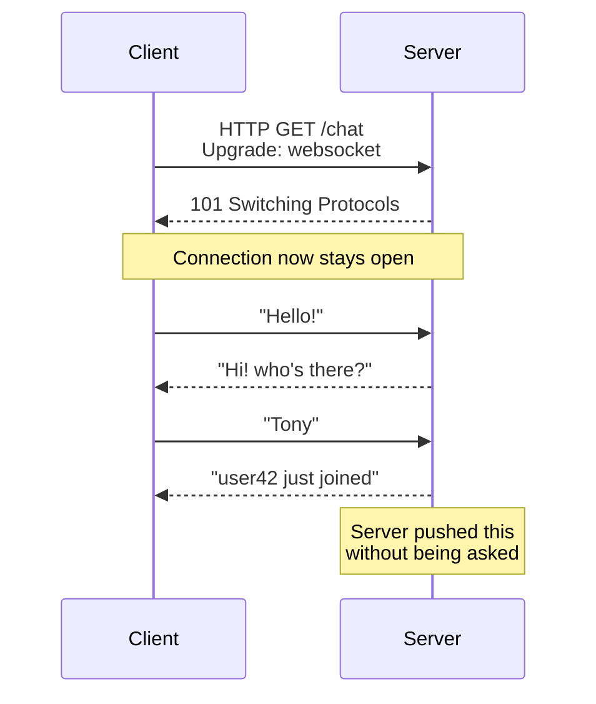

# Real-Time: gRPC, WebSockets & SSE

> **In one line:** REST and GraphQL are *pull* — the client always asks first. WebSockets and SSE let the server *push* data the moment it has something new. gRPC is a high-performance binary protocol used mostly between internal services.

:::tip[In plain English]
Imagine a chat app. With pure REST, the client would have to keep asking the server "any new messages? any new messages? any new messages?" every second (this is called **polling** and it's wasteful). With a **WebSocket**, the client opens *one* connection and the server pushes new messages down it the moment they arrive. **SSE (Server-Sent Events)** is similar but only one-way (server → client). **gRPC** is something different — a high-performance binary protocol used between *back-end services*, rarely directly by browsers.
:::

## WebSockets — bidirectional, real-time

**WebSockets** open a persistent bidirectional connection. Either side can send messages anytime, with very low latency. The connection starts as a regular HTTP request, but the special `Upgrade: websocket` header tells the server to "switch protocols" — after that, it's no longer HTTP, it's a long-lived two-way pipe.



> **Reading this diagram:** The first two arrows are the "upgrade dance" — one HTTP exchange that promotes the connection to a WebSocket. After that, either side can speak at any time. Notice the last server message wasn't a response to anything — that's the *push* capability you can't get with plain REST.

**Best for:**
- Chat applications.
- Collaborative editing (Google Docs-style).
- Multiplayer games.
- Real-time dashboards with bidirectional control.

**The trade-offs:**
- Each open connection consumes server memory. Scaling to millions of concurrent WebSockets is non-trivial.
- Reconnection logic is on you (or your library).
- Doesn't go through some old proxies and load balancers cleanly.

## SSE — Server-Sent Events (one-way streaming)

**Server-Sent Events** are simpler: a long-lived HTTP connection where the server streams text events to the client. One-way only (server → client). No special protocol — it's just plain HTTP that doesn't close.

```javascript
// Client side
const events = new EventSource('/api/notifications');
events.onmessage = (e) => {
  console.log('Got:', e.data);
};
```

```http
# What the server sends (it's just HTTP):
HTTP/2 200 OK
Content-Type: text/event-stream

data: New comment on your post
\n
data: Someone followed you
\n
data: New email
\n
```

**Pros:**
- Simpler than WebSockets — no upgrade dance.
- Works with HTTP/2 multiplexing (many SSE streams over one connection).
- Automatic reconnection built into browsers.
- Easier to scale than WebSockets.

**Cons:**
- One-way only.
- Limited to text data.

:::info[Highlight: SSE is the workhorse of LLM streaming]
Every AI chat interface you've used (ChatGPT, Claude, Gemini) streams the assistant's response token-by-token using SSE. That "typewriter" effect isn't decorative — it's the server sending each token over an SSE stream as soon as the LLM produces it.

If you're building any AI feature with streaming responses, you'll use SSE. It's the dominant 2026 pattern.
:::

## When to use what (the decision)

| Need                                              | Use                  |
|---------------------------------------------------|----------------------|
| Server pushes updates (notifications, dashboards, LLM streaming) | **SSE**     |
| Both sides talk in real time (chat, multiplayer) | **WebSockets**       |
| Internal service-to-service, high performance     | **gRPC**             |
| Collaborative editing (Notion, Figma)             | WebSockets + **CRDTs** (Yjs, Liveblocks) |
| Just polling for occasional updates               | Plain REST + polling |

## gRPC — internal service communication

**gRPC** is a high-performance binary protocol developed by Google. Used almost exclusively for **service-to-service** communication inside large architectures (frontend doesn't usually speak gRPC directly).

```protobuf
// users.proto - the contract
service UserService {
  rpc GetUser (UserRequest) returns (User);
  rpc StreamUsers (UserFilter) returns (stream User);
}

message UserRequest {
  int64 id = 1;
}
```

**Pros:**
- Very fast (binary, multiplexed over HTTP/2).
- Strongly-typed contracts (Protocol Buffers, language-agnostic).
- Built-in streaming (both directions).
- Auto-generates clients for Go, Java, Python, Node, Rust, etc.

**Cons:**
- Browser support requires a proxy (gRPC-Web).
- Harder to debug than REST (binary payloads).
- Tooling is heavier than REST.

You'll meet gRPC when you join an established backend team — not when you're starting a personal project.

:::note[Worked example: a chat app's protocol stack]
A modern chat app might use *all* of these:

| Layer                       | Protocol                                                |
|-----------------------------|---------------------------------------------------------|
| Login (one-time)            | REST (POST /login)                                      |
| Fetching history (once)     | REST (GET /messages?before=...)                         |
| Receiving live messages     | WebSocket                                               |
| Notifications when tab inactive | SSE (battery-friendlier than persistent WebSocket) |
| Backend chat service ↔ moderation service | gRPC                                  |

Each protocol fits a specific role; together they make the app feel instant.
:::

:::info[Highlight: don't over-engineer real-time]
For most personal/startup projects, **plain REST with periodic polling is fine** until you have a real performance problem. WebSockets and SSE are "you'll know when you need them" tools. Don't add a WebSocket server to a static blog because it sounds cool.
:::

## Common mistakes

:::caution[Where people commonly trip up]
- **Reaching for WebSockets when SSE would do.** If the server pushes and the client only acknowledges, that's one-way — SSE is simpler, auto-reconnects, multiplexes on HTTP/2, and survives proxies that mangle WebSockets. Use WebSockets when you genuinely need *both directions* to push (chat, multiplayer, collaboration).
- **Forgetting to reconnect.** A WebSocket dies when a laptop sleeps, a phone switches towers, or a load balancer cycles. Without exponential-backoff reconnection logic, your "real-time" feature silently goes dead after the first network blip. Either use a library that handles this (Socket.io, Pusher, Liveblocks) or build it explicitly.
- **Treating gRPC as a browser API.** Browsers don't speak gRPC natively — you need gRPC-Web and a proxy (Envoy or similar), and even then you lose features like bidirectional streaming. gRPC is fantastic for service-to-service; for browser-to-server, REST or SSE is almost always better.
- **Sending sensitive data in SSE URL parameters.** `EventSource` doesn't support custom headers, so people tend to put the auth token in the query string — which then appears in server logs and proxy logs. Use a cookie for auth, or switch to fetch + readable streams when you need custom headers.
- **Scaling WebSockets like HTTP.** A horizontally-scaled WebSocket server can't broadcast to clients on other nodes without a pub/sub layer (Redis, NATS, or a managed service like Ably/Pusher). Adding a second instance behind a load balancer without that backplane silently breaks "user A's message reaching user B."
:::

## Page checkpoint

<Quiz id="apis-realtime-page" title="Did real-time APIs stick?" sampleSize={2}>

<Question
  prompt="What's the key difference between WebSockets and Server-Sent Events?"
  options={[
    { text: "WebSockets are bidirectional (either side can send anytime); SSE is one-way, server-to-client only" },
    { text: "WebSockets are insecure; SSE is encrypted by default" },
    { text: "SSE supports binary data while WebSockets do not" },
    { text: "They are functionally identical" }
  ]}
  correct={0}
  explanation="WebSockets open a persistent bidirectional pipe — chat apps and multiplayer games need that. SSE is a long-lived HTTP response where the server streams events to the client; it's simpler but one-way only."
  revisit={{ to: "/docs/foundations/apis-realtime#sse--server-sent-events-one-way-streaming", label: "SSE vs WebSockets" }}
/>

<Question
  prompt="You're building an AI chat feature where the server streams the assistant's response token-by-token. Which protocol is the standard choice in 2026?"
  options={[
    { text: "WebSockets" },
    { text: "gRPC" },
    { text: "Server-Sent Events (SSE)" },
    { text: "Plain REST polling" }
  ]}
  correct={2}
  explanation="LLM token streaming is one-way (server-to-client) and fits HTTP, so SSE is the dominant pattern. Every major AI chat UI (ChatGPT, Claude, Gemini) uses it. WebSockets would work but are overkill for one-way streaming."
  revisit={{ to: "/docs/foundations/apis-realtime#sse--server-sent-events-one-way-streaming", label: "SSE for LLM streaming" }}
/>

<Question
  prompt="Where does gRPC usually fit in a modern web architecture?"
  options={[
    { text: "Between the browser and the public API" },
    { text: "Between internal backend services (service-to-service), not directly with browsers" },
    { text: "Replacing the database driver" },
    { text: "As a CSS preprocessor" }
  ]}
  correct={1}
  explanation="gRPC is fast, binary, and strongly typed — perfect between internal services. Browsers can't speak gRPC directly without a proxy (gRPC-Web), so you almost never see it in client code. It's a service-to-service tool."
  revisit={{ to: "/docs/foundations/apis-realtime#grpc--internal-service-communication", label: "gRPC — internal service communication" }}
/>

<Question
  prompt="You're building a simple notifications widget that checks once a minute. Should you add WebSockets?"
  options={[
    { text: "Yes — WebSockets are always better than polling" },
    { text: "No — plain REST polling every minute is simpler and more than enough; WebSockets are 'you'll know when you need them' tools" },
    { text: "No — only SSE works for notifications" },
    { text: "Yes — REST can't poll periodically" }
  ]}
  correct={1}
  explanation="Don't over-engineer real-time. WebSockets add a long-lived connection and reconnection logic; for once-a-minute updates, REST polling is simpler and fine. Reach for WebSockets/SSE only when polling actually hurts."
  revisit={{ to: "/docs/foundations/apis-realtime#when-to-use-what-the-decision", label: "Don't over-engineer real-time" }}
/>

</Quiz>

## What's next

→ Continue to [Relational (SQL) Databases](./databases-sql) where we leave APIs behind and look at *where the data lives* — starting with the dominant default, Postgres.
