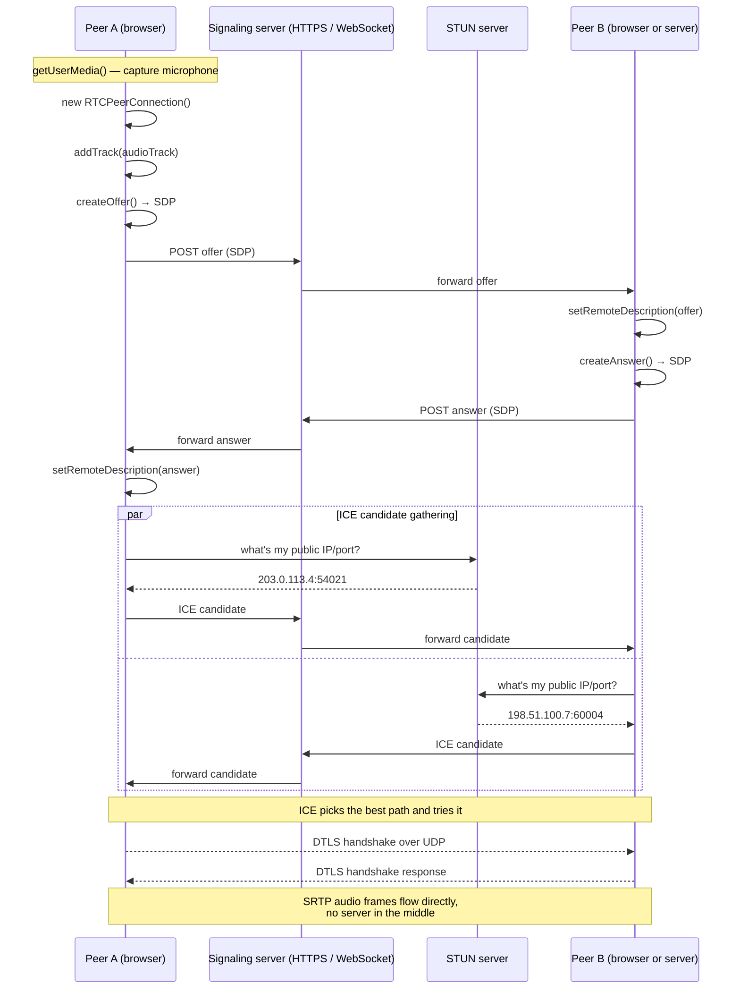
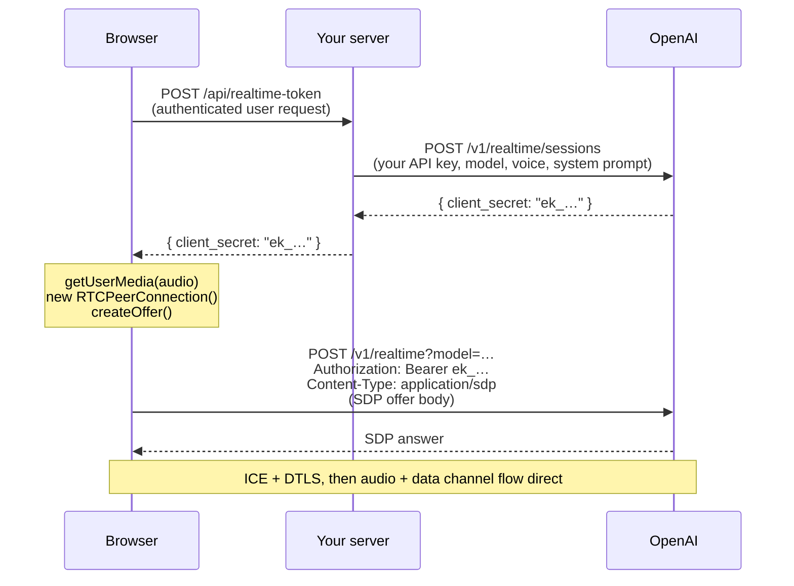

# WebRTC: peer-to-peer media in the browser

> **In one line:** WebRTC is the browser API that opens a low-latency, peer-to-peer connection capable of carrying audio, video, or arbitrary binary data — bypassing your server for the actual media stream once the connection is set up.

:::tip[In plain English]
WebSockets are a one-lane road for *text and small messages*. WebRTC is a different beast: it's the protocol stack that powers Google Meet, Zoom-in-the-browser, Discord voice, and — in 2026 — real-time voice agents like the OpenAI Realtime API. Two browsers (or a browser and a server) negotiate a direct connection over UDP, encrypted end-to-end, then push audio frames at each other dozens of times a second. The setup is fiddly. The actual sending is fast.
:::

You will meet WebRTC the moment your app needs **two-way audio or video** with realistic latency (under 200ms), or **arbitrary binary payloads** that don't fit the HTTP request/response shape. In 2026 the second use case has exploded — voice AI agents (Realtime API, Vapi, Retell, Pipecat) all default to WebRTC because TCP/WebSocket audio is too laggy for natural conversation.

## Why not WebSocket?

WebSockets are TCP. TCP guarantees in-order delivery — if a packet is lost, *everything after it stops* until the missing packet is retransmitted. That's perfect for chat (you never want messages out of order). It's catastrophic for live audio: a 200ms hiccup on the network turns into a 500ms gap in the conversation while TCP catches up.

WebRTC media uses **UDP**, which doesn't retransmit. If a packet is lost, the codec covers the gap (a 20ms blip you might not hear) and the stream keeps flowing. The tradeoff: you accept tiny imperfections in exchange for keeping latency under the threshold where humans perceive a "delay."

| Property | WebSocket | WebRTC media |
|----------|-----------|--------------|
| Transport | TCP | UDP (with DTLS encryption) |
| Latency | Tolerable for text, bad for audio | ~50–150ms end-to-end is realistic |
| Loss handling | Retransmit everything (head-of-line blocking) | Codec conceals loss, stream continues |
| Encryption | TLS at the transport layer | DTLS-SRTP, mandatory, end-to-end |
| Setup complexity | Low (one HTTP upgrade) | High (SDP offer/answer + ICE) |
| NAT/firewall traversal | Just HTTP/HTTPS | STUN, often TURN as fallback |
| Server load | Server stays in the middle of every message | Server can drop out after setup (peer-to-peer) |

:::info[Highlight: realtime audio is a UDP problem]
The reason every voice product on the web speaks WebRTC under the hood is not branding or fashion. It's that **TCP cannot deliver low-latency audio under packet loss**. Once you grasp this you understand why WebRTC exists: it's the only browser-native way to get UDP-based, codec-aware media.
:::

## The full picture



> **Reading this diagram:** Three things happen in parallel-ish. (1) An **SDP offer/answer** exchange where each side describes what media it wants to send and how. (2) An **ICE** dance where each side finds candidate network paths and tells the other. (3) A final **DTLS handshake** that encrypts the media stream once a path is picked. Only step 2 needs internet help (STUN/TURN); 1 and 3 are between the peers.

## The four moving parts

### 1. `RTCPeerConnection` — the object that holds the connection

In the browser, the whole thing hangs off a single object:

```typescript
const pc = new RTCPeerConnection({
  iceServers: [
    { urls: 'stun:stun.l.google.com:19302' },
    // For when STUN isn't enough (symmetric NATs, strict firewalls):
    { urls: 'turn:turn.example.com:3478', username: '…', credential: '…' },
  ],
});
```

> **In English:** You give the connection a list of helper servers it can use to figure out its own public address (STUN) or, if direct peer-to-peer fails, to relay traffic on your behalf (TURN). For local dev, the Google public STUN server is fine; for production, you bring your own.

### 2. SDP — the "what we're going to send" document

**SDP (Session Description Protocol)** is a plaintext format that describes a media session: codecs supported, encryption parameters, bandwidth, transport. It looks like this:

```
v=0
o=- 8273472384 2 IN IP4 127.0.0.1
s=-
t=0 0
m=audio 9 UDP/TLS/RTP/SAVPF 111 63 9 0 8 13 110 126
c=IN IP4 0.0.0.0
a=rtcp:9 IN IP4 0.0.0.0
a=ice-ufrag:F8K2
a=ice-pwd:0p4D8…
a=fingerprint:sha-256 D2:F4:1A:…
a=setup:actpass
a=mid:0
a=sendrecv
a=rtpmap:111 opus/48000/2
…
```

You won't write this by hand. The browser generates it for you via `createOffer()`. The flow is:

```typescript
// Peer A — the caller
const offer = await pc.createOffer();
await pc.setLocalDescription(offer);
sendToOtherPeer(offer); // your own signaling channel

// Peer B — the callee
await pc.setRemoteDescription(offer);
const answer = await pc.createAnswer();
await pc.setLocalDescription(answer);
sendToOtherPeer(answer);

// Back on Peer A:
await pc.setRemoteDescription(answer);
```

> **In English:** A's offer is "I want to send Opus audio over UDP and here's my fingerprint." B's answer is "I accept Opus audio over UDP, here's *my* fingerprint." Both sides now know what to expect; they don't yet know *where* to send it. That's ICE's job.

### 3. ICE — figuring out a path through NAT and firewalls

**ICE (Interactive Connectivity Establishment)** is the algorithm that tries every plausible network path and picks the one that works. Each side gathers **candidates** — possible addresses to be reached on:

- **Host candidate:** your local IP (`192.168.1.10:54021`). Works on the same LAN.
- **Server-reflexive (srflx):** your public IP and port as seen from outside, learned by asking a STUN server. Works through most home routers.
- **Relayed (relay):** a TURN server's address, used when nothing else works. The TURN server forwards traffic in both directions — it's literally a middleman, but encrypted end-to-end.

Each peer emits a stream of candidates as they're discovered, ships them to the other side over your signaling channel, and ICE tries connectivity checks (small UDP pings) on every pair until one round-trips. That pair becomes the path.

```typescript
pc.onicecandidate = (event) => {
  if (event.candidate) {
    sendToOtherPeer({ type: 'ice-candidate', candidate: event.candidate });
  }
};

// On the other side:
async function onRemoteCandidate(candidate) {
  await pc.addIceCandidate(candidate);
}
```

> **Jargon:** **NAT (Network Address Translation)** is what your home router does — many devices share one public IP, with the router rewriting ports as packets go through. NAT breaks the naïve assumption "I know my IP, just send to it." STUN exists *only* to tell a device what address+port the outside world actually sees it on.

### 4. STUN and TURN — the helper servers

| Server | What it does | When you need it |
|--------|--------------|------------------|
| **STUN** | Tells a peer "your public address looks like X:Y" | Almost always. Cheap (one UDP packet). Free public STUN exists. |
| **TURN** | Relays traffic between peers that can't reach each other directly | Symmetric NATs, strict corporate firewalls, mobile carrier NATs. ~10–20% of real-world sessions. Costs bandwidth. |

A naïve mental model: STUN says "here's how to find me." TURN says "if you can't find me, send through this go-between." TURN is a real server holding open sockets to both peers and copying bytes — it costs money to run, and you pay for the bandwidth.

:::info[Highlight: TURN is the thing that breaks if you skip it]
In a happy-path demo on the same Wi-Fi, you can ship without TURN and feel clever. In production, ~10–20% of sessions sit behind a NAT that STUN can't punch through (symmetric NATs on mobile carriers and big-corp networks). Without TURN, those users see "connection failed" with no useful message. Always provision TURN for production realtime — Twilio, Cloudflare, and AWS all offer managed TURN.
:::

## The connection lifecycle

Once SDP is exchanged and ICE finds a path, the connection moves through these states (subscribe with `pc.onconnectionstatechange`):

| State | Meaning |
|-------|---------|
| `new` | Created, nothing happening yet |
| `connecting` | ICE checks in progress, DTLS handshake starting |
| `connected` | Media is flowing |
| `disconnected` | Lost contact, may recover automatically |
| `failed` | ICE gave up, won't recover without a restart |
| `closed` | You called `close()`, the end |

```typescript
pc.onconnectionstatechange = () => {
  console.log('state:', pc.connectionState);
  if (pc.connectionState === 'failed') {
    // ICE restart, or tear down and show the user an error
    pc.restartIce();
  }
};
```

## What flows over the connection

WebRTC carries two kinds of payload, both encrypted:

### Media tracks (audio/video)

The microphone or camera becomes a `MediaStreamTrack`, attached via `addTrack`:

```typescript
const stream = await navigator.mediaDevices.getUserMedia({ audio: true });
stream.getTracks().forEach((track) => pc.addTrack(track, stream));
```

On the other side, incoming media surfaces as `pc.ontrack`:

```typescript
pc.ontrack = (event) => {
  const remoteStream = event.streams[0];
  audioElement.srcObject = remoteStream; // play through an <audio> tag
};
```

The codec is negotiated in SDP — typically **Opus** for audio (high quality, low bitrate, latency-friendly), **VP8/VP9/AV1/H.264** for video.

### Data channels (arbitrary binary or text)

```typescript
const dc = pc.createDataChannel('chat', { ordered: true });
dc.onopen = () => dc.send('hello!');
dc.onmessage = (event) => console.log('received:', event.data);
```

Data channels are useful for **app-level events** alongside media — e.g. "the user clicked mute," control messages, or in voice-AI products, the *function-call payloads* that the model emits ("the user asked to schedule a meeting; here's the JSON"). They support both reliable+ordered (TCP-like) and unreliable+unordered (UDP-like) modes per channel.

## The signaling problem

WebRTC does not specify *how* the SDP offer/answer and ICE candidates travel between peers. That's your job — it's called the **signaling channel**.

In practice you'll see:

- **A WebSocket** between each peer and your server, with the server relaying messages by user ID or room ID. Most browser-to-browser apps.
- **HTTPS POST** in voice-AI products like the OpenAI Realtime API: the client POSTs its SDP offer to OpenAI's endpoint and gets the answer in the response body. Single round trip, no WebSocket needed.
- **A managed service** (Twilio, Daily, LiveKit, Agora) that handles signaling, STUN/TURN, and media routing as a single product.

:::note[Worked example: signaling for OpenAI's Realtime API over WebRTC]
The 2026-standard pattern for a browser-based voice agent looks like this:



**Three things to notice:**

1. Your server *never sees the audio*. It only mints an ephemeral token. The actual media goes browser ↔ OpenAI. This is huge for cost and latency.
2. Signaling is one POST per side, body type `application/sdp`. There is no persistent WebSocket between browser and OpenAI for the handshake.
3. The data channel that comes with the connection carries JSON events — model tool calls, transcription, input/output buffer states. The audio is on the media track; the metadata is on the data channel.
:::

## Failure modes you must handle

Realtime is the unforgiving end of the stack. Things that *will* happen in production:

| Symptom | Likely cause | Detection / mitigation |
|---------|--------------|------------------------|
| Connection stays in `connecting` forever | ICE can't find a path (no TURN, strict NAT) | Provision TURN; surface a clear error after 10s |
| `connectionState` flips to `disconnected` then `connected` mid-call | Brief network blip, ICE recovered automatically | Don't show errors for transient disconnects; only react to `failed` |
| `connectionState` goes to `failed` | ICE consent timeout, network changed (Wi-Fi → cellular) | Call `pc.restartIce()`, regenerate offer, ride through |
| Audio works but you hear nothing | Receiving track exists but `<audio>` element isn't attached | Hook `pc.ontrack` and `audioElement.srcObject` ASAP |
| `getUserMedia` rejects | User denied mic permission, or no device | Show OS-specific instructions ("click the mic icon in the address bar") |
| First few seconds of audio are cut off | Stream started before the other side was listening | The Realtime API's "input audio committed" / `input_audio_buffer.commit` events tell you when capture really started |
| Bandwidth tanks, audio garbles | User on 200kbps cellular | Opus copes well; if you're sending video, drop resolution. Track `getStats()` |

Always wire `pc.getStats()` into your observability — it surfaces packets sent/received, jitter, round-trip time, bytes per second.

```typescript
setInterval(async () => {
  const stats = await pc.getStats();
  stats.forEach((report) => {
    if (report.type === 'inbound-rtp' && report.kind === 'audio') {
      console.log('jitter:', report.jitter, 'packetsLost:', report.packetsLost);
    }
  });
}, 5000);
```

## Browser-to-server vs browser-to-browser

WebRTC is symmetric — peers don't know whether they're talking to another browser or to a server pretending to be one. This matters because **the most common 2026 architecture is browser-to-server**, not browser-to-browser:

- A voice agent (browser-to-OpenAI / Vapi / Retell).
- A live transcription pipeline (browser-to-your-backend, which runs Whisper).
- A "watch together" stream where your server is the broadcaster.

For genuinely peer-to-peer apps (a two-person video call), you might still funnel through an **SFU (Selective Forwarding Unit)** at scale — a server that receives each peer's media once and forwards it to the others, instead of true N-to-N peer connections. LiveKit, Janus, mediasoup are SFU implementations.

| Topology | Use case | Server load |
|----------|----------|-------------|
| Pure peer-to-peer | 1-on-1 calls, demos | None (after signaling) |
| SFU | Group calls, classrooms, watch parties | Receives + forwards each track |
| MCU (mixer) | Old Skype-style "everyone in one image" | Decodes + re-encodes (expensive) |
| Browser ↔ server (single peer) | Voice AI, transcription | Just one peer connection per session |

:::info[Highlight: WebRTC is no longer just for video calls]
If you only think "WebRTC = video calls" you'll miss the 2026 thing it actually unlocks: **realtime AI agents**. The same protocol that powers Google Meet now powers ChatGPT Voice Mode, Realtime API integrations, and the next generation of voice-first products. Anyone building those needs this stack as cold-fluent knowledge.
:::

## Common mistakes

:::caution[Where people commonly trip up]
- **Skipping TURN in production.** Demos work on home Wi-Fi; users on locked-down corporate networks or symmetric-NAT mobile carriers see silent failure. Always provision TURN — it's ~10–20% of real-world sessions and free public TURN basically doesn't exist (it's bandwidth-expensive to run).
- **Treating SDP as something to inspect and "fix" by hand.** SDP munging (string-rewriting the offer to force a codec) is a 2018 hack from before there were proper APIs. In 2026, use `RTCRtpSender.setParameters` or `setCodecPreferences`. Munging breaks in subtle ways across browser versions.
- **Putting the OpenAI / provider API key in the browser.** Anyone with DevTools steals it instantly. Mint an **ephemeral key** server-side (a short-lived token scoped to one session) and ship that to the browser. See the [Secrets & API keys](./secrets-and-keys) page.
- **Forgetting to release the microphone.** A `MediaStreamTrack` keeps the OS-level mic indicator on until you call `track.stop()`. If you don't clean up on `unload` or when the call ends, the user thinks you're spying on them.
- **Logging the full SDP.** SDP can contain ICE credentials and fingerprints; while not catastrophically secret, dumping the whole blob into a public log isn't great. Log the high-level events (`offerCreated`, `iceGatheringComplete`, state transitions), not the raw SDP.
- **Trying to do signaling "later."** Building the media path before you have a signaling channel is putting the cart before the horse — you can't even exchange offers without one. Pick your signaling transport (WebSocket / HTTPS / managed service) first.
- **Ignoring `connectionState` and watching only `iceConnectionState`.** `iceConnectionState` exists for historical compatibility; `connectionState` is the modern aggregate (ICE + DTLS + transport). Use `connectionState` for UX decisions.
:::

## Page checkpoint

<Quiz id="foundations-webrtc-page" title="Did WebRTC stick?" sampleSize={3}>

<Question
  prompt="Why does realtime audio use WebRTC (UDP-based) instead of WebSockets (TCP)?"
  options={[
    { text: "WebSockets can't carry binary data" },
    { text: "TCP retransmits lost packets, causing head-of-line blocking that turns a packet loss into a gap in audio; UDP lets the codec conceal the loss and keeps latency low" },
    { text: "WebRTC compresses audio better than WebSockets" },
    { text: "WebSockets are blocked by most firewalls and WebRTC isn't" }
  ]}
  correct={1}
  explanation="TCP's retransmit-everything-in-order semantics are great for chat and terrible for live audio. WebRTC media uses UDP so a 20ms blip stays a 20ms blip instead of becoming a 500ms freeze."
  revisit={{ to: "/docs/foundations/webrtc#why-not-websocket", label: "WebSocket vs WebRTC" }}
/>

<Question
  prompt="What's the role of STUN in WebRTC?"
  options={[
    { text: "It encrypts the media stream end-to-end" },
    { text: "It relays all media between peers when they can't connect directly" },
    { text: "It tells a peer what public IP and port the outside world sees it on, so peers behind NAT can advertise reachable addresses to each other" },
    { text: "It generates the SDP offer and answer" }
  ]}
  correct={2}
  explanation="STUN is the cheap helper: one UDP exchange to learn your public address. TURN is the expensive fallback that actually relays traffic. Encryption (DTLS-SRTP) is separate."
  revisit={{ to: "/docs/foundations/webrtc#4-stun-and-turn--the-helper-servers", label: "STUN vs TURN" }}
/>

<Question
  prompt="A team ships a voice-AI feature in dev — works perfectly on their Wi-Fi. ~15% of production users get 'connection failed' with no audio. Most likely cause?"
  options={[
    { text: "Their SDP offer is malformed" },
    { text: "They didn't provision TURN, so users on symmetric NATs or strict corporate firewalls can't establish a peer-to-peer path" },
    { text: "OpenAI's Realtime API was down for those users" },
    { text: "Their JavaScript bundle is too large to load" }
  ]}
  correct={1}
  explanation="STUN punches through most NATs but not symmetric ones, common on mobile carriers and corporate networks. Without TURN to relay, those sessions fail silently. Production WebRTC needs TURN provisioned."
  revisit={{ to: "/docs/foundations/webrtc#4-stun-and-turn--the-helper-servers", label: "Why TURN matters" }}
/>

<Question
  prompt="In a browser-to-OpenAI Realtime API setup, where does the audio actually flow?"
  options={[
    { text: "Browser → your server → OpenAI, so your server can log it" },
    { text: "Directly from the browser to OpenAI over a WebRTC peer connection; your server only mints the ephemeral token and is then out of the path" },
    { text: "Through a Twilio TURN relay you must operate" },
    { text: "Over the same WebSocket used for signaling" }
  ]}
  correct={1}
  explanation="After your server hands the browser an ephemeral token, the browser opens a peer connection straight to OpenAI. Audio never touches your server — that's the latency and cost win of WebRTC for voice agents."
  revisit={{ to: "/docs/foundations/webrtc#the-signaling-problem", label: "Browser-to-OpenAI signaling" }}
/>

<Question
  prompt="`pc.connectionState` transitions from `connected` to `disconnected` for a moment, then back to `connected`. What should your UI do?"
  options={[
    { text: "Immediately tear down the session and show 'connection lost'" },
    { text: "Nothing visible — `disconnected` is a transient state and ICE will often recover on its own; only react when it goes to `failed`" },
    { text: "Force the user to reload the page" },
    { text: "Call `pc.close()` and restart from scratch" }
  ]}
  correct={1}
  explanation="`disconnected` means 'we briefly lost contact, may recover.' Flapping a scary error every time it happens makes the UI feel broken on a healthy connection. React to `failed`, not `disconnected`."
  revisit={{ to: "/docs/foundations/webrtc#the-connection-lifecycle", label: "Connection state machine" }}
/>

</Quiz>

## What's next

→ Continue to [Message queues & event-driven](./message-queues).
