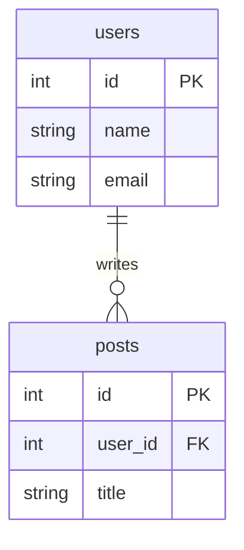

# Relational (SQL) Databases

> **In one line:** Data lives in **tables** with **rows** and **columns**. Tables reference each other with **foreign keys**. You query with **SQL**. This boring tech is the best decision you'll make on most projects.

:::tip[In plain English]
A relational database is a glorified spreadsheet system. Each "table" is a sheet with rows (records) and columns (fields). Tables can reference each other — a `posts` table has a `user_id` column pointing at the `users` table. You ask questions in **SQL**, a 50-year-old query language that's still the lingua franca of data. The "boring" choice has won for half a century because it's *correct, predictable, and well-understood*.
:::

## The structure

Data lives in **tables** with **rows** and **columns**. Tables can reference each other via **foreign keys**.

```
users table:
┌────┬──────┬─────────────┐
│ id │ name │ email       │
├────┼──────┼─────────────┤
│ 1  │ Tony │ tony@x.com  │
│ 2  │ Sam  │ sam@y.com   │
└────┴──────┴─────────────┘

posts table:
┌────┬─────────┬──────────────┐
│ id │ user_id │ title        │
├────┼─────────┼──────────────┤
│ 10 │ 1       │ Hello world  │   ← references users.id = 1
│ 11 │ 1       │ Second post  │
│ 12 │ 2       │ Hi from Sam  │
└────┴─────────┴──────────────┘
```

The `user_id` column in `posts` is a **foreign key** (a column whose value must match a primary key in another table) pointing at `users.id`. As an entity-relationship diagram:



> **Reading this diagram:** `||--o{` means "one users row relates to zero-or-more posts rows" — the canonical one-to-many relationship. `PK` is the **primary key** (the unique identifier for a row); `FK` is the **foreign key** (a pointer to another table's primary key). SQL lets you ask combined questions across both tables via `JOIN`.

## SQL — the query language

You query with SQL:

```sql
SELECT users.name, COUNT(posts.id) AS post_count
FROM users
LEFT JOIN posts ON posts.user_id = users.id
GROUP BY users.id
ORDER BY post_count DESC
LIMIT 10;
```

> **In English:** "Give me the top 10 users by post count, showing their name and total." A **LEFT JOIN** (return every row from the left table, attaching matching rows from the right when they exist) keeps users who have zero posts in the result. **GROUP BY** collapses all of one user's post rows into a single row per user; **COUNT** counts how many were collapsed; **ORDER BY ... DESC** sorts loudest-first; **LIMIT** truncates to ten.

SQL is **declarative** — you describe *what* you want, not *how* to compute it. The database's **query planner** (an internal optimizer that picks an execution strategy) figures out the most efficient path through your tables.

:::note[Worked example: the 5 SQL queries you'll write 90% of the time]
```sql
-- 1. Get one row
SELECT * FROM users WHERE id = 42;

-- 2. Get a filtered list with pagination
SELECT id, title, created_at
FROM posts
WHERE user_id = 42
ORDER BY created_at DESC
LIMIT 20 OFFSET 0;

-- 3. Join two tables
SELECT posts.title, users.name AS author
FROM posts
JOIN users ON users.id = posts.user_id
WHERE posts.published = true;

-- 4. Aggregate
SELECT COUNT(*) AS total, AVG(price) AS avg_price
FROM orders
WHERE created_at > NOW() - INTERVAL '7 days';

-- 5. Insert / Update / Delete
INSERT INTO users (name, email) VALUES ('Tony', 'tony@x.com');
UPDATE users SET email = 'new@x.com' WHERE id = 42;
DELETE FROM posts WHERE id = 11;
```

Spend an afternoon learning these patterns and you'll handle 90% of database work in any web app.
:::

## ACID guarantees — why relational databases earn trust

Relational databases provide **ACID guarantees**:

- **Atomicity** — Transactions complete fully or not at all. If your bank transfer is "deduct $100 from A, add $100 to B," ACID guarantees you never end up with the deduction without the addition.
- **Consistency** — Data always satisfies constraints (no negative ages, no orphan foreign keys).
- **Isolation** — Concurrent transactions don't interfere with each other.
- **Durability** — Committed data survives crashes.

These guarantees are why banks, healthcare systems, and anything that handles money runs on relational databases. NoSQL databases often relax these guarantees in exchange for scale.

## The 2026 choices

| Database         | Notes                                                                   |
|------------------|-------------------------------------------------------------------------|
| **PostgreSQL**   | The dominant 2026 choice. Open-source, feature-rich. Has extensions for almost everything (JSON, full-text search, vectors, time-series, GIS). Hosted via **Supabase**, **Neon**, **Railway**, **AWS RDS**, **Google Cloud SQL**. |
| **MySQL**        | Still common in legacy and powers WordPress. **PlanetScale** popularized serverless MySQL.                |
| **SQLite**       | A single-file database that's surprisingly powerful. **Cloudflare D1** and **Turso** make it production-viable at the edge. |
| **CockroachDB / Spanner** | Distributed SQL — runs as a global cluster. Used at very large scale.                              |

:::info[Highlight: "Just use Postgres" is the most reliable advice in modern web dev]
Almost every "should I use X or Y?" question about databases in 2026 has the same answer: *start with Postgres*. It handles:

- Relational data (its bread and butter)
- JSON / JSONB (rivals MongoDB for most use cases)
- Full-text search (`tsvector`, `tsquery` — better than you'd expect)
- Vector embeddings (via `pgvector` — used in production AI apps)
- Time-series data (via TimescaleDB extension)
- Geospatial queries (via PostGIS — powers many mapping apps)

One database to operate, one set of backups, one mental model. You can specialize later when you have a *specific* problem Postgres can't solve. That moment may never come.
:::

:::note[Try it yourself]
Most modern hosting providers offer a free Postgres tier:

- **Supabase** — `https://supabase.com` — free tier with 500MB.
- **Neon** — `https://neon.tech` — generous free tier with branching.
- **Railway** — `https://railway.app` — $5 starter credit.

Sign up, create a database, run `SELECT 1;` in the web SQL editor. You're now a database operator.
:::

## What's next

→ Continue to [NoSQL & Specialized Databases](./databases-nosql) where we'll cover the non-relational alternatives: document, key-value, search, and vector databases — and when each is worth adopting alongside (or instead of) SQL.
