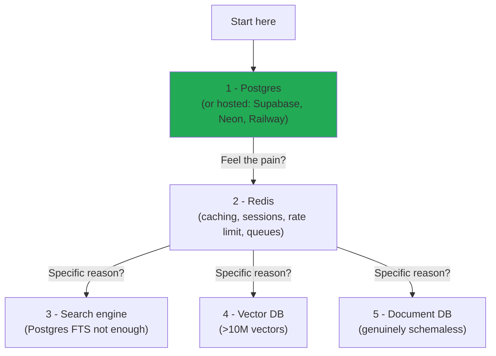
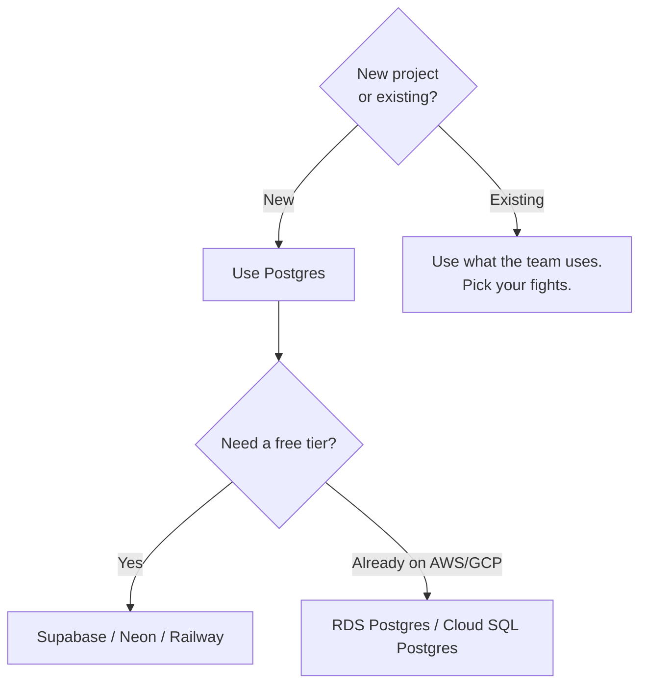
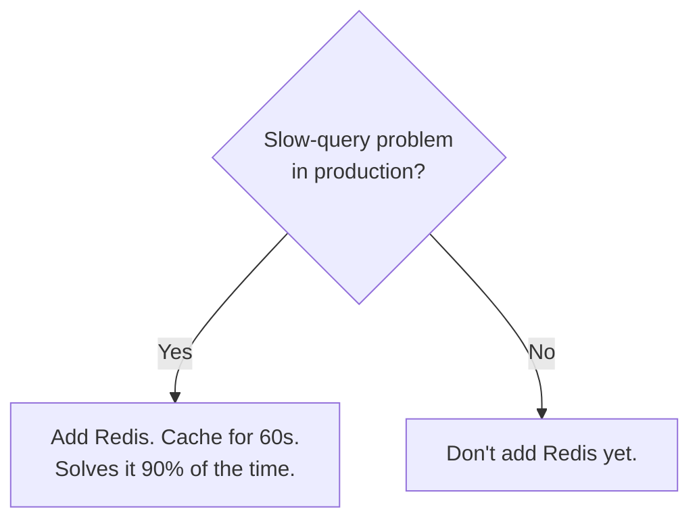
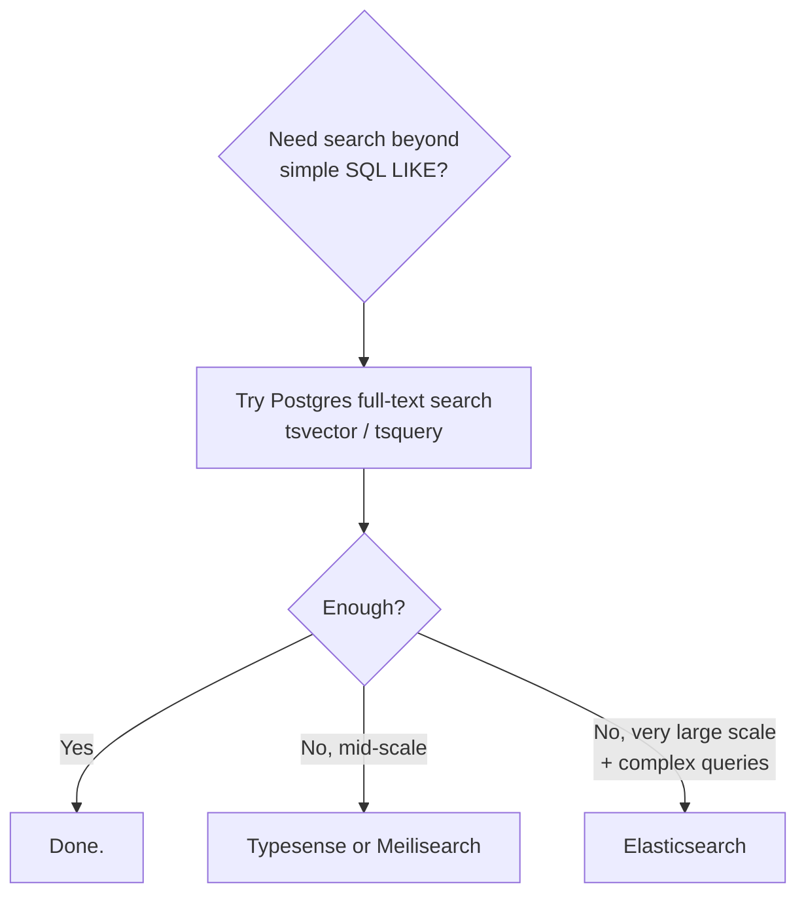
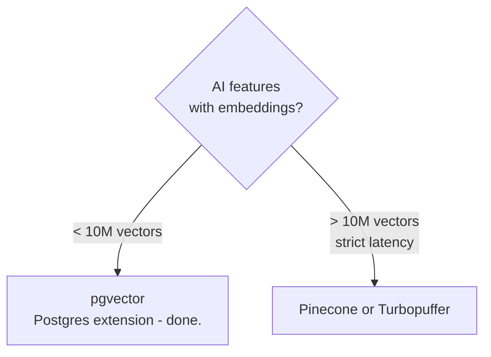

# Choosing a Database

> **In one line:** Start with Postgres. Add Redis as soon as you need caching. Add anything else only when Postgres genuinely can't do the job. That's it.

:::tip[In plain English]
You're going to read a lot of opinions on Twitter, Reddit, and Hacker News about "the best" database. Most of them are wrong because they generalize from someone else's specific problem. The reality is: 95% of web apps in 2026 are well-served by Postgres, often with Redis added for caching. Save the complex specialized databases for when you actually have the problem they solve.
:::

## The 2026 default stack



## A pragmatic decision tree









> **Reading these trees:** Each diamond is a yes/no choice that moves you to the *next* tool. Notice how almost every "yes" branch ends at Postgres or a Postgres extension — that's the whole point of "boring tech wins." A few quick definitions you'll see across these trees: **FTS** = full-text search (matching words and phrases inside long text columns); **pgvector** = a Postgres extension that stores AI embeddings; **embeddings** = fixed-length numeric vectors that represent the "meaning" of text or images for similarity search.

## The cost of each addition

Every extra database costs you:

- **Operational complexity** — more backups, more monitoring, more failure modes.
- **Mental complexity** — your team has to know one more system.
- **Data consistency challenges** — if Redis says one thing and Postgres another, who's right?
- **Latency** — every cross-database call costs network round trips.

This is why the 2026 advice is *boring*: minimize the number of databases until forced to add more.

:::info[Highlight: the "Choose Boring Technology" principle]
Dan McKinley's famous essay says every team starts with a budget of ~3 "innovation tokens" for non-boring choices. Spend them carefully. **Choosing Postgres is spending zero tokens** — it's the boring choice. That's good. It means you have all 3 tokens left for the parts of your product that are genuinely novel.

If your innovation tokens are going into "I picked a cool new vector DB," ask yourself: is this the part of my product that's supposed to be novel?
:::

## Worked example: data stack for three real apps

**Solo developer's todo app:**

```
1 database: SQLite (single file, no server) or Postgres on Neon free tier.
That's it. Done.
```

**Mid-size startup SaaS, ~20 employees, 10K paying customers:**

```
- Postgres on RDS (main DB)
- Redis on Upstash (cache + sessions)
- pgvector extension (AI search, if any)
- ClickHouse or BigQuery (analytics, optional)
```

**Enterprise, hundreds of engineers, billions of records:**

```
- Postgres (per-service, dozens of clusters)
- DynamoDB (high-throughput key-value)
- Redis Enterprise (cache, sessions, rate limit)
- Elasticsearch (search & log aggregation)
- Pinecone or self-hosted vector DB (large embedding stores)
- Snowflake or BigQuery (analytics warehouse)
- Kafka (event bus)
```

The pattern: complexity grows with scale, not with ambition. Start small. Earn each addition.

## Common mistakes

:::caution[Where people commonly trip up]
- **Picking a database from a blog post rather than the workload.** "Discord uses ScyllaDB" is interesting; it's also irrelevant to your todo app. Match the database to the *shape and scale of your data*, not to the company you admire.
- **Adding a second database before fully using the first.** Many "we need a vector DB" or "we need a search engine" decisions go away when you discover Postgres already does it (`pgvector`, `tsvector`, JSONB). Try the Postgres extension before adopting a whole new system.
- **Treating Redis as a primary store.** Redis is fast because it's in-memory; it's also lossy unless you carefully configure persistence — and even then, replication and durability are weaker than Postgres. Use it as a cache or coordination layer, not the source of truth.
- **Locking into a managed DB without an exit plan.** "Just use DynamoDB" is fine until you want to leave AWS, or rebuild a feature in a way that doesn't fit single-table design. Prefer hosted *standards* (Postgres on Supabase/Neon/RDS) where the protocol is portable.
- **Optimizing the database before profiling the query.** "We need to switch databases" is almost never the right next step. The right next step is `EXPLAIN ANALYZE`, an index, or a 60-second Redis cache. A real Postgres install on a $20 VPS will outlast the average startup.
:::

## Page checkpoint

<Quiz id="databases-choosing-page" title="Did choosing a database stick?" sampleSize={2}>

<Question
  prompt="A new project in 2026 needs a database. What's the recommended starting point?"
  options={[
    { text: "Pick a brand-new vector DB to look modern" },
    { text: "Start with Postgres — add Redis when you genuinely need caching, and add specialized DBs only when Postgres can't do the job" },
    { text: "Set up MongoDB, DynamoDB, and Elasticsearch on day one" },
    { text: "Use whatever your favorite influencer recommends this week" }
  ]}
  correct={1}
  explanation="The 2026 default is deliberately boring: Postgres first, Redis as caching pain appears, and specialized databases only with a concrete reason. Minimizing the number of databases saves you operational, mental, and consistency complexity."
  revisit={{ to: "/docs/foundations/databases-choosing#the-2026-default-stack", label: "The 2026 default stack" }}
/>

<Question
  prompt="You have an AI feature with ~50,000 vector embeddings. Which vector store is the most sensible choice?"
  options={[
    { text: "Pinecone, because all AI apps need a dedicated vector DB" },
    { text: "pgvector inside Postgres — well under 10M vectors, no need for a separate database" },
    { text: "An in-memory hash map you write yourself" },
    { text: "Elasticsearch" }
  ]}
  correct={1}
  explanation="Under ~10M vectors, pgvector is more than enough. Reach for a dedicated vector DB (Pinecone, Turbopuffer) only when you have very large scale with strict latency SLOs."
  revisit={{ to: "/docs/foundations/databases-choosing#a-pragmatic-decision-tree", label: "Vector DB decision" }}
/>

<Question
  prompt="What does 'Choose Boring Technology' actually mean for database choices?"
  options={[
    { text: "Always pick the newest, most exciting database to differentiate your product" },
    { text: "You have a small budget of innovation tokens — spend them on the parts of your product that are genuinely novel, not on infrastructure choices like the database" },
    { text: "Avoid all databases; use flat files" },
    { text: "Pick whatever your team learned in college" }
  ]}
  correct={1}
  explanation="Dan McKinley's principle: every team has ~3 innovation tokens. Boring database choices (Postgres) cost 0 tokens, leaving them free for the genuinely novel parts of your product. If your novelty is 'I picked a cool DB,' that's misallocated."
  revisit={{ to: "/docs/foundations/databases-choosing#the-cost-of-each-addition", label: "Choose Boring Technology" }}
/>

<Question
  prompt="What's a real, non-obvious cost of adding ANY additional database to your stack?"
  options={[
    { text: "Slightly higher monthly bill, and that's it" },
    { text: "More backups, more monitoring, more failure modes, more team knowledge required, and consistency issues when one DB disagrees with another" },
    { text: "Nothing — every database is functionally identical" },
    { text: "You lose the ability to use Postgres at all" }
  ]}
  correct={1}
  explanation="Each new database multiplies operational complexity (backups, monitoring, on-call), mental complexity (one more system to understand), and introduces cross-database consistency challenges. That's why 'fewer DBs' is the conservative default."
  revisit={{ to: "/docs/foundations/databases-choosing#the-cost-of-each-addition", label: "The cost of each addition" }}
/>

</Quiz>

## What's next

→ Continue to [Authentication: Proving Identity](./authentication) where we start the third pillar of every web app (after rendering and data): **who is talking to us, and what are they allowed to do?**
