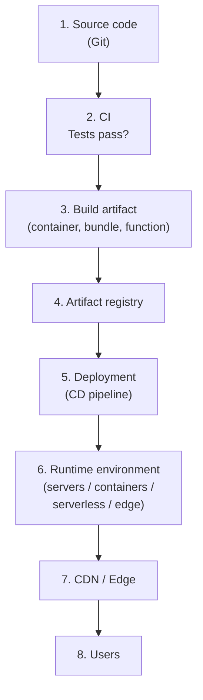
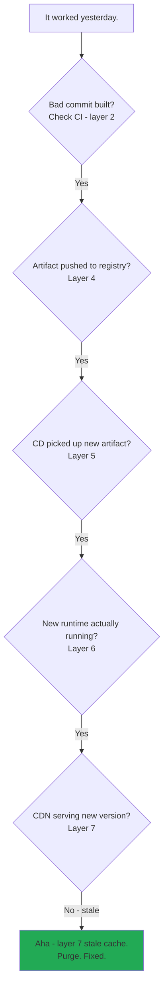

# The Deployment Pyramid

> **In one line:** Every project, from one-person blogs to Google, ships code through some variation of the same eight-stage pipeline. Knowing the stages helps you debug at *every* level.

:::tip[In plain English]
"Deploying" is just the word for *putting your code somewhere users can run it*. It's not a single action — it's a multi-step process where each step has a specific job. The pyramid below is the same shape used by everyone from a teenager building their first Astro site (`git push` and Vercel handles the rest) to Google rolling out a global change (the same eight stages, just way more automation at each one).
:::

## The pyramid

How does code reach users? Every project, from one-person blogs to Google, uses some variation of this pipeline. A few terms before the diagram:

:::info[Jargon for the pipeline]
- **CI** (Continuous Integration) — automation that runs on every commit (lint, tests, security scans).
- **Artifact** — the *built* output of your code (a Docker container image, a static bundle, a serverless function package). What actually gets deployed.
- **Registry** — a storage system for artifacts, like a Git for compiled code (GHCR, ECR, Docker Hub).
- **CD** (Continuous Deployment) — automation that takes a registry artifact and rolls it out to a runtime.
- **Runtime** — the machine/container/function-host that actually executes your code.
- **CDN** (Content Delivery Network) — globally distributed edge caches that serve responses close to the user (covered earlier in the chapter).
:::

> **Reading this diagram:** Top-down, each box is a *stage* with its own tools, failure modes, and debugging skills. The next page covers each stage in detail. This page gives you the bird's-eye map.

## The same shape at every scale

What changes between solo, startup, and enterprise isn't *what* the stages are — it's *how much automation, gating, and ceremony* surround each one.

| Stage              | Solo project                            | Startup                                | Enterprise                                                  |
|--------------------|-----------------------------------------|-----------------------------------------|-------------------------------------------------------------|
| 1. Source          | GitHub repo                              | GitHub + branch protection              | GitHub Enterprise + signed commits + required reviewers     |
| 2. CI              | GitHub Actions, ~30s                     | GitHub Actions, ~5min, lint+test        | Internal CI platform, ~30min, lint+test+security+SAST+SCA   |
| 3. Build artifact  | Static folder or Docker image            | Docker image                            | Multi-arch Docker, signed, SBOM attached                   |
| 4. Registry        | None or Vercel/Netlify implicit          | GHCR, ECR, Docker Hub                   | Internal registry with policy enforcement                  |
| 5. CD              | Auto-deploy on push                      | Auto-deploy to staging, manual to prod  | Multi-environment, progressive rollout, approval gates      |
| 6. Runtime         | Vercel/Netlify/Cloudflare Pages          | Vercel, Fly.io, ECS, Cloud Run          | Kubernetes (often custom internal platform)                |
| 7. CDN             | Bundled with hosting platform            | Cloudflare or CloudFront                | Multi-CDN with custom routing                              |
| 8. DNS             | Domain registrar                          | Managed by Cloudflare or platform       | Internal DNS team                                          |

The solo developer just types `git push` and 30 seconds later their site is live — but under the hood, every one of those eight stages happened. The difference is who/what runs each stage.

:::info[Highlight: this is why "deployment problems" are hard]
When something breaks in production, it could be in any of these 8 layers:

- A bug in your source code (layer 1).
- A test you forgot to update (layer 2).
- A misbuilt Docker image (layer 3).
- A registry permissions issue (layer 4).
- A botched CD config (layer 5).
- A runtime resource limit (layer 6).
- A CDN cache misconfiguration (layer 7).
- A DNS propagation issue (layer 8).

**The skill is knowing which layer to look at.** Once you have the map, debugging stops feeling random.
:::

## A real-world failure narrative

You push code. The site goes down. Where do you look?

> **Reading this diagram:** It's a debugging checklist as a flowchart. You walk *down* the pipeline asking "did this layer do its job?" until you find the broken one. You'll repeat variations of this dance dozens of times in a career. Each layer is a place to look.

## What's next

→ Continue to [Deployment Stages, Explained](./deployment-stages) where we walk through each of the eight stages in detail with concrete tooling examples.
