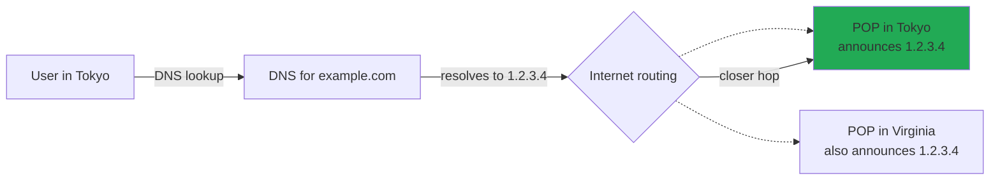

---
id: deployment-stages
title: Deployment Stages, Explained
sidebar_position: 25
sidebar_label: Deployment Stages
description: A detailed walk through each of the eight deployment stages — what happens, what tools are involved, what can go wrong.
---

# Deployment Stages, Explained

> **In one line:** Source → CI → artifact → registry → deploy → runtime → CDN → DNS. Eight stages. Every one has tools, conventions, and failure modes worth knowing.

:::tip[In plain English]
This page walks through what each of the eight deployment stages actually *does*. After reading it, "deployment" stops being a black box and starts being a sequence of clearly-named steps you can debug, automate, and reason about.
:::

## Stage 1: Source code

Code lives in a **Git repository**, typically hosted on:

| Host          | Notes                                                            |
|---------------|------------------------------------------------------------------|
| **GitHub**    | Dominant, owned by Microsoft, integrated with Actions for CI.    |
| **GitLab**    | Self-hostable, all-in-one DevOps platform.                       |
| **Bitbucket** | Atlassian, popular alongside Jira.                               |
| **Gitea / Codeberg** | Self-hosted alternatives, smaller communities.            |

The **branch model** matters: most modern teams use **trunk-based** development with a `main` branch and short-lived feature branches. Pull requests merge to `main`, which triggers everything downstream.

## Stage 2: CI — Continuous Integration

Every push triggers automated checks:

- Install dependencies
- Run linters and formatters
- Run type checker (e.g., `tsc --noEmit`)
- Run unit tests
- Run integration tests
- Build the project
- Run security scans (SAST, SCA — looking for known vulnerable dependencies)

Failed CI blocks the change from merging.

**Tools:**
- **GitHub Actions** — dominant for indie/startup.
- **GitLab CI** — for GitLab users.
- **CircleCI** — fast, well-respected.
- **Buildkite** — common at larger companies.
- **Drone, Jenkins** — legacy or self-hosted setups.

:::note[Worked example: a tiny CI workflow]
```yaml
# .github/workflows/ci.yml
name: CI
on:
  pull_request:
  push:
    branches: [main]
jobs:
  test:
    runs-on: ubuntu-latest
    steps:
      - uses: actions/checkout@v4
      - uses: actions/setup-node@v4
        with:
          node-version: '20'
          cache: 'npm'
      - run: npm ci
      - run: npm run lint
      - run: npm test
      - run: npm run build
```

> **In English:** This GitHub Actions config defines a job named `test` that runs on every pull request and every push to `main`. It boots a fresh Ubuntu virtual machine, installs Node 20, restores cached npm dependencies, then runs four shell commands in order. If any command exits non-zero, the whole job fails and the PR can't merge. That YAML, committed to your repo, is now a quality gate — every commit, every PR, every merge runs through it.
:::

## Stage 3: Build artifact

CI produces a **build artifact** — a packaged version of your app:

| Artifact type              | What's inside                                            |
|---------------------------|----------------------------------------------------------|
| **Docker image**           | A complete filesystem snapshot with your app + dependencies |
| **Static bundle**          | A folder of `.html`, `.js`, `.css` for static sites      |
| **Serverless function package** | A zip with your code, deployed to Lambda/Workers   |
| **Native binary**          | Compiled Go/Rust/etc. binaries                            |

Whichever type, the artifact is **immutable** — once built, it never changes. Different versions are different artifacts.

## Stage 4: Artifact registry

Artifacts are stored in a **registry** for repeatable deployment:

| Registry                          | Best for                                       |
|-----------------------------------|------------------------------------------------|
| **Docker Hub**                    | Public, easy                                   |
| **GitHub Container Registry (GHCR)** | Tightly integrated with GitHub Actions      |
| **AWS ECR**                       | AWS users                                      |
| **Google Artifact Registry**       | GCP users                                      |

Cloud platforms (Vercel, Netlify, Cloudflare Pages) often handle artifact storage implicitly — you never see this stage.

## Stage 5: CD — Continuous Deployment / Delivery

CD takes passing builds and ships them:

- **Direct deployment** — build → deploy. Used by Vercel, Netlify, Cloudflare Pages.
- **Pull-based GitOps** — a controller (**Argo CD**, **Flux**) watches the Git repo and applies changes to the cluster.
- **Progressive delivery** — deploy to 1% of users, monitor metrics, gradually expand.

:::info[Highlight: Continuous Deployment vs Continuous Delivery (the subtle difference)]
**Continuous Delivery** = every commit *can* be deployed at any time (humans approve when).
**Continuous Deployment** = every commit *is* deployed automatically (no humans).

The first is a process choice — common at startups and most enterprises. The second requires high test coverage and confidence, and is common at organizations with strong engineering culture (Netflix, Etsy, modern indie projects).
:::

## Stage 6: Runtime environment

Where the code actually runs:

| Runtime                                   | Notes                                                       |
|-------------------------------------------|-------------------------------------------------------------|
| **PaaS** (Vercel, Netlify, Railway, Render, Fly.io) | You give them code, they run it. Easiest for solo/startup |
| **Containers** (AWS ECS, Google Cloud Run, Azure Container Apps) | You give them a Docker image, they run it       |
| **Kubernetes** (EKS, GKE, AKS, or self-hosted) | Container orchestration at scale; standard at large companies |
| **Serverless functions** (AWS Lambda, Cloudflare Workers, Vercel Edge Functions) | Tiny pay-per-execution handlers           |
| **Raw VMs** (EC2, Compute Engine, dedicated servers) | Full control, high operational burden                  |

For most new projects in 2026, **PaaS first**. Move down the list only when the higher tiers genuinely don't fit.

## Stage 7: CDN and edge

Static assets and (often) HTML are cached on the CDN. Users hit the CDN first; only cache misses reach your servers.

Modern setups use a CDN with edge compute (Cloudflare Workers, Vercel Edge Functions) to handle simple logic — auth, redirects, A/B test assignment — without involving the origin server at all.

## Stage 8: DNS and routing

DNS points your domain to the CDN/load balancer. Modern setups use **anycast** routing (the trick of advertising the same IP address from multiple physical locations and letting the internet's routing tables pick the closest one) — so users automatically hit the geographically closest entry point.



> **Reading this diagram:** Both POPs claim the same address. The user's ISP picks the closest one via standard internet routing — Tokyo wins. This is invisible to your code — it just works.

## The pyramid runs in...

| Scale            | Total time, commit to live   |
|------------------|------------------------------|
| Solo project     | 30 seconds – 2 minutes       |
| Startup          | 5 – 15 minutes               |
| Enterprise (with approval gates) | Hours to weeks |

The whole pyramid runs in minutes for personal projects, hours for startups, and can involve approval gates and weeks of staging for large enterprises.

:::info[Highlight: optimization isn't always faster — sometimes it's *safer*]
At solo scale, speed wins — `git push` and 30 seconds later it's live.

At enterprise scale, *safety* wins — manual approvals, gradual rollouts, kill switches. A 30-second deploy is irrelevant if it accidentally takes down a payment system serving millions.

The right pyramid for your project depends on **what failure costs**, not on what's technically possible. A junior engineer's first instinct is "automate everything." A senior engineer's instinct is "automate everything *that's safe to automate*."
:::

## Common mistakes

:::caution[Where people commonly trip up]
- **Letting CI grow to 30 minutes and "fixing" it by skipping tests.** A slow pipeline kills the habit of frequent small commits. Profile the slow steps, parallelize, cache dependencies (`actions/setup-node` with `cache: 'npm'`), and split into faster check jobs and slower nightly jobs — don't `--skip-tests` your way out.
- **Baking secrets into the Docker image.** Anything in a layer is recoverable from the registry, even if you `RUN rm` it in the next layer. Pass secrets at runtime (env vars, mounted files, AWS Secrets Manager / Vault) — never `COPY .env` into a build.
- **Using `:latest` tag in production.** `image: myapp:latest` means "whatever was most recently pushed," which makes rollbacks impossible and turns every deploy into a guess. Tag with the commit SHA (`myapp:c3a1b9f`) and pin deploys to specific versions.
- **Deploying straight to prod with no staging or canary.** "It worked locally" is the famous last words of every Friday afternoon outage. Even a tiny percentage rollout (1% of traffic for 5 minutes) catches the kind of regressions that don't show up in tests.
- **Forgetting the runtime's resource limits.** A serverless function with a 128MB memory limit and a 10-second timeout doesn't tell you when it's about to OOM — it just kills the request. Set alerts on memory, CPU, and execution-time approaching the limit, not just on actual failures.
:::

## Page checkpoint

<Quiz id="deployment-stages-page" title="Did deployment stages stick?" sampleSize={2}>

<Question
  prompt="What does the CI stage typically do on every push?"
  options={[
    { text: "Sends a notification email to the team and nothing else" },
    { text: "Runs automated checks (install deps, lint, type-check, tests, build, security scans) and blocks the merge if any fail" },
    { text: "Manually approves the change for production" },
    { text: "Deploys directly to users with no other steps" }
  ]}
  correct={1}
  explanation="CI is the quality gate. On every push (or PR), it installs deps, runs lint/types/tests, builds the project, and often runs SAST/SCA. If anything fails, the change can't merge — bad code is caught before it lands."
  revisit={{ to: "/docs/foundations/deployment-stages#stage-2-ci--continuous-integration", label: "Stage 2: CI" }}
/>

<Question
  prompt="What's the subtle distinction between Continuous Delivery and Continuous Deployment?"
  options={[
    { text: "They're identical — different vendors use different names" },
    { text: "Continuous Delivery means every commit CAN be deployed at any time (a human chooses when); Continuous Deployment means every commit IS deployed automatically" },
    { text: "Continuous Delivery uses CDNs; Continuous Deployment doesn't" },
    { text: "Continuous Delivery is for mobile; Continuous Deployment is for web" }
  ]}
  correct={1}
  explanation="Both keep the pipeline always-shippable. Delivery requires a human to push the deploy button (common at startups and enterprises). Deployment is fully automatic — only safe when tests and confidence are high (Netflix, Etsy)."
  revisit={{ to: "/docs/foundations/deployment-stages#stage-5-cd--continuous-deployment--delivery", label: "CD vs Continuous Delivery" }}
/>

<Question
  prompt="A user in Tokyo and a user in Virginia both visit example.com and hit completely different physical servers — yet both got there with the same DNS answer. What technique makes that work?"
  options={[
    { text: "Two separate domain names pointing at different IPs" },
    { text: "Anycast routing — multiple POPs advertise the SAME IP, and the internet's routing tables direct each user to the geographically closest one" },
    { text: "The browser picks at random" },
    { text: "DNS rewrites the IP based on a cookie" }
  ]}
  correct={1}
  explanation="Anycast lets many physical locations claim the same IP address. The user's ISP routes to the closest one automatically. This is how modern CDNs and edge networks work — invisible to your code, just naturally fast."
  revisit={{ to: "/docs/foundations/deployment-stages#stage-8-dns-and-routing", label: "Stage 8: DNS and routing" }}
/>

<Question
  prompt="For a new project in 2026 needing somewhere to run the code, what's the recommended starting point?"
  options={[
    { text: "Kubernetes — it's the industry standard" },
    { text: "Raw EC2 VMs — full control" },
    { text: "A PaaS (Vercel, Netlify, Railway, Render, Fly.io) — easiest for solo/startup; move down to containers, K8s, or VMs only when the higher tier doesn't fit" },
    { text: "Your own laptop in production" }
  ]}
  correct={2}
  explanation="Start with a PaaS — you ship code, the platform handles runtime. Containers (Cloud Run, ECS) come next; Kubernetes after that when you need orchestration at scale. Each step down the list trades simplicity for control."
  revisit={{ to: "/docs/foundations/deployment-stages#stage-6-runtime-environment", label: "Stage 6: Runtime environment" }}
/>

</Quiz>

## Wrapping up Part 1

If you've read this carefully, you now know:

- How the web actually moves bytes
- What HTTP really looks like
- How browsers turn HTML into pixels
- The rendering strategies that drive framework design
- The major API and database paradigms
- How auth works under the hood
- How code reaches production

Every later part of this guide builds on these foundations. The frameworks and tools change every few years, but these underlying concepts don't.

→ **Next chapter:** [Part 3: The Development Lifecycle](/docs/lifecycle) — the universal phases every project moves through, regardless of size or stack.
