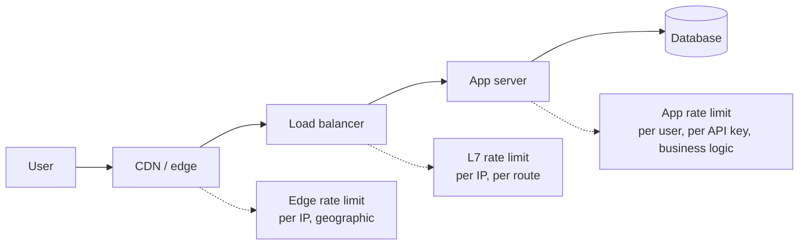

# Rate limiting: protecting your API from abuse and yourself

> **In one line:** Rate limiting caps how many requests an identity (an IP, a user, an API key) can make in a window of time — protecting your backend from abuse, bots, runaway scripts, and *your own customer who accidentally wrote an infinite loop*.

:::tip[In plain English]
A rate limiter is a bouncer at the door of your API. It counts how many times each person has shown up recently and tells anyone over the limit to come back later. The interesting questions aren't "should I have one" — you should — but **who counts as one person**, **how do you count fairly**, and **how do you keep counting straight across multiple server instances**.
:::

You need rate limiting the day your app is publicly reachable. The cheapest one (a few lines of middleware) blocks 90% of attacks and bot traffic. The middle tier (a Redis-backed sliding window) handles legitimate scale. The expensive tier (token buckets per tenant with custom quotas) is what you build when rate limiting *is the product* — Stripe, OpenAI, GitHub all run hand-tuned limiters because their abuse profile demands it.

## What rate limiting protects against

| Threat | What it looks like | What rate limiting does |
|--------|-------------------|------------------------|
| Brute force on login | 100,000 password guesses per minute on one account | Caps attempts per username + per IP |
| Scraping | A single IP pulling your entire catalog | Caps requests per IP |
| Cost-amplification attacks | Endpoint that calls an expensive LLM, hit 10,000×/min | Caps requests on cost-heavy routes |
| Accidental client bugs | Customer's recursion sends 50 requests/sec forever | Caps gracefully without you noticing or paying |
| DDoS (volumetric) | Botnet floods your edge | Edge/CDN rate limit + per-IP at origin |
| Fair-share | One free-tier user hogs all the GPU minutes | Per-account quotas |

The first three are about *security*. The fourth is about *cost*. The fifth is about *availability*. The sixth is about *product fairness*. Same mechanism, different policy.

## The four algorithms

You'll see these names in every rate limiting library and blog post. They're not interchangeable — pick deliberately.

### Fixed window

> "Allow N requests per minute. Reset the count at the top of each minute."

```
00:00 — counter resets to 0
00:23 — 47 requests in this minute, OK
00:59 — 100 requests in this minute, blocked
01:00 — counter resets to 0
```

**Pros:** dead simple, one counter per key per window. Memory cheap.
**Cons:** a user can fire 100 requests at 00:59 and another 100 at 01:00 — *200 in 2 seconds*, twice your stated rate. This is the **boundary spike** problem.

When to use: when you don't care about boundary spikes and you want the cheapest possible implementation. Internal services, low-stakes endpoints.

### Sliding window log

> "Keep a list of every request timestamp. Count timestamps in the last 60 seconds. Block if over limit."

```typescript
function allowed(key: string, limit: number, windowMs: number): boolean {
  const now = Date.now();
  const log = getLog(key); // sorted list of timestamps
  // drop timestamps older than the window
  while (log.length && log[0] < now - windowMs) log.shift();
  if (log.length >= limit) return false;
  log.push(now);
  return true;
}
```

**Pros:** exact. No boundary spike.
**Cons:** stores every request timestamp. Memory grows with traffic. Slow to scan at high RPS.

When to use: low-traffic APIs where exactness matters (e.g., billing-sensitive endpoints).

### Sliding window counter (the 2026 default)

> "Track the count in the *current* window and the *previous* window. Estimate the rate as a weighted blend."

If a user has made 60 requests in the current 60s window (0–60s elapsed in it, 15s in) and 80 in the previous window, the estimated count in the trailing 60 seconds is:

```
estimated = currentCount + previousCount * ((windowMs - elapsedInCurrent) / windowMs)
          = 60          + 80           * ((60000      - 15000)             / 60000)
          = 60 + 80 * 0.75
          = 120
```

**Pros:** two counters per key. Constant memory. Smooths out boundary spikes (the previous-window contribution decays linearly).
**Cons:** approximate (off by up to ~10–15%). Doesn't matter for almost any real product.

When to use: most production APIs. This is what Cloudflare, Nginx, and most cloud rate limiters do under the hood.

### Token bucket

> "Each key has a bucket of N tokens. Refilled at rate R tokens/sec, capped at N. Each request consumes a token. No token, no request."

```
Bucket size = 100 (= burst allowance)
Refill rate = 10 tokens/sec (= sustained rate)

t=0:   bucket has 100 tokens → user fires 100 requests in 1 second → bucket empty
t=1:   refill adds 10 tokens → user can fire 10 more in this second
t=2:   refill adds 10 tokens → and so on
```

**Pros:** distinguishes **burst** from **sustained** rate. A user who normally idles can spike briefly without being blocked, then settles to the steady rate. Matches how humans actually use APIs. Standard for billing tiers.

**Cons:** two numbers to tune (bucket size + refill rate), more state.

When to use: customer-facing APIs where you want to allow legitimate bursts (loading a dashboard fires 30 requests in a second; you don't want to block that). This is what AWS, Stripe, and most paid APIs publish.

### Leaky bucket

A close cousin of token bucket. Imagine requests arriving into a bucket with a hole in the bottom: they drain at a constant rate. If the bucket overflows, new requests are rejected. Functionally similar to token bucket but enforces a constant *output* rate rather than allowing bursts up to the bucket size. Less common in modern web; more common in queue-shaping (network QoS).

:::info[Highlight: token bucket is the sane default for customer APIs]
If you're picking one algorithm and don't want to think about it, use **token bucket**. It matches how humans use APIs (idle, then a burst, then idle), it's what every major paid API publishes as their quota model, and the math is friendly to clear documentation ("100 requests, refilled at 10/sec"). Sliding window counter is fine for internal stuff; token bucket is what you advertise.
:::

## The distributed problem

A naive rate limiter is a `Map<string, number>` in memory. It works on one server. The moment you have **two server instances behind a load balancer**, the counters drift — user X's first 50 requests hit instance A, the next 50 hit instance B, and each instance thinks the user has only made 50 requests. The user sails through 200% of the intended limit.

You need a **shared store** that every instance reads and updates atomically. Standard choices:

| Store | Latency | Pros | Cons |
|-------|---------|------|------|
| **Redis** | 0.5–2ms | Atomic ops, TTL, scripting (Lua), the industry default | One more thing to operate |
| **Memcached** | sub-ms | Faster, simpler | No persistence, no atomic increments-with-check in some versions |
| **Postgres** | 5–20ms | Already in your stack | Slow for hot keys |
| **DynamoDB / Cloud KV** | 5–30ms | Managed | Latency budget hurts |
| **CDN edge cache** (Cloudflare Workers KV, Vercel Edge Config) | sub-ms at edge | Limits at the edge before traffic hits origin | Eventually consistent globally |

In 2026 the answer is almost always **Redis** (or its compatible variants — Valkey, KeyDB, Upstash Redis serverless). It supports atomic `INCR`-with-`EXPIRE` and Lua scripts that run server-side, so you can do a full token-bucket check in one round trip.

### Token bucket in Redis — the actual code

```typescript
// Token bucket with atomic Lua script.
// Refills based on elapsed time since last check; consumes one token per call.

import { Redis } from 'ioredis';
const redis = new Redis(process.env.REDIS_URL!);

const SCRIPT = `
  local key = KEYS[1]
  local capacity = tonumber(ARGV[1])
  local refillPerMs = tonumber(ARGV[2])
  local now = tonumber(ARGV[3])

  local data = redis.call('HMGET', key, 'tokens', 'last')
  local tokens = tonumber(data[1]) or capacity
  local last = tonumber(data[2]) or now

  -- Refill based on elapsed time
  local elapsed = math.max(0, now - last)
  tokens = math.min(capacity, tokens + elapsed * refillPerMs)

  local allowed = 0
  if tokens >= 1 then
    tokens = tokens - 1
    allowed = 1
  end

  redis.call('HMSET', key, 'tokens', tokens, 'last', now)
  redis.call('EXPIRE', key, 3600)

  return { allowed, tokens }
`;

export async function checkRateLimit(
  identity: string,
  capacity = 100,
  refillPerSec = 10,
): Promise<{ allowed: boolean; retryAfter?: number }> {
  const refillPerMs = refillPerSec / 1000;
  const [allowed, tokens] = (await redis.eval(
    SCRIPT,
    1,
    `rl:${identity}`,
    capacity,
    refillPerMs,
    Date.now(),
  )) as [number, number];

  if (allowed === 1) return { allowed: true };

  // How many ms until at least one token is available?
  const retryAfter = Math.ceil((1 - tokens) / refillPerMs);
  return { allowed: false, retryAfter };
}
```

> **In English:** Each rate-limited identity has a hash in Redis with two fields: how many tokens it currently has, and when we last checked. On each request we run a Lua script that (a) figures out how many tokens to add since last time, (b) consumes one if available, (c) writes back. The Lua script runs *atomically* — no other process can interleave with it — which is the whole reason we use Redis for this.

Latency budget: this whole call should round-trip in under 5ms on a same-region Redis. If you're approaching 10ms+, your Redis is too far away or your traffic is hammering a single shard.

## Who counts as "one identity"?

This is where the interesting product choices live.

| Identity | Pros | Cons |
|----------|------|------|
| **Per IP** | No auth required, blocks anonymous abuse | Whole offices on one NAT share a limit. CGNATs (mobile carriers) put thousands of users behind one IP. IPv4 exhaustion makes this worse every year. |
| **Per user / per account** | Fair, scales with your tier system | Requires authentication. Doesn't help with pre-auth abuse (login spam, signup spam). |
| **Per API key** | Clean for B2B APIs, lets you publish per-key quotas | User can rotate keys to evade — pair with per-account caps. |
| **Per session / per JWT** | Per-tab granularity for SPAs | Trivial to bypass by clearing cookies. |
| **Composite (IP + user)** | Most production APIs do this | Two counters per request. |

A common production pattern:

1. **Pre-auth endpoints** (login, signup, password reset) → per IP, *tight*. The cost of false positives is low; the cost of brute force is high.
2. **Authenticated endpoints** → per user, generous. Plus a fallback per IP cap to catch credential-stuffing across many accounts from one host.
3. **Cost-amplifying endpoints** (anything that calls an LLM, generates a PDF, sends an email) → per user, tight, and tracked against billing quota.

:::note[Worked example: the corporate-NAT problem]
A company ships a developer tool with a per-IP limit of "100 requests per minute, free tier."

A medium-size customer (200 engineers) tries to roll it out. Every engineer's laptop sits behind the corporate firewall and shares one egress IP. By 10am, the entire office hits the rate limit because *together they made 100 requests in a minute* — even though no individual engineer is anywhere near it.

The fix:

1. Per-user (or per-API-key) becomes the primary limiter once a user authenticates.
2. The pre-auth per-IP limit gets a separate, looser quota — enough that a 200-engineer NAT can still cold-start without locking out.
3. Anomaly detection (sudden spike from a new IP) replaces strict pre-auth limits.

**The lesson:** any per-IP limit assumes IPs are roughly 1:1 with humans. They are not — corporate NATs, university networks, CGNAT mobile carriers, and VPNs all break this assumption. Per-IP is a *defense against anonymous abuse*, not a fair allocation mechanism.
:::

## Communicating limits to the client

A good API tells the client what its limits are *and* what's left, on every response. The de facto standard is:

```
HTTP/1.1 200 OK
RateLimit-Limit: 100
RateLimit-Remaining: 47
RateLimit-Reset: 38

(or, when blocked:)

HTTP/1.1 429 Too Many Requests
RateLimit-Limit: 100
RateLimit-Remaining: 0
RateLimit-Reset: 38
Retry-After: 38
```

> **Reading these headers:** `RateLimit-Limit` is the cap. `RateLimit-Remaining` is what's left. `RateLimit-Reset` is seconds until the window resets (or until a token will be available). `Retry-After` is the explicit "don't try again for N seconds" on 429s — well-behaved clients (curl, Stripe SDKs, etc.) read it and back off automatically.

Newer drafts use `RateLimit` and `RateLimit-Policy` (single combined header), but the older split form is what most libraries still emit.

## What to do when you hit the limit

The *server* side is "return 429 with `Retry-After`." Done. The interesting design is on the *client* side.

| Strategy | When |
|----------|------|
| **Fail loud** | Internal tools, debugging — make the developer fix the loop |
| **Retry with exponential backoff + jitter** | Customer-facing SDKs (Stripe, OpenAI client all do this) |
| **Queue and drain** | Background jobs that must complete eventually |
| **Degrade gracefully** | "We're catching up, results may be slow." Better than a hard error for UX |

Always include **jitter** in client backoff. If a thousand clients all hit your rate limit and all back off "exactly 30 seconds," they all stampede back at the same moment. Use `backoff = base * 2^attempt + random(0, base)` so they spread out.

## Per-endpoint cost weighting

Not all requests cost the same. A `GET /healthz` is microseconds. A `POST /api/chat` calls Claude Opus and costs you fifteen cents. You should probably not limit them identically.

Two common patterns:

- **Different limits per route group.** Cheap reads get a generous limit, expensive writes get a tight one.
- **Cost-weighted token bucket.** Each request consumes *N* tokens proportional to its cost. A chat call might consume 10 tokens; a health check consumes 1. Same bucket, different drain rate per request type.

Cost-weighted is what OpenAI and Anthropic do for their public APIs — your "tokens per minute" quota is literally the *model tokens* you spend, which scales with prompt + response size, not the count of HTTP requests.

## Where to put the rate limiter in your stack



Three tiers, increasing cost and intelligence:

1. **At the edge / CDN** (Cloudflare, Fastly, Vercel) — cheap, blocks the loudest abuse before traffic hits your origin. Per-IP, per-country, per-ASN. Stops volumetric attacks.
2. **At the load balancer / reverse proxy** (Nginx, HAProxy, Envoy) — per-IP, per-route. Catches what the edge missed.
3. **In your application code** — per-user, per-tenant, per-API-key, cost-weighted. The intelligent layer that knows your business model.

A real production setup has all three. The edge layer is the bulk filter; the app layer is the precise scalpel.

:::info[Highlight: rate limiting is a layered defense, not a single switch]
The cheapest rate limit you write in app code does nothing for a botnet hammering your origin with millions of RPS — that's an edge problem. The smartest edge limiter doesn't know which authenticated user is over their billing quota — that's an app problem. **Provision both; they protect different things.**
:::

## Edge cases that bite

- **The clock-skew problem.** Two app servers with clocks ~500ms apart will produce slightly different rate-limit decisions. Always use the *Redis server's* clock (`TIME` command) as the source of truth, or use `Date.now()` consistently on the application server (and synchronize via NTP).
- **The retry-amplification loop.** A flaky downstream returns 500. Your code retries 3×. Now one user request becomes 4 backend requests, and your "100 req/min user" is really doing 400 backend ops/min. Rate limit at the boundary where the user's intent enters your system, not at every internal hop.
- **The websocket-counts-as-one-request question.** A WebSocket connection is one HTTP upgrade — but then carries thousands of messages. Decide whether each message counts as a request (message-level limit, more accurate, more code) or whether the connection counts as one (cheaper, more permissive). Most APIs do per-message for hot paths.
- **The big-customer carve-out.** Eventually someone important emails saying "we need higher limits." Have a quota override table (`identity → multiplier`) from day one so the answer is a row in a config DB, not a code deploy.
- **The user-facing UX failure.** A blocked user with no helpful message will assume your app is broken and rage-quit. At minimum, surface "you're over your limit, try in N seconds" with the `Retry-After` value.

## When to roll your own vs use a library

For most apps, **don't roll your own** for v1. Use:

- **In-app middleware:** `@upstash/ratelimit` (TypeScript, edge-friendly, multiple algorithms baked in), `express-rate-limit` (Node), `slowapi` (Python), `Bucket4j` (Java).
- **At the edge:** Cloudflare Rate Limiting Rules, Vercel's `@vercel/firewall`, AWS WAF.
- **As a service:** Kong, Tyk, AWS API Gateway (built-in throttling).

Roll your own when:
- You need cost-weighted or business-logic-aware limits the library doesn't model.
- You have unusual scale and need to optimize the Redis round trip away (e.g., approximate counters local to each instance, periodic sync).
- Rate limiting is your product (Stripe's per-merchant fraud limits, OpenAI's per-org token quotas).

## Common mistakes

:::caution[Where people commonly trip up]
- **Per-IP only.** Works on day one. Breaks the day your first 50-engineer customer rolls out — they all share one egress IP and the office hits the limit by 10am. Move to per-user as soon as users can authenticate; keep per-IP as a pre-auth fallback.
- **In-memory `Map`-based limiter behind a load balancer.** Each instance has its own counter, so the effective limit is `N × your_intended_limit`. Either pin sessions to instances (fragile) or use a shared store (Redis). Don't ship in-memory limiters in horizontally-scaled deployments.
- **Blocking with 500 instead of 429.** A 500 says "I'm broken." A 429 says "you're over your limit, here's `Retry-After`." Well-behaved clients back off automatically on 429; on 500 they treat it as a server bug and may retry harder.
- **Forgetting `Retry-After`.** Without it, clients guess — usually wrong, usually too short, often retry-storming you. Always include `Retry-After: <seconds>` (or an HTTP-date) on 429s.
- **No jitter in client backoff.** Synchronized retries from a thousand clients = stampede. Add `random(0, base)` to whatever your exponential backoff produces.
- **Limiting only at the application layer.** A volumetric attack saturates your load balancer before your app code ever runs. Edge/CDN rate limits handle volume; app limits handle business logic. Use both.
- **Setting the same limit on every endpoint.** A health check costing nothing and an LLM call costing 15¢ should not share a quota. Group endpoints by cost class and tune separately.
- **Not exposing limits to the client.** Without `RateLimit-Limit` and `RateLimit-Remaining` headers, a polite client can't pace itself; you only meet at the wall when they cross the line. Always emit headers.
:::

## Page checkpoint

<Quiz id="foundations-rate-limiting-page" title="Did rate limiting stick?" sampleSize={2}>

<Question
  prompt="A team uses a per-process in-memory `Map` to track per-user request counts. They scale from 1 to 4 server instances behind a load balancer. What happens?"
  options={[
    { text: "Nothing changes — the limiter works as before" },
    { text: "Each instance keeps its own counter, so a user's effective limit becomes roughly 4× the intended one" },
    { text: "The load balancer automatically aggregates the counts" },
    { text: "Requests start failing immediately" }
  ]}
  correct={1}
  explanation="In-memory counters don't see traffic that lands on other instances. With N instances, a user can do roughly N× their intended limit before any one instance trips. A shared store (Redis) is required for horizontally-scaled rate limiting."
  revisit={{ to: "/docs/foundations/rate-limiting#the-distributed-problem", label: "The distributed problem" }}
/>

<Question
  prompt="Why does the token bucket algorithm match real customer API usage better than a fixed window?"
  options={[
    { text: "It uses less memory" },
    { text: "It distinguishes 'burst' (brief spike to bucket capacity) from 'sustained rate' (refill speed), matching real users who idle and then spike" },
    { text: "It runs faster in Redis" },
    { text: "It cannot be evaded" }
  ]}
  correct={1}
  explanation="Real usage is bursty — a dashboard load might fire 30 requests in a second. Token bucket allows that (up to capacity) while still enforcing a steady long-run rate. Fixed window either allows or denies the burst with no nuance."
  revisit={{ to: "/docs/foundations/rate-limiting#token-bucket", label: "Token bucket" }}
/>

<Question
  prompt="A B2B tool ships with strict per-IP limits. A new enterprise customer with 200 engineers behind one corporate egress IP can't use the product after 10am. What's the right fix?"
  options={[
    { text: "Raise the per-IP limit globally so all customers can do more" },
    { text: "Make per-user the primary limit (post-auth) and keep per-IP only as a loose pre-auth fallback to defend against signup/login abuse" },
    { text: "Ask the customer to give every engineer their own residential IP" },
    { text: "Block the customer's IP range entirely" }
  ]}
  correct={1}
  explanation="Per-IP assumes one IP = one human. Corporate NATs, CGNATs, and VPNs break that. Once a user has authenticated, count against the user; reserve per-IP for the anonymous-abuse case."
  revisit={{ to: "/docs/foundations/rate-limiting#who-counts-as-one-identity", label: "Identity choices" }}
/>

<Question
  prompt="Which response best signals to a well-behaved client that it should slow down and try again later?"
  options={[
    { text: "HTTP 500 Internal Server Error" },
    { text: "HTTP 400 Bad Request" },
    { text: "HTTP 429 Too Many Requests with `Retry-After: 30`" },
    { text: "HTTP 200 OK with an empty body" }
  ]}
  correct={2}
  explanation="429 is the standardized 'you're rate limited' code. The `Retry-After` header tells the client exactly how long to wait. Stripe, OpenAI, and most SDKs read this and back off automatically — 500s would be treated as bugs and retried harder."
  revisit={{ to: "/docs/foundations/rate-limiting#communicating-limits-to-the-client", label: "429 + Retry-After" }}
/>

<Question
  prompt="Why is jitter important in client-side exponential backoff after a 429?"
  options={[
    { text: "Jitter increases the success rate of each retry" },
    { text: "Without jitter, many clients backing off in lockstep will all retry at the same instant, stampeding the server the moment the window opens" },
    { text: "Jitter encrypts the retry traffic" },
    { text: "Jitter is required by HTTP" }
  ]}
  correct={1}
  explanation="A thousand clients all retrying 'in exactly 30s' produces a thundering herd. Adding `random(0, base)` to each client's wait spreads them out. Every serious SDK does this — it's why their reconnects feel smooth."
  revisit={{ to: "/docs/foundations/rate-limiting#what-to-do-when-you-hit-the-limit", label: "Jitter" }}
/>

</Quiz>

## What's next

→ Continue to [Caching](./caching) — the other half of the "make your backend survive" toolkit. Rate limiting bounds *demand*; caching bounds the *work each request creates*.
