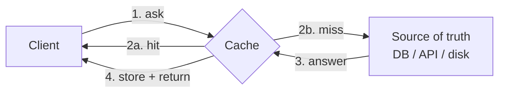
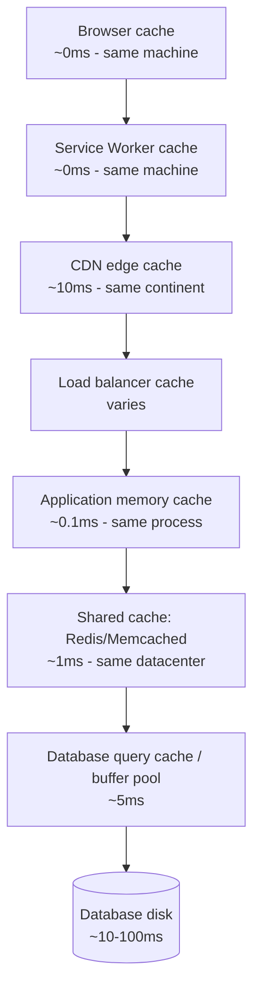

# Caching: the universal speedup (and its two famous problems)

> **In one line:** Caching saves the result of a slow or expensive operation so the next request can return it without redoing the work. It's the single biggest performance lever in any web stack — and the single biggest source of "why am I seeing stale data?" bugs.

:::tip[In plain English]
A cache is a sticky note you keep on your desk. The first time someone asks "what's the capital of France?" you Google it and write "Paris" on the note. Next time you just read the note. Faster. The trouble starts when France moves its capital — you have to remember to throw the note away. Cache *invalidation* is the throwing-away part, and it's where every cache bug lives.
:::

There's a famous quote attributed to Phil Karlton: *"There are only two hard things in computer science: cache invalidation and naming things."* This is funny because it's true. Once you internalize that every cache is a tradeoff between **speed** and **freshness**, you can reason about every cache in any system.

## The mental model

A cache sits between a **client** that asks questions and a **source of truth** that knows answers. The cache remembers recent answers so it can short-circuit future questions.



Every cache has the same four parameters to tune:

1. **What to cache.** Which questions get sticky notes?
2. **Where to store it.** RAM, disk, CDN edge, browser?
3. **How long it lives.** Time-to-live (TTL). Five seconds? Five hours? Forever?
4. **When to invalidate.** What makes a sticky note wrong? How do we throw it away?

The product decision is in #1 and #4. The engineering choice is in #2 and #3.

## The seven layers of cache in a typical web app

Every modern web request passes through multiple caches before it returns. A request that finds its answer at the closest cache returns fastest.



> **Reading top-to-bottom:** each layer either answers (cheap, fast) or passes through to the next (more work). A well-cached page returns from the CDN; an uncached page rummages all the way to disk.

Let's walk down the list.

### 1. Browser cache

Controlled by HTTP response headers — `Cache-Control`, `ETag`, `Last-Modified`.

```http
GET /static/logo.png
HTTP/1.1 200 OK
Cache-Control: public, max-age=31536000, immutable
ETag: "a1b2c3"
```

> **In English:** "This response is cacheable by anyone, for 1 year, and the bytes won't change at this URL." The next time the browser needs this asset, it skips the network entirely.

| Directive | Meaning |
|-----------|---------|
| `public` | Any cache (browser, CDN) may store this |
| `private` | Only the user's browser may cache (per-user data) |
| `no-cache` | Cache it, but revalidate with the origin every time |
| `no-store` | Don't cache at all — sensitive data |
| `max-age=N` | Fresh for N seconds |
| `immutable` | Won't change at this URL; don't even bother revalidating |
| `stale-while-revalidate=N` | Serve the cached copy; refetch in background |

The standard pattern for static assets (JS/CSS/fonts/images): give the file a hashed filename (`app.a1b2c3.js`) and serve with `Cache-Control: public, max-age=31536000, immutable`. When the file changes, the *filename* changes, so the cache is implicitly invalidated. **This is the single best caching trick in web development** — it's how Next.js, every modern bundler, and basically every CDN-served SPA work.

### 2. Service Worker cache

A Service Worker is JavaScript that intercepts network requests before they leave the browser. Combined with the **Cache Storage API** it lets you serve responses from disk for offline use (PWAs) or to short-circuit network entirely.

Use cases:
- Offline-capable web apps.
- Aggressive shell caching (the app's UI shows instantly; data loads in the background).
- Custom stale-while-revalidate logic the browser cache headers can't express.

You won't reach for this in a typical app; reach for it when you specifically want offline or zero-network startup.

### 3. CDN edge cache

A CDN (Cloudflare, Fastly, CloudFront, Vercel) operates a fleet of edge servers around the world. The first user in Tokyo to request `/blog/hello` pulls it from your origin; the next ten million users in Tokyo get it from the Tokyo edge in ~10ms.

CDNs cache:
- **Static assets** (JS/CSS/images) — always, indefinitely with hashed filenames.
- **Static HTML** (SSG pages) — bulletproof, fast.
- **SSR pages with cache headers** — only if you tell the CDN they're safe (`Cache-Control: public`).
- **API responses** — for read endpoints, with explicit headers.

CDN-level caching is the single biggest perceived-performance win available to a web app. A page served from a Tokyo edge in 50ms feels different from a page that round-trips to your origin in Virginia (300ms+).

Invalidation: most CDNs let you **purge** specific URLs or tags via API. Common pattern: tag responses with the underlying entity ID, purge on write.

### 4. Application memory cache

A `Map` (or LRU cache) inside your process holding hot values:

```typescript
import LRUCache from 'lru-cache';

const userCache = new LRUCache<string, User>({
  max: 10_000,
  ttl: 60_000, // 60 seconds
});

async function getUser(id: string): Promise<User> {
  const cached = userCache.get(id);
  if (cached) return cached;
  const user = await db.users.findUnique({ where: { id } });
  userCache.set(id, user);
  return user;
}
```

**Pros:** zero network. Nanoseconds. Free.
**Cons:**
- Per-instance — each app server has its own copy. Cache hit ratio drops as you scale horizontally.
- Lost on restart.
- Hard to invalidate across instances (you have to broadcast).

Use for: small, hot, read-mostly data that's expensive to recompute (auth claims, feature flags, computed values). Don't use for: user data that changes (you'll serve stale across instances).

### 5. Shared cache: Redis / Memcached

A separate process (or managed service: Upstash, ElastiCache, Memorystore) that all app instances share.

```typescript
import { Redis } from 'ioredis';
const redis = new Redis(process.env.REDIS_URL!);

async function getUser(id: string): Promise<User> {
  const key = `user:${id}`;
  const cached = await redis.get(key);
  if (cached) return JSON.parse(cached);

  const user = await db.users.findUnique({ where: { id } });
  await redis.set(key, JSON.stringify(user), 'EX', 300); // 5 min TTL
  return user;
}

// On write:
async function updateUser(id: string, data: Partial<User>) {
  await db.users.update({ where: { id }, data });
  await redis.del(`user:${id}`); // invalidate
}
```

**Pros:** shared across all instances. Survives restarts. Atomic ops. Pub/sub for invalidation. ~1ms latency same-datacenter.
**Cons:** another moving part. Network hop. Memory cost.

In 2026, Redis (or compatible: Valkey, KeyDB, Upstash) is the universal default. If you only learn one external cache, learn this one.

### 6. Database query cache

Postgres and MySQL maintain an in-memory **buffer pool** that caches recently-read pages from disk. Queries that hit the buffer pool return in milliseconds; queries that miss go to disk (or to remote storage in cloud DBs).

You generally don't tune this — the DB manages it. But it's why:
- A query is slow the first time, fast the next ten.
- Sizing your DB's memory matters more than CPU.
- Restarting a hot DB causes a "cache warm-up" period of high latency.

Postgres' old query result cache was removed long ago (it was a footgun); MySQL deprecated it. Modern wisdom: cache at the app layer (Redis), not the DB.

### 7. Disk / storage

The slowest layer. Always the source of truth.

## Application-level patterns

How you use the cache matters more than which cache you use. The patterns:

### Cache-aside (lazy population)

The default, shown in the Redis snippet above:

1. Look up in cache.
2. If hit, return.
3. If miss, query source, store in cache, return.

**Pros:** simple. Only caches what gets requested.
**Cons:** **cache stampede** — first 1000 concurrent misses all query the DB before any of them can populate the cache.

### Write-through

Every write updates *both* the source of truth and the cache.

```typescript
async function updateUser(id: string, data: Partial<User>) {
  const user = await db.users.update({ where: { id }, data });
  await redis.set(`user:${id}`, JSON.stringify(user), 'EX', 300);
  return user;
}
```

**Pros:** cache is always fresh after a write.
**Cons:** every write pays the cache cost. Inconsistency if one side fails (write to DB succeeds, cache update fails — now cache is stale).

### Write-behind (write-back)

Writes go to cache first; a background job flushes to DB periodically.

**Pros:** very fast writes.
**Cons:** data loss risk on crash. Complex consistency. Rarely worth it outside specialized systems.

### Refresh-ahead

Cache proactively re-fetches an item before its TTL expires.

**Pros:** users never see a cold cache.
**Cons:** wasted work for items nobody requests again.

### Stale-while-revalidate (SWR)

Serve the stale value immediately, refresh in background.

```typescript
// React, with the SWR library:
const { data } = useSWR('/api/profile', fetcher, { revalidateOnFocus: true });
```

**Pros:** every request is instant; freshness arrives async.
**Cons:** users see stale-but-old, not fresh-but-slow. Almost always the right tradeoff for read-heavy UI.

The Vercel-style data-fetching philosophy is built around SWR — and it's why apps using it feel snappy. The HTTP equivalent is `Cache-Control: stale-while-revalidate=N`.

## The two famous problems

### Problem 1: cache invalidation

How does the cache know its data is stale?

Strategies, in order of robustness:

1. **TTL** — the data expires after N seconds. Simplest. Acceptable staleness window.
2. **Explicit purge on write** — your write path deletes/updates the cache entry. Works if you control all writes. Fails when writes happen out-of-band (a CRON job, a sibling service).
3. **Versioned keys** — `user:42:v3` becomes `user:42:v4` on each write. Old keys age out naturally. Eliminates stale reads but requires version tracking.
4. **Pub/sub invalidation** — writes broadcast "user 42 changed" on a channel; all caches subscribe and invalidate. Solves the multi-instance problem.
5. **Tag-based invalidation** — group keys by entity tag; purge all keys with tag `user:42` on write. Most CDNs and Next.js' built-in cache use this.

The right strategy depends on **how stale is too stale**:

| Data type | Tolerable staleness | Strategy |
|-----------|---------------------|----------|
| Marketing page HTML | hours | TTL + purge on deploy |
| Logged-in user profile | seconds | Purge on write + short TTL |
| Real-time stock price | zero | Don't cache, or use SWR with very short TTL |
| User's password hash | infinite for reads; instant on rotation | Cache forever, invalidate on rotation |
| Feature flags | minutes | Long TTL + pub/sub purge |

### Problem 2: cache stampede (thundering herd)

A popular cache key expires. The next thousand concurrent requests all miss simultaneously, all query the source, all try to write the cache. Your database melts.

Mitigations:

- **Probabilistic early refresh.** Before the TTL expires, randomly start refreshing — XFetch algorithm. Smooths the refresh load.
- **Lock + single-flight.** First requester gets a lock and queries; others wait for the result. `redis-lock`, `singleflight` in Go, or the patterns in any "request coalescing" library.
- **Stale-while-revalidate.** Serve stale to all concurrent requesters; one of them refreshes in the background.
- **Negative caching.** Cache the *absence* of a value too (with a shorter TTL), so a miss doesn't become a stampede.
- **Long base TTL + soft TTL.** Cache for hours, but treat the data as "fresh" only for the first few minutes; after that, refresh on read but still serve the cached copy.

:::info[Highlight: cache invalidation is policy, not code]
The wrong question is "how do I write the perfect cache invalidator?" The right question is "**how stale can this data be before it hurts the product?**" Once you answer that, the strategy falls out: marketing pages tolerate hours, dashboards tolerate seconds, financial transactions tolerate nothing. Match your strategy to your tolerance, not the other way around.
:::

## Prompt caching (the AI-era special case)

In 2026, **LLM providers cache prompt prefixes** on their end. If you send the same system prompt + retrieved docs to Claude or GPT, the provider can recognize the shared prefix and skip re-processing it — cutting cost by 50–90% on the cached portion and latency by 30–50%.

Anthropic exposes this via `cache_control` markers; OpenAI does it automatically for repeated prefixes. To benefit:

- **Keep the static prefix stable.** Put your system prompt and long-lived context *first*, dynamic user content *last*.
- **Mark cache breakpoints.** With Anthropic, you tag blocks with `cache_control: { type: 'ephemeral' }`.
- **Reuse within the cache window.** Prompt caches typically live 5 minutes; if you don't hit them again in time, the cache evaporates.

This matters enormously for cost-control on chat apps with long system prompts (e.g., interview-coach apps with detailed interviewer briefs).

:::note[Worked example: an interview-coach app and its three caches]
A web-based AI interviewer (think SoloMock) typically caches at *three* layers:

1. **CDN cache** (Cloudflare): the marketing landing page, the static assets, the published list of problems. TTL: days. Purge on deploy.
2. **Application cache** (Redis): the assembled interviewer brief (system prompt + Socratic ladder + solution tree) for each problem ID. Built once per problem at deploy time; held in Redis with no TTL until next deploy. Saves ~50ms of assembly on every session start.
3. **LLM prompt cache** (Anthropic / OpenAI): the system prompt portion of every request is marked cacheable, so a returning user (or a returning *prefix* across users with the same problem) hits the provider's cache and skips re-processing. Saves real money.

Three caches, three TTLs (deploy / forever-pinned / 5-minute prefix), three invalidation strategies (purge on deploy / replace on deploy / automatic). Each layer cuts the cost or latency of its predecessor's misses.
:::

## When NOT to cache

- **The query is fast already.** Caching adds complexity. If a query takes 5ms, the cache hop also takes 5ms — you've doubled the codepath for no win.
- **The data changes every request.** A user's current cursor position, a real-time chat feed, anything write-mostly. The cache misses every time and adds latency.
- **Stale answers are catastrophic.** Auth decisions, payment authorizations, anything where "the old answer is wrong" causes a bad outcome. Cache the lookup, not the decision.
- **The cache cost exceeds the savings.** Redis isn't free — a tiny cache for a tiny app may cost more in ops than it saves in latency. Measure before optimizing.

## Common mistakes

:::caution[Where people commonly trip up]
- **Caching personalized data with `Cache-Control: public`.** Now user A's bank balance is served to user B from the CDN. Anything per-user should be `private` (browser-only) or uncached. CDNs only cache `public`.
- **No TTL on a `set`.** A Redis cache without TTL grows forever. Always pair `set` with an `EX` (or rely on key eviction policy). At some point your Redis runs out of memory and starts evicting *important* keys instead of stale ones.
- **Caching the error.** Your DB throws a transient error, you wrap the call in cache-aside, the cache now stores `null` (or the error) with a 5-min TTL. Five minutes of every user seeing the same broken response. Negative-cache only with very short TTL, and never cache 5xx responses.
- **Forgetting to invalidate on write.** The hardest cache bug: writes go through; reads serve the stale value; everyone disagrees about reality. Wire invalidation into the *same path* as the write, not as a separate cleanup job.
- **Race between cache populate and write.** Reader A misses, reads from DB (gets value v1), pauses. Writer B updates to v2, invalidates cache. Reader A resumes and writes v1 to cache. Cache is now wrong. Fix: write-through with a versioned key, or use `SETNX`-style "only set if absent."
- **Treating the cache as the source of truth.** Cache lost → app degrades to slow but correct. Cache became the source → cache lost → app loses data. Always have a recoverable source of truth.
- **Caching at every layer "just in case."** Each layer adds latency-on-miss and a freshness problem. Use the layer that fits the data: static assets at CDN, hot user data in Redis, query results sometimes nowhere (let Postgres' buffer pool do it).
:::

## Page checkpoint

<Quiz id="foundations-caching-page" title="Did caching stick?" sampleSize={2}>

<Question
  prompt="What's the standard trick for caching static JS/CSS/font assets forever in the browser and CDN?"
  options={[
    { text: "Set `Cache-Control: no-cache` to revalidate every time" },
    { text: "Include a hash in the filename (`app.a1b2c3.js`) and serve with `Cache-Control: public, max-age=31536000, immutable` — the filename changes when the content changes, so old cached copies are simply never requested again" },
    { text: "Cache it in Redis with a 1-year TTL" },
    { text: "Disable caching and rely on HTTP/2 for speed" }
  ]}
  correct={1}
  explanation="Hashed filenames make 'invalidation' a non-event: a new build produces a new filename, the old URL is never requested, the new URL was never cached before. This is how every modern bundler works."
  revisit={{ to: "/docs/foundations/caching#1-browser-cache", label: "Browser cache + hashed filenames" }}
/>

<Question
  prompt="An app uses an in-process `Map` cache for user profiles. They scale to 4 instances. Why does cache hit ratio drop?"
  options={[
    { text: "Each instance keeps its own cache, so the same user's profile is cached in only one of four caches; hits depend on which instance routed the request" },
    { text: "Maps in JavaScript can't hold more than 1000 keys" },
    { text: "Horizontal scaling automatically clears caches" },
    { text: "Load balancers strip cache headers" }
  ]}
  correct={0}
  explanation="Per-instance caches don't share. With round-robin routing, only 1/N of requests hit a cache that already saw this user. Move to a shared cache (Redis) to recover hit ratio."
  revisit={{ to: "/docs/foundations/caching#4-application-memory-cache", label: "In-process cache trade-offs" }}
/>

<Question
  prompt="A popular cache key expires at noon. A thousand concurrent requests all miss and all query the DB simultaneously, melting it. What's this called and how do you mitigate?"
  options={[
    { text: "Cache poisoning — fix with input validation" },
    { text: "Cache stampede / thundering herd — mitigate with single-flight (only one queries), stale-while-revalidate (serve old until new is ready), or probabilistic early refresh" },
    { text: "Cache invalidation — fix with longer TTLs" },
    { text: "Cache aliasing — fix with namespaces" }
  ]}
  correct={1}
  explanation="Stampede: simultaneous misses overwhelm the source. Solutions are about ensuring only one fetcher does the work, or serving stale while refreshing, or jittering the expiration."
  revisit={{ to: "/docs/foundations/caching#problem-2-cache-stampede-thundering-herd", label: "Stampede mitigations" }}
/>

<Question
  prompt="In an AI chat app, why is putting the (long, static) system prompt at the FRONT of the messages list, and dynamic user input at the END, a cost-saving move?"
  options={[
    { text: "It improves response quality" },
    { text: "Anthropic and OpenAI cache prompt prefixes. A stable front portion gets cached on the provider side, cutting cost ~50–90% and TTFT ~30–50% on the cached part; dynamic content at the end doesn't disturb the cache" },
    { text: "The model reads messages back-to-front" },
    { text: "It avoids triggering rate limits" }
  ]}
  correct={1}
  explanation="Provider prompt caches key on the prefix. Anything stable lives at the front; anything per-request lives at the end. Get this right and a long system prompt costs almost nothing to ship on every turn."
  revisit={{ to: "/docs/foundations/caching#prompt-caching-the-ai-era-special-case", label: "Prompt caching" }}
/>

<Question
  prompt="A team caches user profiles in Redis with `set('user:42', json)` — no TTL. Months later Redis OOMs and starts evicting random keys. What's the root cause?"
  options={[
    { text: "Redis can't handle JSON" },
    { text: "Caching without a TTL lets the keyspace grow unbounded until Redis runs out of memory and evicts under pressure — including keys you actually need" },
    { text: "Postgres should be used instead" },
    { text: "JSON serialization is too slow" }
  ]}
  correct={1}
  explanation="Always pair `set` with `EX` (TTL) — or configure a proper eviction policy and accept that hot keys may also be evicted. An unbounded cache is a memory leak with a fancy name."
  revisit={{ to: "/docs/foundations/caching#common-mistakes", label: "Always TTL your sets" }}
/>

</Quiz>

## What's next

→ Continue to [Secrets and API keys](./secrets-and-keys) — the production-engineering muscle continues with how to keep credentials out of harm's way (and how to mint short-lived ones).
