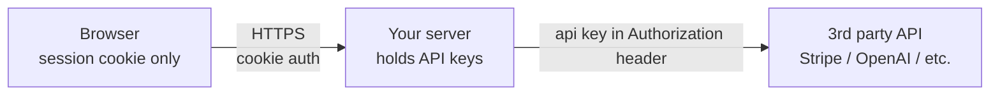
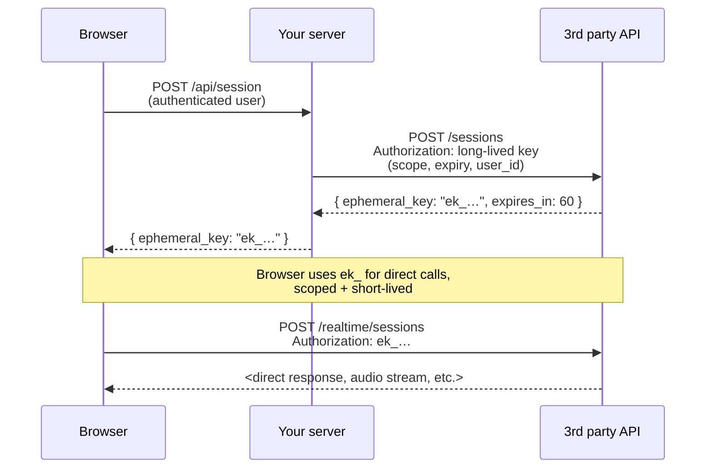

# Secrets and API keys: keeping credentials out of harm's way

> **In one line:** Every production app holds secrets — database passwords, API keys, signing keys — and the difference between a hobby project and a real one is how seriously you isolate, rotate, and scope those secrets. The single sharpest pattern in 2026 is the **ephemeral key**: mint a short-lived, narrowly-scoped credential server-side and hand it to the browser, so your long-lived secret never leaves the backend.

:::tip[In plain English]
A secret is anything that lets you act as someone or something — your database password, your OpenAI key, your Stripe webhook signing key. If it leaks, attackers get to do whatever that key authorizes. The defenses are layered: keep secrets out of code, keep them out of the browser, keep them out of logs, make them short-lived, and scope them to the smallest possible job.
:::

You'll meet this material the day your first key leaks (a copy-pasted `.env` in a GitHub gist, a `console.log` in production, a browser fetch that includes the wrong header). Most leaks aren't dramatic hacks — they're forgotten `.env.local` files committed to git, or API keys baked into a frontend bundle and visible in DevTools.

## What counts as a secret

| Secret | Owner | If leaked |
|--------|-------|-----------|
| DB password | Your backend | Attacker reads/writes your data |
| API key for paid 3rd party (OpenAI, Stripe, Twilio) | Your backend | Attacker runs up your bill — sometimes catastrophic ($50k overnight on Anthropic isn't unheard-of) |
| JWT signing secret | Your backend | Attacker forges sessions, impersonates any user |
| Webhook signing secret | Your backend | Attacker forges webhook events from a "verified" provider |
| OAuth client secret | Your backend | Attacker impersonates your app to providers |
| Encryption key (data at rest) | Your backend | Attacker decrypts dumped DB |
| Session cookies (HttpOnly) | Browser | Attacker impersonates one user (until rotation) |
| User passwords | Hashed in DB | Reverse the hashes, log in as users — extra bad |
| Service-account keys (AWS, GCP) | Your infra | Attacker spins up resources, exfiltrates everything, $$$ |

The first six are *your* secrets. The last three are *user* secrets. They both matter; the defenses differ.

## The cardinal rule: secrets never go in the browser

A line in your React component like:

```typescript
// ❌ Never do this:
const openai = new OpenAI({ apiKey: 'sk-proj-…' });
```

…ships your key to every visitor. They can open DevTools, copy it from the bundle, and use it. There is no obfuscation that fixes this — the browser is hostile territory by definition.

The rule:

```
Server holds secrets. Browser holds session tokens.
```

A **session token** authenticates the user *to your server*, which then uses *its* secrets to talk to third parties. The browser never sees Stripe's secret key, OpenAI's API key, or your DB password.



If you find yourself wanting the browser to talk *directly* to a third-party API for latency reasons (true for voice AI, WebRTC, audio streaming), see the **ephemeral keys** section below.

## Where secrets live

### Local development: `.env` files (with rules)

```bash
# .env.local — git-ignored
DATABASE_URL=postgresql://localhost:5432/mydb
OPENAI_API_KEY=sk-proj-…
STRIPE_SECRET_KEY=sk_test_…
```

Rules:
1. **Always git-ignore**. `.env`, `.env.local`, `.env.*.local` all go in `.gitignore` from the moment the file is created.
2. **Commit a `.env.example`** with the variable *names* and no values, so collaborators know what's expected.
3. **Never copy** the file via Slack, email, or screenshots. Use 1Password / Bitwarden's shared vault, or your secret manager's CLI.
4. **Different keys per developer**. Don't share one OpenAI key across the team — if it leaks you can't tell who or rotate cleanly.
5. **`NEXT_PUBLIC_` prefix means public.** In Next.js, anything prefixed with `NEXT_PUBLIC_` is inlined into the browser bundle. The prefix is opt-in for a reason. **Don't put `NEXT_PUBLIC_OPENAI_API_KEY`.**

### Production: secret managers

In production, env-vars-via-platform are the table stakes:

- **Vercel / Netlify / Cloudflare Pages** — secrets-as-env-vars set via dashboard or CLI, injected at runtime. Encrypted at rest.
- **AWS Secrets Manager, GCP Secret Manager, Azure Key Vault** — dedicated services with versioning, rotation, fine-grained IAM.
- **HashiCorp Vault** — the heavyweight standard for big shops.
- **Doppler, Infisical** — modern secrets-as-a-service.
- **Kubernetes Secrets** (with at-rest encryption enabled) — fine for k8s shops.

A good secret manager gives you:

1. **Encryption at rest** — secrets aren't readable on the host disk even by ops.
2. **Audit log** — who fetched what, when.
3. **Versioning** — old versions retained, instant rollback.
4. **Rotation** — automatic or scripted credential rotation.
5. **Fine-grained access** — service X can read DB creds, service Y cannot.

Reach for a real manager the day you have more than one environment (staging + prod) or more than one engineer who shouldn't see all secrets.

### The "what about IaC / Terraform" question

You'll see `.tfvars` files and Helm `values.yaml` that look like they hold secrets. Two patterns:

1. **The IaC file references a secret manager**, not the value. Terraform fetches the secret at apply time from Vault / AWS Secrets Manager.
2. **Encrypted-at-rest** (SOPS, sealed-secrets, age) — the file in git is encrypted; CI has the decryption key.

Never check raw secrets into git, even private repos. GitHub's secret-scanning will catch many providers' formats and notify them — your Stripe key becomes a public incident the moment you push.

## The principle of least privilege

Every secret has a *scope*. The narrower the scope, the smaller the blast radius if it leaks.

Examples:

- **Database**: a service account that only does `SELECT` on the `orders` table — not the root user. If the service is compromised, attackers can't drop tables or read user passwords.
- **AWS IAM**: a role that can only write to one S3 bucket, in one region — not `AdministratorAccess`. If a token leaks, the damage is bounded.
- **API keys**: providers often offer scoped keys. OpenAI lets you create project-scoped keys with spend caps. Stripe has restricted keys (read-only, or restricted to specific resources). Use them.
- **OAuth scopes**: when your app integrates with Google, ask for `gmail.readonly` instead of `gmail.modify` if you only need to read.

This sounds obvious until you're tired and just paste `AdministratorAccess` in to get past a permission error. Don't.

## Key rotation

Every secret has a lifecycle: created → used → eventually compromised or expired. **Rotation** is the process of replacing one with the next, with no downtime.

Patterns:

- **Two-key window.** Issue key N+1, deploy it, retire key N after a grace period. App accepts either during the overlap.
- **Automatic provider rotation.** AWS Secrets Manager can rotate RDS passwords on a schedule; your app fetches the current one each session.
- **Manual rotation on event.** Engineer leaves the team → rotate every secret they had access to. Suspected leak → rotate, immediately.

Rotation cadence varies:
- **High-stakes secrets** (database root, encryption keys): every 90 days.
- **API keys**: at least annually, plus on any leak.
- **OAuth refresh tokens**: per provider rules; often automatic.
- **Session signing keys**: every few months; old sessions become invalid after each rotation (or use key IDs in the JWT header to support overlap).

A team that has never rotated a single secret will fumble the day one of those secrets leaks. Practice rotation in non-emergency conditions.

## Logging and secrets

A surprisingly common leak: secrets in logs. Examples:

- Your error handler dumps the entire request, including the `Authorization` header.
- Your DB driver logs slow queries — including the connection string with the password.
- A debug `console.log({ env: process.env })` ships to your log aggregator.

Defenses:
- **Redact sensitive headers** before logging. Most frameworks have a header-allowlist for logs.
- **Treat your log store as a secrets store.** Don't email logs around, don't paste them in chat, control access.
- **Use structured logging.** Field-level redaction is easy when logs are objects; impossible when logs are interpolated strings.

## The ephemeral key pattern

The hottest 2026 pattern, because it solves a real problem: how do you let a browser talk directly to a third-party API without sending the API key to the browser?

The naive options are bad:

| Option | Why it's bad |
|--------|--------------|
| Ship the real key to the browser | Anyone with DevTools steals it. Spends your account. |
| Proxy every call through your server | Adds latency, server load, and for media (audio/video) you don't want to relay the bytes |

The third option, **ephemeral keys**, threads the needle:



**The properties that matter:**

1. **Short-lived.** A typical ephemeral key expires in 30–60 seconds. If it leaks, the attacker has seconds to use it.
2. **Scoped.** Limited to one model, one feature, one user, one specific operation.
3. **Tied to an authenticated user.** Your server only mints one after checking that the user is allowed.
4. **Minted from your real key.** The long-lived secret never leaves your backend.

This is exactly how OpenAI's Realtime API, Twilio access tokens, AWS Cognito tokens, and most modern "browser talks to API directly" patterns work.

### Worked code: OpenAI Realtime ephemeral key

```typescript
// app/api/realtime-session/route.ts (Next.js Route Handler, server-only)
import { NextResponse } from 'next/server';
import { getUserFromCookie } from '@/lib/auth';

export async function POST(req: Request) {
  const user = await getUserFromCookie(req);
  if (!user) return new Response('unauthorized', { status: 401 });

  // (optional: check rate limit, billing quota, feature flags here)

  const r = await fetch('https://api.openai.com/v1/realtime/sessions', {
    method: 'POST',
    headers: {
      Authorization: `Bearer ${process.env.OPENAI_API_KEY}`,
      'Content-Type': 'application/json',
    },
    body: JSON.stringify({
      model: 'gpt-realtime',
      voice: 'verse',
      // tie this session to the user so the provider can audit
      metadata: { user_id: user.id },
    }),
  });

  const data = await r.json();
  // data.client_secret.value is the ephemeral key — opaque, ~60s TTL
  return NextResponse.json({ clientSecret: data.client_secret.value });
}
```

```typescript
// client/realtime.ts (browser)
async function startVoiceSession() {
  const { clientSecret } = await fetch('/api/realtime-session', { method: 'POST' })
    .then((r) => r.json());

  // The browser now POSTs SDP directly to OpenAI with the ephemeral key.
  // Your server is OUT of the audio path.
  const pc = new RTCPeerConnection();
  // ... addTrack(mic), createOffer, etc.
  const offer = await pc.createOffer();
  await pc.setLocalDescription(offer);

  const sdpResponse = await fetch('https://api.openai.com/v1/realtime?model=gpt-realtime', {
    method: 'POST',
    headers: {
      Authorization: `Bearer ${clientSecret}`,
      'Content-Type': 'application/sdp',
    },
    body: offer.sdp,
  });
  const answerSDP = await sdpResponse.text();
  await pc.setRemoteDescription({ type: 'answer', sdp: answerSDP });
}
```

> **In English:** The server fetches a one-shot, ~60s-lifetime token from OpenAI using the real (`sk-…`) key, then ships only the ephemeral token to the browser. The browser uses it to establish a WebRTC connection directly to OpenAI. If a malicious user grabs the ephemeral key from DevTools, they have ~60 seconds to use it for one session — not the keys to your whole org.

## Threat models (the questions worth asking)

When designing secret handling, ask:

1. **If this key leaks, what's the maximum damage in 1 minute? 1 hour? 1 day?** (This shapes how short-lived it should be.)
2. **Who/what holds this secret?** Browser, server, CI, ops, the model? (Each transit is a leak surface.)
3. **What logs and storage does it touch?** Is the secret in CloudWatch / Datadog / your error tracker?
4. **How do I rotate it without downtime?** (If you can't answer this, you're not really running it; you're praying it never leaks.)
5. **What does revocation look like?** Can you kill compromised credentials in seconds? Or only by rotating and waiting for old ones to expire?

A useful exercise: pick a real secret in your app, talk through what happens if it leaks at 3am. If you don't have a clear playbook, write one.

## Common mistakes

:::caution[Where people commonly trip up]
- **Committing `.env` to git.** Even private repos. Even briefly. GitHub's secret scanning catches many provider key formats and the provider gets notified — your "private" repo's leak becomes a public incident. Use `git rm --cached .env` *and* rotate the key.
- **`NEXT_PUBLIC_OPENAI_API_KEY` and friends.** Any `NEXT_PUBLIC_*` env var (or equivalent in Vite/CRA/Remix) is inlined into the browser bundle. If you can read it in `process.env.NEXT_PUBLIC_*` from a client component, your users can read it in DevTools.
- **Logging the request envelope.** `logger.info('incoming request', req)` includes headers — including `Authorization`. Use an explicit allowlist of fields to log.
- **One key for everything.** A team uses a single OpenAI key in dev, staging, and prod. The dev key leaks in a recorded screen-share; you must rotate prod too because you can't tell which key it was. Use one key per environment, per service.
- **No rotation playbook.** When a key inevitably leaks at 11pm Saturday, "how do we rotate this" is the wrong question to be Googling. Write the rotation procedure for each key class *before* you need it.
- **Trusting client-supplied identity.** "The browser tells me the user_id, I'll trust it" — no. Identity comes from the session/cookie that your server validates. The browser is hostile.
- **Long-lived everything.** Issuing a 1-year API key to a 5-minute browser session is overprovisioning the blast radius by ~10,000×. If the operation is short, the credential should be too.
- **Skipping webhook signing verification.** "It came from Stripe's IP, surely it's Stripe." Always verify the `Stripe-Signature` header (or the equivalent from your webhook provider) using the signing secret. Otherwise anyone can `POST` to your webhook URL pretending to be them.
:::

## Page checkpoint

<Quiz id="foundations-secrets-and-keys-page" title="Did secrets & keys stick?" sampleSize={3}>

<Question
  prompt="Why is `NEXT_PUBLIC_OPENAI_API_KEY=sk-…` in your `.env` a serious leak?"
  options={[
    { text: "It's not — environment variables stay on the server" },
    { text: "The `NEXT_PUBLIC_` prefix tells the bundler to inline the value into the browser bundle, so any visitor with DevTools can read the key" },
    { text: "Only Vercel deployments expose it" },
    { text: "Only if the user is logged in" }
  ]}
  correct={1}
  explanation="`NEXT_PUBLIC_` (and equivalents in other frameworks) is opt-in for browser exposure. The compiler literally substitutes the value into the JS bundle. Treat any secret with that prefix as public."
  revisit={{ to: "/docs/foundations/secrets-and-keys#local-development-env-files-with-rules", label: "NEXT_PUBLIC_ rules" }}
/>

<Question
  prompt="Why does the ephemeral-key pattern (e.g., for OpenAI's Realtime API) exist?"
  options={[
    { text: "It makes the API faster" },
    { text: "It lets the browser open a direct connection to the third-party API (needed for low-latency audio/video) without ever holding the long-lived secret — the server mints a short-lived, scoped token and hands only that to the browser" },
    { text: "It avoids the need for HTTPS" },
    { text: "It bypasses rate limits" }
  ]}
  correct={1}
  explanation="A naive proxy adds latency you can't afford for audio; a raw key in the browser is theft-on-sight. Ephemeral keys give you both: direct browser-to-API media path, with a token that's useless minutes after it's issued."
  revisit={{ to: "/docs/foundations/secrets-and-keys#the-ephemeral-key-pattern", label: "Ephemeral keys" }}
/>

<Question
  prompt="A service account uses an AWS IAM role with `AdministratorAccess`. The container is compromised. What's the principle being violated?"
  options={[
    { text: "Defense in depth" },
    { text: "Least privilege — the role should only have the permissions this service actually needs (e.g., read one S3 bucket), so a compromised token can't escalate to the whole AWS account" },
    { text: "Zero trust networking" },
    { text: "Separation of concerns" }
  ]}
  correct={1}
  explanation="Least privilege caps the blast radius. If the service only needs `s3:GetObject` on one bucket, that's all it gets. Admin tokens in compromised pods are how 'a misconfigured container' becomes 'whole AWS account exfiltrated.'"
  revisit={{ to: "/docs/foundations/secrets-and-keys#the-principle-of-least-privilege", label: "Least privilege" }}
/>

<Question
  prompt="A team has used the same OpenAI key in dev, staging, and prod for two years. It leaks. What's the rotation problem they now face?"
  options={[
    { text: "They have to rebuild their app from scratch" },
    { text: "They can't tell from logs which environment the leak came from, so they have to rotate everywhere at once and risk downtime across all environments simultaneously" },
    { text: "OpenAI will refuse to issue a new key" },
    { text: "The leak doesn't matter because the key is encrypted" }
  ]}
  correct={1}
  explanation="One key for all environments means one leak forces a coordinated rotation everywhere. Per-environment keys (and ideally per-service keys) let you rotate the blast radius, not the entire org."
  revisit={{ to: "/docs/foundations/secrets-and-keys#key-rotation", label: "Per-environment keys" }}
/>

<Question
  prompt="A webhook handler trusts incoming requests because 'they come from the provider's IP.' What's the right defense?"
  options={[
    { text: "Block all webhook traffic" },
    { text: "Verify the signature header (e.g., `Stripe-Signature`) using the provider's signing secret — IPs can change, but a valid signature proves the request came from someone holding the shared secret" },
    { text: "Allow only HTTPS" },
    { text: "Use OAuth instead of webhooks" }
  ]}
  correct={1}
  explanation="Provider IP ranges change, can be spoofed at lower layers, or shared with other tenants. Signature verification with the signing secret is the authoritative test — and every serious webhook provider publishes one."
  revisit={{ to: "/docs/foundations/secrets-and-keys#common-mistakes", label: "Webhook signing" }}
/>

</Quiz>

## What's next

→ Continue to [Observability fundamentals](./observability-fundamentals) — the production-engineering trio of "see what's happening, see what's slow, see what's broken."
