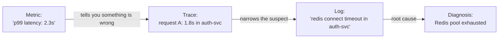
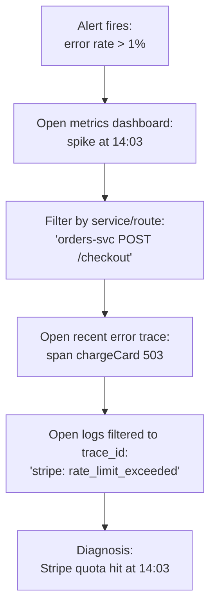

# Observability: logs, metrics, traces

> **In one line:** "Monitoring" tells you when something is broken. "Observability" lets you figure out *why* — by collecting enough structured data (logs, metrics, traces) that you can ask new questions you didn't anticipate when you wrote the code.

:::tip[In plain English]
Imagine you're a doctor and the only test you can run is "is the patient alive?" That's monitoring. Observability is being able to take a blood test, read an MRI, listen to the heart — multiple instruments that let you diagnose any new symptom on the spot. The three instruments are **logs** (events with context), **metrics** (numbers over time), and **traces** (the path a request took across services). A team without them is guessing.
:::

This page is the universal vocabulary. Every backend job interview, every postmortem, every "why is the app slow today" Slack thread runs on this material.

## The three pillars

| Pillar | What it is | What it answers |
|--------|-----------|-----------------|
| **Logs** | Discrete events with context, usually structured (JSON) | "What happened in this specific request?" |
| **Metrics** | Numbers aggregated over time (counters, gauges, histograms) | "How is the system behaving in aggregate?" |
| **Traces** | The full path of one request across services + spans of time | "Where did this request slow down or fail?" |

They're complementary. A metric tells you "p99 latency spiked at 3:14pm." A trace tells you "this specific slow request spent 800ms waiting on the auth service." A log tells you "the auth service timed out trying to reach Redis." Each one's question is hardest to answer without the others.



## Logs: events with context

A log line is a piece of evidence. The question is: *evidence of what, and can you search for it later?*

### Unstructured vs structured

```
// Unstructured (the 1990s default — please don't):
[2026-05-26 09:14:22] INFO User 42 logged in from 1.2.3.4

// Structured (JSON — the 2026 default):
{
  "ts": "2026-05-26T09:14:22Z",
  "level": "info",
  "msg": "user logged in",
  "user_id": "42",
  "ip": "1.2.3.4",
  "trace_id": "abc-def-123",
  "service": "auth-svc",
  "version": "v2.4.1"
}
```

> **In English:** structured logs are JSON (or another machine-readable format) where each field is queryable. You can filter `level=error AND service=auth-svc AND user_id=42` in seconds. Unstructured logs require grep and regex and prayer.

In Node:
```typescript
import pino from 'pino';
const log = pino();
log.info({ user_id: '42', ip: req.ip }, 'user logged in');
```

In Python:
```python
import structlog
log = structlog.get_logger()
log.info("user logged in", user_id="42", ip=request.remote_addr)
```

### What to log

| Log this | Don't log this |
|---------|----------------|
| Errors with stack traces | Successful requests (use metrics) |
| State changes (user signed up, order placed) | Every database query (use traces) |
| External calls (HTTP request to Stripe, with status + duration) | The full request body unfiltered |
| Auth events (login, logout, token issued, token rejected) | Passwords, API keys, PII unless redacted |
| Slow operations (anything > N ms threshold) | Heartbeat noise |

Every log line should have:
- **Timestamp** (with timezone — UTC is standard).
- **Severity level** (`debug`, `info`, `warn`, `error`, `fatal`).
- **Service name** and **version**.
- **Trace ID** if available (so logs link to traces).
- **A handful of contextual fields** (user_id, request_id, etc.).

### Log levels and what they mean

| Level | Use for | Page someone? |
|-------|---------|---------------|
| `debug` | Verbose stuff for local dev. Filtered out in prod. | Never |
| `info` | State changes, important events. | Never |
| `warn` | Something unusual but recovered. Worth investigating in aggregate. | Maybe — alert on rate, not single events |
| `error` | Failed an operation, may need human attention. | Sometimes |
| `fatal` | Process is about to die. | Yes |

Treat `error` and `fatal` as production signals. Treat `warn` as "review weekly." Don't page on individual `info` events — the volume drowns the signal.

### Centralized logging

Logs sitting on individual servers are useless when you have more than one. Modern stacks ship logs to a central store:

- **Cloud-native:** CloudWatch Logs (AWS), Cloud Logging (GCP), Azure Monitor.
- **Open source:** Loki, Elasticsearch / OpenSearch, Vector + ClickHouse.
- **SaaS:** Datadog, Honeycomb, New Relic, Sumo Logic, Better Stack, Axiom.

Whatever you pick, the goal is: *one search box*, all services, structured queries, retention you can afford.

## Metrics: numbers over time

A metric is a single number you sample regularly. The three types:

| Type | What it tracks | Examples |
|------|----------------|----------|
| **Counter** | A monotonically increasing total | `http_requests_total`, `errors_total`, `bytes_sent` |
| **Gauge** | A value that goes up and down | `memory_usage_bytes`, `queue_depth`, `active_connections` |
| **Histogram** | A distribution of values (buckets), used to compute percentiles | `http_request_duration_seconds` |

You almost never care about *averages* — they hide the long tail. You care about **percentiles**: p50 (median), p95, p99, p99.9. A p99 latency of 2s means 1% of users (often the most engaged ones) are waiting 2 seconds. The average can be 200ms and still hide that misery.

Histograms let you compute percentiles from bucketed counts cheaply. The standard library is **Prometheus** (open source) or its hosted equivalents (Cortex, Thanos, VictoriaMetrics, Grafana Cloud).

### The RED method (for request-driven services)

For every endpoint or service, track:

- **R**ate — requests per second
- **E**rrors — failed requests per second
- **D**uration — request latency distribution (p50/p95/p99)

That's it. Three signals, you can diagnose ~80% of "is something wrong?" questions.

### The USE method (for resources)

For every resource (CPU, memory, disk, network, DB connections):

- **U**tilization — % time in use
- **S**aturation — work queued up waiting
- **E**rrors — error events

If RED tells you the service is unhappy, USE tells you which resource is the bottleneck.

### What to instrument

A new service should ship with, at minimum:

1. **One counter per endpoint**: `http_requests_total{route, method, status}`.
2. **One histogram per endpoint**: `http_request_duration_seconds{route, method, status}`.
3. **One counter per external call**: `external_calls_total{target, status}`.
4. **One histogram per external call**: `external_call_duration_seconds{target}`.
5. **A few gauges**: connection pool size, queue depth, active sessions.
6. **Anything business-specific**: signups, orders placed, AI tokens spent, etc.

Frameworks like Express, FastAPI, ASP.NET, and Spring all have middleware that emits the HTTP four with one line of setup. Add it on day one.

## Traces: where time goes

A **trace** is one request followed across every service, function, and external call it touched, with timing for each.

```
trace_id: abc-123 (total: 1240ms)
├── frontend / GET /dashboard          (1240ms)
│   └── api-svc / GET /dashboard      (1180ms)
│       ├── db / query users           (40ms)
│       ├── auth-svc / verify token   (12ms)
│       └── analytics-svc / pageview  (1100ms) ← culprit
│           └── kafka publish         (1090ms)
```

You read the tree to find the **critical path**, the one branch whose duration dominates the total. Here, almost the entire 1.2s is in `analytics-svc → kafka publish`. Without a trace, you'd be staring at "the dashboard endpoint is slow" with no idea where to look.

### How tracing works

Each request gets a **trace ID** at entry (or carries one from the caller). Every service propagates it via HTTP headers (`traceparent` from the W3C trace context spec). Each operation within a service creates a **span** — a (start, end) interval with a parent span ID. Spans are shipped to a tracing backend that reassembles them by trace ID.

```typescript
// OpenTelemetry — the open standard.
import { trace } from '@opentelemetry/api';

const tracer = trace.getTracer('orders-svc');

async function placeOrder(userId: string, items: Item[]) {
  return tracer.startActiveSpan('placeOrder', async (span) => {
    span.setAttribute('user.id', userId);
    span.setAttribute('order.items_count', items.length);
    try {
      const order = await db.orders.create({ /* … */ });
      await chargeCard(order);
      await sendConfirmationEmail(order);
      return order;
    } catch (err) {
      span.recordException(err);
      span.setStatus({ code: 2, message: 'order failed' });
      throw err;
    } finally {
      span.end();
    }
  });
}
```

> **In English:** wrap each meaningful operation in a span. Set attributes for searchability. Record exceptions. The framework propagates the trace context across `await` boundaries and HTTP calls automatically.

The big shift in the last few years: **OpenTelemetry (OTel)** has become the universal standard. Most languages have stable SDKs; most observability backends (Datadog, Honeycomb, Grafana Tempo, AWS X-Ray, Jaeger) accept OTel data.

### Sampling

Tracing everything is expensive and floods your backend. Two strategies:

- **Head-based sampling** — decide at request entry "trace 1% of requests." Cheap and simple, but you may miss the rare error trace.
- **Tail-based sampling** — buffer all spans, decide at end of trace "keep this if it errored or was slow." Expensive but high signal.

For most teams, head-sample errors at 100% and successes at 1–5%.

## Putting them together: a debugging session

The way these three connect:



A team with all three pillars goes from alert to root cause in minutes. A team with only logs spends an hour grepping. A team with only metrics knows something is wrong but not what.

## SLOs and SLIs (the executive language)

Once you have observability, you can speak in **SLOs** (Service Level Objectives): formal commitments about reliability that business stakeholders understand.

| Term | What it is | Example |
|------|-----------|---------|
| **SLI** (Indicator) | A measurable signal of user experience | "Fraction of `/checkout` requests that return 2xx in < 500ms" |
| **SLO** (Objective) | A target for that signal over a window | "99.9% of `/checkout` requests succeed within 500ms over 30 days" |
| **SLA** (Agreement) | A contract with consequences (refunds) if you miss the SLO | "If we drop below 99.9%, customers on Enterprise tier get a 10% credit" |
| **Error budget** | The allowed failure rate (100% − SLO) | At 99.9% SLO over 30 days: ~43 minutes of allowed downtime |

The point of an error budget: it's a *quantitative* answer to "should we ship the risky thing this week or harden the system instead?" Burning the budget fast → freeze risky changes. Budget plentiful → ship faster.

### Picking SLOs

Good SLOs:
- Are measured from the user's perspective (the request, not internal CPU).
- Have a clear numerator/denominator (`good_requests / total_requests`).
- Are realistic — 99.99% (52 min/year) is achievable; 99.9999% (31 sec/year) is not.
- Cover what matters most: the few user-visible flows that drive the product.

You don't need an SLO for every endpoint. You need one for "did the user successfully do the thing they came to do."

## Alerting principles

Alerts should be **rare, actionable, and aimed at the right person**. The cardinal sins:

1. **Alert fatigue.** Too many alerts, each one a "probably nothing." Engineers learn to ignore them. The next real one is missed.
2. **Alerting on causes instead of symptoms.** Alerting on "CPU is high" wakes you up when nothing's wrong. Alerting on "checkout p99 latency > 2s" wakes you up when users are suffering.
3. **No runbook.** An alert fires, the on-call engineer has no idea what to do. Every alert should link to a runbook ("check X, then Y, escalate to Z").
4. **Alerting only on error rate, ignoring success.** A service that returned no requests at all also returned zero errors. Alert on "did we serve traffic" too.

Modern wisdom: **page on SLO burn rate**. If you're burning your monthly error budget at 10× the normal rate, that's a page. If you're at 1.5× normal rate, that's a ticket for tomorrow.

## Common mistakes

:::caution[Where people commonly trip up]
- **Logging everything indiscriminately.** Every request, every query, every internal call — you'll DDoS your own log store and your bill will be eye-watering. Logs are for events with information value; metrics handle "did anything happen at all."
- **Logging unstructured strings.** `logger.info('User ' + userId + ' did thing ' + thing)` is unsearchable past day one. Always emit structured fields: `logger.info({ user_id, action }, 'thing happened')`.
- **Averages instead of percentiles.** The average is a lie — it hides the long tail where users actually suffer. Track p50/p95/p99/p99.9. An app with average 200ms and p99 of 8s is broken for 1% of users; the average won't tell you.
- **No correlation IDs.** A request crosses five services; each one logs independently. Without a trace ID linking them, you have five unrelated logs and no story. Generate a trace ID at the edge and propagate it through every internal call.
- **Tracing in dev only.** Tracing only matters in prod. If your traces drop on deploy, you're flying blind exactly when you need eyes. Tracing is a production feature; ship it with the service.
- **Alerting on CPU.** "CPU > 80%" wakes you up when an autoscaler would have handled it, and misses the case where CPU is fine but the DB is sick. Alert on user-visible SLIs.
- **Logging PII in plain text.** Your observability store is now a privacy liability. Redact at the logging boundary (header filters, field allowlists) and treat the store with the same access controls as production data.
- **No log retention policy.** Logs accumulate forever or get deleted at random. Decide: prod errors retained 90d, info logs 7d, debug logs 1d — and configure the retention so the store doesn't grow without bound.
- **Treating metrics, logs, traces as separate worlds.** They're three views of the same events. Modern tools (Honeycomb, Datadog, Grafana, OpenTelemetry) let a trace ID jump straight to the matching logs and to a metric panel. Wire that up from day one.
:::

## Page checkpoint

<Quiz id="foundations-observability-fundamentals-page" title="Did observability fundamentals stick?" sampleSize={3}>

<Question
  prompt="Which question does a TRACE answer that LOGS and METRICS alone struggle with?"
  options={[
    { text: "What's the overall error rate of the service?" },
    { text: "What was the exact error message for this request?" },
    { text: "Across the multiple services this request touched, where did it spend its time and at which hop did it fail?" },
    { text: "How much memory is the service using?" }
  ]}
  correct={2}
  explanation="A trace stitches together spans across services with timing, so you can see 'this request spent 1.1s of its 1.2s in the analytics service's Kafka publish.' Logs and metrics see only the local picture; traces see the path."
  revisit={{ to: "/docs/foundations/observability-fundamentals#traces-where-time-goes", label: "What traces uniquely answer" }}
/>

<Question
  prompt="Why is 'average latency = 200ms' a misleading thing to optimize for?"
  options={[
    { text: "Averages are computed wrong by most tools" },
    { text: "Averages hide the long tail — the p99 might be 8s, meaning 1% of users (often your most engaged) wait 8 seconds. You can ship an app with great averages and miserable real-world UX" },
    { text: "Averages are only valid for HTTP, not other protocols" },
    { text: "The metric is privacy-sensitive" }
  ]}
  correct={1}
  explanation="One user waiting 10 seconds and 99 users waiting 100ms averages to 200ms. That 'great average' hides someone's terrible experience. Always track p50/p95/p99/p99.9."
  revisit={{ to: "/docs/foundations/observability-fundamentals#metrics-numbers-over-time", label: "Why percentiles" }}
/>

<Question
  prompt="What does 'RED' stand for in the RED method of service instrumentation?"
  options={[
    { text: "Reliability, Efficiency, Durability" },
    { text: "Rate (requests/sec), Errors (failures/sec), Duration (latency distribution)" },
    { text: "Read, Edit, Delete" },
    { text: "Region, Endpoint, Device" }
  ]}
  correct={1}
  explanation="Rate, Errors, Duration. Track those three for every request-driven service and you can diagnose ~80% of 'something is wrong' situations. USE (Utilization, Saturation, Errors) is the companion for resources."
  revisit={{ to: "/docs/foundations/observability-fundamentals#the-red-method-for-request-driven-services", label: "RED method" }}
/>

<Question
  prompt="What's an 'error budget'?"
  options={[
    { text: "The dollar amount your support team is allowed to refund" },
    { text: "100% minus the SLO — e.g., a 99.9% SLO over 30 days allows ~43 minutes of failure, and that allowance becomes a quantitative basis for 'ship the risky thing now' vs 'freeze and harden'" },
    { text: "The number of bugs allowed in production" },
    { text: "How long the on-call shift is" }
  ]}
  correct={1}
  explanation="Error budget = allowed failure rate. Spending it fast → freeze risky changes; budget plentiful → ship faster. It's how SLOs become a decision-making tool, not just a number."
  revisit={{ to: "/docs/foundations/observability-fundamentals#slos-and-slis-the-executive-language", label: "Error budgets" }}
/>

<Question
  prompt="A pager goes off at 3am: 'CPU on web-1 exceeded 80%.' Engineer logs in, finds autoscaler added a node, all is well. What's the alerting principle being violated?"
  options={[
    { text: "Logs are too verbose" },
    { text: "Alerting on causes (CPU) instead of symptoms (user-visible latency/errors). High CPU isn't a problem if users aren't suffering — alert on the SLI, not the resource" },
    { text: "The on-call schedule is wrong" },
    { text: "CPU thresholds should be 90%" }
  ]}
  correct={1}
  explanation="Alerts should fire on user-visible pain (slow checkouts, error rate spikes), not on infrastructure conditions that may auto-resolve. Cause-based alerts produce noise; symptom-based alerts produce useful pages."
  revisit={{ to: "/docs/foundations/observability-fundamentals#alerting-principles", label: "Symptoms not causes" }}
/>

</Quiz>

## What's next

→ Continue to [Testing](./testing) — how to verify your app works before users find the bugs.
