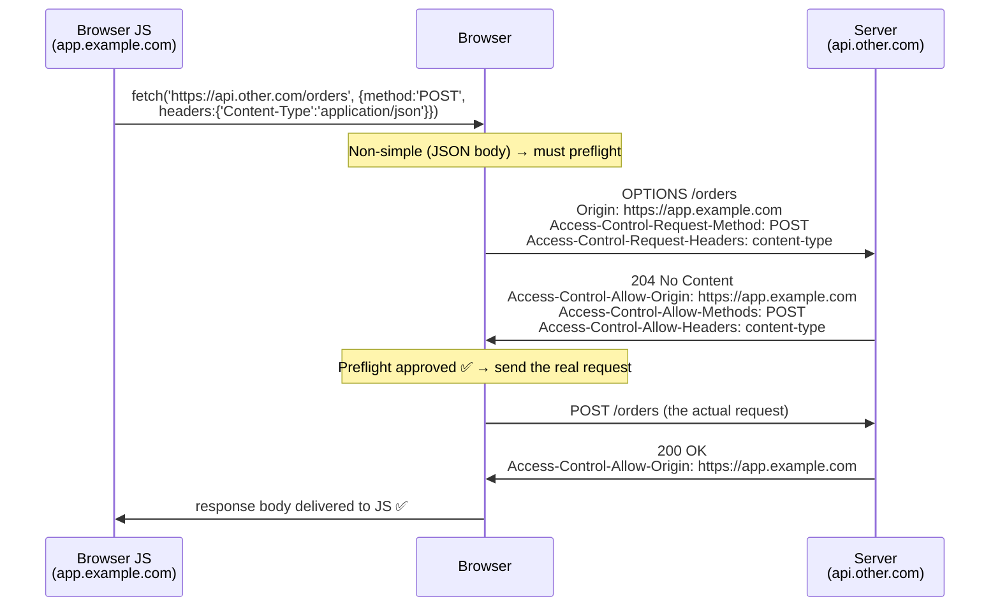

# Security headers & browser-security checklist: HSTS, CSP, SRI, and debugging CORS

> **In one line:** [Web security](./web-security) taught you the *attack classes* (XSS, CSRF, SQLi, SSRF). This lesson is the *operational layer*: the handful of response headers you actually set, the integrity hash you actually paste, and the CORS error you actually have to debug — the "is it shipped safely?" checklist.

:::tip[In plain English]
Picture handing your house keys to a contractor. The locks (your application code) matter, but so do a dozen small switches you flip on the way out: the alarm (does the browser force HTTPS?), the "do not let strangers re-frame my front door" sign (clickjacking protection), the tamper-evident seal on a package you didn't pack yourself (a script loaded from someone else's server). Each switch is one line. Forget one and a confident attacker walks straight past the expensive lock. This lesson is the switch-list — what each one does, in one place, plus how to read the single most confusing error a browser will ever show you: the **CORS** error.
:::

You already met some of these headers in passing — [Web security](./web-security) named HSTS, CSP, and `X-Frame-Options` inside larger attack discussions, and [TLS & HTTPS internals](./tls-https-internals) explained *why* forcing HTTPS matters. This lesson pulls the whole **browser-security hardening surface** into one checklist you can apply to any app before it ships, then goes deep on the two things that trip people up the most in practice: **Subresource Integrity** and **CORS**.

## Why it matters: security is asymmetric

Here is the uncomfortable property of this whole layer: **the defenses are AND-ed, the attacks are OR-ed.** Your app is safe only if *every* relevant header is set correctly. The attacker wins if *any one* of them is missing or wrong.

A worked illustration. Suppose you have a great Content Security Policy that blocks injected scripts — but you forgot `X-Content-Type-Options: nosniff`. An attacker uploads a file called `avatar.png` that is actually HTML containing `<script>`. The browser **sniffs** the bytes, decides "this looks like HTML, not an image," renders it as a page on your origin, and the script runs — *bypassing* the CSP-protected pages entirely because this response never set the CSP header. One missing one-liner undid the expensive one.

That asymmetry is why a **checklist** beats cleverness here. You are not trying to be smart; you are trying to not leave a switch off. The cost of each header is roughly one line of server config; the cost of omitting one is a class of attack.

:::info[Where headers get set]
These are **HTTP response headers** — your server (or your hosting platform / CDN / framework) attaches them to every response. In Next.js it's a `headers()` entry in `next.config.js`; in Express it's `helmet()`; on Vercel/Netlify/Cloudflare it's a config file or dashboard; in nginx it's `add_header`. The *concept* is identical everywhere: a `Header-Name: value` line on the response. We teach the headers; your platform's docs map them to its config syntax.
:::

## The security-headers checklist

Here is the whole surface in one table — set these on your HTML responses. The column that matters is **"defends against"**: that is the switch's job.

| Header | Example value | Defends against |
|--------|---------------|-----------------|
| **`Strict-Transport-Security`** (HSTS) | `max-age=31536000; includeSubDomains; preload` | Downgrade / SSL-strip attacks — forces the browser to use HTTPS even if the user types `http://` |
| **`Content-Security-Policy`** (CSP) | `default-src 'self'; script-src 'self' 'nonce-…'` | XSS — the browser refuses to run scripts not on your allowlist, even if injection succeeds |
| **`X-Content-Type-Options`** | `nosniff` | MIME-sniffing — stops the browser re-interpreting an uploaded `.png` as executable HTML/JS |
| **`X-Frame-Options`** *(or CSP `frame-ancestors`)* | `DENY` *(or `frame-ancestors 'none'`)* | Clickjacking — stops your page being embedded in a hostile invisible `<iframe>` |
| **`Referrer-Policy`** | `strict-origin-when-cross-origin` | Referrer leakage — stops full URLs (with tokens/IDs in them) leaking to other sites via the `Referer` header |
| **`Permissions-Policy`** | `camera=(), microphone=(), geolocation=()` | Capability abuse — disables powerful browser features (camera, mic, location) your app doesn't use, so injected code can't either |

A few of these need unpacking beyond the one-liner.

### HSTS — recap, plus the gotcha

You met **HSTS (HTTP Strict Transport Security)** in [Web security](./web-security#hsts--http-strict-transport-security) and [TLS internals](./tls-https-internals). The recap: it tells the browser "for this domain, only ever use HTTPS, for `max-age` seconds — refuse plain HTTP entirely." That closes the window where a user's *first* `http://` request could be intercepted and redirected to a fake.

The operational gotcha that bites people: **`preload` is a one-way door.** Submitting your domain to the [HSTS preload list](https://hstspreload.org/) bakes "HTTPS-only" into the browser *binary itself* — it works before the first request ever reaches you. But removing a domain from that list takes *months* to propagate. Only add `preload` once you're certain every subdomain can serve HTTPS forever. Start without it (`max-age=31536000; includeSubDomains`), confirm nothing breaks, *then* preload.

### Content-Security-Policy — recap + the report-only rollout

CSP is covered in depth in [Web security](./web-security#content-security-policy-csp--the-defense-in-depth) — it's *the* defense that stops XSS even when sanitization fails, because injected `<script>` doesn't match your allowlist. What that lesson didn't cover is the part that makes CSP *deployable*: you almost never get the policy right on the first try, and a wrong CSP **silently breaks your own site** (your real analytics script, your real font, your real CDN image all get blocked).

The safe rollout uses a sibling header that **reports violations without blocking them**:

```
Content-Security-Policy-Report-Only: default-src 'self'; script-src 'self' https://cdn.example.com; report-uri /csp-reports
```

In *report-only* mode the browser **does not block anything** — it just sends a JSON report to your `report-uri` endpoint every time something *would* have been blocked. You run this for a week, watch the reports, discover "oh, we load Stripe from `js.stripe.com` and a font from `fonts.gstatic.com`," widen the allowlist to cover the legitimate ones, and only *then* flip the header name to the enforcing `Content-Security-Policy`. Report-only first, enforce second — the same pattern as a feature flag.

### `frame-ancestors` vs `X-Frame-Options`

Both stop **clickjacking** (an attacker iframes your real page invisibly over a decoy, so a click the user thinks lands on "Win a prize!" actually lands on your "Confirm transfer" button). `X-Frame-Options: DENY` is the older header; CSP's `frame-ancestors 'none'` is the modern replacement and is strictly more expressive (it can allow *specific* parents: `frame-ancestors 'self' https://partner.example.com`). Set `frame-ancestors` in your CSP; keep `X-Frame-Options: DENY` too for older browsers. They don't conflict.

## Subresource Integrity (SRI): trusting a script you didn't write

Here's a problem the headers above don't solve. You load a library from a public CDN to make your site faster:

```html
<script src="https://cdn.example.com/chart-lib@3.2.0/chart.min.js"></script>
```

This is a **trust boundary** (the same idea from [Web security](./web-security#the-mental-model-trust-boundaries)): you are running *someone else's code* on *your* origin, with full access to your page, your cookies, your DOM. If `cdn.example.com` is ever compromised — or serves a tampered file, or the maintainer pushes a malicious update — every visitor to your site silently runs the attacker's JavaScript. CSP `script-src` lets you *allow* that CDN, but it can't tell a good file from a swapped-out bad one at the same URL.

**Subresource Integrity (SRI)** closes that gap. You compute a cryptographic hash of the *exact* file you reviewed and trust, and pin it on the tag:

```html
<script
  src="https://cdn.example.com/chart-lib@3.2.0/chart.min.js"
  integrity="sha384-oqVuAfXRKap7fdgcCY5uykM6+R9GqQ8K/uxy9rx7HNQlGYl1kPzQho1wx4JwY8wC"
  crossorigin="anonymous"></script>
```

Now the browser fetches the file, hashes the bytes it received, and compares to the `integrity` value. **Match → run it. Mismatch → refuse to execute it, full stop.** A swapped-out or tampered file produces a different hash, so a compromised CDN can no longer inject code into your page — the worst it can do is make the script fail to load (which you'll notice), not run something malicious (which you wouldn't).

### Worked example: generating and reading an SRI hash

The `integrity` value has two parts separated by a dash: the **algorithm** and the **base64-encoded hash**.

```
sha384-oqVuAfXRKap7fdgcCY5uykM6+R9GqQ8K/uxy9rx7HNQlGYl1kPzQho1wx4JwY8wC
└─────┘ └──────────────────────────────────────────────────────────────┘
  algo                    base64( sha384(file bytes) )
```

You generate it from the exact file with one command:

```bash
# Download the exact version you reviewed, then hash it:
curl -s https://cdn.example.com/chart-lib@3.2.0/chart.min.js \
  | openssl dgst -sha384 -binary \
  | openssl base64 -A
# → oqVuAfXRKap7fdgcCY5uykM6+R9GqQ8K/uxy9rx7HNQlGYl1kPzQho1wx4JwY8wC
```

Trace what happens on each future page load:

1. Browser requests `chart.min.js` from the CDN.
2. CDN returns some bytes (the real file — or, if compromised, a tampered one).
3. Browser computes `sha384` of *the bytes it actually received*.
4. Browser base64-encodes that and compares it to your pinned `integrity` value.
5. **Equal** → the file is byte-for-byte the one you reviewed → execute. **Not equal** → block, and log a console error.

The `crossorigin="anonymous"` attribute is **required** with SRI for cross-origin files: it tells the browser to fetch the file in CORS mode (without sending cookies) so it's *allowed* to read the response bytes to hash them. Omit it and SRI silently fails to apply. (That's the same CORS machinery we dissect next — SRI and CORS meet here.)

:::caution[SRI is for files that don't change at a URL]
SRI pins one exact byte-stream. It's perfect for a *versioned, immutable* CDN URL (`chart-lib@3.2.0`). It is **wrong** for a URL whose content legitimately changes (an analytics snippet the vendor updates, a `@latest` tag) — the hash will mismatch the moment they ship a new build and your script will stop loading. Pin SRI to pinned versions only.
:::

## CORS: the error everyone hits, finally explained operationally

[Web security](./web-security#cors--cross-origin-resource-sharing) made the crucial conceptual point: **CORS is not a server-side defense — it's a *relaxation* of the browser's same-origin policy.** Re-read that if it's fuzzy. This section assumes you've got the concept and teaches the *mechanics* — the request flow and how to debug the error, because "I got a CORS error" is one of the most common, most misread messages in web development.

### The model: simple vs preflighted requests

The **same-origin policy** is the browser's default: JavaScript running on `https://app.example.com` may *send* a request to `https://api.other.com`, but the browser will **block your JS from reading the response** unless `api.other.com` opts in with CORS headers. Two things to hold:

- An **origin** is the triple `scheme + host + port`. `https://app.example.com` and `https://api.example.com` are *different* origins (different host). So are `http://x.com` and `https://x.com` (different scheme), and `x.com:3000` vs `x.com:8080` (different port).
- CORS only governs **browser JavaScript reading cross-origin responses.** `curl`, a mobile app, or a server-to-server call ignore CORS entirely — which is exactly why CORS is *not* an authorization mechanism.

The browser splits cross-origin requests into two kinds:

**Simple requests** go straight to the server. A request is "simple" if it's a `GET`, `HEAD`, or `POST`, uses only safe headers, and its `Content-Type` is one of `text/plain`, `application/x-www-form-urlencoded`, or `multipart/form-data`. The browser sends it, then checks the *response* for `Access-Control-Allow-Origin` before deciding whether to let your JS read the body.

**Preflighted requests** are everything else — anything "non-simple": a `PUT`/`DELETE`/`PATCH`, a custom header like `Authorization` or `X-Requested-With`, or `Content-Type: application/json` (the common one — almost every JSON API trips this). For these, the browser first sends a separate **preflight**: an `OPTIONS` request that asks permission *before* sending the real one.



The key response headers the server must return:

- **`Access-Control-Allow-Origin`** — which origin may read the response. Either an exact origin (`https://app.example.com`) or `*` (any origin, but see the credentials rule below).
- **`Access-Control-Allow-Methods`** / **`Access-Control-Allow-Headers`** — which methods/headers the real request may use (answered on the preflight).
- **`Access-Control-Allow-Credentials: true`** — required if the request sends cookies or `Authorization`. **Crucial rule:** if credentials are allowed, `Access-Control-Allow-Origin` **must be an exact origin, never `*`.** The browser refuses the `*`-plus-credentials combination by design.

### Traced walkthrough: debugging a real CORS error

This is the part you'll live. Your frontend on `https://app.example.com` calls your API on `https://api.example.com`, and the console shows:

```
Access to fetch at 'https://api.example.com/orders' from origin
'https://app.example.com' has been blocked by CORS policy: No
'Access-Control-Allow-Origin' header is present on the requested resource.
```

**Step 1 — read the message literally, and don't misdiagnose.** Beginners read "blocked by CORS policy" as *"my request failed."* It did not. Open the Network tab: you'll often see the request returned **`200 OK` with a perfectly good response body**. The *server answered fine.* CORS is the **browser refusing to hand that response to your JavaScript** because the response lacked permission. The bug is "the response is missing a header," not "the request errored." This single reframing solves most CORS confusion.

**Step 2 — identify which request actually failed.** Look in the Network tab. If you see an **`OPTIONS`** request go red *before* your `POST`, the **preflight** failed — the server didn't approve the method/headers. If the `OPTIONS` is green but the real request's response can't be read, the **actual response** is missing `Access-Control-Allow-Origin`. Here, the error names the `/orders` resource and *no* `Access-Control-Allow-Origin` at all → the server simply never sets the header.

**Step 3 — find why.** The response from `api.example.com` is missing `Access-Control-Allow-Origin`. Three usual causes, in order of likelihood:

1. The server has **no CORS configuration at all** — it's a same-origin app that's now being called cross-origin. (Most common.)
2. CORS is configured but the **allowlist doesn't include `https://app.example.com`** (e.g. it lists the `www.` variant, or `http://` not `https://`, or a trailing-slash mismatch — origins are matched exactly).
3. The request **sends credentials** (`fetch(url, {credentials: 'include'})`) and the server returns `Access-Control-Allow-Origin: *`, which the browser rejects for credentialed requests — so effectively *no usable* allow-origin is present.

**Step 4 — fix it on the server.** CORS is fixed by the server that owns the resource (`api.example.com`), never by the caller. Add an allowlist:

```typescript
// Express on api.example.com
import cors from 'cors';
app.use(cors({
  origin: 'https://app.example.com',   // exact origin, NOT '*', because:
  credentials: true,                    // we send the session cookie
  methods: ['GET', 'POST', 'PUT', 'DELETE'],
  allowedHeaders: ['Content-Type', 'Authorization'],
}));
```

The server now answers the preflight `OPTIONS` with the matching `Access-Control-Allow-*` headers and stamps `Access-Control-Allow-Origin: https://app.example.com` on the real response. The browser sees its own origin echoed back, the credential rule is satisfied (exact origin, not `*`), and it hands the response to your JS. Error gone.

:::note[The fix is never "in the frontend"]
You cannot fix a CORS error from the browser side — not with a fetch option, not with a header you add to your *request*, not by "disabling CORS in the browser" (that only hides it on your machine; every real user still fails). Fixing means **adding the response headers on the server that owns the resource.** If you don't own that server (a third-party API), the supported path is a server-side proxy: your backend calls their API (no CORS — it's server-to-server) and your frontend calls your backend (same-origin). The "CORS browser extension" route is a debugging crutch, never a deployment.
:::

## Common mistake

:::caution[Where people commonly trip up]
- **Treating a CORS error as a failed request.** The server usually returned `200` with a valid body; the *browser* blocked your JS from reading it. Check the Network tab — the response is often right there. Misreading this sends people debugging the wrong layer for hours.
- **Trying to fix CORS in the frontend.** No `fetch` option, request header, or browser flag fixes it for real users. The fix is response headers on the server that owns the resource (or a same-origin proxy if you don't own it).
- **`Access-Control-Allow-Origin: *` with credentials.** The browser rejects the combination. If you send cookies/`Authorization`, you must echo an *exact* origin from a validated allowlist — never `*`, and never blindly reflect the request's `Origin` header (that allows *any* site to read your credentialed responses).
- **Enforcing a brand-new CSP straight to production.** A wrong CSP silently blocks your *own* scripts, fonts, and images — a self-inflicted outage. Roll out with `Content-Security-Policy-Report-Only` first, read the violation reports, widen the allowlist, *then* enforce.
- **SRI on a mutable URL.** Pinning an integrity hash to a `@latest` or vendor-updated snippet breaks the moment they ship a new build (hash mismatch → script blocked). SRI belongs only on immutable, version-pinned files you've reviewed.
- **Forgetting `crossorigin="anonymous"` on an SRI tag.** For cross-origin files, without it the browser can't read the bytes to hash them and SRI silently does nothing — you *think* you're protected and aren't.
- **Skipping `X-Content-Type-Options: nosniff`.** Without it, an uploaded file can be MIME-sniffed into executable HTML/JS on your origin — bypassing the CSP you so carefully wrote for your *other* pages. It's one line; always set it.
- **Adding HSTS `preload` before you're ready.** `preload` is effectively permanent (months to undo). Ship `max-age` + `includeSubDomains` first, verify every subdomain is HTTPS-clean, and only then submit to the preload list.
- **Assuming CORS is protecting your API.** It governs *browsers reading responses*, nothing else. `curl` and other servers ignore it. Authentication and authorization remain entirely your job — CORS is not a substitute.
:::

## Why it matters (in the field)

- **It's the pre-ship checklist a senior reviewer runs in their head.** "HTTPS forced? CSP set? `nosniff`? frame protection? Are we loading any CDN script without SRI? Does the new API endpoint have CORS configured for our frontend's origin?" None of it is hard; all of it is forgettable. The discipline is the checklist.
- **CORS debugging is a near-weekly event.** The moment a frontend and an API live on different origins (almost always, in modern split deployments), CORS appears. Engineers who understand the simple-vs-preflight model and "the server answered fine, the browser blocked the read" fix it in minutes; everyone else loses an afternoon.
- **The supply-chain risk is real and growing.** As [Web security](./web-security#supply-chain-attacks) covered, third-party code is a live threat. SRI is the cheapest concrete control you can apply to the CDN scripts you load *today*.
- **Headers fail open and silent.** A missing security header throws no error and breaks no test — the site works perfectly right up until it's exploited. Automated header scanners (your CI, or a one-off against [securityheaders.com](https://securityheaders.com)) are how you catch the switch you left off.

## Page checkpoint

<Quiz id="foundations-security-headers-page" title="Did the hardening checklist stick?" sampleSize={3} passingScore={2}>

<Question
  prompt="Your frontend on https://app.example.com calls your API on https://api.example.com and the console shows 'blocked by CORS policy: No Access-Control-Allow-Origin header'. In the Network tab, the request shows 200 OK with the correct JSON body. What's actually happening, and where do you fix it?"
  options={[
    { text: "The request failed on the server; add error handling to the API route" },
    { text: "The server responded fine, but the browser is refusing to hand the response to your JS because api.example.com didn't send an Access-Control-Allow-Origin header. Fix it on the server (api.example.com) by allowlisting the frontend's origin — never in the frontend" },
    { text: "Add 'mode: no-cors' to the fetch call on the frontend to bypass it" },
    { text: "Install a CORS browser extension so it works" }
  ]}
  correct={1}
  explanation="A CORS error is the browser blocking your JS from *reading* a response, not the request failing — the 200 + valid body proves the server answered. CORS is fixed by adding the Access-Control-Allow-Origin (etc.) response headers on the server that owns the resource. Frontend fetch options and browser extensions don't fix it for real users; a same-origin proxy is the route when you don't own the API."
  revisit={{ to: "/docs/foundations/security-headers#traced-walkthrough-debugging-a-real-cors-error", label: "Debugging a CORS error" }}
/>

<Question
  prompt="A POST request from app.example.com to api.other.com sends a JSON body (Content-Type: application/json). Before the POST, the browser sends an OPTIONS request to the same URL. Why?"
  options={[
    { text: "It's a bug in the browser; OPTIONS shouldn't be sent" },
    { text: "Content-Type: application/json makes this a 'non-simple' cross-origin request, so the browser sends a CORS preflight (OPTIONS) first to ask the server's permission — checking Access-Control-Allow-Methods/-Headers — before sending the real POST" },
    { text: "OPTIONS is faster than POST, so the browser tries it first" },
    { text: "The server requested it via a redirect" }
  ]}
  correct={1}
  explanation="Cross-origin requests that aren't 'simple' (e.g. a JSON content-type, a PUT/DELETE, or a custom header like Authorization) trigger a preflight: a separate OPTIONS request asking permission before the real one. A simple request (GET/POST with a form content-type and no custom headers) skips the preflight and goes straight through."
  revisit={{ to: "/docs/foundations/security-headers#the-model-simple-vs-preflighted-requests", label: "Simple vs preflighted requests" }}
/>

<Question
  prompt="You load a charting library from a public CDN with a <script> tag. What does adding integrity='sha384-…' crossorigin='anonymous' (Subresource Integrity) protect you from?"
  options={[
    { text: "It makes the script load faster by caching the hash" },
    { text: "It protects against the CDN serving a tampered or compromised version of that file: the browser hashes the bytes it received and refuses to execute the script if the hash doesn't match the one you pinned — so a swapped-out file can fail to load but can't inject malicious code" },
    { text: "It encrypts the script in transit instead of using HTTPS" },
    { text: "It allows the script to bypass your Content-Security-Policy" }
  ]}
  correct={1}
  explanation="SRI pins a cryptographic hash of the exact file you reviewed. On each load the browser re-hashes the received bytes and runs the script only on an exact match — neutralizing a compromised or tampered CDN. It's for immutable, version-pinned URLs only (a hash on a mutable @latest URL breaks on every legitimate update), and crossorigin='anonymous' is required so the browser is allowed to read the bytes to hash them."
  revisit={{ to: "/docs/foundations/security-headers#subresource-integrity-sri-trusting-a-script-you-didnt-write", label: "Subresource Integrity" }}
/>

<Question
  prompt="A team wants to deploy a Content-Security-Policy but is worried about breaking their own site (blocking legitimate scripts/fonts). What's the safe rollout?"
  options={[
    { text: "Ship the enforcing CSP to production immediately; fix breakage as users report it" },
    { text: "Ship Content-Security-Policy-Report-Only first, which reports violations to a report-uri without blocking anything; watch the reports for a week to discover every legitimate resource, widen the allowlist, then switch to the enforcing Content-Security-Policy header" },
    { text: "Set default-src 'none' and add nothing else, so nothing can load" },
    { text: "Use SRI instead — it replaces CSP entirely" }
  ]}
  correct={1}
  explanation="Content-Security-Policy-Report-Only enforces nothing — it only sends JSON violation reports to your report-uri, surfacing exactly which legitimate resources a strict policy would block. You widen the allowlist based on real reports, then flip to the enforcing header. A wrong enforcing CSP shipped straight to prod silently breaks your own site, so report-only-first is the standard pattern."
  revisit={{ to: "/docs/foundations/security-headers#content-security-policy--recap--the-report-only-rollout", label: "CSP report-only rollout" }}
/>

<Question
  prompt="Why is the browser-security hardening layer described as 'asymmetric', and what follows from that?"
  options={[
    { text: "Because HTTPS uses asymmetric cryptography for the handshake" },
    { text: "Because the defenses are AND-ed (you're safe only if every relevant header is correct) while attacks are OR-ed (one missing or wrong header is enough to win) — so a disciplined checklist of one-line headers beats cleverness, since the cost of omitting any single one is a whole class of attack" },
    { text: "Because only the server sends headers, not the client" },
    { text: "Because CORS is asymmetric between origins" }
  ]}
  correct={1}
  explanation="The defenses must all hold together; the attacker needs only one gap. A great CSP doesn't help the response that forgot X-Content-Type-Options. That asymmetry is exactly why this layer is a checklist — each header is ~one line to add, but omitting any one re-opens a category of attack."
  revisit={{ to: "/docs/foundations/security-headers#why-it-matters-security-is-asymmetric", label: "Security is asymmetric" }}
/>

</Quiz>

## Going deeper & cross-links

- ← Back to the attack classes: [Web security](./web-security) — XSS, CSRF, SQLi, SSRF, and supply chain. *This* lesson is the operational header/SRI/CORS layer on top of those concepts.
- ← Why HTTPS is the floor: [TLS & HTTPS internals](./tls-https-internals) — the handshake and certificates that HSTS forces every visitor onto.
- → Where these headers physically get set at scale: [CDN & edge](./cdn-and-edge) and [Edge computing](./edge-computing).
- → The cookies these headers protect: [HTTP Headers & Cookies](./http-headers-cookies) — `Secure`, `HttpOnly`, `SameSite`.

## What's next

→ Continue to [The Deployment Pyramid](./deployment-pyramid) — how your code (and these headers) actually reach users.
