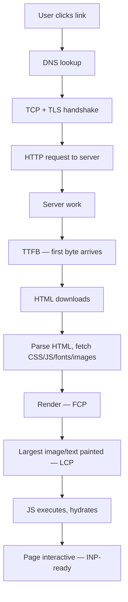

# Performance & Core Web Vitals

> **In one line:** Performance is what the user *feels* between clicking a link and being able to use the page — and the difference between a "fast" app and a "slow" one is rarely a single bottleneck; it's a handful of measurable signals (LCP, INP, CLS, TTFB, bundle size) that you can track and improve.

:::tip[In plain English]
Users don't care about your server's p50 latency. They care about three things: (1) when does the page show something useful (LCP)? (2) when can I actually interact (INP)? (3) does it stop jumping around (CLS)? Google made these into the Core Web Vitals because they correlate with bounce rate, conversion rate, and SEO ranking. Optimizing them is concrete: trim the bundle, defer the non-critical stuff, reserve space for images, stop hydrating things that don't need to hydrate.
:::

This page is the working playbook. Once you've internalized the metrics and the levers, you can debug "why is this page slow" without guessing.

## The metrics that matter

### Core Web Vitals (Google's user-facing trinity)

| Metric | Measures | Good | Poor |
|--------|----------|------|------|
| **LCP** (Largest Contentful Paint) | When the biggest visible element rendered | < 2.5s | > 4s |
| **INP** (Interaction to Next Paint) | Slowest user interaction (replaces FID in 2024) | < 200ms | > 500ms |
| **CLS** (Cumulative Layout Shift) | How much the page jumps around | < 0.1 | > 0.25 |

These are real-user metrics. Lab tools (Lighthouse) approximate them; **field data** (Chrome User Experience Report — CrUX, or your own RUM) is what Google uses for SEO and what represents reality.

### Supporting metrics

| Metric | Measures |
|--------|----------|
| **TTFB** (Time to First Byte) | Server response time. Drives LCP. |
| **FCP** (First Contentful Paint) | When *any* content shows — earlier than LCP |
| **TBT** (Total Blocking Time) | How long main thread is blocked >50ms during load. Lab proxy for INP. |
| **Speed Index** | Visual progress over time. Lighthouse computes it. |
| **Bundle size** | JS shipped to client. Direct lever on parse/compile cost. |

For the SoloMock-style apps and most web work, **LCP + INP + bundle size** are the three to focus on first.

## The "what makes pages slow" mental model

A page load has phases. Each can be slow for different reasons.



Where time goes (typical):

- **B-C-D** (network): 100-300ms cold, ~10ms warm.
- **E** (server): your responsibility — caching, query optimization, edge.
- **F-G** (download HTML): proportional to HTML size + bandwidth.
- **H** (resource fetch): proportional to render-blocking resources. Render-blocking JS/CSS is the most common LCP killer.
- **I** (FCP): roughly when the browser can paint anything.
- **J** (LCP): proportional to how big and how late the biggest content is.
- **K** (hydration): in React/Next.js apps, the JS that "attaches" interactivity to server-rendered HTML. The dirty secret of modern SSR.
- **L**: the page is now responsive.

Diagnose by phase: which one is taking too long? Each has its own toolkit.

## Server-side performance

### TTFB

Time from request to first byte of response. Drives LCP. Three places it can be slow:

1. **Network distance** — user in Sydney, server in Virginia → 200ms+ before your code even runs. Fix: CDN / edge ([Edge computing](./edge-computing)).
2. **Server compute** — slow query, slow code path, cold start. Fix: caching ([Caching](./caching)), query optimization, kept-warm functions.
3. **Render-blocking server work** — SSR generates the whole page before sending. Fix: streaming SSR (React 18+ supports it), send the shell early.

A good TTFB is < 200ms warm, < 800ms cold. If yours is 1500ms, no amount of frontend optimization fixes the LCP.

### Database queries

The #1 cause of slow server response: a query missing an index, or an N+1 query.

**N+1**:

```typescript
const orders = await db.orders.findAll();
for (const order of orders) {
  order.user = await db.users.find(order.userId); // 100 queries for 100 orders
}
```

Fix: eager load (`include: { user: true }` in Prisma, `JOIN` in SQL, `DataLoader` for GraphQL).

**Missing index**: `EXPLAIN` your slow queries; if it says "Seq Scan" on a large table, you need an index.

**Cache hot reads** — see [Caching](./caching).

### Streaming SSR

Old SSR: server generates the *whole* HTML, then sends. User waits for the slowest piece (a recommendation query taking 800ms) before seeing anything.

Streaming SSR (Next.js App Router, Remix, SvelteKit): send the page shell immediately, stream slower components later wrapped in `<Suspense>` with skeletons.

```tsx
// React 18+ — Suspense boundaries are streamed
<main>
  <Header />               {/* sent immediately */}
  <Suspense fallback={<Skeleton />}>
    <Recommendations />    {/* streams in when ready */}
  </Suspense>
</main>
```

The browser sees the shell at TTFB; the slow piece arrives 800ms later. LCP can drop dramatically.

## Frontend performance

### Bundle size: the silent killer

A 500KB JS bundle parses and executes for 1-3 seconds on a mid-range Android phone over 4G. That delay shows up as INP suffering, slow hydration, and "the page looks done but I can't click anything" UX.

Levers:

- **Code splitting** — `import()` for routes/components used rarely. Next.js/Remix do route-level splitting automatically; you do component-level via `dynamic()`.
- **Tree-shaking** — modern bundlers eliminate unused exports. Don't import the whole library when you need one function (`import { debounce } from 'lodash-es'` rather than `import _ from 'lodash'`).
- **Replace heavy deps** — `moment` (300KB) → `date-fns` (~20KB if tree-shaken) → `Intl` API (0KB). `lodash` → vanilla. `momentjs/moment-timezone` → `@js-temporal/polyfill`.
- **Defer non-critical** — analytics, error tracking, chat widget all load *after* `load` event.
- **Polyfills** — modern browsers don't need them. Use `<script type="module">` + nomodule fallback so 90% of users get the modern bundle.

Measure with `next-bundle-analyzer`, `webpack-bundle-analyzer`, or Vite's `rollup-plugin-visualizer`. Anything > 200KB initial JS is a problem to investigate; > 500KB is broken.

### Render-blocking resources

CSS and JS in the document `<head>` block rendering. The browser won't paint until they download and parse.

Defenses:

- **Inline critical CSS** — the styles needed for above-the-fold. Inline as `<style>`; load the rest async (`<link rel="preload" as="style" onload="this.rel='stylesheet'">`).
- **Defer/async scripts** — `<script defer>` (runs after parse, in order) or `<script async>` (runs whenever it loads). Default to `defer` for app code, `async` for independent analytics.
- **Preload critical resources** — `<link rel="preload" as="font" href="...">` tells the browser to fetch in parallel before it would naturally discover the resource.
- **HTTP/2 server push** — mostly deprecated in 2026, replaced by `103 Early Hints`.

### Images

Images are often the LCP element. Big PNGs are LCP poison.

Defenses (most via `<Image>` components in Next.js, Astro, etc.):

- **Modern formats** — WebP (broad support) or AVIF (smaller, slightly less support). Serve via `<picture>` or framework-built-in.
- **Responsive sizes** — `srcset` with multiple resolutions; mobile gets a 400px image, desktop gets 1200px.
- **`width` and `height` attributes** — even with CSS sizing, set the intrinsic dimensions so the browser reserves space (kills CLS).
- **`loading="lazy"`** — for below-the-fold images. Native browser lazy loading. Use `loading="eager"` on the LCP image.
- **Priority hints** — `` on the LCP element so the browser prioritizes it.
- **CDN with on-the-fly resizing** — Cloudflare Images, Vercel/Next Image, ImageKit. Don't ship a 4MB original.

### Fonts

Web fonts are tricky. The browser may delay rendering text until the font loads ("flash of invisible text" — FOIT) or render with fallback then swap (FOUT).

Defenses:

- **`font-display: swap`** — render fallback immediately; swap to web font when loaded. Prefer this for all but the most brand-critical fonts.
- **`preload` the font** — `<link rel="preload" as="font" crossorigin>`.
- **Self-host** — don't depend on Google Fonts' DNS + their CDN's latency.
- **Subset** — strip glyphs you don't use. Latin-only subset can be 50KB vs 300KB.
- **Variable fonts** — one file for many weights/widths.

### CLS — stop the jumping

Layout shift happens when content arrives and pushes existing content around. The cardinal sins:

- **No size on images.** Browser doesn't reserve space; when the image loads it pushes everything down.
- **Ads / embeds without reserved height.** Same.
- **Web fonts without `size-adjust`.** When the font swaps, line heights change, pushing content.
- **Late-loading hero banner.** Below-the-fold content reflows when it appears.

Fix: reserve space for everything that will arrive late. `width`/`height` attributes, CSS `aspect-ratio`, fixed-height containers for ads.

### INP — interactivity

INP measures the *slowest* interaction during the user's session. A 700ms hang on one click ruins your INP even if everything else is fast.

Common causes:

- **Long tasks on the main thread.** A click handler that runs 500ms of synchronous JS. Use `setTimeout(work, 0)` to break it up; or `requestIdleCallback`; or push to a Web Worker.
- **Heavy React renders.** A `setState` triggers re-render of 10k components. Use `React.memo`, virtualization (`react-window`), or "don't render 10k items, paginate."
- **Hydration cost.** The first interaction after page load runs in the middle of React mounting all the components. Selective hydration (React 18) prioritizes the part you're clicking; Astro Islands and Qwik take the "ship no JS by default" approach.

### Hydration — the unintuitive cost

Modern SSR ships HTML + JS. The browser shows the HTML fast (great LCP!) then has to **hydrate**: re-run all the React code, attach event handlers. Until hydration completes, clicks may not work or may feel laggy.

For a typical Next.js page:

```
TTFB     200ms   server response
FCP      400ms   shell rendered
LCP      1.2s    main content painted
... user can SEE the page ...
JS load  + 800ms downloading the JS bundle
Hydrate  + 600ms re-running React
INP-ready 2.6s   page actually interactive
```

The user sees the page in 1.2s, then can't click anything for another 1.4s. That gap is hydration cost.

Solutions, in increasing rigor:

- **React Server Components (RSC)** — components run only on the server, ship zero JS to client. Marketing pages, lists, anything not interactive.
- **Selective hydration** — React 18 hydrates as components become visible / interacted with.
- **Islands** — Astro's model: render statically, ship JS only for "islands" of interactivity. Drastic JS reduction for content sites.
- **Resumability** — Qwik's approach: serialize the framework state into HTML; the client picks up where the server left off with no re-execution. Conceptually clean; ecosystem smaller.

For an app where most pages are interactive (a SaaS dashboard), hydration is unavoidable; minimize bundle size to make it fast. For a content site with sparse interactivity, choose the right framework (Astro, Eleventy + Alpine).

## Profiling: what's actually slow

Stop guessing; measure.

### Chrome DevTools Performance tab

Record a page load or interaction. Get a flame graph of every task on the main thread. Look for:

- Long tasks (>50ms) in red.
- "Scripting" time dominating — your JS is the bottleneck.
- "Recalculate Style" / "Layout" spikes — your CSS or DOM mutations are.
- "Paint" / "Composite" — almost never your problem; the GPU handles it.

### Lighthouse (lab) and PageSpeed Insights (field + lab)

Lighthouse runs in a simulated environment. Useful for catching regressions in CI (`@lhci/cli`). The score is a directional signal, not a target.

PageSpeed Insights pulls real-user CrUX data — what your *actual users* experienced over the past 28 days. This is what Google uses for SEO. Read it.

### Real-user monitoring (RUM)

`web-vitals` library reports actual Core Web Vitals from real users. Ship it to your observability backend (Datadog, New Relic, Vercel Analytics, Cloudflare Web Analytics).

```typescript
import { onLCP, onINP, onCLS } from 'web-vitals';

onLCP((metric) => sendToAnalytics(metric));
onINP((metric) => sendToAnalytics(metric));
onCLS((metric) => sendToAnalytics(metric));
```

You'll see things lab tools don't catch — slow networks in specific countries, specific device classes, specific routes.

## Perceived performance

Sometimes you can't make it faster; you can make it *feel* faster.

- **Optimistic UI** — assume the action will succeed; revert on error. The user sees instant response.
- **Skeleton screens** — placeholder shapes instead of spinners. Implies progress without committing to a duration.
- **Streaming results** — show first N items while the rest load.
- **Progressive image loading** — blurhash, LQIP (low-quality image placeholder) → full image.
- **Instant transitions** — `<Link prefetch>` (Next.js) preloads pages on hover so the click feels free.

The streaming chat trick from [Pattern 1: Streaming Chat](../ai/ai-streaming-chat) is the same idea: a 3-second response streamed feels fast because the user starts reading immediately.

## The 2026 baseline checklist

A web app is **not negligently slow** if it:

- [ ] LCP < 2.5s on field data (p75 of real users)
- [ ] INP < 200ms on field data (p75)
- [ ] CLS < 0.1 on field data (p75)
- [ ] TTFB < 800ms (and < 200ms warm)
- [ ] Initial JS bundle < 200KB (uncompressed) for typical pages
- [ ] LCP image: optimized format, `fetchpriority="high"`, `width`/`height` set
- [ ] All images have intrinsic dimensions (no CLS from image loads)
- [ ] Web fonts: `font-display: swap` + preload
- [ ] Render-blocking JS minimized; `defer` or `async`
- [ ] Code-split per route
- [ ] CDN for static assets
- [ ] Streaming SSR or RSC for slow-data pages
- [ ] Below-the-fold images: `loading="lazy"`
- [ ] Heavy interactions broken up so no main-thread task > 50ms
- [ ] RUM in production; alerts on Core Web Vitals regression

## Common mistakes

:::caution[Where people commonly trip up]
- **Optimizing for Lighthouse score, not real users.** Lighthouse runs on a simulated mid-tier device; your users are on iPhone Pros and budget Androids. Use CrUX/RUM data for the real picture.
- **Shipping a 600KB bundle on a landing page.** Marketing pages don't need React; they need HTML and a few KB of JS. Pick the right tool.
- **Forgetting image dimensions.** A 4MB hero image without `width`/`height` is two performance sins: CLS spike and slow LCP. Both fixable in five minutes.
- **`async` on a script that other scripts depend on.** It runs whenever it loads — possibly before dependencies. Use `defer` for app code; `async` for truly independent (analytics, ads).
- **Hydration of static content.** A blog post with no interactivity ships React + its component code anyway. Use RSC or Astro Islands; ship no JS for static parts.
- **`useEffect` for everything.** Effects fire after paint, often causing re-renders, layout reads, and INP regression. State that can be derived from props shouldn't need an effect.
- **N+1 queries on every API call.** ~3x latency for ~0 effort. ORMs make it easy to do this without noticing. Always `EXPLAIN` your slow endpoints.
- **Caching that misses on every request.** Cache-Control set to `no-cache` because "we don't want stale data," combined with no real reason. Most static assets can cache for a year.
- **Big sync work in click handlers.** "Filter 10,000 items, sort them, update the DOM" all in one handler = 700ms freeze. Chunk via `setTimeout`, virtualize the list.
- **Treating performance as a one-time project.** Bundles bloat, dependencies grow, regressions slip in. CI checks on bundle size + Lighthouse + RUM alerts keep it from sliding.
:::

## Page checkpoint

<Quiz id="foundations-performance-page" title="Did performance stick?" sampleSize={2}>

<Question
  prompt="Why is LCP (Largest Contentful Paint) on field data (CrUX/RUM) more important than the Lighthouse LCP score in a lab?"
  options={[
    { text: "Lighthouse is broken" },
    { text: "Field data reflects actual users on actual devices and networks; lab data is a single simulated run. Google uses field data for Search ranking, and it's what represents the experience your real users have" },
    { text: "Field data is required by law" },
    { text: "They're identical" }
  ]}
  correct={1}
  explanation="Lab measurements catch regressions in CI; field measurements tell you what users feel. Both matter, but the field is the source of truth — and the only one Google uses for SEO."
  revisit={{ to: "/docs/foundations/performance#the-metrics-that-matter", label: "Field vs lab metrics" }}
/>

<Question
  prompt="A page shows in 1.2s (LCP good!) but isn't clickable until 2.6s. What's most likely happening?"
  options={[
    { text: "Network is slow" },
    { text: "Hydration cost — the server-rendered HTML displays fast, but React has to download its JS bundle and re-run components to attach event handlers. The user sees the page but interactions don't work yet. Reduce with RSC, code splitting, Islands, or selective hydration" },
    { text: "The server is overloaded" },
    { text: "The CSS hasn't loaded" }
  ]}
  correct={1}
  explanation="The 1.4s gap between visible and interactive is hydration. Solutions: ship less JS (RSC, Islands), or hydrate selectively (React 18), or use a framework that doesn't re-execute on the client (Qwik resumability)."
  revisit={{ to: "/docs/foundations/performance#hydration--the-unintuitive-cost", label: "Hydration cost" }}
/>

<Question
  prompt="An e-commerce page has a 4MB PNG hero image with no `width`/`height` attributes. What two performance metrics does this hurt?"
  options={[
    { text: "TTFB and FCP" },
    { text: "LCP (slow to load the largest content) and CLS (no reserved space, so the image pushes content around when it arrives). Fix: optimize to WebP/AVIF, serve responsive sizes, add width/height (or aspect-ratio CSS) to reserve layout space, use fetchpriority='high'" },
    { text: "Bundle size and CPU usage" },
    { text: "None — images don't affect Core Web Vitals" }
  ]}
  correct={1}
  explanation="Two-for-one performance damage. The image is slow (LCP), and its late arrival shifts the layout (CLS). Both fixable: smaller format, responsive srcset, intrinsic dimensions reserved."
  revisit={{ to: "/docs/foundations/performance#images", label: "Images & CWV" }}
/>

<Question
  prompt="A team adds `momentjs`, `lodash`, and `chart.js` to their landing page bundle. Why is this a problem?"
  options={[
    { text: "These libraries are obsolete" },
    { text: "They balloon initial JS to 800KB+ — parse and execute time on a mid-range Android is 2-4 seconds, ruining INP and hydration. Cheaper alternatives (date-fns or Intl, native ES, lazy-loaded chart.js) cut this by ~10×" },
    { text: "These libraries have security issues" },
    { text: "Bundle size doesn't affect performance" }
  ]}
  correct={1}
  explanation="Bundle size is parse/compile cost on every visit. Mid-range mobile devices feel a 700KB bundle as a noticeable freeze. Cheaper libraries (or native APIs) + lazy-loading heavy ones for the views that use them is the standard fix."
  revisit={{ to: "/docs/foundations/performance#bundle-size-the-silent-killer", label: "Bundle size impact" }}
/>

</Quiz>

## What's next

→ Continue to [Accessibility](./accessibility).
