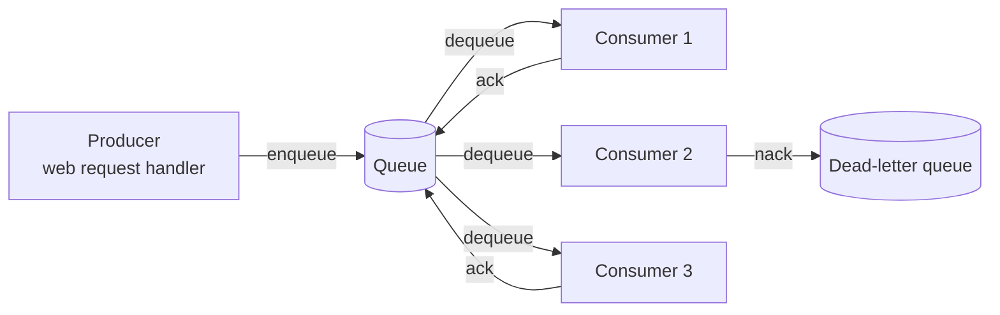
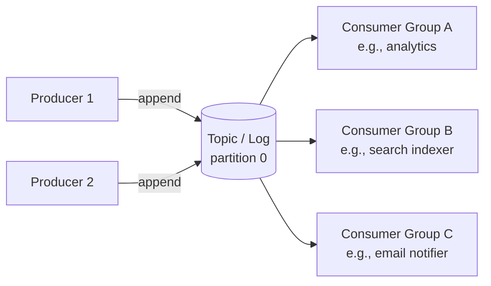

# Message queues & event-driven architecture

> **In one line:** A message queue is a buffer between "something produced an event" and "something processed it" — letting you do work asynchronously, scale producers and consumers independently, retry on failure, and decouple services so each one can ship on its own schedule.

:::tip[In plain English]
A user clicks "place order." Your web request needs to: charge the card, send a confirmation email, update inventory, notify the warehouse, kick off shipping. Doing all that synchronously means the user waits 8 seconds. Putting "order placed" on a queue and letting four separate workers consume it means the user waits 300ms, and any one of those side-effects can fail without breaking the others. That's the value proposition. The cost is operational complexity: another moving part, retries, idempotency, dead letters.
:::

This page is the working tour of the queue/event landscape. Pages on [Concurrency](./concurrency) (for idempotency) and [Distributed systems](./distributed-systems) (for at-least-once) are prerequisites worth checking.

## Two families

Despite the often-conflated marketing, there are **two distinct patterns**:

| Pattern | What it is | Examples |
|---------|------------|----------|
| **Task queue / job queue** | Producer sends a message; one consumer processes it; ack-on-success removes it. Each message done once. | RabbitMQ, SQS, Sidekiq, BullMQ, Celery |
| **Streaming log** | Producers append events to an ordered log; many consumers read the log independently at their own pace; events stay around (days/weeks/forever). | Kafka, Pulsar, Redpanda, Kinesis, Redis Streams |

Both are "messaging," but the semantics are different.

- Task queue: "do this thing, once" (work distribution).
- Streaming log: "this happened" (state distribution + audit).

Real production stacks use both. Order placed event → goes to Kafka (durable log of order history) → a consumer reads Kafka and puts "send confirmation email" on RabbitMQ → email worker pulls from RabbitMQ.

## When to use a queue

You want a queue when:

- **The work is slow** and the user shouldn't wait (sending email, generating PDFs, image processing).
- **The work can fail** and you want automatic retries with backoff.
- **You want to smooth bursts** — 1000 users click "checkout" in a minute; queue them, process at a sustainable rate.
- **You're integrating with a flaky 3rd party** — buffer the calls and retry if they're down.
- **Multiple things need to happen** in reaction to an event; let each consumer do its own.
- **You want producers and consumers to be deployed independently** (microservices).

You don't want a queue when:

- The work is fast (under 100ms) — adding a queue costs more than it saves.
- The user needs the result immediately (a synchronous API request).
- You have only one producer and one consumer running in the same process (just call the function).
- Ordering across all events is critical and you don't have a partitioning strategy.

## Anatomy of a task queue



The flow:

1. **Producer** publishes a message. Returns immediately.
2. **Queue** durably stores it.
3. **Consumer** pulls (or is pushed) the next message.
4. Consumer does the work.
5. Consumer **acknowledges** (ACK) — the queue removes the message.
6. If consumer fails to ACK within a timeout, the queue **redelivers** to another consumer.
7. After N redelivery attempts, the message goes to a **dead-letter queue** for manual inspection.

The ACK + redelivery loop is what makes queues at-least-once: a message *will* be processed eventually, possibly more than once if a consumer crashes mid-work. **Your consumer must be idempotent** — see [Concurrency & async](./concurrency#idempotency-the-property-that-lets-retries-be-safe).

### Consumer code (sketch)

```typescript
// BullMQ (Redis-backed) — the 2026 default in TS land
import { Worker } from 'bullmq';

const worker = new Worker('orders', async (job) => {
  const { orderId } = job.data;

  // Idempotency: the same job may run more than once
  const alreadyProcessed = await db.processedJobs.find({ jobId: job.id });
  if (alreadyProcessed) return alreadyProcessed.result;

  // Do the work
  await sendConfirmationEmail(orderId);
  await db.processedJobs.create({ jobId: job.id, result: 'sent' });
}, {
  connection: { url: process.env.REDIS_URL },
  concurrency: 10, // process up to 10 jobs in parallel per worker
});

worker.on('failed', (job, err) => {
  console.error('job failed', job.id, err);
});
```

BullMQ handles retries, backoff, dead-letter routing, prioritization, scheduling, and a dashboard. Same shape applies to other queue libraries.

## Anatomy of a streaming log (Kafka et al.)



Differences from a task queue:

- **Events stay in the log** (retention: hours to forever). New consumers can replay history.
- **Multiple consumer groups** each get every event independently. (vs task queue: one consumer wins, others see nothing.)
- **Ordered within a partition.** A topic has N partitions; events with the same key go to the same partition; ordering is per-partition.
- **Consumers track their own offset.** Reading is non-destructive.
- **Higher throughput.** Kafka handles millions of events/sec on commodity hardware.

Use cases:

- **Audit log** — every state change as an event, kept forever, replayable.
- **Fan-out** — one "user signed up" event, six downstream systems each react.
- **Event sourcing** — your DB *is* the event log; current state is derived.
- **Stream processing** — real-time analytics, alerting, ML feature pipelines.
- **Change data capture (CDC)** — every DB write becomes an event (Debezium reads Postgres WAL and emits Kafka events).

## The 2026 landscape

| Tool | Family | When |
|------|--------|------|
| **AWS SQS** | Task queue | Default if you're on AWS, simple use |
| **AWS SNS + SQS fanout** | Pub/sub on AWS | Multiple SQS queues subscribing to one topic |
| **RabbitMQ** | Task queue (AMQP) | Self-hosted, mature, complex routing |
| **BullMQ / Bee-Queue** | Task queue on Redis | Simple stacks where you already have Redis |
| **Sidekiq** | Task queue (Ruby ecosystem) | Rails apps |
| **Celery** | Task queue (Python ecosystem) | Django/Flask apps |
| **AWS Step Functions / Temporal** | Saga orchestration | Long-running workflows |
| **Kafka** | Streaming log | High-throughput event streams |
| **Redpanda** | Kafka-compatible, written in C++ | Kafka workloads with simpler ops |
| **AWS Kinesis** | Streaming log | Streaming on AWS |
| **Google Pub/Sub** | Hybrid | GCP shops |
| **NATS / NATS JetStream** | Lightweight pub/sub + streams | Edge-y, low-footprint |
| **Inngest** | Event-driven serverless | New-school, JS/TS, edge-friendly |
| **Trigger.dev / Defer** | Background jobs with code-as-config | Modern indie hacker / startup |
| **Redis Streams** | Streaming log on Redis | Good enough for small scale |

For a starter stack: Redis + BullMQ is hard to beat for TS. For high-scale event streams: Kafka or Redpanda. For "I'm on AWS and I just want a queue": SQS.

## Patterns

### Fan-out

One event, multiple consumers each doing their own thing:

```
order.placed
  ├→ email worker: send confirmation
  ├→ analytics worker: log conversion
  ├→ inventory worker: decrement stock
  └→ shipping worker: kick off fulfillment
```

In SQS, do this with SNS topic + multiple SQS subscribers. In Kafka, multiple consumer groups on one topic. In RabbitMQ, a fanout exchange. Each consumer scales independently; one failing doesn't block the others.

### Dead-letter queue (DLQ)

After N failed attempts, the message goes to a DLQ instead of being retried forever. Two outcomes:

1. **Investigate and replay.** The failure was a bug or transient issue; fix, then re-enqueue from DLQ.
2. **Investigate and drop.** The message is genuinely malformed or no longer relevant; archive for audit, delete from DLQ.

Always provision a DLQ. Without one, a poison pill (a message your consumer always crashes on) blocks the queue. Monitor DLQ depth — anything in there is a customer with a broken experience.

### Outbox pattern

The atomicity problem: you save an order to your DB *and* publish an "order placed" event. If you save first and crash, no event. If you publish first and crash, event without order.

The outbox pattern:

1. In one DB transaction: save the order + save an "outbox" row with the event.
2. A separate process polls the outbox table and publishes to the queue/log.
3. After successful publish, mark the outbox row done.

The DB transaction guarantees atomicity within your DB. The poller guarantees the event is eventually published. The consumer is idempotent so duplicate publishes don't double-effect.

Modern alternative: **CDC** (Change Data Capture) — let Debezium read your DB's transaction log and emit events automatically. Cleaner; harder to set up initially.

### Saga (orchestrated multi-step workflow)

Covered in [Distributed systems](./distributed-systems#sagas--the-practical-alternative). Tools: AWS Step Functions, Temporal, Inngest. Each step is a job; failures trigger compensating jobs.

### Event sourcing

The DB *is* the event log. Current state = fold(events). Adding "what was the user's plan on March 1?" requires no migration — replay events to that point.

Trade-offs: powerful for audit, complex to evolve schemas, often overkill.

### CQRS (Command Query Responsibility Segregation)

Writes go through a different model than reads. Often paired with event sourcing: writes append events; reads come from materialized views built from those events.

## Operating queues in production

### Backpressure and queue depth

Watch queue depth. Growing = consumers are slower than producers.

- **Add more consumers** — usually the right answer if work is parallelizable.
- **Optimize the consumer** — faster handler, batch external calls.
- **Drop or sample** — if events are observability data, sometimes you keep N%.
- **Add backpressure to producers** — slow down ingestion; e.g., return 429s.

### Ordering

Most queues don't guarantee global order. Even Kafka only orders within a partition.

If you need "for one user, process events in order":
- Partition by user ID (Kafka, Kinesis).
- Use FIFO SQS with a `MessageGroupId` per user.
- Use RabbitMQ with consistent hashing.

Single global ordering is rare and expensive; partial ordering per key is usually what you actually need.

### Visibility timeout / lease

When a consumer pulls a message, the queue makes it invisible for N seconds. If the consumer ACKs within N, it's deleted; if not, it reappears for another consumer.

Pitfalls:

- **Timeout too short** → slow jobs get re-delivered while still running → duplicates.
- **Timeout too long** → crashed consumer's jobs sit invisible for too long, stalling work.

Set the timeout to 2-3× your p99 job duration. Extend it (`changeVisibility` in SQS) if you discover the job will take longer than expected.

### Poison pills

A message that always crashes the consumer. Without protections, it blocks the queue (in strict-order mode) or churns retries forever.

- **Retry cap** (max attempts) → eventual move to DLQ.
- **Per-message DLQ routing** — after N retries on the same message, give up.
- **Catch-all error handling in consumer** — log the error, ACK or NACK explicitly; never let the consumer crash the worker process for a single bad message.

### Observability

What to track per queue:

- **Queue depth** (per queue, per priority). Alerts when growing.
- **Consumer lag** (Kafka — how far behind real-time each consumer group is).
- **Throughput** (msgs/sec, in and out).
- **Latency** (time from enqueue to processed).
- **DLQ depth** — should be near zero.
- **Per-job histograms** — p50, p95, p99 duration.

A queue health dashboard saves hours during incidents.

## Common architectural mistakes

:::caution[Where people commonly trip up]
- **Adding a queue when a sync call would do.** A 50ms function called 1000 times/day doesn't need a queue. Queues earn their keep on slow work, retries, or fan-out.
- **Non-idempotent consumers on at-least-once queues.** "Why do we sometimes send two emails?" Because the queue redelivered; your code didn't dedupe. Add an idempotency key check.
- **No dead-letter queue.** A poison pill blocks everything. Always provision a DLQ from day one.
- **Treating Kafka as a task queue.** Kafka doesn't ACK individual messages out of order; if you want "do this one thing, once," Kafka is awkward. Use a queue or a queue-on-Kafka pattern.
- **Storing huge messages.** Some queues limit message size (SQS: 256KB). Put the data in S3/blob storage, put the *reference* on the queue.
- **Producer + consumer in the same process for "simplicity."** Now your queue is a unbounded `Array`. Use a real queue from the start; it's not more complex.
- **No retention plan for streaming logs.** Kafka with "keep forever" eventually fills the disks. Set retention (days? weeks? tiered storage to S3?) deliberately.
- **Visibility timeout shorter than the job.** Long-running jobs get re-delivered while the original is still working → duplicate work + duplicate effects.
- **Distributed transactions across queue + DB.** Don't try; use the outbox pattern (atomic DB write + outbox row → publish from outbox).
- **One giant 'events' topic.** Mixing high-volume and low-volume events on one topic hurts everyone. Topic per logical event type, partition appropriately.
- **No backpressure.** Producers blast events; queue grows; consumers OOM trying to keep up. Bound the queue or rate-limit producers when depth grows.
- **Treating the queue as a database.** "I'll just query the queue for…" Queues aren't queryable databases. Use a DB for state; the queue is for in-flight work.
:::

## Page checkpoint

<Quiz id="foundations-message-queues-page" title="Did message queues stick?" sampleSize={2}>

<Question
  prompt="A web request must charge a card, send confirmation, update inventory, and notify shipping. Currently it does all four synchronously and users wait 8s. What's the right architectural change?"
  options={[
    { text: "Use a faster card processor" },
    { text: "Charge the card synchronously (user needs to know if it succeeds), then enqueue 'order.placed' and let separate workers handle email/inventory/shipping. Each worker scales and fails independently; user response time drops to ~300ms" },
    { text: "Buy faster servers" },
    { text: "Move to GraphQL" }
  ]}
  correct={1}
  explanation="Synchronous-only ties the user's response time to the slowest downstream. Queueing the post-payment side-effects (email, inventory, shipping) lets you ACK the user quickly and process the rest reliably with retries."
  revisit={{ to: "/docs/foundations/message-queues#when-to-use-a-queue", label: "When to use a queue" }}
/>

<Question
  prompt="A team sometimes sends two confirmation emails for one order. They're on SQS with default settings. Most likely cause?"
  options={[
    { text: "SQS bug" },
    { text: "At-least-once delivery + non-idempotent consumer. SQS retries if it doesn't see an ACK within the visibility timeout — if the consumer was slow, the message was re-delivered to a second worker. Fix: idempotency key (or check 'already sent' in DB) before sending email" },
    { text: "Email provider duplicates messages" },
    { text: "Race condition in user signup" }
  ]}
  correct={1}
  explanation="Every at-least-once queue produces duplicates under failure. Consumers must be idempotent. The fix is in your code — check 'have I already processed this job ID' before doing side-effects."
  revisit={{ to: "/docs/foundations/message-queues#anatomy-of-a-task-queue", label: "At-least-once + idempotent consumers" }}
/>

<Question
  prompt="What's the outbox pattern, and what does it solve?"
  options={[
    { text: "A way to organize emails" },
    { text: "Atomicity between a DB write and an event publish: save the entity *and* an outbox row in one DB transaction; a separate process publishes the outbox row to the queue. Solves 'I saved the order but crashed before publishing the event'" },
    { text: "A queue for outgoing messages" },
    { text: "A CDN cache layer" }
  ]}
  correct={1}
  explanation="The DB transaction guarantees both rows succeed or both fail. The publisher process then guarantees eventual delivery. Without the outbox, you risk a saved order with no event — or an event with no order."
  revisit={{ to: "/docs/foundations/message-queues#outbox-pattern", label: "Outbox pattern" }}
/>

<Question
  prompt="A team's Kafka consumer group falls hours behind real-time. Symptoms: customer-visible delays in downstream features. What's the most useful first metric to track?"
  options={[
    { text: "CPU usage on the brokers" },
    { text: "Consumer lag — for each consumer group, how many messages behind the latest. Growing lag means consumers are slower than producers; fix by scaling consumers, optimizing the handler, or partitioning the topic differently" },
    { text: "Number of topics" },
    { text: "Disk I/O on producers" }
  ]}
  correct={1}
  explanation="Consumer lag is the most direct signal of 'are downstream features keeping up?' Alerts on lag growth catch problems before they become customer-visible delays. The fix is usually: more partitions, more consumer instances, or a faster handler."
  revisit={{ to: "/docs/foundations/message-queues#observability", label: "Consumer lag metric" }}
/>

</Quiz>

## What's next

→ Continue to [Containers & orchestration](./containers).
