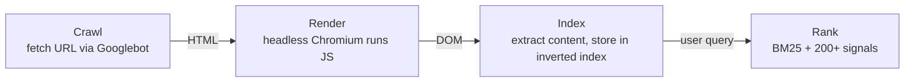

# SEO fundamentals for developers

> **In one line:** Most of "SEO" is content and links — not a developer's job. But the technical foundation (clean URLs, fast loads, semantic HTML, proper meta tags, structured data, no accidental noindex) *is* a developer's job, and getting it wrong undoes every other effort.

:::tip[In plain English]
A great article on a slow page with a broken canonical URL and a stray `noindex` will rank worse than a mediocre article on a clean one. Search engines crawl, render, and index your pages — your job is to make all three frictionless. That's: fast pages (Core Web Vitals), correct meta tags (title, description, og:image), structured data so Google understands the content type, sitemap + robots.txt so it knows what exists, and *not* breaking these on every deploy.
:::

This page is the technical-SEO checklist a developer can actually execute. The non-technical parts (keyword research, link building, content strategy) belong to whoever owns content.

## How search engines see your page



Critical implications:
- **JS-rendered content is a second-pass.** Google can render JS, but in two stages — initial HTML first, JS render in a queue (can be hours-days later). SSR or SSG content is indexed immediately; client-only-rendered content has a lag.
- **Bots have a crawl budget.** Slow pages = fewer pages crawled per visit. Performance ≈ crawl coverage.
- **The HTML is the source of truth.** What's in `view-source` is what Google sees first. Make sure your real content is in the HTML, not built later by JS.
- **Robots.txt and meta `noindex` are absolute.** A misconfigured one removes you from the index.

## The page-level checklist

Every important page needs:

### `<title>`

```html
<title>Best Lightweight Database for Embedded Apps (2026 Guide)</title>
```

- 50-60 characters (longer gets truncated in search results).
- Unique per page.
- Front-load the most important keywords.
- Brand at the end (or omit if length-constrained).

### `<meta name="description">`

```html
<meta name="description" content="A clear comparison of SQLite, DuckDB, and Turso for embedded apps in 2026, with benchmarks and concrete use-case recommendations.">
```

- 150-160 characters.
- Influences click-through rate (CTR), not ranking directly — but CTR influences ranking indirectly.
- If you don't set one, Google picks an excerpt; that's often fine for blog posts, bad for product pages.

### Canonical URL

```html
<link rel="canonical" href="https://example.com/blog/lightweight-databases-2026">
```

When the same content is reachable at multiple URLs (?utm_*, trailing slash, /amp/, etc.), the canonical tells search engines "this is the real one." Without it, search engines pick one — often the wrong one — and may split ranking signal across duplicates.

### OpenGraph (for social sharing)

```html
<meta property="og:type" content="article">
<meta property="og:title" content="Best Lightweight Database for Embedded Apps">
<meta property="og:description" content="A clear comparison...">
<meta property="og:image" content="https://example.com/og/databases-2026.png">
<meta property="og:url" content="https://example.com/blog/lightweight-databases-2026">

<meta name="twitter:card" content="summary_large_image">
<meta name="twitter:image" content="https://example.com/og/databases-2026.png">
```

When someone shares the URL on LinkedIn / Twitter / Slack / Discord, these decide the preview card. Without them: a tiny default image and the URL itself. Big effect on shareability.

### Heading structure

One `<h1>` per page. Section headings (`<h2>`, `<h3>`) in logical order, no skipping levels. This isn't just for accessibility — search engines use headings to understand structure.

### Semantic HTML

`<article>`, `<section>`, `<nav>`, `<header>`, `<aside>`, `<main>`. Google's renderer uses these to understand content layout, distinguish primary content from chrome.

### Image alt text

```html

```

- Real description, not "image of."
- Decorative images: `alt=""`.
- Important for image search and accessibility — both matter.

### Internal links

Link liberally between your own pages. Use descriptive anchor text (`our pricing page`, not `here`). Internal links spread PageRank-equivalent signal through your site.

## Structured data (JSON-LD)

Search engines understand structured data via Schema.org vocabulary, typically encoded as JSON-LD in a `<script>` tag.

```html
<script type="application/ld+json">
{
  "@context": "https://schema.org",
  "@type": "Article",
  "headline": "Best Lightweight Database for Embedded Apps",
  "author": { "@type": "Person", "name": "Jane Smith" },
  "datePublished": "2026-05-26",
  "image": "https://example.com/og/databases-2026.png",
  "publisher": {
    "@type": "Organization",
    "name": "Example",
    "logo": { "@type": "ImageObject", "url": "https://example.com/logo.png" }
  }
}
</script>
```

When structured data matches a known type, search engines can show **rich results** — star ratings on products, breadcrumbs on articles, FAQs that expand inline, recipe ingredients, event dates.

Common types worth implementing:

| Type | When |
|------|------|
| `Article` / `BlogPosting` / `NewsArticle` | Editorial content |
| `Product` + `Offer` | E-commerce |
| `Review` / `AggregateRating` | Reviews/ratings |
| `BreadcrumbList` | Site navigation |
| `FAQPage` | Question/answer pages |
| `HowTo` | Step-by-step guides |
| `Recipe` | Recipes |
| `Event` | Live events |
| `Organization` + `WebSite` | Sitewide; helps logo + sitelink search box |
| `LocalBusiness` | Business with a physical location |
| `VideoObject` | Video content (helps appear in video carousels) |

Validate via Google's [Rich Results Test](https://search.google.com/test/rich-results). The reports show what rich-result types are eligible.

## Sitewide setup

### `robots.txt`

Root of your domain (`/robots.txt`):

```
User-agent: *
Allow: /

Disallow: /admin/
Disallow: /api/
Disallow: /search

Sitemap: https://example.com/sitemap.xml
```

Tells crawlers what's allowed. Common mistakes:

- **`Disallow: /` left over from staging.** De-indexes everything; you find out two weeks later when traffic vanishes.
- **Blocking JS/CSS.** Modern crawlers need to render the page; blocking the assets they need = they render a broken page = lower quality signal.
- **Trusting robots.txt to hide private content.** It's advisory — bad bots ignore it. Use auth, not robots.

### Sitemap.xml

A list of every URL on your site you want indexed:

```xml
<?xml version="1.0" encoding="UTF-8"?>
<urlset xmlns="http://www.sitemaps.org/schemas/sitemap/0.9">
  <url>
    <loc>https://example.com/</loc>
    <lastmod>2026-05-26</lastmod>
    <priority>1.0</priority>
  </url>
  <url>
    <loc>https://example.com/blog/lightweight-databases-2026</loc>
    <lastmod>2026-05-20</lastmod>
  </url>
  <!-- ... -->
</urlset>
```

- **Generate dynamically.** Don't maintain by hand. Most frameworks have plugins (`next-sitemap` for Next.js, etc.).
- **`lastmod` matters.** Crawlers re-fetch when this changes. Don't stamp it as "now" on every build — only on real content changes.
- **Submit to Google Search Console and Bing Webmaster Tools.** This is how you tell them about new pages.
- **One sitemap per ~50,000 URLs**; if you have more, create a sitemap index.

### Search Console

The owner-side console (Google Search Console, Bing Webmaster Tools, Yandex Webmaster) shows:
- What queries you rank for, what CTR.
- Indexing status — which pages are indexed, which aren't, why not.
- Errors — crawl failures, mobile usability issues, Core Web Vitals problems, structured-data errors.

Set this up on day one. Without it, you're flying blind.

## URL design

| Good | Bad |
|------|-----|
| `/blog/lightweight-databases-2026` | `/blog?id=42` |
| `/products/red-wool-sweater` | `/products/SKU-1839271` |
| `/users/jane-smith` | `/users/f8a3...uuid` |
| `/articles/typing-the-event-loop` | `/articles/TYPING%20THE%20EVENT%20LOOP` |

- **Words, not IDs.** Slugs that describe the content.
- **Lowercase, hyphens.** No underscores. No mixed case.
- **Stable.** Don't change URLs — redirect old ones (301) if you must.
- **Logical hierarchy.** `/blog/posts/foo` makes structural sense; flat `/foo` doesn't tell search engines about content type.

## Redirects and URL changes

When a URL changes:

- **301 permanent redirect** from old to new. Search engines transfer ranking signal.
- **302 temporary redirect** for short-term changes (a/b tests, geo redirects). Doesn't transfer signal.
- **307 (HTTP/1.1) or 308** — modern equivalents of 302/301 that preserve the HTTP method.
- **Never chain redirects.** Each hop is a delay; 3+ hops, search engines may stop following.
- **Update internal links** to point at the new URL directly. Don't rely on the redirect.

A site migration without proper redirects is the most common way to lose 30% of traffic overnight.

## Pagination and infinite scroll

Old `rel="prev"` / `rel="next"` is no longer used by Google (deprecated 2019). For paginated content:

- **Each page has a unique URL** (`/blog?page=2`, `/blog/page/2`).
- **Self-canonical** — each page canonicals to itself.
- **The first page is the primary entry; subsequent pages should be crawlable but not heavily promoted.**
- **For infinite scroll** — also have paginated URLs the user can navigate to, and serve those for crawlers. "JS infinite scroll only" means everything past page 1 is invisible to search engines.

## International sites

If you serve multiple languages or regions:

```html
<link rel="alternate" hreflang="en" href="https://example.com/en/page">
<link rel="alternate" hreflang="es" href="https://example.com/es/page">
<link rel="alternate" hreflang="x-default" href="https://example.com/page">
```

URL structure options:
- **Subdomain** — `en.example.com`, `es.example.com`. Treated as separate sites.
- **Subdirectory** — `example.com/en/`, `example.com/es/`. Easier; signals to one domain.
- **ccTLDs** — `example.de`, `example.fr`. Strong geo signal; expensive.

Most teams pick subdirectories. Pair with content localization (see [i18n](./i18n)).

## The Core Web Vitals connection

Google uses **Core Web Vitals** (LCP, INP, CLS — see [Performance](./performance)) as a ranking signal. Effects:

- **Direct ranking impact.** Sites failing CWV get a small ranking penalty.
- **Crawl budget.** Slow sites get fewer pages crawled per visit.
- **User signals.** Slow page → quick back-button → Google interprets as "low quality."

So performance is SEO. Optimize CWV; you've helped your search rankings as a side effect.

## SSR vs CSR for SEO

The eternal question. The honest answer in 2026:

- **SSR / SSG**: content in HTML on first response. Indexed quickly. Reliable.
- **CSR only** (React shell, content loaded by JS): Google can render it, but it's a second-pass that can lag hours-to-days. Other search engines (Bing, DuckDuckGo) handle it less well. Social-media link previewers (LinkedIn, Twitter, Slack) often don't run JS at all — your `og:image` must be in the HTML.

For anything you want indexed (marketing pages, blog, product pages, docs), prefer SSR or SSG. For authenticated SPA dashboards, SEO isn't usually a concern.

Frameworks that get this right by default: Next.js (App Router), Remix, SvelteKit, Astro, Nuxt.

## Site structure and crawlability

- **Internal linking** is how search engines discover pages.
- A page that no other page links to is **orphaned** and may not be indexed.
- **Breadcrumbs** (with structured data) help both users and crawlers understand hierarchy.
- **Avoid deep hierarchies** — pages 5+ clicks from the homepage are crawled less. Flatter structures index better.

## Common mistakes

:::caution[Where people commonly trip up]
- **Leaving `noindex` from staging in production.** A meta robots tag set to `noindex` removes the page from the index. Audit every page's robots meta after deploys.
- **Robots.txt blocking everything.** Same as above; copy-pasted from staging or dev. Read `/robots.txt` in production every release.
- **Client-side rendering for content pages.** Google indexes it eventually; Bing/social previews don't see anything. SSR or SSG for indexable content.
- **Multiple URLs serving the same content with no canonical.** Trailing slash vs not, `www` vs not, `?utm_*` parameters, HTTP vs HTTPS — pick one as canonical, redirect or canonicalize the rest.
- **Changing URLs without 301s.** Massive ranking loss; old links rot. If you must rename, add 301 redirects from every old URL.
- **Slow pages on mobile.** Most search traffic is mobile. A site that's fast on desktop but a 5s LCP on mobile is broken for SEO.
- **Hiding important content behind tabs / accordions that load JS-only.** Google may not see it; it certainly doesn't weight it. Put the content in the HTML.
- **`og:image` 404s or wrong size.** Min 1200×630 recommended. Test with the LinkedIn and Twitter card validators before launch.
- **No structured data for product pages.** Missing out on rich results (star ratings, prices) in search. Implement `Product` + `Offer` + `AggregateRating`.
- **Letting `lastmod` in sitemap.xml update on every build.** Crawlers re-fetch unchanged pages; you waste their budget. Only update `lastmod` on real content changes.
- **Forgetting to set up Search Console.** No data on what's working or broken. Set it up on day one of public launch.
- **Treating SEO as a launch task, not ongoing.** Pages get added, structured data drifts, broken links accumulate. Audit quarterly.
:::

## Page checkpoint

<Quiz id="foundations-seo-page" title="Did SEO stick?" sampleSize={3}>

<Question
  prompt="A team's marketing pages are a React SPA — empty `<div id='root'>` in HTML, content rendered by JS after load. Why is this a problem for SEO?"
  options={[
    { text: "React isn't supported by search engines" },
    { text: "Google can render JS but in a delayed second pass (sometimes hours-days later), other search engines handle it worse, and social-media link previewers don't run JS — so your og:image / title isn't visible when someone shares the URL. Use SSR/SSG for indexable content" },
    { text: "SPAs require manual sitemap entry" },
    { text: "Google has banned SPAs" }
  ]}
  correct={1}
  explanation="Google's two-pass indexing means JS-rendered content lags significantly. Social-media previewers (LinkedIn, Twitter, Slack) don't run JS at all — so without SSR, no preview card. SSR/SSG for anything indexable; CSR is fine for authenticated SPA dashboards."
  revisit={{ to: "/docs/foundations/seo#ssr-vs-csr-for-seo", label: "SSR vs CSR for SEO" }}
/>

<Question
  prompt="What does a `<link rel='canonical' href='...'>` tag do?"
  options={[
    { text: "It sets the page's URL in the address bar" },
    { text: "It tells search engines 'when the same content is reachable at multiple URLs, *this* is the real one' — preventing duplicate-content penalties and keeping ranking signal consolidated. Critical when query params, trailing slashes, or AMP versions create URL variants" },
    { text: "It enables canonical name servers" },
    { text: "It is required by HTML5" }
  ]}
  correct={1}
  explanation="Without a canonical, search engines pick one of the duplicate URLs (often the wrong one) and may split signal across variants. The canonical tag is how you say 'consolidate to here.'"
  revisit={{ to: "/docs/foundations/seo#canonical-url", label: "Canonical URLs" }}
/>

<Question
  prompt="A team renames `/blog/foo` to `/articles/foo` and forgets to add a 301 redirect. What's the SEO impact?"
  options={[
    { text: "Nothing — search engines auto-discover new URLs" },
    { text: "Old URLs go 404 → search engines drop them from the index → ranking signal accumulated for the old URL evaporates. External backlinks pointing at the old URL now lead nowhere. A proper 301 transfers signal and preserves the link's value" },
    { text: "The new URL won't be indexed" },
    { text: "Only mobile traffic is affected" }
  ]}
  correct={1}
  explanation="URL changes without 301 redirects are a top cause of 'we lost all our traffic after a site migration' incidents. Every URL change needs a 301 to its replacement; signal transfers, backlinks keep working, search engines update over time."
  revisit={{ to: "/docs/foundations/seo#redirects-and-url-changes", label: "URL changes and 301s" }}
/>

<Question
  prompt="Why does Core Web Vitals (LCP/INP/CLS) matter for SEO directly?"
  options={[
    { text: "It doesn't — CWV is just a UX metric" },
    { text: "Google uses CWV as a ranking signal (small but measurable), slow sites get less crawl budget per visit, and user signals (quick back-button on slow pages) further hurt rankings. Performance and SEO are the same lever from two angles" },
    { text: "It only matters for paid ads" },
    { text: "CWV affects Bing but not Google" }
  ]}
  correct={1}
  explanation="Google has confirmed CWV is a ranking signal since 2021. Beyond the direct effect, slow pages get less crawl coverage and worse user behavior signals — a triple compounding loss. Optimize performance; SEO benefits."
  revisit={{ to: "/docs/foundations/seo#the-core-web-vitals-connection", label: "CWV and SEO" }}
/>

</Quiz>

## What's next

→ Continue to [i18n & l10n](./i18n).
