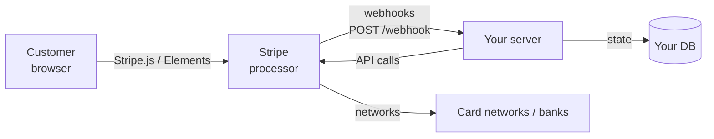

# Payments: Stripe, subscriptions, webhooks, PCI scope

> **In one line:** Payments is one of those domains where the framework (Stripe, mostly) handles the hard parts but the integration details — idempotency, webhook reliability, subscription lifecycle, refunds, disputes, PCI scope — are *all yours*, and getting any of them wrong shows up as missed revenue, angry customers, or a regulator on the phone.

:::tip[In plain English]
You almost certainly use Stripe (or Stripe-shaped competitors: Adyen, Paddle, Braintree, Lemon Squeezy). They handle the actual card processing, fraud detection, PCI compliance, bank routing. Your code does: collect payment method via their JS widget (Elements/Checkout), call their API to create charges or subscriptions, listen to their webhooks for state changes, store the *minimum* (Stripe customer ID, subscription ID, payment method ID — never raw card numbers). Get the webhook handling right and you can sleep at night. Get it wrong and you've quietly charged someone twice or failed to revoke a churned customer's access.
:::

This page is the working developer's tour. The product choices (pricing tiers, free trials, dunning policy) live elsewhere; here we cover what the code has to do.

## The actors



- **Customer's browser** talks to Stripe directly to collect the card. Card data never touches your server.
- **Your server** talks to Stripe's API to create charges, subscriptions, refunds.
- **Stripe** sends webhooks back when state changes (charge succeeded, subscription canceled, dispute opened).
- **Your DB** mirrors just enough Stripe state to answer "is this user subscribed?"

Two architectural rules:

1. **Stripe is the source of truth for payment state.** Your DB is a cache. When in doubt, query Stripe.
2. **Webhooks are how Stripe tells you about async state changes** — failed renewals, disputes, payouts. If you ignore them, your DB drifts from reality.

## PCI scope: why the browser talks to Stripe directly

PCI DSS is the credit-card industry compliance standard. The cost of compliance scales with how much you touch raw card data:

| Your code | PCI scope | Compliance effort |
|-----------|-----------|-------------------|
| Card number passes through your servers | Highest (SAQ D) | Quarterly scans, annual audits, network segmentation, big effort |
| Card number entered in iframe Stripe controls | Lowest (SAQ A) | Annual self-assessment, minimal effort |

The whole point of Stripe Elements / Checkout / Payment Element is to keep raw card data out of your servers. Your browser code tokenizes the card with Stripe; Stripe gives you a `pm_…` payment method ID; that's all you store/handle. PCI scope stays at SAQ A.

**Don't roll your own card form.** Use Stripe Elements (Payment Element is the 2026 default — it auto-handles cards, Apple/Google Pay, BNPL, regional methods).

## The basic charge flow

The simplest case: one-time payment.

```typescript
// Step 1: server creates a PaymentIntent
import Stripe from 'stripe';
const stripe = new Stripe(process.env.STRIPE_SECRET_KEY!);

export async function POST(req: Request) {
  const { amount, currency } = await req.json();
  const intent = await stripe.paymentIntents.create({
    amount,            // in smallest unit — cents for USD, yen for JPY
    currency,
    automatic_payment_methods: { enabled: true },
    metadata: { user_id: getUserId(req) },
  }, {
    idempotencyKey: req.headers.get('Idempotency-Key') ?? undefined,
  });
  return Response.json({ clientSecret: intent.client_secret });
}
```

```typescript
// Step 2: browser confirms with Stripe directly (using clientSecret)
import { loadStripe } from '@stripe/stripe-js';
import { Elements, PaymentElement, useStripe, useElements } from '@stripe/react-stripe-js';

const stripePromise = loadStripe(process.env.NEXT_PUBLIC_STRIPE_PUBLISHABLE_KEY!);

function CheckoutForm({ clientSecret }) {
  const stripe = useStripe();
  const elements = useElements();

  const handleSubmit = async () => {
    const { error } = await stripe.confirmPayment({
      elements,
      confirmParams: { return_url: 'https://example.com/order/complete' },
    });
    if (error) showError(error.message);
  };

  return (
    <Elements stripe={stripePromise} options={{ clientSecret }}>
      <PaymentElement />
      <button onClick={handleSubmit}>Pay</button>
    </Elements>
  );
}
```

```typescript
// Step 3: Stripe sends webhook when charge succeeds
// POST /api/webhooks/stripe
export async function POST(req: Request) {
  const sig = req.headers.get('stripe-signature')!;
  const body = await req.text();
  const event = stripe.webhooks.constructEvent(
    body, sig, process.env.STRIPE_WEBHOOK_SECRET!,
  );

  switch (event.type) {
    case 'payment_intent.succeeded': {
      const intent = event.data.object;
      await fulfillOrder(intent.metadata.user_id, intent.amount);
      break;
    }
    case 'payment_intent.payment_failed': {
      // log, notify, etc.
      break;
    }
  }
  return new Response('ok');
}
```

Three things to notice: signature verification on every webhook, `automatic_payment_methods` lets Stripe pick which methods to show, fulfillment happens on the *webhook*, not on the browser's success redirect (the redirect can be missed if the user closes the tab).

## Subscriptions

The flow for recurring billing is similar but with `Customer`, `Product`, `Price`, and `Subscription` objects:

```typescript
// 1. Create or find a Customer (one per user)
const customer = await stripe.customers.create({
  email: user.email,
  metadata: { user_id: user.id },
});
await db.users.update({ id: user.id, data: { stripe_customer_id: customer.id } });

// 2. Create a Subscription
const subscription = await stripe.subscriptions.create({
  customer: customer.id,
  items: [{ price: 'price_PRO_MONTHLY' }],
  payment_behavior: 'default_incomplete',
  payment_settings: { save_default_payment_method: 'on_subscription' },
  expand: ['latest_invoice.payment_intent'],
});

// 3. Confirm payment in browser using the resulting payment intent's clientSecret
// (same as one-time)

// 4. Webhooks tell you about subscription lifecycle
```

Critical subscription events to handle in webhooks:

| Event | What it means | Your action |
|-------|---------------|-------------|
| `customer.subscription.created` | New sub | Mark user as active, grant entitlements |
| `customer.subscription.updated` | Plan change, status change | Update entitlements |
| `customer.subscription.deleted` | Sub canceled | Revoke entitlements (often at period end) |
| `invoice.paid` | Renewal payment succeeded | Update "paid through" date |
| `invoice.payment_failed` | Renewal failed | Start dunning flow |
| `invoice.payment_action_required` | SCA / 3DS challenge | Send the user an email to confirm |
| `customer.subscription.trial_will_end` | 3 days before trial end | Send a reminder |

### "Active" is more nuanced than you think

A subscription has a `status` field. Don't treat "subscribed user" as "user has a non-null subscription." Treat it as the subscription's *status*:

| Status | Active? |
|--------|---------|
| `trialing` | Yes — full access |
| `active` | Yes |
| `past_due` | Usually yes — still in dunning, give them time to pay |
| `unpaid` | No — dunning exhausted |
| `canceled` | No (after current period ends if `cancel_at_period_end`) |
| `incomplete` | No — payment never confirmed |
| `incomplete_expired` | No |
| `paused` | No (or partial — Stripe's new feature) |

A common bug: revoking access immediately on `cancel_at_period_end`. Users paid for the rest of the month; they should keep access through `current_period_end`.

## Webhooks: the most important integration detail

Webhooks are how Stripe tells you about asynchronous state. Get them right and your system is reliable. Get them wrong and you have ghost subscriptions, double-charges, and confused customers.

### Verify the signature, always

```typescript
const event = stripe.webhooks.constructEvent(
  rawBody,                              // raw request body, NOT JSON-parsed
  req.headers.get('stripe-signature'),
  process.env.STRIPE_WEBHOOK_SECRET,    // signing secret from dashboard
);
```

Without this, anyone can `POST /api/webhooks/stripe` with fake events. (See [Secrets & API keys](./secrets-and-keys#common-mistakes) for the analogous attack on every webhook provider.)

**The raw body matters**: some frameworks parse JSON automatically and break signature verification. In Next.js App Router: `await req.text()` first, parse later if needed.

### Handle idempotency on your side

Stripe redelivers webhooks if you don't respond 2xx within a few seconds. The same event ID may arrive multiple times.

```typescript
async function handleEvent(event: Stripe.Event) {
  // Atomic insert; if event was already processed, this fails the unique constraint
  try {
    await db.processedEvents.create({
      data: { stripe_event_id: event.id, type: event.type },
    });
  } catch (e) {
    if (isUniqueViolation(e)) return; // already processed
    throw e;
  }

  // ...handle the event...
}
```

A `processed_events` table with a unique constraint on `stripe_event_id` is the standard pattern. Insert first, then process — guarantees no duplicate side effects.

### Acknowledge fast, process async if slow

Stripe expects a 2xx within ~10s. If your handler takes longer (sending email, calling other services), enqueue the work and ACK immediately.

```typescript
export async function POST(req: Request) {
  const event = verifyAndParse(req);
  await db.processedEvents.create({ data: { stripe_event_id: event.id } });
  await queue.publish('stripe.event', event);  // enqueue
  return new Response('ok');                    // ACK immediately
}
```

The worker reads from the queue, does the work, retries on failure (which is now its problem, not Stripe's).

### Replay endpoint

Build a small admin endpoint that can replay any Stripe event ID through your handler. When something goes wrong in production ("we never processed the subscription.created webhook"), you fetch the event from Stripe's API and replay it. Saves manual SQL fixups.

### Test locally

`stripe listen --forward-to localhost:3000/api/webhooks/stripe` — the Stripe CLI forwards real webhooks to your dev server. You can also `stripe trigger payment_intent.succeeded` to fire synthetic events.

## Dunning: handling failed renewals

When a renewal fails (expired card, insufficient funds, fraud block), the subscription goes `past_due`. Stripe will retry the charge for ~3 weeks (configurable via the dashboard's "Smart Retries" or Schedule).

Your job: communicate with the user. Stripe sends emails by default, but a good integration:

1. **Send a custom email on first failure**, with a link to Stripe's Customer Portal (or your own) to update payment method.
2. **In-app banner** — "your payment failed; update card."
3. **Retry schedule** — Stripe handles retries; you don't need to.
4. **After dunning exhausted** (`status: unpaid` or `canceled`), revoke access *and* send a "your subscription has ended" email.
5. **Win-back flows** — for users who churned, send promo offers, surveys, etc.

Don't immediately yank access on first failure. Give Stripe time to retry; give the user time to react. 7-21 days is typical.

## Refunds and disputes

### Refunds

```typescript
await stripe.refunds.create({
  payment_intent: 'pi_...',
  // amount optional — defaults to full
});
```

Listen for `charge.refunded` webhook → revoke whatever was granted.

For subscriptions: a partial refund + canceling the subscription is the common "I want my money back" flow. Stripe doesn't auto-prorate refunds on cancellation; you script it.

### Disputes (chargebacks)

Customer disputes a charge with their bank. Stripe takes the money back from your account, often charges you a $15 fee, and gives you a few days to respond with evidence.

Webhook: `charge.dispute.created`. Your handler:

1. Revoke access (the user explicitly disputed; they don't want it).
2. Notify your team.
3. Gather evidence (logs of usage, IP addresses, receipts emailed, consent screenshots).
4. Submit via Stripe dashboard or API.

Win rate on disputes is low (~30% across the industry). Prevention beats remediation: clear billing descriptors (`COMPANY*PRODUCT`), explicit consent screens, immediate receipts, prompt customer support response.

If your dispute rate exceeds ~1% of transactions, you're at risk of being put in monitoring programs (Visa's VAMP, Mastercard's MCP) which carry steep fines and can ultimately lose you payment processing.

## Saving payment methods and SCA / 3DS

**Strong Customer Authentication (SCA)** is an EU rule (2019, broadened since). Most cards require a 3DS challenge — the user sees a bank-side authentication step ("enter the code from your bank app") on first charge.

Stripe handles this. Your code:

- Use **PaymentIntents** (not deprecated Charges).
- For saved-card-then-charge-later flows, use **`SetupIntent`** to attach the card (with SCA done up front), then create future PaymentIntents with `off_session: true`.
- If off-session payment requires authentication (rare but happens), webhook `invoice.payment_action_required` fires — email the user to come back and confirm.

### Saving a card for later

```typescript
// One-time: collect with SetupIntent
const setupIntent = await stripe.setupIntents.create({
  customer: customer.id,
  payment_method_types: ['card'],
});
// browser: confirmSetup(...) — does SCA if needed
```

Later, charge:

```typescript
const intent = await stripe.paymentIntents.create({
  amount: 1000,
  currency: 'usd',
  customer: customer.id,
  payment_method: 'pm_...',     // saved
  off_session: true,
  confirm: true,
});
// If SCA required: catch error code, send "come back" email
```

## Tax and invoicing

**Stripe Tax** handles automatic tax calculation (VAT in EU, GST in AU, sales tax in US states with nexus). Worth turning on once you sell internationally — manual tax handling is painful.

For B2B: customer-supplied VAT IDs (`tax_ids`) → reverse charge, no VAT collected. Stripe validates and applies automatically.

Invoices: Stripe generates them; you can customize logo, address, footer, and stack with your own invoice service if needed.

## Marketplaces and Stripe Connect

If you're a marketplace (collect money from buyers, pay sellers minus a cut), you need **Stripe Connect**:

- **Standard accounts** — sellers have their own Stripe accounts; you control payouts.
- **Express accounts** — sellers onboarded via Stripe-hosted flow, you control most settings.
- **Custom accounts** — you fully control UX; you're responsible for compliance.

Connect handles KYC (Know Your Customer) — sellers verify their identity to receive money. Required by law everywhere.

Connect is its own product surface. Block out a few weeks for serious integration; don't underestimate.

## Alternative processors

| Processor | Strengths |
|-----------|-----------|
| **Stripe** | Default. Best DX, broad coverage. |
| **Adyen** | Enterprise, more direct rails to networks, often cheaper at scale. |
| **Braintree** (PayPal) | Older, still solid; integrates PayPal natively. |
| **Paddle / Lemon Squeezy** | "Merchant of record" — they handle taxes and VAT for you globally. Smaller integrators love them. |
| **PayPal directly** | For PayPal/Venmo support if Stripe's PayPal isn't enough. |
| **Adyen for Platforms / Stripe Connect** | Marketplaces. |
| **MercadoPago, Razorpay** | Regional (LatAm, India). |
| **Crypto** (Coinbase Commerce, BitPay) | Niche; legal/tax complexity. |

For a starter SaaS: Stripe. For "I don't want to deal with VAT and tax compliance globally": a Merchant of Record (Paddle, Lemon Squeezy) — they take a higher cut (~5%) but handle the tax mess.

## Common mistakes

:::caution[Where people commonly trip up]
- **Fulfilling orders from the browser success redirect, not the webhook.** User closes the tab during redirect → never fulfilled. Fulfillment must come from the `payment_intent.succeeded` webhook.
- **Not verifying webhook signatures.** Anyone with the URL can POST fake events. Always `constructEvent`; always pass the raw body.
- **Webhook handler processes events twice.** Stripe retries. Without an idempotency check (processed_events table), every retry is a duplicate side effect.
- **Storing raw card numbers / CVV.** Massive PCI scope expansion + legal liability. Use Stripe Elements; never see the raw card.
- **`NEXT_PUBLIC_STRIPE_SECRET_KEY`** or equivalent. Use the publishable key (`pk_…`) in the browser; the secret key (`sk_…`) only on the server.
- **Building a custom card form to match your design.** PCI scope rockets up. Use Stripe's Payment Element; style it with their CSS hooks.
- **Treating subscription `status === 'active'` as the only "is subscribed" check.** `trialing` and (often) `past_due` are also active for entitlements. Centralize "is user subscribed" logic.
- **Yanking access immediately on cancel.** User paid for the rest of the period. Revoke at `current_period_end`, not on cancellation.
- **No dunning emails.** Payment fails → Stripe quietly retries → user never knew until access disappears. Send emails on first failure with a "update card" link.
- **Stripe customer IDs not stored.** Every operation requires a customer ID. Create it on user signup or first payment; persist it on the user row.
- **Manual invoice generation duplicating Stripe.** Stripe creates invoices automatically for subscriptions. Don't build a parallel system; customize Stripe's invoice templates.
- **Testing against production.** Use test mode keys + test cards (4242 4242 4242 4242). Wire your CI/staging to test mode; only prod talks to live mode.
- **No webhook replay tool.** Something goes wrong, you want to re-run an event — build an admin endpoint that fetches an event by ID and runs it through your handler. Saves hours during incidents.
- **Charging different currencies without specifying amount in the smallest unit.** USD: cents. JPY: yen (no fractional). EUR: cents. SAR: halala. Read each currency's `amount` rules in Stripe docs; mixing them = wildly wrong charges.
- **Free trial without payment method.** Allowed (Stripe supports it), but increases fraud and trial abuse. Most B2B SaaS requires a payment method at trial start.
- **No "Customer Portal" link.** Users can't update their card, see invoices, or cancel. Stripe's hosted Customer Portal is one config + one link.
- **Auto-renewal without clear UX.** Users think they had a one-time charge, get billed again, dispute. EU and California laws require explicit auto-renewal disclosure.
:::

## Page checkpoint

<Quiz id="foundations-payments-page" title="Did payments stick?" sampleSize={3}>

<Question
  prompt="A user closes the browser tab during the post-payment redirect. The team's code fulfilled the order from `useEffect` on the success page. What happens?"
  options={[
    { text: "Stripe automatically fulfills the order" },
    { text: "The success page never runs → fulfillment never triggers → user paid but never got the product. The fix: fulfill from the `payment_intent.succeeded` webhook (server-side, guaranteed delivery), not from the browser's success page" },
    { text: "The user is automatically refunded" },
    { text: "The transaction is reversed" }
  ]}
  correct={1}
  explanation="Browser-side fulfillment is unreliable — closed tabs, slow networks, ad blockers. Webhooks are how Stripe guarantees you hear about state changes. Always fulfill from the webhook; the success page is just UX."
  revisit={{ to: "/docs/foundations/payments#the-basic-charge-flow", label: "Fulfill from webhooks" }}
/>

<Question
  prompt="A team's webhook handler processes the same event 3 times because Stripe retried. Result: 3 emails sent and 3× the credit granted. What's the fix?"
  options={[
    { text: "Tell Stripe to stop retrying" },
    { text: "Idempotency on your side: insert into a `processed_events` table with a unique constraint on `stripe_event_id` *before* doing the work; if the insert fails (already-processed), skip. Webhooks are at-least-once by design; consumers must dedupe" },
    { text: "Use a different webhook provider" },
    { text: "Increase the webhook timeout" }
  ]}
  correct={1}
  explanation="Stripe retries until you ACK 2xx. Same event ID may arrive multiple times. Your handler must be idempotent — a processed_events table with unique constraint is the standard pattern."
  revisit={{ to: "/docs/foundations/payments#handle-idempotency-on-your-side", label: "Webhook idempotency" }}
/>

<Question
  prompt="Why is Stripe's Elements / Payment Element approach so important for PCI compliance?"
  options={[
    { text: "Its CSS is prettier" },
    { text: "The card number lives in an iframe controlled by Stripe; raw card data never touches your servers. This keeps you in the lowest PCI scope (SAQ A, minimal compliance burden). Rolling your own card form rockets your PCI scope to SAQ D (audits, quarterly scans, network segmentation)" },
    { text: "It's free" },
    { text: "It's required by law in all countries" }
  ]}
  correct={1}
  explanation="PCI scope scales with what your code touches. Stripe Elements keep card data in an iframe under Stripe's control — your code never sees the PAN. That's the difference between a $0 self-attestation and a six-figure compliance program."
  revisit={{ to: "/docs/foundations/payments#pci-scope-why-the-browser-talks-to-stripe-directly", label: "PCI scope" }}
/>

<Question
  prompt="A subscription's `status` is `past_due`. A user contacts support saying their access stopped working. What's the likely cause?"
  options={[
    { text: "Stripe outage" },
    { text: "Your code revoked access immediately on `past_due`, but Stripe is still retrying the charge (Smart Retries over ~3 weeks). During `past_due`, the customer is in dunning — typically keep access for some grace period (7-21 days) while Stripe retries and you remind them to update their card" },
    { text: "The webhook secret is wrong" },
    { text: "The user changed plans" }
  ]}
  correct={1}
  explanation="`past_due` is dunning, not cancellation. Stripe retries the failed charge over a configurable schedule. Revoking access immediately turns a soft churn (forgot to update card) into a hard one (frustrated user). Keep access during dunning; revoke when status reaches `unpaid` or `canceled`."
  revisit={{ to: "/docs/foundations/payments#active-is-more-nuanced-than-you-think", label: "Subscription states & dunning" }}
/>

</Quiz>

## What's next

→ Continue to [Email deliverability](./email).
