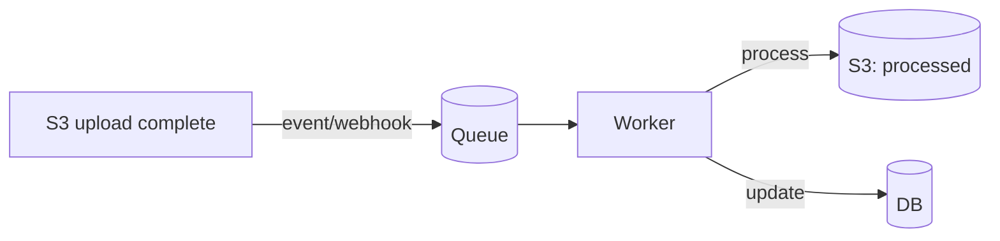

# File & media handling: uploads, processing, streaming

> **In one line:** Files (images, video, PDFs, user docs) need a different architecture than your DB rows — they're big, they're slow, they're best stored in object storage (S3 and friends), and the right pattern is "browser uploads directly to storage via a presigned URL while your server does the metadata work."

:::tip[In plain English]
A user uploads a 200MB video. The naive flow ("multipart POST to your server, save to disk, then upload to S3") bottlenecks at your server, fails on 30s timeouts, blocks other requests, and costs you ingress bandwidth. The right flow: your server mints a one-shot presigned URL; the browser uploads directly to S3; your server gets notified when it's done. Then a worker processes the file (transcode, thumbnail, extract text, virus-scan) and updates your DB with the result. This page is the patterns.
:::

This is one of those domains where doing it right saves a 10× operational headache later — and doing it wrong is a security incident waiting to happen.

## Where files actually live

You almost never want to store files in your database, on your app server's disk, or in your repo.

| Storage | When |
|---------|------|
| **Object storage** (S3, R2, GCS, Azure Blob) | Default for everything: user uploads, generated artifacts, static assets at scale |
| **CDN** in front of object storage | When users *download* the file frequently — caches at edges |
| **Database** | Tiny files (avatars < 50KB sometimes); usually a mistake otherwise — blob columns slow your DB |
| **App server's disk** | Almost never — ephemeral in containerized deploys |
| **Block storage / volumes** | Self-managed databases, log files, scratch space |
| **Specialty** | Postgres `bytea` for cryptographic blobs; HDF5 / Parquet for analytical data |

The 2026 default: **S3 (or compatible: R2, B2, GCS) for storage; a CDN for delivery; your DB stores the URL/key + metadata.**

## Object storage 101

Object storage is a key-value store optimized for large blobs.

```
Bucket: example-uploads
  Key: users/42/avatar.jpg     → 156KB JPEG
  Key: users/42/resume.pdf     → 2.3MB PDF
  Key: orders/8312/invoice.pdf → 45KB PDF
```

Properties:

- **Flat namespace** — slashes in keys are just characters; there are no real "directories."
- **Eventually consistent on overwrites** (S3 became strongly consistent on PUT in 2020; older systems may not be).
- **Cheap storage** ($0.02/GB/month typical); pay for requests and egress.
- **HTTP-native API** — `PUT`, `GET`, `DELETE`.
- **Lifecycle policies** — auto-delete after N days, move to cold storage, etc.
- **Versioning** — keep prior versions of overwritten objects (useful for "oops" recovery).

Provider notes (2026):

| Provider | Strengths |
|----------|-----------|
| **AWS S3** | The default. Most features. Highest egress cost. |
| **Cloudflare R2** | S3-compatible API; **zero egress fees** — huge for high-bandwidth apps. |
| **Backblaze B2** | S3-compatible; cheapest storage + very cheap egress; smaller ecosystem. |
| **Google Cloud Storage** | Similar to S3; tight GCP integration. |
| **Wasabi** | S3-compatible; flat-rate pricing. |
| **MinIO** (self-hosted) | When you must run your own; on-prem, edge devices. |

For most apps: S3 if you're on AWS, R2 otherwise. R2's no-egress-fee model is genuinely category-changing for media-heavy apps.

## The right way to do uploads: presigned URLs

The naive way: browser POSTs the file to your server, server forwards to S3.

```
Browser → multipart POST → Your server → upload → S3
```

Problems:
- Doubles bandwidth (you pay ingress to your server *and* the storage provider's ingress).
- Slow large files block your request handler for minutes.
- 30-second timeouts at many proxies (Vercel: 30s, Cloudflare default: 100s) — large files fail.
- Memory pressure if you buffer in app code.
- Doesn't scale across servers.

The right way: **presigned URLs.**

```
Step 1: Browser → POST /api/upload-url → Your server
Step 2: Your server → S3 (with your credentials) → presigned PUT URL
Step 3: Your server → Browser → { url: ..., key: ... }
Step 4: Browser → PUT directly to S3 → uploaded
Step 5: Browser → POST /api/upload-complete → Your server (notify)
        (or use S3 event notifications — server-side notification)
Step 6: Your server stores key in DB, kicks off processing
```

The server's involvement is brief — it just mints a one-shot URL that authorizes the upload. The browser does the heavy lifting straight to S3. Your bandwidth stays untouched.

### Code: minting a presigned URL

```typescript
import { S3Client } from '@aws-sdk/client-s3';
import { createPresignedPost } from '@aws-sdk/s3-presigned-post';

const s3 = new S3Client({ region: 'us-east-1' });

export async function POST(req: Request) {
  const { contentType, sizeBytes } = await req.json();
  const userId = await requireUser(req);
  const key = `uploads/${userId}/${crypto.randomUUID()}`;

  const { url, fields } = await createPresignedPost(s3, {
    Bucket: 'example-uploads',
    Key: key,
    Conditions: [
      ['content-length-range', 0, 50 * 1024 * 1024],   // max 50MB
      ['eq', '$Content-Type', contentType],            // pin to specific type
    ],
    Expires: 60,  // URL valid 60s
  });

  return Response.json({ url, fields, key });
}
```

```typescript
// Browser
async function upload(file: File) {
  const { url, fields, key } = await fetch('/api/upload-url', {
    method: 'POST',
    body: JSON.stringify({ contentType: file.type, sizeBytes: file.size }),
  }).then(r => r.json());

  const formData = new FormData();
  Object.entries(fields).forEach(([k, v]) => formData.append(k, v));
  formData.append('file', file);

  const res = await fetch(url, { method: 'POST', body: formData });
  if (!res.ok) throw new Error('upload failed');

  await fetch('/api/upload-complete', {
    method: 'POST',
    body: JSON.stringify({ key }),
  });
}
```

The presigned URL embeds the constraints (max size, content type, expiry). S3 enforces them on upload — the browser can't sneak in a 5GB file.

## Large file uploads: multipart and resumable

For files over ~100MB, a single PUT is risky — connection drops mean retry the whole thing.

**Multipart upload**: split the file into chunks (typically 5-100MB each), upload each chunk in parallel, then call "complete" to assemble. Each chunk can retry independently. Built into S3 and presignable.

**Resumable upload** (Google Cloud Storage native, S3 via tus protocol or library): if the upload is interrupted, resume from where it stopped.

Libraries:
- **Uppy** — comprehensive client, handles multipart, resumable, S3, tus. The 2026 default for serious upload UI.
- **filepond** — lightweight, plugin-based.
- **react-dropzone** — minimal, drag-and-drop only.

For "user uploads anything large," Uppy + S3 multipart is the standard combo.

## Processing pipeline

After upload, you usually want to:

- Validate (correct type? not corrupted?)
- Virus-scan (untrusted user input!)
- Generate thumbnails (images)
- Transcode (video: HLS, multiple resolutions)
- Extract text (PDFs, documents — for search)
- OCR (scanned documents)
- Compute checksums, dimensions, EXIF metadata
- Strip EXIF (privacy — GPS coords in photos)

This must be **async** and on a **worker**, not your request handler. The pattern:



S3 supports event notifications natively — on `s3:ObjectCreated:*`, it can publish to SQS, SNS, EventBridge, or invoke a Lambda. That gives you "file uploaded → kick off processing" for free.

Alternative: your `/api/upload-complete` endpoint enqueues a job.

## Images

The most common processed media. The 2026 stack:

### Storage and delivery

- **Original** in S3, never modified (you might want it for re-processing later).
- **Derivatives** (thumbnail, 800px, 1600px, WebP, AVIF) generated on demand or precomputed.
- **Served via CDN** that does on-the-fly transformations: Cloudflare Images, Vercel/Next Image Optimization, Imgix, Cloudinary, ImageKit.

The "on-the-fly transformations" approach is brilliant: you upload one original; the CDN serves any size, format, quality on the fly with edge caching. Saves you from generating and storing dozens of derivatives.

### Generation libraries

If you process server-side:
- **`sharp`** (Node) — the standard, built on libvips. Fast, low-memory.
- **ImageMagick** — older, heavier, vulnerable history.
- **`Pillow`** (Python).
- **`vips-jvm`** (Java/Kotlin).

```typescript
import sharp from 'sharp';

const buffer = await fetchFromS3(key);
const thumb = await sharp(buffer)
  .resize(400, 400, { fit: 'cover' })
  .webp({ quality: 80 })
  .toBuffer();
await uploadToS3(`${key}.thumb.webp`, thumb);
```

### Modern formats

- **WebP** — broad support, 25-35% smaller than JPEG at same quality.
- **AVIF** — 50% smaller than JPEG, slightly worse browser support but good in 2026.
- **JPEG XL** — even better; nascent browser support.

Serve via `<picture>` with multiple `<source>` for graceful degradation, or use a transforming CDN that picks based on `Accept` headers.

## Video

Hardest media class. Three concerns: storage, transcoding, delivery.

### The lifecycle

1. **Upload** original — could be 4K, 100s of MB or GBs.
2. **Transcode** into multiple resolutions + bitrates (1080p, 720p, 480p, 360p).
3. **Package** for adaptive streaming (HLS or DASH) — break each resolution into chunks + a manifest.
4. **Store** the chunks + manifest in object storage.
5. **Serve** via CDN; players (HLS.js, Video.js, native iOS Safari) request the manifest, switch bitrates based on bandwidth.

### Tools

- **FFmpeg** — the universal video tool. Run on workers (avoid main thread).
- **AWS MediaConvert / Elastic Transcoder** — managed transcoding.
- **Mux** — video-as-a-service. Upload, get URLs back, player included. The "Stripe of video."
- **Cloudflare Stream** — similar, integrated with CF infra.
- **Bunny.net Stream** — cheaper alternative.

For most apps building "users can upload video," **Mux or Cloudflare Stream** is the right answer. Rolling your own transcoding pipeline is months of work and ongoing cost.

### Live streaming

A different beast — see WebRTC ([WebRTC page](./webrtc)) for sub-second realtime, HLS/DASH for higher-latency broadcast. Most products use a service (Mux, Agora, LiveKit).

## PDFs

Web's awkward middle child. Common needs:

- **Generate** — `pdfkit`, `puppeteer` (HTML → PDF), `react-pdf`, server-side React Email-style.
- **Render in browser** — PDF.js (Mozilla; the default).
- **Extract text** — `pdf-parse`, `pdfminer.six` (Python), `pdftotext`.
- **Sign / fill forms** — pdfkit + extensions, Adobe APIs, DocSign / HelloSign for legal-grade.
- **OCR scanned PDFs** — Tesseract, AWS Textract, Google Document AI.

For high-volume PDF generation (invoices, reports): pre-render via Puppeteer on a worker, store in S3, serve.

## Security pitfalls

Files are a top vulnerability surface. Watch for:

### File type validation

Don't trust the filename or `Content-Type` header — both come from the client.

```typescript
import { fileTypeFromBuffer } from 'file-type';

const result = await fileTypeFromBuffer(buffer);
if (!['jpg', 'png', 'webp'].includes(result?.ext)) {
  throw new Error('unsupported file type');
}
```

`file-type` reads the file's magic bytes. Don't trust extension or MIME header — attackers rename `.exe` to `.png` happily.

### Path traversal

If your code uses a filename in a filesystem path:

```typescript
// ❌
const path = `/uploads/${req.body.filename}`;
fs.readFile(path);
```

`req.body.filename = "../../../etc/passwd"` reads anything on the server. Use a UUID for the on-disk name (or S3 key), store the original filename separately if you need to display it.

### Storing in a web-accessible directory

Files in `/public/uploads/` are served as-is. An attacker uploads `bad.html` → it's now hosted on your domain → XSS, phishing, brand abuse.

Defenses:
- Store outside the web root (or in S3).
- Serve via a controlled handler that sets `Content-Disposition: attachment` (download, don't render).
- Sandbox HTML on a separate domain (`user-content.example.com`) so cookies don't leak.

### Malware / viruses

User uploads = untrusted code. Scan everything with ClamAV (free), AWS GuardDuty Malware Protection, or a third-party (VirusTotal API, MetaDefender). Run before delivering the file to other users.

### Image-based exploits

Even images can be malicious — heap overflows in old libraries, polyglot files. Defenses:
- Use up-to-date libraries (`sharp`, not ImageMagick — has long CVE history).
- **Re-encode every upload.** Decode and re-encode strips embedded payloads (the bytes you save are not the bytes uploaded).
- Run image processing in a sandbox (separate container, restricted capabilities).

### Storage cost attacks

A user uploads 1000 × 100MB files; your storage bill spikes.

- **Per-user storage quotas.** Track total bytes per user; enforce a cap.
- **Per-upload size limits.** Enforce at the presigned URL level.
- **Lifecycle policies.** Auto-delete temp uploads after N days; delete cold data.

### CDN cache poisoning

Serving user content with `Cache-Control: public` lets one user's file appear under another's URL if your routing has a bug. Use per-user / per-file URL structures and treat user-uploaded content cache carefully.

## Access control

Two patterns for "only logged-in users can see this file":

### Signed URLs

Generate a time-limited URL when the user requests; URL expires in N minutes.

```typescript
import { getSignedUrl } from '@aws-sdk/s3-request-presigner';
import { GetObjectCommand } from '@aws-sdk/client-s3';

const url = await getSignedUrl(s3, new GetObjectCommand({
  Bucket: 'example-uploads',
  Key: 'users/42/private.pdf',
}), { expiresIn: 300 });
return Response.json({ url });
```

User clicks; downloads directly from S3. URL expires quickly. Simple and scalable.

### Authenticated proxy

```
Browser → GET /api/files/private.pdf (auth required) → Your server → fetch from S3 → stream to browser
```

Adds latency and cost (you pay egress) but lets you log access, do per-request authorization, and serve via your domain.

For most use cases: signed URLs. For audit-heavy compliance contexts: proxy.

## Common mistakes

:::caution[Where people commonly trip up]
- **Uploading through your server.** Browser → your server → S3 doubles bandwidth and blocks your request handlers. Use presigned URLs; let the browser go direct.
- **No size or type limits in the presigned URL.** Without `content-length-range` and `Content-Type` conditions, a user can upload 5GB of anything. Always pin both.
- **Trusting MIME type from the client.** `application/pdf` says nothing about file contents. Use `file-type` or equivalent to read magic bytes.
- **Storing files in your DB.** A blob column kills query performance, balloons backups, makes replication slow. Store the S3 key in the DB; the file in S3.
- **Storing original filenames in S3 keys.** Two users with `report.pdf` collide. Use UUIDs (or content hashes); store original filename in DB.
- **Public bucket for "convenience."** All your users' uploads listed online. Default S3 buckets to private; serve via signed URLs.
- **No virus scanning.** A user uploads malware; you serve it to another user. Scan before serving.
- **No quotas.** One user uploads 100GB; storage bill spikes. Per-user byte caps; enforce on upload.
- **Generating thumbnails synchronously in the request handler.** A user uploads a 4K image; your handler hangs 30s; other requests starve. Async on a worker.
- **Trusting EXIF for "original" date / location.** EXIF can be stripped, faked, or wrong. Don't use for forensic purposes.
- **Not stripping EXIF on user upload.** GPS coordinates leak. Re-encode and strip metadata for public images.
- **No CDN for downloads.** Every download hits S3 directly, no caching. CloudFront / Cloudflare in front of S3 is a one-time setup.
- **Serving user-uploaded HTML from your main domain.** Stored XSS. Serve from `user-content.example.com` or force `Content-Disposition: attachment`.
- **Rolling your own video transcoder.** Months of FFmpeg ops you don't want. Use Mux / Cloudflare Stream / Bunny.
- **No cleanup for failed multipart uploads.** S3 multipart uploads that don't complete leave invisible parts charging storage. Set a lifecycle rule to abort multipart > 7 days old.
:::

## Page checkpoint

<Quiz id="foundations-files-and-media-page" title="Did file & media handling stick?" sampleSize={3}>

<Question
  prompt="Why is the 'browser POSTs file to your server, server forwards to S3' pattern usually wrong?"
  options={[
    { text: "S3 doesn't accept files from servers" },
    { text: "Double bandwidth (you pay ingress to both your server and the storage provider), your request handler blocks on the slow upload, proxies/edge functions have 30s timeouts that kill large uploads, and it doesn't scale. Mint presigned URLs; browser uploads to S3 directly" },
    { text: "Browsers can't upload to S3" },
    { text: "It's a CORS issue" }
  ]}
  correct={1}
  explanation="Presigned URLs let the browser upload directly to S3 with constraints baked into the URL (max size, content type, expiry). Your server is just the authorizer, not the data path."
  revisit={{ to: "/docs/foundations/files-and-media#the-right-way-to-do-uploads-presigned-urls", label: "Presigned URLs" }}
/>

<Question
  prompt="A team accepts user-uploaded files and uses `req.body.filename` to construct a file path. An attacker uploads with filename `../../../etc/passwd`. What's the class of bug?"
  options={[
    { text: "XSS" },
    { text: "Path traversal — the attacker controls part of a filesystem path, escapes the intended directory, reads (or writes) anywhere the process has access. Defense: generate UUIDs (or content hashes) for on-disk names; never use user input in a path" },
    { text: "CSRF" },
    { text: "SQL injection" }
  ]}
  correct={1}
  explanation="Any user input flowing into a filesystem path is path-traversal territory. Use server-generated UUIDs for storage keys; store the original filename in a separate column if you need to show it back to the user."
  revisit={{ to: "/docs/foundations/files-and-media#path-traversal", label: "Path traversal" }}
/>

<Question
  prompt="A team uses the `Content-Type` header from the browser to validate uploads. An attacker uploads a malicious PHP file claiming `Content-Type: image/png`. What's wrong?"
  options={[
    { text: "The header should be lowercase" },
    { text: "Headers come from the (untrusted) client and can claim anything. Validate by reading the file's magic bytes (libraries like `file-type` for Node) — those are what actually determine the format. Filename extensions are equally untrustworthy" },
    { text: "PHP files are allowed by default" },
    { text: "PNG is not a real format" }
  ]}
  correct={1}
  explanation="MIME type from the client is just a string. Server-side detection via magic bytes is the real check. And even after detection, decide based on what file types you *allow*, not what types you *exclude*."
  revisit={{ to: "/docs/foundations/files-and-media#file-type-validation", label: "File type validation" }}
/>

<Question
  prompt="A team's CMS lets users upload images. Engineers manually generate thumbnails by running `sharp` in the request handler. Pages serving uploads are slow during high-traffic moments. What's the right fix?"
  options={[
    { text: "Use a bigger server" },
    { text: "Move processing to async — on upload, enqueue a job; a worker generates thumbnails / variants and updates the DB when done. Original served unchanged in the meantime; UI shows 'processing' until variants are ready. Either that or use an on-the-fly CDN (Cloudflare Images, Vercel Image, Imgix) that transforms at the edge with caching" },
    { text: "Switch from sharp to ImageMagick" },
    { text: "Disable thumbnails" }
  ]}
  correct={1}
  explanation="Synchronous heavy processing in request handlers blocks other requests. Either do it async on a worker, or use a transforming CDN that handles variants on the edge. Both scale; in-process sharp on the request thread doesn't."
  revisit={{ to: "/docs/foundations/files-and-media#processing-pipeline", label: "Async processing" }}
/>

</Quiz>

## What's next

→ Continue to [Realtime collaboration / CRDTs](./crdts).
