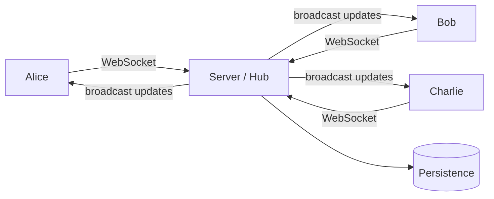

# Realtime collaboration & CRDTs: the Google-Docs problem

> **In one line:** Realtime collaboration is the problem of "multiple people editing the same document at the same time, with low latency, no conflicts, and graceful handling of offline edits" — and the modern solution is **CRDTs** (conflict-free replicated data types), shipped via libraries like Yjs that make the algorithmic complexity invisible to your app code.

:::tip[In plain English]
Two people typing in the same Google Doc. Both see each other's cursors. Both add words simultaneously. Neither sees a "conflict" dialog. Both end up with the same document. The thing that makes this possible isn't a clever server — it's a math result: certain data structures (CRDTs) can be merged in any order and always produce the same result. Yjs is a JS library implementing those structures. Liveblocks, Partykit, Tiptap Sync, and Replicache are products built on top. You ship "collaborative editing" with surprisingly little code.
:::

This page is the working architecture. Anyone building a doc, whiteboard, planning tool, or any "multi-user state" feature is operating in CRDT territory, whether they know it or not.

## The naive approach (and why it breaks)

```
Alice types "Hello" at position 5
  → server saves doc, broadcasts to Bob
Bob types "World" at position 5  (same time, doesn't know about Alice yet)
  → server tries to apply at position 5
  → position 5 now points to something different
  → either Alice's edit wins (Bob's lost) or vice versa
```

Two simultaneous edits, one lost. Naive last-write-wins gives users the wrong answer. **Locks** (only one editor at a time) solve correctness but ruin UX — everyone hates "this doc is locked by Alice."

You need a model where two concurrent edits *both* take effect, in a way both sides agree on.

## Two families: OT and CRDT

### Operational Transformation (OT)

The original (Google Wave / Docs) approach. Edits are operations; when two operations conflict, you **transform** one against the other so they apply to the right positions.

```
Alice: insert "Hello" at position 5
Bob:   insert "World" at position 5  (concurrently)

Server receives Alice first, applies it.
Bob's op arrives — server transforms:
  "insert 'World' at position 5" → "insert 'World' at position 10"
  (shifted because Alice inserted 5 chars before it)

Final state: "...Hello World..." — both edits preserved.
```

OT requires a central server to enforce a total order of operations (otherwise two clients disagree on the transform). Works great when you control the server; harder for offline-first or P2P.

Used by: Google Docs, Etherpad, Quill (with their `quill-cursors` for OT).

### CRDTs

A more recent (and now dominant) approach. Operations carry enough metadata that they can be applied **in any order** and arrive at the same final state — no transformation needed.

The trick: each character (or unit of data) gets a unique, comparable identifier that survives reordering. Then "insert X between A and B" is unambiguous regardless of what other inserts happen.

Example (simplified):

```
Initial doc:           [A] - [B]
Alice inserts X here:  [A] - [Alice@10:X] - [B]
Bob inserts Y here:    [A] - [Bob@11:Y] - [B]    (concurrently)

Server (or peers) merge:
[A] - [Alice@10:X] - [Bob@11:Y] - [B]    (sorted by timestamp+actorId tiebreaker)

Both sides converge on this result regardless of which arrived first.
```

CRDTs *are*: a data structure design where the merge operation is **commutative**, **associative**, and **idempotent** — apply edits in any order, any number of times, end up at the same state.

Used by: Notion, Linear, Figma (vector data), Yjs-powered apps, Automerge-powered apps, Atom Teletype.

### Which to pick

In 2026, **CRDTs have won** for new builds because:

- No central authority required (works offline, P2P, distributed).
- Easier to reason about — merge is mathematical, not procedural.
- Mature libraries (Yjs, Automerge) handle most data structures.
- Smaller code than rolling your own OT.

OT still makes sense if you're integrating with an existing OT-based system (Google Docs) or have very specific constraints.

## The 2026 toolkit

### Yjs

The CRDT library that took over. It implements:

- `Y.Text` — collaborative string (rich text via embedded format markers).
- `Y.Array` — collaborative ordered list.
- `Y.Map` — collaborative object/dict.
- `Y.XmlFragment` — for ProseMirror / Tiptap integrations.
- Nested structures freely.

```typescript
import * as Y from 'yjs';

const doc = new Y.Doc();
const text = doc.getText('content');

text.insert(0, 'Hello, world!');

// Listen for changes
doc.on('update', (update, origin) => {
  // 'update' is a binary diff you broadcast to peers
});

// Apply remote update
Y.applyUpdate(doc, remoteUpdate);
```

Yjs handles all the merge logic. Your app code just works with `Y.Text`, `Y.Map`, etc.

### Transport

Yjs gives you binary updates; you need to ship them between peers. Options:

- **`y-websocket`** — simple WebSocket server (free, self-host).
- **`y-webrtc`** — peer-to-peer via WebRTC (no server, scales weirdly).
- **`y-redis`** — Redis as the broker.
- **Liveblocks** — hosted Yjs-compatible service. Easiest path; pricing scales.
- **Partykit** — Cloudflare Durable Objects-based, Yjs support.
- **Hocuspocus** — open-source server (Yjs ecosystem).
- **Tiptap Sync** — hosted, integrates with Tiptap editor.

For a starter app: y-websocket on a small server (Cloudflare Workers + Durable Objects, Fly, Render). For "I don't want to operate this": Liveblocks or Tiptap Sync.

### Persistence

CRDTs only solve real-time merge. You still need to *save* the document somewhere.

```typescript
// Persist Yjs doc state to your DB on every update (or debounced)
doc.on('update', async (update) => {
  await db.documents.appendUpdate({
    docId, update: Buffer.from(update),
  });
});

// On load, replay updates to reconstruct doc
const updates = await db.documents.findUpdates({ docId });
const doc = new Y.Doc();
for (const u of updates) Y.applyUpdate(doc, u);
```

For long-running docs, periodically *compact* — replace many small updates with one full snapshot — to keep load time fast. Yjs has `Y.encodeStateAsUpdate(doc)` for this.

### Awareness / presence

"Who's online, where are their cursors, what's their name/color." Yjs has a separate `Awareness` API for this — ephemeral state that doesn't persist, just propagates to other connected users.

```typescript
import { Awareness } from 'y-protocols/awareness';

const awareness = new Awareness(doc);
awareness.setLocalStateField('user', {
  name: 'Alice',
  color: '#f06',
  cursor: { line: 3, column: 12 },
});

awareness.on('change', () => {
  // Get all connected users
  const users = Array.from(awareness.getStates().values());
});
```

Awareness data isn't merged with the document — it's transient. Lost if the user closes the tab; no need to persist.

## Architecture patterns

### Centralized (hub-and-spoke)



The default. Server accepts updates, persists, broadcasts to other connected clients. Liveblocks, Partykit, Tiptap Sync, and self-hosted y-websocket all use this.

Pros: simple, audit logs, central permissions, easy persistence.
Cons: scales per-document (one server holds a document's connections).

### Peer-to-peer (WebRTC mesh)

`y-webrtc` connects peers directly. No server (except for signaling). Updates flow peer-to-peer.

Pros: no per-doc server cost; works locally on LAN.
Cons: persistence is awkward (which peer saves?); scales badly past ~10 peers; firewalls/NATs.

Rarely used in production; cute for demos.

### Hybrid (Local-first + sync)

**Local-first** apps (the Ink & Switch philosophy) store the doc locally, sync to peers when online. CRDTs make this work seamlessly — offline edits merge cleanly when you reconnect.

Tools: Automerge, Yjs (with IndexedDB persistence), Replicache (CRDT-adjacent), Triplit.

Best for: tools that need to work offline (mobile apps, field-work apps, productivity tools).

## Integrating with rich-text editors

If your document is more than plain text — formatting, lists, headings, embedded media — you need a rich-text editor that integrates with CRDTs.

| Editor | CRDT support |
|--------|--------------|
| **Tiptap** | First-class Yjs integration (via `y-prosemirror`); the 2026 default |
| **ProseMirror** | The underlying engine; works with Yjs |
| **Slate** | OT-style baseline; CRDT support via plugins |
| **Lexical** (Meta) | Built-in collab via Yjs |
| **Quill** | OT-first, less common for new builds |
| **Plate** | Slate-based, modern |
| **CodeMirror 6** | First-class Yjs for code/text |
| **Monaco** | VS Code's editor; can wire to Yjs |

For most "Notion-like" features: **Tiptap + Yjs + Liveblocks (or self-hosted)** is the standard.

## Permissions and access control

CRDTs solve merge, not auth. You still:

- Authenticate the user (cookie / JWT).
- Authorize per-document ("can Alice edit this?").
- Enforce permissions at the *server* — don't trust the client to drop edits.

Implementation:
- Server validates updates before broadcasting. Reject if user lacks permission.
- For read-only viewers: server can broadcast updates to them but reject any updates they try to send.
- For multi-permission (read, comment, edit, admin): per-update server validation.

This is the part Yjs alone doesn't give you — it's why services like Liveblocks have permissions baked in.

## Common pitfalls

### Schema migration on a CRDT

You decided `comment` was a `Y.Text`. Six months later you want it to be a `Y.Array<Y.Map>` so it can have replies. Existing docs all have the old shape.

Migration approaches:
- **Co-existing fields** — add `commentV2` alongside `comment`; new edits go to V2; reads union both.
- **Migration job** — for each doc, run a transform that converts old structure to new (in a single Yjs transaction).
- **Versioned docs** — `doc.getMap('v1')` vs `doc.getMap('v2')`.

CRDT schema migration is harder than DB schema migration. Plan your structure carefully up front.

### Document size growing forever

Every update adds to the history. After 100k edits on a long-lived doc, load time tanks.

Fix: **compaction** — periodically replace the history with a single snapshot. Yjs:

```typescript
const snapshot = Y.encodeStateAsUpdate(doc);
// store snapshot, archive raw history
```

Tradeoff: lose granular history. For doc-style apps, often acceptable; for "I need full audit log forever," keep an append-only event log alongside.

### Garbage collection on deletes

In Yjs, deleted characters aren't actually removed from the data structure — they're marked as deleted (tombstones). This is required for correct merging (an offline peer's edit might reference a "deleted" character).

Yjs has a GC option that removes tombstones once you're sure no offline peer holds them. Trades correctness in extreme offline cases for size.

### Cursor positions across edits

User A's cursor at position 50. User B inserts 20 characters at position 10. A's cursor should now be at position 70 (followed the text).

`y-protocols` and editor integrations handle this via **relative positions** — instead of "position 50," store "after this specific character." When the doc changes, the cursor's absolute position is recomputed.

### Offline conflicts on intent, not text

Two users offline. Alice changes a doc title from "Draft" to "Final v1". Bob changes it to "Final v2". Both come online.

CRDT merge gives you... "Final v1" or "Final v2" depending on character-level tiebreakers, possibly a mangled hybrid. Neither user's intent (a coherent title) survives.

CRDTs guarantee *convergence*, not *intent preservation*. For high-conflict fields (titles, settings, single-value fields), consider:

- **Multi-value registers** (MV-Register CRDT) — preserve both values; UI shows conflict.
- **Last-Writer-Wins with timestamps + UX nudge** — accept that one user's edit may "lose" with a notification.
- **Locks for inherently-single-value fields**.

CRDTs are great for collaborative text; less great for "shared boolean settings." Mix patterns.

## When you don't need CRDTs

- **Single-user editing.** Just save to your DB.
- **One-at-a-time editing with locks** (admin tools, settings forms).
- **"Eventually consistent" UI that doesn't need real-time merge** (most CRUD apps).
- **Read-heavy with occasional writes** — last-write-wins is fine.

CRDTs are the right answer for "two or more users actively editing the same blob simultaneously." For "two users with their own data occasionally syncing," ordinary databases work fine.

## Common mistakes

:::caution[Where people commonly trip up]
- **Rolling your own merge logic.** "I'll just diff and patch on save." Six months later, your users report missing edits. Use a battle-tested CRDT library; merge logic is famously hard.
- **Trusting the client to enforce permissions.** A read-only user sends an update; client doesn't filter; server broadcasts to others; the "read-only" was cosmetic. Validate on server.
- **Forever-growing doc state.** Updates pile up; load time degrades. Compact periodically.
- **No offline support but using CRDTs anyway.** CRDTs add complexity; you don't need them for "online, multi-user, persistent server." Old-fashioned WebSocket + LWW works.
- **Mixing edits to the same CRDT field from server-side and client-side without coordination.** Server "auto-corrects" the doc while users edit; you get strange conflicts. Pick a lane — either the server does background mutations as another peer (it joins the collab session), or the doc is purely user-driven.
- **Naive cursor positions.** Storing "cursor at offset 50"; another user inserts 100 chars before; cursor still says 50, now points at the wrong place. Use relative positions (from your editor's API or `y-protocols`).
- **No backup of the document.** All your eggs in one CRDT basket; if it gets corrupted or your library has a bug, you lose data. Periodically dump a plain-text snapshot to S3 alongside the CRDT state.
- **Loading the entire history on every open.** Document opens slow as history grows. Snapshot + tail-of-recent-updates is faster than replaying everything from scratch.
- **Underestimating awareness traffic.** Cursor updates fire on every keystroke. With 100 connected users, that's a lot of WebSocket traffic. Throttle awareness updates (every 100ms is plenty for cursor movement).
- **No reconciliation on reconnect.** Client goes offline, edits locally, comes back. If your sync layer isn't handling "send my pending updates to the server" cleanly, edits are lost. Most libraries handle this; double-check yours does.
:::

## Page checkpoint

<Quiz id="foundations-crdts-page" title="Did CRDTs stick?" sampleSize={3}>

<Question
  prompt="Why are CRDTs (rather than naive last-write-wins) needed for collaborative editing?"
  options={[
    { text: "CRDTs compress data better" },
    { text: "Two concurrent edits at the same position both need to take effect — last-write-wins loses one user's work. CRDTs (and OT) merge concurrent operations so both edits are preserved and all clients converge on the same result regardless of arrival order" },
    { text: "CRDTs are faster than HTTP" },
    { text: "Browsers don't support naive saving" }
  ]}
  correct={1}
  explanation="The whole point is preserving both edits. LWW means whichever update lands second wins outright — one user's typing is silently dropped. CRDTs (or OT) merge correctly under concurrency."
  revisit={{ to: "/docs/foundations/crdts#the-naive-approach-and-why-it-breaks", label: "Why CRDTs/OT" }}
/>

<Question
  prompt="What's the practical difference between OT (Operational Transformation) and CRDT for collaborative editing?"
  options={[
    { text: "OT is open-source, CRDT is proprietary" },
    { text: "OT requires a central server to order operations and apply transforms; CRDT operations carry metadata letting them merge in any order without a central authority — better for offline-first and P2P scenarios. In 2026, CRDTs dominate new builds (libraries like Yjs make them practical)" },
    { text: "OT only works for text; CRDT works for any data type" },
    { text: "They produce different final results" }
  ]}
  correct={1}
  explanation="The architectural difference: OT depends on the server's order; CRDT operations are self-ordering. Both reach the same final state for well-formed operations. CRDT's order-independence makes it easier for offline-first apps and decentralized systems."
  revisit={{ to: "/docs/foundations/crdts#two-families-ot-and-crdt", label: "OT vs CRDT" }}
/>

<Question
  prompt="A team uses Yjs for a notes app and stores every update binary blob forever. Load time grows linearly with edit count. What's the fix?"
  options={[
    { text: "Switch to OT" },
    { text: "Periodically compact: collapse all the small updates into one snapshot via `Y.encodeStateAsUpdate(doc)`; store the snapshot, optionally archive raw history elsewhere. Future loads start from snapshot + only-recent updates" },
    { text: "Drop the oldest 90% of updates" },
    { text: "Compress with gzip" }
  ]}
  correct={1}
  explanation="CRDT documents are append-only by default. Compaction (snapshot the current state, drop or archive the history) keeps load time bounded. Lose granular history; gain performance."
  revisit={{ to: "/docs/foundations/crdts#document-size-growing-forever", label: "Compaction" }}
/>

<Question
  prompt="Two users offline. Alice renames a doc to 'Final v1'. Bob renames it to 'Final v2'. They reconnect. CRDT merge result?"
  options={[
    { text: "CRDT picks the longer title" },
    { text: "Depending on character-level tiebreakers, you get 'Final v1' or 'Final v2' (or rarely a mangled hybrid). CRDTs guarantee convergence, not intent preservation. For inherently-single-value fields (titles, settings), pair with UX (show conflict + let user pick) or accept LWW with a notification" },
    { text: "Both titles are kept side-by-side" },
    { text: "An error is shown" }
  ]}
  correct={1}
  explanation="CRDTs merge text correctly; they can't preserve *intent* for fields that semantically must have one value. For titles, settings, single-value config, design the UX to surface the conflict — don't pretend the merge is correct."
  revisit={{ to: "/docs/foundations/crdts#offline-conflicts-on-intent-not-text", label: "Convergence vs intent" }}
/>

</Quiz>

## What's next

→ Continue to [Edge computing](./edge-computing).
