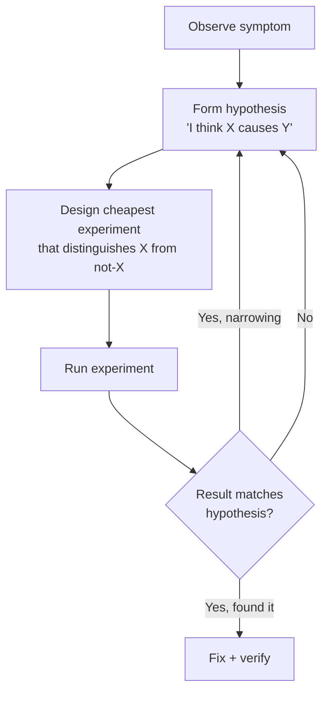

# Debugging methodology: how to be good at finding bugs

> **In one line:** Debugging is *the* skill that separates senior from junior engineers — and it's a learnable methodology, not a personality trait: form hypotheses, test them with the cheapest possible experiment, change *one thing at a time*, and never act on a guess when you can measure.

:::tip[In plain English]
The slowest debuggers are the ones who poke at random — change a thing, see if it works, change another. The fastest are scientists: they form a hypothesis ("I think the issue is X"), design an experiment that distinguishes X from not-X (a print statement, a binary search, a controlled test), run it, update the hypothesis, repeat. The technique is general; the discipline is "don't skip steps because you're sure."
:::

**This page is self-contained.** Read it top to bottom and you have the full methodology for debugging web apps — local dev, production, unfamiliar repos, and AI-drafted code. Links at the bottom are optional if you want interview practice or ops tooling in more depth.

This page is the meta-skill. The tools change (browser devtools, debuggers, log queries, traces); the method doesn't.

## The scientific debugging loop



The loop:

1. **Observe the symptom carefully.** What exactly is wrong? When does it happen? Who reports it?
2. **Form a hypothesis.** Don't skip this. "Something's broken" is not a hypothesis; "the timezone is being read from the server, not the user" is.
3. **Design an experiment.** The cheapest test that distinguishes "hypothesis true" from "hypothesis false." Often: print a value, run a single query, look at one log line.
4. **Run it.** Don't run five tests at once; you won't know which was the signal.
5. **Update.** Hypothesis confirmed → narrow further. Hypothesis disconfirmed → form a new one.

Most failed debugging is skipping step 2 (no hypothesis, just poking) or step 3 (changing many things at once, can't tell what worked). Random edits without a theory is what engineers call **shotgun debugging** — and it's the habit interviewers and teammates penalize first.

:::info[Industry jargon — what you'll hear in standup and Slack]
Plain English on the left; what practitioners actually say on the right. Same concepts — learn both so code review comments and incident channels make sense.

| In plain English | What engineers call it |
|---|---|
| Make the bug happen on command | **Get a repro** (short for *reproduction*); **minimal repro** when you've stripped it to the smallest case |
| "I think X causes Y" before you edit | **Hypothesis-driven debugging**; narrating it out loud is **thinking in public** |
| Change five things and hope | **Shotgun debugging** (also **random tweaking**) |
| Change one thing, observe, repeat | **Scientific debugging**; Agans' book calls it **divide and conquer** |
| Cut the search space in half | **Bisect** / **binary search the problem**; on commits: **`git bisect`** |
| "It worked yesterday" | A **regression** — something that *regressed* (got worse); hunt the **regression range** |
| What actually broke vs. what users see | **Root cause** vs. **symptom**; postmortems ask for **RCA** (*root cause analysis*) |
| Test that fails before your fix, passes after | **Regression test** (sometimes **lock test** or **guard test**) |
| Error printout with file + line chain | **Stack trace** (Python: **traceback**); "read the **stack**" |
| Pause and inspect variables | **Breakpoint** — "throw a **break** on line 42" |
| `console.log` to see state | **Printf debugging** or **logging** (adding **instrumentation**) |
| Bug vanishes when you add logs | **Heisenbug** (observer effect) |
| Test passes 9/10 times for no code change | **Flaky** test — "that's a **flake**"; fix or **quarantine** it |
| Production logs/metrics/traces | **Observability** — "check **o11y**"; one request's trail is a **trace** |
| Roll back before you understand | **Stop the bleeding** — **mitigate** first, **root-cause** second |
| Explain the bug to a rubber duck | **Rubber-duck debugging** |
| AI code that looks right but isn't | **Confidently wrong** output — **hallucinated API** when it invents a method |
:::

## The most important question: what changed?

Most bugs that appear in production were introduced by a change. Before forming exotic hypotheses, ask:

- **What was the last deploy?** Diff it.
- **What infrastructure changed today?** DNS, certs, load balancer config?
- **What 3rd-party changed?** Provider outages, API updates, model updates.
- **What config changed?** Feature flags, env vars, secrets.
- **What data changed?** New customer, larger scale, edge-case input.
- **What environment changed?** Browser update, mobile OS update, library bump.

Status pages first. Git log second. The bug *almost certainly* correlates with something that moved. In incident chat you'll hear **"what's the diff?"**, **"last known good"** (the last version that worked — **LKG**), or **"correlate with deploy"**.

For "this worked yesterday and broke today" — start with the deploy. For "this never worked" — start with the assumption that broke first.

## The bisection technique

When you have a wide search space, **bisect** (engineers also say **binary search** or **divide and conquer**).

### Git bisect

A bug appeared between v1.5 and v1.6. There are 80 commits. Which one?

```bash
git bisect start
git bisect bad v1.6      # known broken
git bisect good v1.5     # known good
# Git checks out the middle commit
# You test: bad or good?
git bisect bad           # (or good)
# Git narrows; ~log2(80) ≈ 7 tests to find it
```

`git bisect run <test_script>` automates if you have a reliable repro.

### Code bisection

A long function fails partway. Add a print at the midpoint:

```typescript
function process(data) {
  step1(data);
  step2(data);
  console.log('PAST step2', data);
  step3(data);  // failure happens somewhere in here or after
  step4(data);
}
```

If the print fires, the bug is later than step 2. Halve again. ~7 splits find any single line in 100.

### Component bisection

A page is broken. Comment out half the components; does it work? Yes → bug in the commented half. No → bug in the rest. Recurse.

The key insight: **each test eliminates half the search space**. Linear search is slow; binary search is fast. Apply liberally.

## Reading stack traces

A stack trace is a free debugging clue. Read it top-down:

```
Error: Cannot read property 'name' of null
    at getUserName (app.ts:42:18)
    at renderHeader (Header.tsx:15:12)
    at processChild (react-dom.js:14523)
    ...
```

- **Top frame**: where the error was thrown. Look here first.
- **Your-code frames**: the path through *your* code that led here. (Skip framework internals — `react-dom.js`, `next-server.js`, etc.)
- **Bottom frames**: how the request entered. Useful for "why was this even called?"

The top frame tells you *what* broke. The path tells you *how* you got there. Both matter; both are right in front of you.

Sourcemaps in production: critical. A minified stack trace points at line 1 of `bundle.min.js`; useless. Configure your stack-trace handler (Sentry, etc.) to resolve sourcemaps so you see real file names.

## Instrumentation

When you don't have enough information, add some. Don't guess; *log*.

### Strategic prints

```typescript
function suspectFunction(input) {
  console.log('[DEBUG] suspectFunction input:', JSON.stringify(input));
  const intermediate = compute(input);
  console.log('[DEBUG] intermediate:', intermediate);
  const result = transform(intermediate);
  console.log('[DEBUG] result:', result);
  return result;
}
```

Useful prints:
- **Inputs to functions** you don't trust.
- **Outputs from external calls** (DB, API).
- **Branch decisions** ("entering branch A").
- **Timing** if perf is suspect (`console.time` / `console.timeEnd`).
- **State snapshots** at key transitions.

Bad prints:
- `console.log('here')` × 12, no context.
- `console.log(thing)` where `thing` is an object — `JSON.stringify` it so async logs don't show mutated state.
- Production logging without removal — turns into permanent log noise.

### Debugger / breakpoints

A real debugger beats prints for complex inspection. In VS Code:

- Set a breakpoint by clicking the gutter.
- Conditional breakpoints — "break only if `user.id === 42`."
- Logpoints — "print this expression every time, without pausing."

For Node: `node --inspect`, attach VS Code or Chrome DevTools.
For browser: built into devtools.
For Python: `pdb` / `ipdb` / `pudb`, or VS Code's debugger.
For Go: Delve.
For Rust: lldb/gdb via `cargo` integration.

Breakpoints aren't sexy. They're the fastest way to see what's actually happening in a complex flow.

### Tracing for distributed systems

When a request crosses services, traces are how you debug. **Observability** means instrumenting your app so you can see what happened in production — logs (text records of events), metrics (numbers over time, like error rate), and traces (one request's path across services). When a bug crosses an API call, find the trace ID in the logs and follow the spans. (Your ops chapter goes deeper on tooling; the debugging move is: don't guess which service failed — follow the trace.)

## Usual suspects: the bugs that show up again and again

Before exotic theories, match the symptom to a category. These recur in web apps, interview snippets, and AI-drafted code alike:

| Category | What it looks like | What to check |
|---|---|---|
| **Off-by-one** | Wrong count, missing first/last element, fence-post errors | Loop bounds: `<` vs `<=`, `range(1, n)` skipping index 0, `arr.length - 1` |
| **Type coercion** | `"10" < "9"` is true; string + number silently weird | Log `typeof` / use strict equality (`===`); explicit `parseInt` |
| **Null / undefined** | `Cannot read property 'x' of null` | Trace where the value became null — often one hop upstream |
| **Stale closure** | Callback sees an old variable (classic in React `useEffect`) | Log the captured value inside the callback |
| **Async ordering** | "Sometimes works" — race between two async calls | Who finishes first? Add `await`; log order of resolution |
| **Mutation aliasing** | "I copied it but the original changed too" | Did you mutate a shared object? Use spread / deep copy |
| **Silent error swallow** | Error vanishes; behavior is wrong with no message | Empty `catch {}` — log or rethrow first |
| **Wrong layer fix** | Patch at the symptom; bug returns | Follow data upstream: where did the bad value originate? (**symptom fix** vs **root-cause fix**) |

Match symptom → suspect → one cheap test. That is hypothesis-driven debugging in practice. In code review you'll hear **"classic off-by-one"**, **"stale closure"**, **"works on my machine"**, or **"swallowed exception"** — same categories, shorthand labels.

## Debugging in an unfamiliar codebase

Most real bugs live in code you did not write — a teammate's module, a dependency, or something AI drafted ten minutes ago. You do not read the whole repo; you **navigate by the failure**:

1. **Reproduce.** Run the failing test or minimal script. No repro = guessing.
2. **Let the error name the file.** The stack trace's top frame is your starting point.
3. **Search, don't scroll.** Grep the exact error message or a distinctive symbol (`rg -n "User not found"`). Engineers say **"grep for it"** or **"ripgrep the error string"** — same move.
4. **Follow the data upstream.** "Where did this wrong value come from?" — **trace the data flow** or **follow the call chain**.
5. **Check what changed.** `git log --oneline -- path/to/file` and **`git blame`** on the suspicious line ( **`blame`** = "who last touched this line and in which commit?").
6. **Fix at the right layer.** The crash may be in `render()` but the cause is bad data from `fetch()`. Fixing only the symptom is a **band-aid** or **symptom patch**; fixing the invariant is addressing **root cause**.
7. **Lock with a regression test.** Red before your change, green after — engineers call that **red-green** (borrowed from TDD).

This is the same loop as single-file debugging; the only addition is orientation tools (grep, git, stack trace) to shrink a large repo down to a small suspect surface fast.

## Bug taxonomy: what kind is this?

Different bugs respond to different techniques.

### Reproducible

You can trigger it on demand. Easy mode — bisect, breakpoint, print.

### Heisenbug — disappears when you look

The act of debugging (timing, logging) changes the behavior. Common causes:

- **Race conditions.** Adding a log slows the code enough to mask the race.
- **Compiler/optimization differences.** Debug builds vs prod builds.
- **Observer effect.** Inspecting a lazy-loaded value forces its evaluation.

Fight back by:
- Adding logs that don't change timing (atomic counters, ring buffers, async-flushed sinks).
- Reproducing in the *same* build / environment as production.
- Recording (`rr` on Linux, time-travel debuggers) when timing matters.

### Schroedinbug — works incorrectly but only when no one is watching

Variant of the above. You "fix" it; the fix didn't actually do anything; the bug returns once you stop looking. Solution: only believe a fix when the test (or specific reproduction) confirms it.

### Intermittent / flaky

Happens 1 in 10 / 100 / 1000 times. The hardest class. Approaches:

- **Reproduce with a loop.** `while; do test; done` until it fails. Capture state when it does.
- **Add logs everywhere along the suspect path.** Even occasional failures leave a trail.
- **Stress** — run the test under load, with concurrency, with low resources. Flakes amplify.
- **Read the code for race conditions.** Often the bug is a TOCTOU or missing lock; the rarity is just timing.

### Performance

"Slow" without a stack trace. Use profilers, not prints:

- **Browser**: Chrome DevTools Performance tab.
- **Node**: `node --prof` + `node --prof-process`, or `clinic.js`, or `0x`.
- **DB**: `EXPLAIN ANALYZE`, slow query logs.
- **System**: `top`, `htop`, `iotop`, `iostat`.

Don't guess what's slow. Profile, see the flame graph, optimize the dominant cost.

### Memory leaks

Memory grows over time, eventually OOM.

- **Browser**: DevTools Memory tab → heap snapshots, take two, diff.
- **Node**: `--heapsnapshot-signal=SIGUSR2`, then load `.heapsnapshot` in Chrome.
- **Look for**: closures holding references, listeners never removed, growing arrays.

### "Works on my machine"

Environment differences. Check:
- Node / Python / language version.
- OS-specific paths (`\` vs `/`).
- Locale (e.g., decimal separator: `1.234,56` in Germany).
- Timezone (`Date` behavior).
- Case-insensitive filesystem (macOS) vs case-sensitive (Linux).
- Installed deps (`pnpm install` vs `npm install` may differ; lockfile-respecting CI catches this).

Docker + lockfile + CI parity is the structural answer.

## Production debugging

Different game. You can't add `console.log` and redeploy; you have logs, metrics, traces — and limited time.

### The triage

1. **Is it user-impacting now?** If yes, **stop the bleeding** before debugging. Rollback, feature flag off, scale up — restore service first.
2. **Is it growing?** If yes, page someone; if no, ticket.
3. **What's the blast radius?** One user, one cohort, everyone? Affects severity.

### The investigation

- **Logs**: structured queries on the affected endpoint, time range, user.
- **Metrics**: when did the spike start? What was happening then?
- **Traces**: pull a trace ID from a failed request; see what slowed/errored.
- **DB**: long-running queries, lock waits, replica lag.
- **External**: provider status, recent deploys.

The goal is the **first deviation from normal**. If the error started at 14:03 and you also deployed at 14:00, that's your suspect. Pull the diff.

### Capturing context

For intermittent prod issues, you need to capture state at the moment of failure. Patterns:

- **Wrap suspicious code in try/catch + log the inputs.** Now every failure is reproducible.
- **Sentry-style error capture** with breadcrumbs (recent events leading to the error).
- **Replay tools** (LogRocket, FullStory) — capture session events; play back the failing user's experience.
- **Sampling** — record N% of requests in detail; on error, you have a sample to replay.

## Communication during debugging

A bug isn't fixed when *you* understand it; it's fixed when the team does.

- **Write the bug report as you investigate** — what you've tried, what you've ruled out, what you've found.
- **Hypothesis log** in a doc or in the PR — saves the next person from re-discovering.
- **Postmortem** for anything user-impacting — no-blame, what happened, what we'll change.
- **Tell the user** the right thing — "we know about this, here's the workaround" beats silence.

## The rubber duck

Explain the bug, out loud, to a rubber duck (or a colleague, or a journal). The act of articulating forces you to fill in the gaps you've been glossing over. Half of debugging breakthroughs come from "wait, why *did* I assume that?"

Costs nothing; works.

## Debugging AI-generated code

In 2026, a growing share of the code you debug was drafted by Cursor, Copilot, Claude, or an agent — including code *you* accepted ten minutes ago. The debugging **method** does not change: reproduce, hypothesize, test one thing at a time. What changes is the **failure profile**. AI output fails in predictable shapes that human-written code rarely does, and the hardest trap is debugging code you never fully understood in the first place.

:::tip[In plain English]
Treat AI-generated code like a pull request from a very fast junior who has read every Stack Overflow answer but never ran your app. The bug is still found the same way — reproduce it, form a guess, test the guess — but your first suspects are different: invented APIs, missing edge cases, and logic that *looks* right on a quick read. Never ask the AI to "fix the bug" until you can say what the bug actually is.
:::

### The same loop — different default suspects

Run the scientific debugging loop from above. When the diff came from AI, check these **before** exotic theories:

| Symptom | Likely AI cause | First check |
|---|---|---|
| `undefined is not a function` / import error | Hallucinated API or wrong import path | Grep the repo and the language docs — does this method exist? |
| Works on happy path, crashes on empty/null | Edge case never in the prompt | Trace empty input, `null`, `0`, `""` by hand |
| "It worked once, then broke" | Partial edit — AI changed one file but not its caller | Read the full diff; grep for the changed symbol across the repo |
| Subtle wrong number / wrong sort order | Type coercion, off-by-one, wrong comparator | Log types and values at the boundary |
| Test passes locally, fails in CI | Environment assumption baked in (path, env var, timing) | Compare env; read what the AI assumed about config |
| Everything compiles, behavior is nonsense | Wrong mental model — plausible code solving the wrong problem | Re-state the spec: what *should* happen vs. what *does* |

When *writing* with AI, the prevention checklist is the same as the debugging suspect list: read every diff, run tests, trace one edge case. On the job you'll hear **"review the diff"**, **"don't ship unread"**, **"verify before merge"**, and **"confidently wrong"** when the model looks sure but isn't.

### Rules that keep AI from making debugging worse

1. **Reproduce before you re-prompt.** "Fix this bug" with no reproducer makes the model guess. You get a new plausible wrong answer. Reproduce → name the failure → *then* optionally ask the AI for hypotheses.
2. **Use AI to generate hypotheses, not to apply fixes blindly.** Good: "Here is the failing test and stack trace — what are three plausible causes?" Bad: accepting a 40-line rewrite you cannot explain.
3. **Read the diff like a code review, not like prose.** Skim for invented calls, swallowed `catch` blocks, `TODO` stubs, and dependencies that were not in the project before the AI touched it.
4. **Assume you do not understand code you did not write by hand.** If you cannot explain what a function does in one sentence, read it first — entry point → data flow → side effects, one function at a time.
5. **Lock fixes with a regression test.** AI-suggested patches are especially good at fixing the symptom while leaving the root cause. A test that failed before and passes after is how you know you actually fixed something.

### When AI helps debugging — and when it hurts

**Helps:** unfamiliar libraries ("what does this error mean in Prisma?"), generating minimal repro scripts, suggesting what to log, explaining a stack trace in plain English, rubber-ducking a hypothesis list.

**Hurts:** "just fix it" without context; rewriting modules you have not read; patching around a bug instead of finding the cause; accepting a fix you cannot defend in code review.

The skill that separates senior from junior in the AI era is not *generating* code — it is **verifying** it under the same discipline you would apply to a human teammate's PR, then debugging with evidence when verification fails.

## Common mistakes

:::caution[Where people commonly trip up]
- **Changing many things at once.** Then "it works" → which change fixed it? You don't know. Change one thing; test; revert if no improvement.
- **Trusting your memory of code over reading it.** "I'm sure I set that to true." Read the code. You're wrong half the time.
- **Skipping the "what changed" question.** Jumping straight to exotic hypotheses when the deploy from 20 minutes ago has the answer.
- **Debugging without reproduction.** "It happens sometimes." Build the reproducer first; debug second. Without a repro, you can't tell when you've fixed it.
- **Believing fixes without verifying.** "I changed X; the bug should be gone." Verify. The number of times "the fix" didn't fix anything is humbling.
- **Adding logs everywhere instead of a hypothesis.** "Let me log everything and grep." Useful sometimes; usually faster to think first about *where* the bug must be.
- **Not reading the error message.** "Cannot read property 'name' of null at line 42." The message tells you exactly what happened. Don't skim past.
- **Ignoring the stack trace.** "Probably a framework issue." Read the trace; your code is in it.
- **Searching the error message blindly on Stack Overflow.** Often the right move. But understand the answer; don't just copy a fix.
- **Defensive coding instead of understanding.** Wrapping everything in try/catch + null checks until the error stops. The bug is still there; you've just silenced it.
- **Premature optimization while debugging.** "While I'm here, let me also refactor this." No. One change at a time. Refactor later.
- **No version control hygiene.** Working in 4 hours of uncommitted changes, can't bisect, can't easily back out. Commit often; debug from a clean state.
- **Refusing to read the source code of a dependency.** When the docs aren't enough, `node_modules/<lib>/src/...` is right there. Read it.
- **Asking AI tools to fix without first explaining the symptoms.** They guess in a vacuum. Give them the error, the relevant code, what you've tried. Same as you'd brief a human colleague.
- **Not writing a regression test for the bug.** Fix and ship; six months later, the bug returns. A test pinned to the bug ensures it doesn't.
:::

## Page checkpoint

<Quiz id="foundations-debugging-page" title="Did debugging methodology stick?" sampleSize={3}>

<Question
  prompt="A bug appeared in production. What's the first question a senior debugger asks (almost always)?"
  options={[
    { text: "What's the user's password?" },
    { text: "What changed? — recent deploys, infrastructure changes, third-party updates, data shifts. Most bugs correlate with a change; checking the diff before forming exotic hypotheses saves hours" },
    { text: "Should we rewrite this in Rust?" },
    { text: "Is the issue browser-specific?" }
  ]}
  correct={1}
  explanation="Bugs rarely appear from nothing in code that's been running for months. Something moved. The fastest path: check the recent deploys and config changes first."
  revisit={{ to: "/docs/foundations/debugging#the-most-important-question-what-changed", label: "What changed" }}
/>

<Question
  prompt="A bug exists somewhere in 80 commits between v1.5 (good) and v1.6 (bad). Linear search would take ~80 build/test cycles. Better?"
  options={[
    { text: "Read every commit by hand" },
    { text: "`git bisect`: test the midpoint commit, narrow to good or bad half, repeat — finds the offending commit in ~log2(80) ≈ 7 tests. Halving the search space each time is what makes bisection so much faster than linear scan" },
    { text: "Revert to v1.5 and rewrite v1.6 from scratch" },
    { text: "Ask the author of each commit" }
  ]}
  correct={1}
  explanation="Bisection on commits, on code, on components, on data — the same principle. Each test eliminates half the search space. log2 instead of linear means 7 tests instead of 80, or 10 instead of 1000."
  revisit={{ to: "/docs/foundations/debugging#the-bisection-technique", label: "Git bisect" }}
/>

<Question
  prompt="An engineer's reaction to a tricky bug: 'let me try changing a few things and see if it works.' What's the methodological problem?"
  options={[
    { text: "Changing code is bad" },
    { text: "Changing multiple things at once means you can't tell which change fixed (or didn't fix) the bug. The scientific approach: one change at a time, test, observe, decide. Compound changes destroy your ability to interpret results" },
    { text: "Engineers should not debug" },
    { text: "Changes require approval" }
  ]}
  correct={1}
  explanation="Debugging is hypothesis-test-update. Multiple simultaneous changes break the test step — you can't attribute success or failure to any single change. One thing at a time, even if it feels slower."
  revisit={{ to: "/docs/foundations/debugging#the-scientific-debugging-loop", label: "One change at a time" }}
/>

<Question
  prompt="A test fails 1 in 50 runs. What's the right approach?"
  options={[
    { text: "Add `retry: 3` and ignore" },
    { text: "Reproduce reliably (loop the test until failure; capture state on failure), then debug — flakes are usually real race conditions or timing-dependent bugs. Tolerated flakes train the team to ignore real failures hiding in the noise" },
    { text: "Skip the test" },
    { text: "Mark it as known-flaky forever" }
  ]}
  correct={1}
  explanation="Flakes have causes — almost always a real bug (race condition, shared state, non-determinism). Reproduce, debug, fix the underlying issue. Tolerated flakes destroy trust in the suite and hide real regressions."
  revisit={{ to: "/docs/foundations/debugging#intermittent--flaky", label: "Flaky tests" }}
/>

<Question
  prompt="AI-generated code crashes on empty input but works on the happy path. Best first move?"
  options={[
    { text: "Re-prompt the AI to fix the bug" },
    { text: "Reproduce with empty input, trace what the code actually receives, then form a hypothesis — same loop as any bug; AI code just fails on edge cases more often" },
    { text: "Rewrite the whole function from scratch without reading it" },
    { text: "Add a try/catch so the crash stops" }
  ]}
  correct={1}
  explanation="Re-prompting without a reproducer produces another plausible wrong answer. Reproduce, trace the empty case, then debug with evidence — and add a regression test once fixed."
  revisit={{ to: "/docs/foundations/debugging#debugging-ai-generated-code", label: "Debugging AI-generated code" }}
/>

</Quiz>

## Going deeper (optional)

Everything above is enough to debug web apps, production incidents, and AI-drafted code on the job. If you want more:

- [Reading code / onboarding](../lifecycle/reading-code) — extended playbook for your first week in a large repo
- [Observability fundamentals](./observability-fundamentals) — logs, metrics, traces in depth
- [Editors & AI](/docs/stack/editors-ai) — preventing bugs while pair-programming with AI
- [Testing: foundations](/docs/foundations/testing) — regression tests, CI, testing AI-generated code
- [SWE Interview Guide — debugging rounds](https://swe-interview-guide.vercel.app/#/lesson/debugging-round) — the same methodology under interview time pressure

## What's next

→ Continue to [Production Engineering Checkpoint](./foundations-checkpoint).
