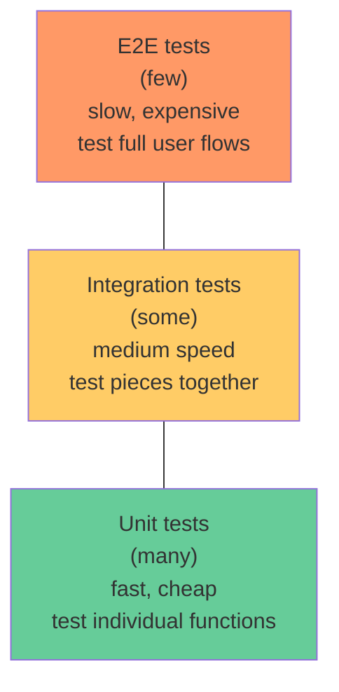

# Phase 6: Testing

> **In one line:** Tests prove your code works, document what it's supposed to do, and let you refactor without fear. Without them, every change is a gamble.

:::tip In plain English
Testing is the practice of writing code that *checks your code*. You write a function that adds two numbers. You write a test that calls it with `2, 3` and expects `5`. The test runs automatically every time you save or push. If you ever break the function, the test fails and tells you. Multiply that by a few hundred tests and you have a safety net that lets you change code confidently.
:::

## Why test?

- **Catch bugs before users do.**
- **Enable refactoring.** Tests are scaffolding that lets you change code confidently.
- **Document behavior.** A good test explains what code is supposed to do.
- **Prevent regressions.** Bugs that come back are especially demoralizing.

## The testing pyramid



> **Reading this diagram:** Stacked top-down because the *shape* is the point — narrow at the top (few slow E2E tests, in orange/red), wide at the bottom (many fast unit tests, in green). Inverting the pyramid (many slow E2E tests) makes CI take hours and tests flake constantly.

## Test types in depth

### Unit tests

Test individual functions or components in isolation. Mock external dependencies. Run in milliseconds.

```typescript
import { describe, it, expect } from 'vitest';
import { formatPrice } from './format-price';

describe('formatPrice', () => {
  it('formats USD with 2 decimals', () => {
    expect(formatPrice(1234.5, 'USD')).toBe('$1,234.50');
  });

  it('handles zero', () => {
    expect(formatPrice(0, 'USD')).toBe('$0.00');
  });
});
```

> **In English:** Each `it(...)` block is one test case. `describe` groups related tests under one heading. `expect(x).toBe(y)` is an **assertion** — if `x` doesn't equal `y` at runtime, the test fails. No mocks here because `formatPrice` is pure (no DB, no network).

### Integration tests

Test how pieces work together. API endpoint + database. Component + state management.

```typescript
import { test, expect } from 'vitest';
import { app } from './app';

test('POST /users creates a user', async () => {
  const response = await app.request('/users', {
    method: 'POST',
    body: JSON.stringify({ name: 'Tony', email: 'tony@example.com' }),
  });

  expect(response.status).toBe(201);
  const user = await response.json();
  expect(user.id).toBeDefined();
});
```

> **In English:** Fire a real HTTP `POST /users` at the in-process app, then assert it responded with **201 Created** (the standard HTTP status for "resource created") and that the response body has an `id`. No browser, no real network — but the app's routing, validation, and DB writes all execute. That's what makes it an *integration* test rather than a unit test.

### End-to-end (E2E) tests

Drive a real browser through real user flows. Find bugs that span the full stack.

```typescript
import { test, expect } from '@playwright/test';

test('user can sign up and create a project', async ({ page }) => {
  await page.goto('/signup');
  await page.fill('[name=email]', 'tony@example.com');
  await page.fill('[name=password]', 'SecurePass123!');
  await page.click('button[type=submit]');

  await expect(page).toHaveURL('/dashboard');

  await page.click('text=New Project');
  await page.fill('[name=name]', 'My First Project');
  await page.click('text=Create');

  await expect(page.locator('h1')).toContainText('My First Project');
});
```

> **In English:** Playwright launches a real headless Chrome, navigates to `/signup`, types into form inputs, clicks Submit, then *asserts* the user landed on `/dashboard`. Then it creates a project and checks the page heading. Each `await` is a real browser action; the test reads almost like an English script of what a user would do.

### Other test types

- **Visual regression tests** — Take screenshots; compare against baseline. Catches unintended visual changes.
- **Performance tests** — Measure response times under load (k6, Artillery, Gatling).
- **Accessibility tests** — Verify WCAG compliance (axe-core).
- **Security tests** — SAST (Semgrep, CodeQL), DAST (OWASP ZAP), SCA (Snyk, Dependabot).

## Test-Driven Development (TDD)

A discipline where you write the test first:

1. Write a failing test.
2. Write the minimum code to make it pass.
3. Refactor.
4. Repeat.

TDD enforces small, testable units and high coverage. It's valuable but not universally adopted; many great codebases are tested after the fact.

## Coverage is misleading

"100% test coverage" doesn't mean bug-free. You can have 100% coverage and still miss critical bugs:

```typescript
function divide(a: number, b: number): number {
  return a / b;
}

// Test: expect(divide(10, 2)).toBe(5);  // 100% coverage!
// But: divide(10, 0) returns Infinity, not an error.
```

Coverage is a *minimum* signal. The real question: do your tests cover the cases that would matter to users?

:::info Highlight: the 80/20 rule for beginner test suites
For a beginner project, you don't need a perfect test pyramid. You need *some* tests for the parts that matter:

1. **One E2E test for your most important user flow** (signup → core action).
2. **Unit tests for any function with complex logic** (calculations, parsers, validators).
3. **No tests for trivial code** (a function that just calls another function).

This gives you ~20% of the testing effort for ~80% of the value. As your project grows, you can fill in the rest.
:::

## Common anti-patterns

- **No tests:** "I'll add them later." (You won't.)
- **Only happy-path tests:** No tests for errors, edge cases, or invalid input.
- **Tests that test implementation, not behavior:** Refactoring breaks tests even when behavior is correct.
- **Flaky tests:** Sometimes pass, sometimes fail. Erode trust until everyone ignores CI.
- **Massive E2E test suites:** Slow CI, hard to debug, eventually abandoned.
- **Snapshot tests for everything:** Just commits the current output as "correct"; catches nothing meaningful.

## Tools in 2026

| Tool                  | What it's for                                         |
|----------------------|-------------------------------------------------------|
| **Vitest**           | Dominant test runner for new JS/TS projects (replaces Jest). |
| **Playwright**       | Dominant E2E framework.                                |
| **Testing Library**  | Lightweight DOM testing.                                |
| **MSW**              | Mock API requests realistically.                       |
| **k6**               | Load testing.                                          |
| **Chromatic / Percy**| Visual regression.                                     |
| **Storybook**        | Component development + interaction testing.           |

## What's next

→ Continue to [Phase 7: Code Review](./code-review) where we add a second pair of human eyes to catch what tests miss.
