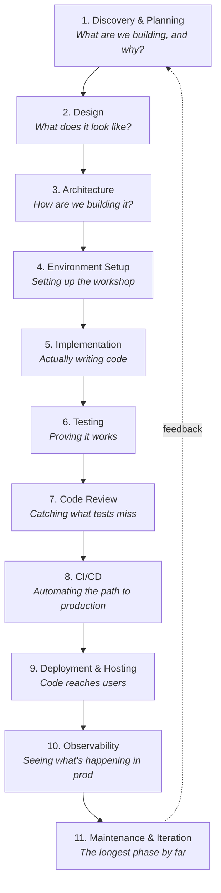

# Part 2: The Universal Development Lifecycle

*The phases every project moves through — from one-person blogs to billion-user platforms.*

:::tip Absolute-beginner orientation
**What this chapter is really about:** Real software isn't written in one go. It moves through phases — somebody decides what to build, somebody designs it, somebody writes the code, somebody else reviews it, automated systems test it, it gets shipped to users, and then it gets monitored and maintained forever.

**Why this matters before you learn any framework:** Frameworks (Next.js, React, Django) only solve the "writing the code" phase. The other phases — planning, design, code review, deployment, monitoring — are what actually consume most of your time as a working developer. Understanding the full loop helps you see where each tool fits.

**Mental model:** Think of building a product like building a restaurant. You don't just start cooking. First you decide what kind of restaurant (planning), draw up the floor plan (design), build the kitchen (architecture + setup), hire and train staff (team setup), cook test meals (implementation + testing), have a soft opening with friends (code review + staging), open to the public (deployment), and then keep the place running every day (observability + maintenance). Software has the exact same arc.

**Jargon you'll meet:** *requirements, PRD, wireframe, system design, architecture, repository, branch, pull request, code review, CI, CD, staging, production, observability, on-call, incident, post-mortem.*

**If you only remember one thing:** Writing code is maybe 20% of a software engineer's actual job. The other 80% is everything in this chapter.
:::

Software development has a recognizable rhythm. The complexity of each phase varies dramatically by scale, but the phases themselves are universal. A solo developer in a coffee shop and a 5,000-engineer organization both go through these steps; one just does each one in five minutes while the other takes five weeks.

## The eleven phases

> **Reading this diagram:** The dotted line back from phase 11 to phase 1 is the most important arrow on the page. These aren't strictly sequential — modern development is iterative, with constant feedback loops. But every feature, every bug fix, every refactor goes through these stages in some form.

## Pages in this chapter

1. [Phase 1: Discovery & Planning](/docs/lifecycle/discovery-planning)
2. [Phase 2: Design](/docs/lifecycle/design)
3. [Phase 3: Architecture](/docs/lifecycle/architecture)
4. [Phase 4: Environment Setup](/docs/lifecycle/environment-setup)
5. [Phase 5: Implementation](/docs/lifecycle/implementation)
6. [Phase 6: Testing](/docs/lifecycle/testing)
7. [Phase 7: Code Review](/docs/lifecycle/code-review)
8. [Phase 8: CI/CD](/docs/lifecycle/ci-cd)
9. [Phase 9: Deployment & Hosting](/docs/lifecycle/deployment-hosting)
10. [Phase 10: Observability](/docs/lifecycle/observability)
11. [Phase 11: Maintenance & Iteration](/docs/lifecycle/maintenance)

Each page covers one phase with worked examples, anti-patterns, and concrete tooling recommendations for 2026.

---

When you finish, move on to [Chapter 3: The Tech Stack, Decoded](/docs/stack).
