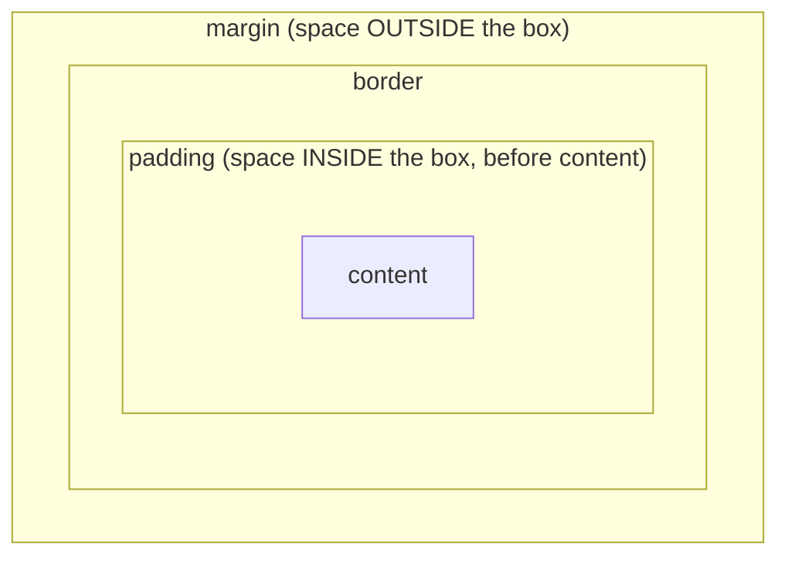

---
id: stage-2-html-css
title: Stage 2 — HTML & CSS
sidebar_position: 3
sidebar_label: Stage 2 — HTML & CSS
description: The structure and styling of every web page. Semantic HTML, the box model, Flexbox, Grid, and mobile-first responsive design.
---

# Stage 2 — HTML & CSS

> **Time budget:** ~2–4 weeks

> **In one line:** HTML is the structure of every web page, CSS is how it looks — a small set of patterns covers 90% of real UI.

HTML is the structure of every web page. CSS is how it looks. JavaScript (Stage 3) is how it behaves. You need all three, but HTML and CSS are quieter than people make them sound — there's a small set of patterns that cover 90% of real-world UI.

### 1. The shape of an HTML document

```html
<!DOCTYPE html>
<html lang="en">
<head>
  <meta charset="UTF-8" />
  <meta name="viewport" content="width=device-width, initial-scale=1" />
  <title>My page</title>
  <link rel="stylesheet" href="styles.css" />
</head>
<body>
  <header><h1>Welcome</h1></header>
  <main>
    <p>A paragraph of text.</p>
    <a href="https://example.com">A link</a>
  </main>
  <footer>© 2026</footer>
  <script src="app.js"></script>
</body>
</html>
```

The `<head>` holds metadata (the page title, links to CSS, etc.) — the user never sees it directly. The `<body>` is everything visible. Use **semantic tags** — `<header>`, `<main>`, `<nav>`, `<article>`, `<section>`, `<footer>` — instead of generic `<div>` where one fits. They help screen readers, search engines, and your future self reading the markup.

### 2. The tags worth knowing cold

- **Text**: `<h1>`–`<h6>` (headings), `<p>` (paragraph), `<strong>` (bold for emphasis), `<em>` (italic for emphasis), `<span>` (inline neutral wrapper).
- **Layout**: `<div>` (block neutral wrapper), `<ul>` + `<li>` (unordered list), `<ol>` (ordered list).
- **Media**: `` (always include `alt` for screen readers), `<video>`, `<audio>`.
- **Links**: `<a href="...">`. External links typically get `target="_blank" rel="noopener"` to open in a new tab safely.
- **Forms**: `<form>`, `<input>` (types: `text`, `email`, `password`, `number`, `checkbox`, `radio`, `date`), `<textarea>`, `<button>`, `<label>`.

### 3. Forms done right (the accessibility version)

```html
<form>
  <label for="email">Email</label>
  <input id="email" name="email" type="email" required />

  <label for="msg">Message</label>
  <textarea id="msg" name="msg" required></textarea>

  <button type="submit">Send</button>
</form>
```

Two non-negotiable rules: every input gets a `<label>` wired to it via matching `for` / `id` (screen readers depend on this), and use the right `type` (mobile keyboards change for `email`, `number`, `tel`; browsers validate for free).

### 4. CSS: selectors, the cascade, and the rules of engagement

```css
/* element selector */
p { color: #333; line-height: 1.6; }

/* class selector — your main tool */
.button { padding: 8px 16px; border-radius: 6px; }

/* id selector — high specificity, use sparingly */
#main-nav { background: white; }

/* descendant selector — applies inside .card */
.card p { margin: 0; }

/* state selector */
.button:hover { background: #eee; }
```

When two rules target the same element, the more **specific** one wins (id beats class beats element). When two rules have the same specificity, the one that appears *later* in the CSS wins. This is "the cascade." 90% of CSS confusion is two rules fighting and the wrong one winning.

### 5. The box model



> Every element is content surrounded by padding, then a border, then margin. Width = content + padding + border (with `box-sizing: border-box` — set this on everything).

```css
* { box-sizing: border-box; } /* universal reset, do this on every project */

.card {
  width: 300px;
  padding: 16px;
  border: 1px solid #ccc;
  margin: 12px;
}
```

### 6. Flexbox — for laying things out in a row or column

```css
.navbar {
  display: flex;
  justify-content: space-between;  /* horizontal distribution */
  align-items: center;             /* vertical alignment */
  gap: 16px;                       /* space between children */
}
```

Flexbox is the workhorse of modern layout. Six properties cover 90% of cases: `display: flex`, `flex-direction`, `justify-content`, `align-items`, `gap`, `flex-wrap`. Centering a div — the meme that defined a decade — is now `display: flex; justify-content: center; align-items: center;`.

### 7. Grid — for two-dimensional layouts

```css
.dashboard {
  display: grid;
  grid-template-columns: 200px 1fr;  /* sidebar + main */
  grid-template-rows: auto 1fr auto; /* header, content, footer */
  gap: 16px;
  min-height: 100vh;
}
```

Use Grid when you have rows AND columns; Flexbox when you have one direction. `1fr` means "one fraction of remaining space" — the modern way to say "fill the rest."

### 8. Responsive design — mobile-first

```css
/* default: mobile styles (small screens) */
.container { padding: 12px; }

/* at 768px and wider: tablet/desktop */
@media (min-width: 768px) {
  .container { padding: 32px; max-width: 1200px; margin: 0 auto; }
}
```

Mobile-first means: write styles for the small screen first, then add media queries to override for bigger screens. The opposite (desktop-first) tends to produce worse mobile experiences. Two breakpoints (`768px` tablet, `1024px` desktop) is enough for most projects.

### What to skip

- **Float layouts** — pre-2015 technique for column layouts. Replaced by Flexbox and Grid. If a tutorial uses floats for layout, find a newer tutorial.
- **Internet Explorer hacks, vendor prefixes** — modern browsers don't need them. Tools like Autoprefixer handle the rare exception automatically.
- **CSS preprocessors (Sass, Less)** — still used but Tailwind (Stage 7) makes them mostly unnecessary for new projects.
- **Animations beyond `transition`** — fancy keyframe animations are fun but rarely the bottleneck on a project. Learn them when you need them.

## Where to go deeper

- [web.dev — Learn HTML](https://web.dev/learn/html) — short, modern, accessible.
- [web.dev — Learn CSS](https://web.dev/learn/css) — same series, deeply current.
- [Flexbox Froggy](https://flexboxfroggy.com) + [Grid Garden](https://cssgridgarden.com) — gamified ways to learn Flexbox and Grid. Each takes ~30 minutes and is genuinely the fastest way in.
- [Josh Comeau's blog](https://www.joshwcomeau.com/) — best CSS writing on the internet. His "interactive guide to flexbox" is unmatched.

## Deeper in this guide

- [Styling](/docs/stack/styling) — where CSS sits today, plus Tailwind, CSS-in-JS, and the modern styling landscape.

## Project

:::tip[Project — Static personal page, no JS]
In a `stage-2/` folder, build a single-page personal site by hand: a hero section with your name and a tagline, an "about me" section with 2 paragraphs, a "projects" section showing 3 cards in a grid, a contact form (no submit handler yet — Stage 3 will wire it up), a footer. Make it responsive: looks good on mobile AND a 1440px monitor. Use semantic tags. No frameworks, no libraries — just `index.html` and `styles.css`. Open it by double-clicking the HTML file. Iterate until you're proud of it; you'll deploy this version of yourself again in Stage 9 with Next.js.
:::

→ [Next: Stage 3 — JavaScript in the browser](/docs/roadmap/part-1-from-zero/stage-3-js-in-browser) · [Back to Part I overview](/docs/roadmap/part-1-from-zero)
