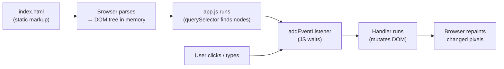

---
id: stage-3-js-in-browser
title: Stage 3 — JavaScript in the browser
sidebar_position: 4
sidebar_label: Stage 3 — JS in browser
description: The DOM, events, fetch, async/await, localStorage — every browser primitive you'll ever use in React.
---

# Stage 3 — JavaScript in the browser

> **Time budget:** ~2–3 weeks

> **In one line:** Make web pages interactive — the DOM is the bridge between your JS code and your HTML.

Stage 1 taught you JavaScript as a language. This stage teaches it as a way to *make web pages interactive*. The bridge between your JS code and your HTML is the **DOM** (Document Object Model) — a tree representation of the page that your JS can read and change.

For the deeper "what is actually running here" picture, see [Browser as a Runtime](/docs/foundations/browser-runtime) and [Rendering Pipeline](/docs/foundations/rendering-pipeline).

### 1. Loading JavaScript into a page

```html
<!-- in index.html, right before </body> -->
<script src="app.js"></script>

<!-- modern: a module, can use import/export -->
<script type="module" src="app.js"></script>
```

Put `<script>` tags at the end of `<body>` so the HTML is parsed before your JS runs. Or use `type="module"` (or `defer`) and put it in the head — they wait for the DOM automatically.

### 2. Selecting elements: `querySelector`

```js
// pass any CSS selector — same syntax as your CSS
const button = document.querySelector("#submit");
const firstP = document.querySelector("p");
const allCards = document.querySelectorAll(".card");  // NodeList of all matches
```

### 3. Listening for events

```js
button.addEventListener("click", () => {
  console.log("clicked!");
});

// event object — access the keyboard event, the target, etc.
input.addEventListener("keydown", (event) => {
  if (event.key === "Enter") submit();
});

// form submission — preventDefault stops the page reload
form.addEventListener("submit", (event) => {
  event.preventDefault();
  const formData = new FormData(form);
  console.log(formData.get("email"));
});
```

Common event names: `click`, `submit`, `input` (fires on every keystroke), `change` (fires when the value is committed), `keydown`, `mouseenter`, `scroll`.

**Try it live** — a real page with your JS running. Click the button and type in the box, then edit the code and watch the preview re-run:

<Sandbox
  template="static"
  editorHeight={300}
  files={{
    '/index.html': `<!doctype html>
<html>
  <body style="font-family: system-ui; padding: 1rem;">
    <button id="btn">Click me</button>
    <p id="count">Clicks: 0</p>
    <input id="name" placeholder="Type your name" />
    <p id="echo"></p>

    <script>
      let n = 0;
      const count = document.querySelector('#count');
      document.querySelector('#btn').addEventListener('click', () => {
        n += 1;
        count.textContent = 'Clicks: ' + n;
      });

      const echo = document.querySelector('#echo');
      document.querySelector('#name').addEventListener('input', (e) => {
        echo.textContent = e.target.value ? 'Hello, ' + e.target.value : '';
      });
    </script>
  </body>
</html>`,
  }}
/>

### 4. Changing the page

```js
title.textContent = "New title";             // safe text only
container.innerHTML = `<p>Hello</p>`;        // ⚠ injects HTML — XSS risk if user data
element.classList.add("is-active");
element.classList.toggle("is-open");
element.setAttribute("disabled", "");
element.style.color = "red";                // inline style; usually toggle a class instead

// creating new elements
const li = document.createElement("li");
li.textContent = "New todo";
list.appendChild(li);
```

Prefer `textContent` over `innerHTML` when you're inserting user-supplied data — it can't be tricked into running scripts.

The whole loop, end-to-end:



> Your JS doesn't touch HTML strings — it touches the *DOM*, the in-memory tree the browser built from the HTML. Every change you make to the DOM is what the user sees on the next repaint.

### 5. Asynchrony: promises and async/await

Things that take time — network requests, timers, file reads — return **promises**: an object representing "a value that will arrive later." You wait for them with `await` inside an `async` function.

```js
async function loadUser() {
  try {
    const response = await fetch("https://api.github.com/users/octocat");
    if (!response.ok) throw new Error(`HTTP ${response.status}`);
    const user = await response.json();
    console.log(user.name);
  } catch (err) {
    console.error("failed:", err);
  }
}

loadUser();
```

The mental model: `await` "pauses" the function until the promise settles. Other code keeps running in the meantime — the page doesn't freeze. `fetch` is the built-in way to make HTTP requests from the browser; `.json()` parses the response body as JSON.

### 6. `localStorage` — saving data on the user's device

```js
localStorage.setItem("theme", "dark");
const theme = localStorage.getItem("theme"); // "dark" or null

// to store objects, JSON-serialise them
localStorage.setItem("todos", JSON.stringify(todos));
const todos = JSON.parse(localStorage.getItem("todos") || "[]");
```

Persists across page reloads but lives only in this browser on this device. Don't store secrets here — the user (and any browser extension) can read it.

### 7. DevTools — your most-used tool

Press `F12` (or right-click → Inspect). Tabs to learn:

- **Elements** — inspect the DOM live, edit HTML/CSS in-place to experiment.
- **Console** — see `console.log` output, type ad-hoc JS to inspect variables.
- **Network** — see every request the page made, the response, the timing.
- **Sources** — set breakpoints, step through code with a real debugger.
- **Application** → Local Storage — view what your code is saving.

Senior devs live in DevTools. Learn it now, save a thousand hours later.

## Where to go deeper

- [javascript.info](https://javascript.info) — Part 2 ("Browser: Document, Events, Interfaces"). Same caliber as Part 1.
- [MDN Client-side Web APIs](https://developer.mozilla.org/en-US/docs/Learn/JavaScript/Client-side_web_APIs) — the reference for everything the browser exposes.
- [Chrome DevTools docs](https://developer.chrome.com/docs/devtools/) — the actual product docs. Underrated.

## Deeper in this guide

- [Browser as a Runtime](/docs/foundations/browser-runtime) — the event loop, the DOM, and what's actually executing your code.
- [Rendering Pipeline](/docs/foundations/rendering-pipeline) — from HTML/CSS/JS to pixels on screen.

## Project

:::tip[Project — Vanilla-JS todo list]
In a `stage-3/` folder, build a todo list as a single HTML file + a single JS file. Features: input + button to add a todo, click a todo to mark it done (struck-through), a delete button per todo, count of remaining items at the bottom, persistence via `localStorage` so reloading keeps your list. No frameworks. Then add a second feature: a button that calls the GitHub API (`https://api.github.com/users/yourname`) and shows your avatar and bio at the top of the page. By the end you'll have wired up DOM manipulation, events, async/await, fetch, JSON, and persistence — every browser primitive you'll ever use in React.
:::

## Common mistakes

:::caution[Where people commonly trip up]
- **Putting `<script>` in the `<head>` without `defer` or `type="module"`.** The browser runs the script before parsing the body — `document.querySelector("#submit")` returns `null` because the element doesn't exist yet. Either put the tag right before `</body>` or add `defer`/`type="module"`.
- **Using `innerHTML` with user-supplied data.** Anything a user typed (a comment, a username, a search query) injected via `innerHTML` can execute `<script>` tags — that's the XSS attack. Use `textContent` for text; reserve `innerHTML` for static, developer-controlled strings.
- **Forgetting `event.preventDefault()` on form submit.** Without it, the form submits as a real HTTP request and the page reloads — your handler's "results" vanish in the reload. Always start a custom submit handler with `e.preventDefault()`.
- **Storing secrets in `localStorage`.** Auth tokens, API keys, anything sensitive — every browser extension and every line of your own JS can read localStorage. It's for *preferences and drafts*, not security.
:::

## Page checkpoint

<Quiz id="stage-3-page" title="Did Stage 3 stick?" sampleSize={3}>

<Question
  prompt="Your form has `<form onsubmit=...>` and the handler runs, but the page reloads anyway and you lose your console.log output. What's the fix?"
  options={[
    { text: "Add `return false` at the start of the handler" },
    { text: "Call `event.preventDefault()` inside the submit handler" },
    { text: "Set the form's `method` attribute to 'none'" },
    { text: "Wrap the handler in `async`" }
  ]}
  correct={1}
  explanation="By default, a form submit is a real HTTP request that reloads the page. `event.preventDefault()` cancels that default behavior so your JS handler can take over."
  revisit={{ to: "/docs/roadmap/part-1-from-zero/stage-3-js-in-browser#3-listening-for-events", label: "Revisit: Listening for events" }}
/>

<Question
  prompt="You're rendering a user's comment into the page. Why is `commentEl.textContent = comment` safer than `commentEl.innerHTML = comment`?"
  options={[
    { text: "`textContent` is faster" },
    { text: "`innerHTML` parses the string as HTML, so a comment containing `<script>` can run code (an XSS attack); `textContent` treats it as plain text" },
    { text: "`textContent` works on older browsers" },
    { text: "`innerHTML` doesn't support unicode" }
  ]}
  correct={1}
  explanation="`innerHTML` parses its input as HTML — any `<script>` or `onerror=` injected via user data executes. `textContent` writes the string verbatim, treating angle brackets as literal characters. This is the most common XSS bug."
  revisit={{ to: "/docs/roadmap/part-1-from-zero/stage-3-js-in-browser#4-changing-the-page", label: "Revisit: Changing the page" }}
/>

<Question
  prompt="Inside an `async` function, what does `await` actually do?"
  options={[
    { text: "Blocks the entire browser until the promise settles" },
    { text: "Pauses the async function until the promise settles, while other code keeps running" },
    { text: "Converts a promise into a callback" },
    { text: "Retries the call until it succeeds" }
  ]}
  correct={1}
  explanation="`await` suspends just the current async function while the promise is pending — the browser keeps responding to clicks, other timers fire, other code runs. When the promise settles, the function resumes where it left off."
  revisit={{ to: "/docs/roadmap/part-1-from-zero/stage-3-js-in-browser#5-asynchrony-promises-and-asyncawait", label: "Revisit: Promises and async/await" }}
/>

</Quiz>

→ [Next: Stage 4 — Git & GitHub](/docs/roadmap/part-1-from-zero/stage-4-git) · [Back to Part I overview](/docs/roadmap/part-1-from-zero)
