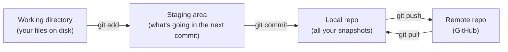

---
id: stage-4-git
title: Stage 4 — Git & GitHub
sidebar_position: 5
sidebar_label: Stage 4 — Git
description: Version control with Git and collaboration on GitHub — the eight commands, branches, .gitignore, and writing decent commit messages.
---

# Stage 4 — Git & GitHub

> **Time budget:** ~1–2 weeks

> **In one line:** Every change to your code becomes a saved snapshot you can return to — and your work lives somewhere other than just your laptop.

Git is version control — every change to your code becomes a saved snapshot you can return to. GitHub is the most popular site for hosting Git repositories online. Together they're how every team in the world ships software. Learn them now even though you're working solo: future-you will thank you when "I broke something three days ago" stops meaning "I lost three days of work."

### 1. The mental model

A Git repository ("repo") is a folder where every file is tracked. You make changes; you **stage** the ones you want to record; you **commit** them, creating a snapshot with a message. Later you can see every snapshot, jump back to any of them, or branch off to try something risky without disturbing the main line.



> Three locations every Git command moves files between.

### 2. The first-time setup

```bash
git config --global user.name "Tony Yu"
git config --global user.email "you@example.com"
git config --global init.defaultBranch main
```

Then create a free [GitHub](https://github.com) account and set up SSH keys following [GitHub's guide](https://docs.github.com/en/authentication/connecting-to-github-with-ssh) — it's a 5-minute setup that saves you typing passwords forever.

### 3. The 8 commands you'll use 95% of the time

```bash
git init                          # turn the current folder into a Git repo
git status                        # what's changed since the last commit?
git add file.js                   # stage one file for the next commit
git add .                         # stage everything changed
git commit -m "add login form"    # take a snapshot with a message
git log                           # list all commits (q to exit)
git diff                          # show unstaged changes line-by-line
git push                          # send commits to GitHub
```

### 4. Branches: working on a feature without breaking `main`

```bash
git branch                        # list branches; * marks the current one
git checkout -b add-dark-mode     # create AND switch to a new branch
# ...make changes, commit them...
git checkout main                 # switch back
git merge add-dark-mode           # bring the branch's commits into main
git branch -d add-dark-mode       # delete the branch when done
```

The pattern: `main` is always working code. Any new feature or fix happens on a branch. When the branch works, merge it into `main`. This is how teams work, and how you should work even solo — it forces you to think in self-contained changes.

### 5. Connecting to GitHub

```bash
# after creating an empty repo on GitHub, it shows you these:
git remote add origin git@github.com:yourname/my-project.git
git push -u origin main           # -u remembers this branch for future `git push`s
```

### 6. The `.gitignore` file

Some files shouldn't be tracked: `node_modules/` (huge, regenerated by `npm install`), `.env` (secrets!), `.DS_Store` (Mac noise). Create a `.gitignore` at the repo root listing them:

```
node_modules/
.env
.env.local
.DS_Store
*.log
dist/
build/
```

For a Node project, the [canonical Node .gitignore](https://github.com/github/gitignore/blob/main/Node.gitignore) from GitHub is a great copy-paste start.

### 7. When things break

```bash
git restore file.js               # discard unstaged changes to file.js
git restore --staged file.js      # unstage a file (un-`git add`)
git reset --soft HEAD~1           # undo the last commit but keep changes
git stash                         # shelve changes temporarily
git stash pop                     # bring them back
git log --oneline                 # compact history
```

A working philosophy: commit often, with small focused changes. The more granular your history, the easier it is to find the commit that broke something with `git bisect` later (Part III).

### 8. Writing commit messages

The convention most teams follow: a short imperative subject line (≤60 chars), a blank line, then optional details.

```
# bad
fix

# good
fix(form): prevent double-submit on slow networks

The submit button was disabled on click but re-enabled by React's
re-render before the fetch resolved. Move the disabled state into
useTransition so it tracks the actual pending state.
```

### Pull requests (PRs)

When you push a branch to GitHub, you can open a **pull request** — a UI for "please review and merge these changes." Solo, you'll often PR your own branches into `main` just for the diff view and a place to write context. On a team, this is where code review happens.

## Where to go deeper

- [Pro Git book](https://git-scm.com/book/en/v2) (free online) — chapters 1–3 cover everything in this stage in proper depth.
- [Learn Git Branching](https://learngitbranching.js.org) — interactive visualisation of branching/merging/rebasing. The fastest way to build a mental model.
- [ohshitgit.com](https://ohshitgit.com) — "I just did X, how do I undo it?" reference. Bookmark.

## Deeper in this guide

- [CI/CD](/docs/lifecycle/ci-cd) — once your code is on GitHub, automation runs on every push and merge.

## Project

:::tip[Project — Put your previous work on GitHub]
Create a free GitHub account if you haven't. Make a new repo per Stage 1–3 project (or one repo with three folders — your call). Practice the full loop: `git init`, write code, `git add`, `git commit`, `git push`. Then make a change on a branch (`git checkout -b polish-styles`), commit it, push it, open a PR on GitHub, merge it. Do this until the commands are muscle memory. Bonus: add a README.md to each project explaining what it does, how to run it, and what you learned — your future portfolio.
:::

→ [Next: Stage 5 — TypeScript](/docs/roadmap/part-1-from-zero/stage-5-typescript) · [Back to Part I overview](/docs/roadmap/part-1-from-zero)
