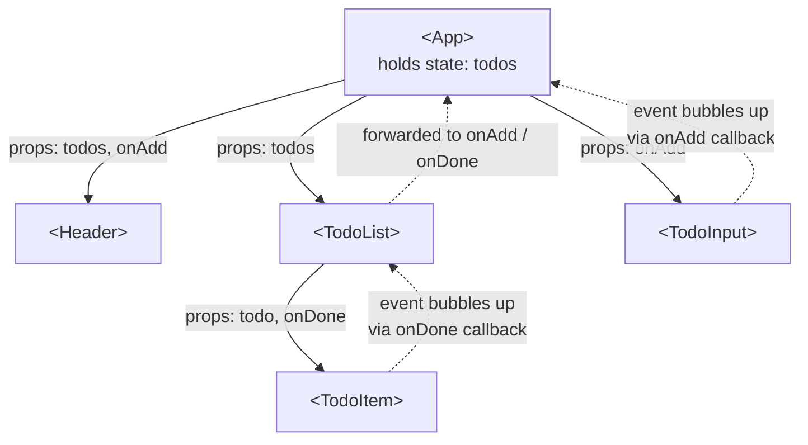

# Stage 6 — React fundamentals

> **Time budget:** ~3–5 weeks

> **In one line:** Describe what the UI should look like for a given state — React figures out the DOM changes.

> **Going deeper:** once components, props, state, and effects click, [Advanced React](/docs/stack/frontend-frameworks-advanced) covers the render model, the rules of hooks, Server Components, and performance.

React is a library for building user interfaces out of components. Instead of imperatively writing "find this DOM element, change its text" (Stage 3), you declaratively describe what the UI should look like for a given **state**, and React figures out the DOM changes for you. Once it clicks, you'll never want to go back to vanilla DOM manipulation.

For where React sits among other UI libraries, see [Frontend Frameworks](/docs/stack/frontend-frameworks). For the architectural style React originated, see [SPA / MPA / Hybrid](/docs/foundations/spa-mpa-hybrid).

### 1. Create your first app

```bash
npm create vite@latest my-app -- --template react-ts
cd my-app
npm install
npm run dev
```

Vite is a build tool — it bundles your code and runs a dev server. Visit the printed URL (usually `http://localhost:5173`). Hot-reload: edit a file, see the page update without reloading.

### 2. Components and JSX

A component is a function that returns a tree of UI. JSX is HTML-looking syntax inside JS — the build tool compiles it to regular function calls.

```jsx
function Greeting() {
  return <h1>Hello, world</h1>;
}

function App() {
  return (
    <div>
      <Greeting />
      <p>A sub-paragraph.</p>
    </div>
  );
}
```

Rules: components start with a Capital Letter. JSX can render only one root element (wrap multiple in `<>...</>`, a "fragment"). Use `className` not `class` and `htmlFor` not `for` — the only two HTML attributes that get renamed.

### 3. Props: passing data into components

```tsx
interface CardProps {
  title: string;
  body: string;
  onClick?: () => void;
}

function Card({ title, body, onClick }: CardProps) {
  return (
    <div className="card" onClick={onClick}>
      <h3>{title}</h3>
      <p>{body}</p>
    </div>
  );
}

// usage
<Card title="Hello" body="World" onClick={() => alert("!")} />
```

Props flow one-way: parent → child. A child cannot directly change a parent's data — it can only ask via a callback prop (the `onClick` in the example).



> **Data flows down via props (solid arrows); events flow up via callback props (dotted arrows).** State lives at the highest component that needs to read or write it — usually the parent — and children stay "dumb" functions of their props.

### 4. State: `useState`

```tsx
import { useState } from "react";

function Counter() {
  const [count, setCount] = useState(0);

  return (
    <div>
      <p>Count: {count}</p>
      <button onClick={() => setCount(count + 1)}>+1</button>
      <button onClick={() => setCount(0)}>reset</button>
    </div>
  );
}
```

The mental model: `useState` gives you a value and a setter. Calling the setter tells React "re-run my component function and produce new JSX with this new value." React diffs the new JSX against the old and updates only what changed in the DOM.

**Try it live** — click the buttons, then edit the code (try changing `+1` to `+5`, or the starting value) and watch it re-render instantly:

```jsx live
function Counter() {
  const [count, setCount] = useState(0);

  return (
    <div>
      <p>Count: {count}</p>
      <button onClick={() => setCount(count + 1)}>+1</button>
      <button onClick={() => setCount(0)} style={{ marginLeft: 8 }}>reset</button>
    </div>
  );
}
```

### 5. The rules of state that bite newcomers

```tsx
// ❌ Don't mutate state directly
const [todos, setTodos] = useState([]);
todos.push(newTodo);           // React doesn't notice — no re-render

// ✅ Create a new array/object
setTodos([...todos, newTodo]);

// ✅ For updates that depend on previous state, use the function form
setCount(prev => prev + 1);    // safe against race conditions
```

This is the *reference vs value* distinction from Stage 1 in action. React compares state by reference: if you mutate the same array, the reference is unchanged, no re-render.

**Challenge — immutable update.** React only re-renders when state changes by *reference*, so you must return a *new* array, never mutate the old one. Write it and run the tests (mutating the input fails on purpose):

<CodeChallenge
  id="stage6-add-todo"
  fnName="addTodo"
  noMutate
  prompt="Write addTodo(todos, text) that returns a NEW array with { text } appended — without mutating the original todos array."
  starter={`function addTodo(todos, text) {
  // return a new array; do NOT mutate todos
}`}
  solution={`function addTodo(todos, text) {
  return [...todos, { text }];
}`}
  tests={[
    {args: [[], "buy milk"], expected: [{text: "buy milk"}]},
    {args: [[{text: "a"}], "b"], expected: [{text: "a"}, {text: "b"}]},
  ]}
  hint="spread the existing array into a new one and append the todo: [...todos, { text }]."
/>

### 6. Rendering lists

```tsx
function TodoList({ todos }: { todos: Todo[] }) {
  return (
    <ul>
      {todos.map(t => (
        <li key={t.id}>{t.text}</li>
      ))}
    </ul>
  );
}
```

`key` is non-optional — it's how React tracks which item is which across re-renders. Use a stable unique id (the database id, a UUID). **Never use the array index as the key** in lists that can reorder or have items inserted/removed — it causes mysterious bugs.

**Challenge — immutable update of one item in a list.** This is the single most common React state operation. Return a *new* array where only the matching todo changes:

<CodeChallenge
  id="stage6-toggle-done"
  fnName="toggleDone"
  noMutate
  prompt="Write toggleDone(todos, id) that returns a NEW array where the todo with the matching id has its done flipped — without mutating the originals."
  starter={`function toggleDone(todos, id) {
  // return a new array; flip done on the matching todo only
}`}
  solution={`function toggleDone(todos, id) {
  return todos.map((t) =>
    t.id === id ? { ...t, done: !t.done } : t
  );
}`}
  tests={[
    {args: [[{id: 1, done: false}, {id: 2, done: true}], 1], expected: [{id: 1, done: true}, {id: 2, done: true}]},
    {args: [[{id: 1, done: false}], 99], expected: [{id: 1, done: false}]},
  ]}
  hint="map over the array; for the matching id return a NEW object { ...t, done: !t.done }, otherwise return t unchanged."
/>

### 7. Forms (controlled inputs)

```tsx
function SignupForm() {
  const [email, setEmail] = useState("");

  function handleSubmit(e: React.FormEvent) {
    e.preventDefault();
    console.log("submitting:", email);
  }

  return (
    <form onSubmit={handleSubmit}>
      <input
        type="email"
        value={email}
        onChange={e => setEmail(e.target.value)}
      />
      <button type="submit">Sign up</button>
    </form>
  );
}
```

A "controlled" input is one where React holds the value, not the DOM. The input *reflects* the state, and every keystroke updates the state. It feels like extra work for a single input but pays off the moment you need validation, derived state, or a programmatic reset.

**Try it live** — type in the box and watch React's state mirror every keystroke. Then try deriving from it (e.g. show `name.length`):

```jsx live
function NameField() {
  const [name, setName] = useState("");

  return (
    <div>
      <input
        value={name}
        onChange={(e) => setName(e.target.value)}
        placeholder="Type your name"
      />
      <p>React state holds: <strong>{name || "(empty)"}</strong></p>
    </div>
  );
}
```

### 8. `useEffect`: side effects (and why you should avoid it)

```tsx
import { useEffect, useState } from "react";

function UserProfile({ userId }: { userId: number }) {
  const [user, setUser] = useState<User | null>(null);

  useEffect(() => {
    fetch(`/api/users/${userId}`)
      .then(r => r.json())
      .then(setUser);
  }, [userId]);  // re-run when userId changes

  if (!user) return <p>loading...</p>;
  return <h2>{user.name}</h2>;
}
```

`useEffect` runs after a render. It's how you sync React state to "the outside world" — fetching data, subscribing to events, setting timers. The official advice from the React team is now *"you probably don't need an effect"*: server-side data fetching (Stage 8 / RSC) replaces most data-loading effects. Use `useEffect` only for genuine side effects — subscribing to a WebSocket, integrating with a non-React library.

### 9. The mental model that makes React click

Stop thinking "what should I do when X changes?" Start thinking "what should the UI look like for this state?" React re-runs your component every time state changes. Your job is to write a function from *state* to *UI*. React handles the "do" part.

### What to skip for now

- **Class components** — pre-2019 React. Skim, ignore, never write.
- **Redux / Zustand / Jotai** (global state libraries) — covered in Tier 3. `useState` + props gets you very far.
- **useReducer, useContext, useMemo, useCallback** — exist for specific problems you don't have yet. Learn when you hit the problem they solve.
- **Higher-order components, render props** — legacy patterns superseded by hooks.

## Where to go deeper

- [react.dev Learn](https://react.dev/learn) — the official tutorial, rewritten in 2023, genuinely excellent. Work through "Describing the UI," "Adding Interactivity," and "Managing State." Skip the rest until you need it.
- [react.dev Reference](https://react.dev/reference/react) — every hook and API, with examples.
- [Dan Abramov's blog](https://overreacted.io/) — the React team's longtime lead. "A Complete Guide to useEffect" alone is worth the time.

## Deeper in this guide

- [Frontend Frameworks](/docs/stack/frontend-frameworks) — React vs Vue vs Svelte vs Solid, and why React still wins for most teams.
- [SPA / MPA / Hybrid](/docs/foundations/spa-mpa-hybrid) — the architectural style React popularised, and the modern hybrid it's evolving into.

## Project

:::tip[Project — Todo list in React + TypeScript]
Use `npm create vite@latest` with the `react-ts` template. Rebuild your Stage 3 todo list in React: add, complete, delete todos, persist via `localStorage`, show the remaining count. Compose it from at least three components (`App`, `TodoInput`, `TodoItem`). Pass data down via props, send actions up via callback props. No external libraries. The goal isn't features — it's experiencing how much cleaner this is than the Stage 3 vanilla version.
:::

## Common mistakes

:::caution[Where people commonly trip up]
- **Mutating state instead of replacing it.** `todos.push(x); setTodos(todos)` doesn't trigger a re-render — the array reference is unchanged, so React thinks nothing changed. Always create a new array/object: `setTodos([...todos, x])`. This is the React-flavoured version of the Stage 1 reference-vs-value trap.
- **Using the array index as a `key`.** `key={i}` works until the list reorders or you insert/remove items — then React reuses the wrong DOM nodes and you get ghost state, wrong focus, lost input values. Use a stable unique id (database id, UUID).
- **Reaching for `useEffect` to derive data from props.** If you can calculate it during render (`const filtered = todos.filter(...)`), do that — no effect needed. `useEffect` is for *side effects* (subscriptions, manual DOM, third-party libs), not "I want this variable to update when X changes."
- **Reading React's source code instead of typing examples.** React clicks through the fingers, not the eyes. Open a CodeSandbox alongside react.dev and *type* every example, then break it on purpose to see what error you get.
:::

## Page checkpoint

<Quiz id="stage-6-page" title="Did Stage 6 stick?" sampleSize={3}>

<Question
  prompt="You write `todos.push(newTodo); setTodos(todos);` and nothing re-renders. Why?"
  options={[
    { text: "`push` is asynchronous and hasn't finished yet" },
    { text: "React compares state by reference — the array reference didn't change, so React thinks nothing changed" },
    { text: "You forgot to wrap it in useEffect" },
    { text: "`setTodos` only accepts strings" }
  ]}
  correct={1}
  explanation="React's bailout uses Object.is, which is reference equality for arrays/objects. Mutating in place keeps the same reference. Create a new array — `setTodos([...todos, newTodo])` — and React sees a different reference, triggering a re-render."
  revisit={{ to: "/docs/roadmap/part-1-from-zero/stage-6-react#5-the-rules-of-state-that-bite-newcomers", label: "Revisit: Rules of state" }}
/>

<Question
  prompt="In React, a child component needs to update a value owned by its parent. What's the correct pattern?"
  options={[
    { text: "Mutate the prop directly inside the child" },
    { text: "The parent passes a callback prop (e.g. `onChange`); the child invokes it, and the parent updates its own state" },
    { text: "Use a global variable" },
    { text: "Children can't update parent data — the architecture is wrong" }
  ]}
  correct={1}
  explanation="React enforces one-way data flow: props go parent → child, but children request changes via callback props that the parent provides. The parent stays the single source of truth for its state."
  revisit={{ to: "/docs/roadmap/part-1-from-zero/stage-6-react#3-props-passing-data-into-components", label: "Revisit: Props and one-way data flow" }}
/>

<Question
  prompt="What's the React team's current recommendation about `useEffect`?"
  options={[
    { text: "Use it for every piece of derived state" },
    { text: "Wrap every component's body in one" },
    { text: "You probably don't need it — server-side fetching and computing values during render cover most cases; reserve it for genuine outside-world side effects" },
    { text: "Avoid it entirely — it's deprecated" }
  ]}
  correct={2}
  explanation="The official guidance is 'You Might Not Need an Effect.' Most data-loading effects are replaced by server components (Stage 8); most derived values should be computed during render. Save `useEffect` for subscriptions, manual DOM work, and non-React libraries."
  revisit={{ to: "/docs/roadmap/part-1-from-zero/stage-6-react#8-useeffect-side-effects-and-why-you-should-avoid-it", label: "Revisit: useEffect" }}
/>

</Quiz>

→ [Next: Stage 7 — Tailwind CSS](/docs/roadmap/part-1-from-zero/stage-7-tailwind) · [Back to Part I overview](/docs/roadmap/part-1-from-zero)
