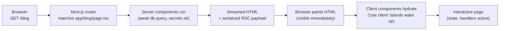

# Stage 8 — Next.js

> **Time budget:** ~3–4 weeks

> **In one line:** React, plus routing, server rendering, image and font optimisation, API endpoints, and a production-ready build/deploy pipeline.

Next.js is a framework built on React. Where React is just the UI library, Next.js bundles in routing, server-side rendering, image and font optimisation, API endpoints, and a production-ready build/deploy pipeline. It's the default React stack for 2026 — Vercel (the company that makes it) and the React core team are deeply aligned on its direction.

For where Next.js sits among other React meta-frameworks, see [Frontend Frameworks](/docs/stack/frontend-frameworks). For the rendering strategies it uses under the hood, see [SSR](/docs/foundations/ssr), [SSG](/docs/foundations/ssg), and [ISR / Streaming / PPR](/docs/foundations/isr-streaming-ppr).

### 1. Create your app

```bash
npx create-next-app@latest my-site
# answer the prompts: TypeScript yes, Tailwind yes, App Router yes, ESLint yes, src/ no, alias yes
cd my-site
npm run dev
```

Open `http://localhost:3000`. You're running a Next.js app. The first thing to notice: a file in `app/page.tsx` became the page at `/`. That's file-based routing.

### 2. File-based routing (the App Router)

```
app/
├── page.tsx                # → /
├── about/
│   └── page.tsx            # → /about
├── blog/
│   ├── page.tsx            # → /blog
│   └── [slug]/
│       └── page.tsx        # → /blog/anything ([slug] is a parameter)
└── layout.tsx              # wraps every page in the app
```

Folders are URL segments. `page.tsx` is the actual page component. Square-brackets denote dynamic segments. `layout.tsx` wraps every child page — perfect for nav and footer.

### 3. Server vs Client Components — the headline feature

This is what makes Next.js (and modern React) different from anything before. **Every component is a server component by default.** Server components run on the server only — they can be `async`, talk directly to a database, read files, hold secrets — and ship zero JavaScript to the browser. They produce HTML.

```tsx
// app/blog/page.tsx — server component (the default)
async function BlogIndex() {
  // fetch directly from your database; no useEffect, no loading state
  const posts = await db.select().from(postsTable);
  return (
    <ul>
      {posts.map(p => <li key={p.id}>{p.title}</li>)}
    </ul>
  );
}
export default BlogIndex;
```

When you need interactivity — state, effects, event handlers — you mark a component as client with `"use client"` at the top of the file:

```tsx
// app/components/LikeButton.tsx
"use client";
import { useState } from "react";

export function LikeButton() {
  const [liked, setLiked] = useState(false);
  return <button onClick={() => setLiked(true)}>{liked ? "♥" : "♡"}</button>;
}
```

The pattern: server components for everything that just *shows* data; client components for the small islands that need interactivity. Most of your tree is server; client is the exception.



> Every request: route match → server components run on the server (no JS shipped for them) → HTML streams to the browser → small client-component islands hydrate on top.

### 4. Server Actions: handling form submissions without API routes

```ts
// app/contact/actions.ts
"use server";
import { db } from "@/lib/db";

export async function sendMessage(formData: FormData) {
  const email = formData.get("email") as string;
  const body = formData.get("body") as string;
  await db.insert(messages).values({ email, body });
}
```

```tsx
// app/contact/page.tsx
import { sendMessage } from "./actions";

export default function ContactPage() {
  return (
    <form action={sendMessage}>
      <input name="email" type="email" required />
      <textarea name="body" required />
      <button type="submit">Send</button>
    </form>
  );
}
```

No `fetch` call, no API route, no JSON serialisation by you. Next.js secretly turns the action call into an HTTP POST. This is where Next.js feels like a different kind of framework.

### 5. Navigation: the `Link` component

```tsx
import Link from "next/link";

<Link href="/about">About</Link>
```

Use `Link` instead of `<a>` for internal navigation. It prefetches the destination, transitions without a full page reload, and feels instant.

### 6. Image and font optimisation

```tsx
import Image from "next/image";
import { Inter } from "next/font/google";

const inter = Inter({ subsets: ["latin"] });

// in your layout:
<body className={inter.className}> ... </body>

// in a page:
<Image src="/me.jpg" alt="Tony" width={400} height={400} />
```

`next/image` automatically resizes, compresses, and serves modern formats (WebP/AVIF). `next/font` loads Google Fonts at build time with zero layout shift.

### 7. Deploying to Vercel

Push your repo to GitHub. Go to [vercel.com](https://vercel.com), click "Import Project," select your repo. The defaults are correct. Click Deploy. You're live on a `your-app.vercel.app` URL within a minute. Every push to `main` after that auto-deploys; every push to a branch gets its own preview URL. This is genuinely free for personal projects.

## Where to go deeper

- [Next.js Learn](https://nextjs.org/learn) — the official interactive tutorial. Builds a dashboard app step by step. The best single resource for this stage.
- [Next.js docs](https://nextjs.org/docs) — reference. The "App Router" sections are the only ones that matter for new projects.
- [Lee Robinson on YouTube](https://www.youtube.com/@LeeRobinson) — VP of Product at Vercel. Tutorial videos that match Next.js's current direction.

## Deeper in this guide

- [Frontend Frameworks](/docs/stack/frontend-frameworks) — Next.js vs Remix vs SvelteKit vs the rest.
- [SSR](/docs/foundations/ssr) — server-side rendering, the strategy Next.js extends.
- [SSG](/docs/foundations/ssg) — static generation, the other half of Next.js's hybrid model.
- [ISR / Streaming / PPR](/docs/foundations/isr-streaming-ppr) — the newer rendering modes Next.js is built around.

## Project

:::tip[Project — A multi-page Next.js site]
Use `npx create-next-app@latest`. Build a site with at least: a home page (hero + 3 feature cards), an "about" page, a "blog" section that lists posts from a hardcoded array, and a dynamic `/blog/[slug]` page that renders one post. Use the `Link` component for internal navigation. Use `next/image` for at least one image. Use a server action for a contact form. Deploy it to Vercel and share the link. You now have a real, public, full-stack site.
:::

## Common mistakes

:::caution[Where people commonly trip up]
- **Sprinkling `"use client"` at the top of every file "just to be safe."** That defeats the entire point — you ship JS for everything, lose the ability to await your DB directly, and the bundle balloons. Default to server; opt in to client only for the leaves that need state or event handlers.
- **Calling your DB from a client component.** Server-only modules (database clients, secret-holding SDKs) imported into a client component leak secrets *and* break the build. The fix is to keep data access in server components or server actions, and pass the result down as props.
- **Using `<a href>` for internal navigation.** A plain anchor triggers a full page reload — you lose React state, refetch everything, and feel sluggish. Use `<Link>` for any same-site URL; reserve `<a>` for external links.
- **Confusing server actions with API routes.** Server actions are a *built-in shortcut* for "this form submit runs this server function." You don't need to write a separate route, fetch it from the client, or JSON-stringify the body — Next.js handles all of that.
:::

## Page checkpoint

<Quiz id="stage-8-page" title="Did Stage 8 stick?" sampleSize={3}>

<Question
  prompt="In the Next.js App Router, what's true of a component by default (no `&quot;use client&quot;` directive)?"
  options={[
    { text: "It runs only in the browser" },
    { text: "It's a server component — it runs on the server, can be `async`, can talk to your DB, and ships zero JS to the browser" },
    { text: "It runs on both, twice, and you pick the winner" },
    { text: "It can't render anything until you mark it as client" }
  ]}
  correct={1}
  explanation="In the App Router, the default is server component. They run only on the server, can hold secrets and await the database directly, and produce HTML — no JavaScript for the component itself is shipped."
  revisit={{ to: "/docs/roadmap/part-1-from-zero/stage-8-nextjs#3-server-vs-client-components--the-headline-feature", label: "Revisit: Server vs Client Components" }}
/>

<Question
  prompt="What's the URL for a file at `app/blog/[slug]/page.tsx`?"
  options={[
    { text: "/app/blog/slug" },
    { text: "/blog (the [slug] folder is ignored)" },
    { text: "/blog/:slug — anything in that segment, e.g. /blog/hello-world, is matched and `slug` is a route parameter" },
    { text: "/blog/page" }
  ]}
  correct={2}
  explanation="Folders become URL segments, `page.tsx` is the page component, and square-bracket folder names are dynamic segments captured as parameters. So `app/blog/[slug]/page.tsx` matches `/blog/anything` with `slug = &quot;anything&quot;`."
  revisit={{ to: "/docs/roadmap/part-1-from-zero/stage-8-nextjs#2-file-based-routing-the-app-router", label: "Revisit: File-based routing" }}
/>

<Question
  prompt="Why use `<Link href=&quot;/about&quot;>` instead of `<a href=&quot;/about&quot;>` for internal navigation?"
  options={[
    { text: "`<a>` is deprecated" },
    { text: "`<Link>` prefetches the destination and transitions without a full page reload — feels instant and preserves client state" },
    { text: "`<Link>` is required by React" },
    { text: "`<a>` doesn't work inside Tailwind-styled containers" }
  ]}
  correct={1}
  explanation="`<a>` triggers a full document load — flash of white, lost state, re-download of shared assets. `<Link>` does a client-side navigation, prefetches the destination's JS, and feels native-app fast."
  revisit={{ to: "/docs/roadmap/part-1-from-zero/stage-8-nextjs#5-navigation-the-link-component", label: "Revisit: Link" }}
/>

</Quiz>

→ [Next: Stage 9 — Ship a real portfolio](/docs/roadmap/part-1-from-zero/stage-9-portfolio) · [Back to Part I overview](/docs/roadmap/part-1-from-zero)
