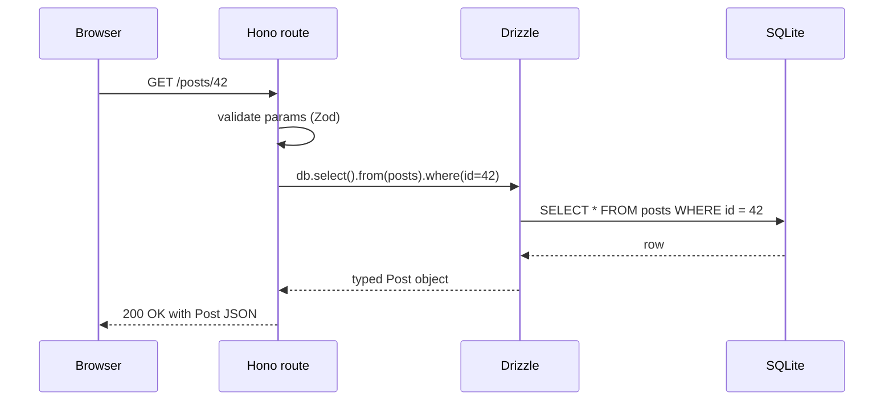

# Stage 10 — Backend basics

> **Time budget:** ~3–4 weeks

> **In one line:** Stop being just the client — write the server that listens for requests, reads from a database, and sends responses.

Up until now you've built frontends. The browser sends a request; somewhere a server responds. This stage is about *being* that server: writing code that listens for requests, reads from a database, and sends responses. Once you can do this, you can build any web app that exists.

Many backend tutorials still teach Express (the dominant Node framework for a decade). We'll use **Hono** instead — it's smaller, faster, modern, fully TypeScript-native, and runs on Node, Bun, Cloudflare Workers, and Vercel without code changes. Smaller surface area to learn, more places it can run.

For where Hono and friends fit among other backend choices, see [Backend Frameworks](/docs/stack/backend-frameworks). For more on the database side, see [Databases](/docs/stack/databases). For API style, see [APIs](/docs/stack/apis).

### 1. What a "server" actually is

A server is a program that listens on a network port for incoming HTTP requests, decides what to do with each one (often: look something up in a database, do some logic, build a response), and sends a response back. That's it. There's no magic.

```ts
// the simplest possible server, with built-in Node — no framework
import http from "node:http";

http.createServer((req, res) => {
  res.writeHead(200, { "Content-Type": "text/plain" });
  res.end("Hello from a server");
}).listen(3000, () => console.log("on http://localhost:3000"));
```

Run it (`node server.ts` with `tsx`); visit `http://localhost:3000` in a browser. That's a server. Frameworks add ergonomics on top of this — they don't change the fundamental shape.

### 2. The same thing in Hono

```bash
npm install hono @hono/node-server
npm install -D tsx
```

```ts
// server.ts
import { Hono } from "hono";
import { serve } from "@hono/node-server";

const app = new Hono();

app.get("/", (c) => c.text("Hello from Hono"));
app.get("/hello/:name", (c) => c.text(`Hello, ${c.req.param("name")}`));
app.post("/echo", async (c) => c.json(await c.req.json()));

serve({ fetch: app.fetch, port: 3000 });
```

Run with `npx tsx server.ts`. Test from your browser (GET) or with `curl` (any method). The shape: a route is "an HTTP method + a path + a function." The function gets a context object `c` with the request and response helpers.

### 3. REST: the convention every API follows

REST isn't a framework — it's a style of organising API endpoints around *resources* using HTTP verbs. The convention for a blog:

| Method | Path | Meaning |
|--------|------|---------|
| GET | /posts | List all posts |
| POST | /posts | Create a new post |
| GET | /posts/:id | Read one post |
| PUT / PATCH | /posts/:id | Update a post |
| DELETE | /posts/:id | Delete a post |

You don't have to follow REST religiously — Server Actions (Stage 8) skip it entirely. But every API you'll integrate with does, so understand the shape.

### 4. Reading and validating request data

```ts
import { z } from "zod";

const CreatePost = z.object({
  title: z.string().min(1).max(200),
  body: z.string().min(1),
});

app.post("/posts", async (c) => {
  const body = await c.req.json();
  const parsed = CreatePost.safeParse(body);
  if (!parsed.success) return c.json({ error: parsed.error.issues }, 400);

  // parsed.data is typed: { title: string; body: string }
  const post = await db.insert(posts).values(parsed.data).returning();
  return c.json(post, 201);
});
```

Lesson reinforced: every byte from the outside is suspect. Zod (or any validator) at the boundary, always.

### 5. Talking to a database — SQLite + Drizzle for your first time

The shape of every request from this point on:



> Every backend request follows this loop. Add auth, caching, logging — but the spine doesn't change.

You don't need to set up Postgres just to learn. SQLite is a database that lives in a single file on disk — no server to install, no config. Combined with Drizzle, the experience is identical to "real" databases and the code transfers directly later.

```bash
npm install drizzle-orm better-sqlite3
npm install -D drizzle-kit @types/better-sqlite3
```

```ts
// db/schema.ts
import { sqliteTable, integer, text } from "drizzle-orm/sqlite-core";

export const posts = sqliteTable("posts", {
  id: integer("id").primaryKey({ autoIncrement: true }),
  title: text("title").notNull(),
  body: text("body").notNull(),
  createdAt: integer("created_at", { mode: "timestamp" }).defaultNow(),
});
```

```ts
// db/index.ts
import { drizzle } from "drizzle-orm/better-sqlite3";
import Database from "better-sqlite3";

const sqlite = new Database("data.db");
export const db = drizzle(sqlite);
```

```ts
// using it in your routes
import { db } from "./db";
import { posts } from "./db/schema";
import { eq, desc } from "drizzle-orm";

app.get("/posts", async (c) => {
  const all = await db.select().from(posts).orderBy(desc(posts.createdAt));
  return c.json(all);
});

app.get("/posts/:id", async (c) => {
  const id = Number(c.req.param("id"));
  const [post] = await db.select().from(posts).where(eq(posts.id, id));
  if (!post) return c.json({ error: "not found" }, 404);
  return c.json(post);
});
```

### 6. Migrations: how the schema changes over time

You define the schema in TypeScript. Drizzle generates SQL migration files for you. You commit those files to git so the next developer (or your future self) can recreate the database.

```bash
npx drizzle-kit generate   # reads schema.ts, writes migration .sql
npx drizzle-kit migrate    # applies pending migrations to the DB
```

### 7. CORS: letting your frontend talk to your backend

When your frontend (running on `localhost:3000`) calls your backend (running on `localhost:8787`), the browser blocks the request by default — different origins. The backend has to opt in by sending a `CORS` header. Hono has middleware for this:

```ts
import { cors } from "hono/cors";
app.use("/*", cors({ origin: "http://localhost:3000" }));
```

### 8. Deployment

For your first backend, deploy to [Render](https://render.com) (free tier, simple) or [Railway](https://railway.app) (free trial, slightly nicer DX). Both: push to GitHub, connect the repo, set the build/start command, deploy. Migrating to Cloudflare Workers (Tier 2) is later.

### What to skip for now

- **Express** — works fine, but Hono is the better starting point in 2026.
- **Microservices** — your first backend is a monolith. The end.
- **GraphQL** — niche; REST + Server Actions handle 95% of needs.
- **Docker** — useful eventually, but Render/Railway/Vercel abstract it away for now.

## Where to go deeper

- [Hono docs](https://hono.dev/docs/) — short, well-written, covers everything.
- [Drizzle docs](https://orm.drizzle.team/docs/overview) — read "Get Started" and "Queries."
- [SQLite Tutorial](https://www.sqlitetutorial.net/) — learn enough raw SQL to read your migrations. ~3 hours.
- [Node.js docs](https://nodejs.org/en/learn) — for understanding what's actually happening under Hono.

## Deeper in this guide

- [Backend Frameworks](/docs/stack/backend-frameworks) — Hono, Express, Fastify, NestJS, and how to pick.
- [Databases](/docs/stack/databases) — Postgres, MySQL, SQLite, the managed-database landscape.
- [APIs](/docs/stack/apis) — REST, GraphQL, tRPC, and where each fits.

## Project

:::tip[Project — A working REST API with persistence]
Build a Hono API for a "links" app: `POST /links` creates a new link (validates with Zod: url required, title optional), `GET /links` lists all links newest first, `GET /links/:id` returns one, `DELETE /links/:id` removes one. Store everything in SQLite via Drizzle. Test with `curl` or [Postman](https://www.postman.com). Deploy to Render. By the end you'll have your first public-facing API.
:::

## Common mistakes

:::caution[Where people commonly trip up]
- **Trusting request bodies without validation.** `c.req.json()` returns `unknown` — anything could be in there, including a 50 MB string designed to crash your DB. Always parse with Zod (or similar) before touching the data; "the frontend will only send valid input" is a security bug, not a fact.
- **Concatenating SQL strings.** Building a query like `"SELECT * FROM users WHERE id = " + id` is the textbook SQL injection bug — a malicious id like `1; DROP TABLE users;--` will execute. Use the ORM's parameterised query API (`where(eq(users.id, id))`) so values are bound, not interpolated.
- **Storing secrets in code.** API keys, DB connection strings, JWT secrets all belong in `.env` (gitignored) and read via `process.env.NAME`. The moment you push a secret to GitHub, assume the world has it — rotate immediately.
- **Forgetting CORS until the frontend can't talk to you.** When the frontend at `localhost:3000` calls the backend at `localhost:8787`, the browser blocks it by default. Add `cors()` middleware with the explicit allowed origin — and never `origin: "*"` on an authenticated API.
:::

## Page checkpoint

<Quiz id="stage-10-page" title="Did Stage 10 stick?" sampleSize={3}>

<Question
  prompt="A user sends `POST /posts` with `{ title: &quot;&quot;, body: 12345 }`. Your handler does `const data = await c.req.json(); await db.insert(posts).values(data);`. What's the problem?"
  options={[
    { text: "Nothing — TypeScript will catch the bad types" },
    { text: "You're inserting unvalidated data straight into the DB — title is empty, body is the wrong type, and a malicious payload could be much worse. Always parse with Zod (or a schema validator) at the boundary." },
    { text: "Hono doesn't support POST requests" },
    { text: "The DB will reject it automatically" }
  ]}
  correct={1}
  explanation="`c.req.json()` returns `unknown` at runtime — TypeScript can't see what's actually in the request. A validator like Zod is the boundary guard: it rejects bad shapes with a 400 before they hit your DB."
  revisit={{ to: "/docs/roadmap/part-1-from-zero/stage-10-backend#4-reading-and-validating-request-data", label: "Revisit: Validating request data" }}
/>

<Question
  prompt="In REST conventions, what does `DELETE /posts/42` mean?"
  options={[
    { text: "Delete every post" },
    { text: "Delete the post with id 42" },
    { text: "Mark post 42 as draft" },
    { text: "Delete the user who wrote post 42" }
  ]}
  correct={1}
  explanation="REST uses HTTP verbs against resources. `DELETE /posts/42` targets one specific resource. `DELETE /posts` (the collection) would mean delete all — almost never what you want, and most APIs don't implement it."
  revisit={{ to: "/docs/roadmap/part-1-from-zero/stage-10-backend#3-rest-the-convention-every-api-follows", label: "Revisit: REST" }}
/>

<Question
  prompt="Why does this guide start you on SQLite instead of Postgres?"
  options={[
    { text: "SQLite is faster than Postgres" },
    { text: "SQLite lives in a single file with no server to install or configure — you learn the ORM and SQL fundamentals without sysadmin work; the code transfers directly to Postgres later" },
    { text: "Postgres doesn't work with Drizzle" },
    { text: "SQLite supports more data types" }
  ]}
  correct={1}
  explanation="SQLite removes setup friction so you can focus on schema design, queries, and migrations. Drizzle's API is nearly identical across SQLite and Postgres, so the transition later is a config change, not a rewrite."
  revisit={{ to: "/docs/roadmap/part-1-from-zero/stage-10-backend#5-talking-to-a-database--sqlite--drizzle-for-your-first-time", label: "Revisit: SQLite + Drizzle" }}
/>

</Quiz>

→ [Next: Stage 11 — Your first full-stack project](/docs/roadmap/part-1-from-zero/stage-11-fullstack) · [Back to Part I overview](/docs/roadmap/part-1-from-zero)
