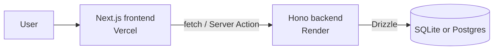

# Stage 11 — Your first full-stack project

> **Time budget:** ~2–4 weeks

> **In one line:** Connect frontend to backend, ship a project end-to-end, and live the schema → API → UI → deploy → iterate loop.

This is the capstone of Part I. You've built frontends (Stages 6–9) and backends (Stage 10) separately. Now you'll connect them, ship a single project end-to-end, and experience the full loop a working developer lives in: schema → API → UI → deploy → iterate.

The whole lifecycle this stage compresses is unpacked in [Lifecycle](/docs/lifecycle). If you add user accounts to your project, see [Authentication](/docs/foundations/authentication) for the conceptual model.

### 1. Pick a project that's just hard enough

The right first full-stack project has: more than just "list and create" (so you exercise UPDATE and DELETE), at least one piece of state that lives on the server, and a use case you'd actually want to use. Three good options to choose from, ranked by difficulty:

- **Guestbook** (easy): visitors leave messages on your portfolio. POST a message, GET the list, optional DELETE for messages you posted. One table.
- **Bookmark manager** (medium): save URLs with tags, search/filter by tag, edit and delete. Two tables (bookmarks + tags) with a many-to-many join.
- **Habit tracker** (medium): create habits, check them off daily, see a streak count. Two tables (habits + completions), date arithmetic.

Don't pick something more ambitious. You will be tempted. Resist. Shipping a smaller project teaches more than abandoning a bigger one.

### 2. The architecture (the simplest one that works)

> Two deploys (frontend + backend), one database. The standard split.

Or — and this is increasingly common — skip the separate backend entirely. Put your backend logic in Next.js server actions and your database queries in a `lib/db.ts` file. One deploy, one repo, no CORS to wrangle. Use this approach unless you have a specific reason not to.

### 3. The build sequence (the order that prevents thrashing)

1. **Sketch the schema first.** What tables, what columns, what relationships. On paper or in a comment block — not in code yet. Get this wrong and you'll rewrite the rest twice.
2. **Write the schema and migrate.** Drizzle schema in TypeScript, generate the migration, apply it. Verify with a SQLite GUI like [DB Browser for SQLite](https://sqlitebrowser.org/).
3. **Build the "happy path" UI with hardcoded data.** The page renders, but reads from a fake array. Get the layout right before plumbing.
4. **Connect one read.** Replace one hardcoded array with a server-side fetch from your database. Confirm it works.
5. **Connect one write.** A form that creates a row. Use a Server Action.
6. **Add the rest of CRUD.** Update and delete, one at a time.
7. **Polish.** Empty states, loading states, error states. The 80% of the work that happens after the feature "works."
8. **Deploy.** Push to GitHub, deploy on Vercel. Confirm it works on the live URL.

### 4. The things that will trip you up (in order of likelihood)

- **Database connection in development vs production.** SQLite file paths and Postgres connection strings differ. Use environment variables (`.env.local` for dev, Vercel's env vars for prod).
- **Forgetting to validate user input.** Always Zod. Always.
- **State that should live on the server but you put on the client.** If reloading the page loses important data, it's in the wrong place.
- **The dreaded "hydration mismatch" error.** Means your server-rendered HTML disagrees with your client-rendered version (usually: timestamps, random IDs, or `typeof window` checks). Fix by computing the variable on one side only.
- **CORS errors when calling a separate backend.** See Stage 10. Or skip the separate backend entirely (recommended).

### 5. Bonus moves that make the project portfolio-worthy

- Add basic **auth** with Clerk (Tier 2) — 30 minutes, makes the project per-user. (For the conceptual model behind auth, see [Authentication](/docs/foundations/authentication).)
- Add **optimistic UI** — the list updates before the server confirms, with rollback on failure. Feels instant.
- Write a short **README** with a screenshot, "what it does," "what's hard about it," and a deployed link. This is what you point recruiters at.
- Add **one test** (Tier 1, Vitest + Playwright) — the homepage loads without console errors. Tiny but signals "I think about quality."

## Deeper in this guide

- [Lifecycle](/docs/lifecycle) — the full development lifecycle this stage compresses: planning → architecture → implementation → testing → deploy → maintenance.
- [Authentication](/docs/foundations/authentication) — sessions, JWTs, OAuth, and the trade-offs between roll-your-own and managed auth providers.

## Project

:::tip[Project — Ship the thing you picked]
Build one of the three options (or invent your own at similar complexity). Use Next.js + Tailwind + Drizzle + SQLite or Postgres. Deploy it. Add it to your portfolio. The completion of this project is the line between "learning to code" and "I can build software." You've crossed it.
:::

## Common mistakes

:::caution[Where people commonly trip up]
- **Picking too ambitious a project.** "A Twitter clone with DMs and notifications" sounds inspiring and ships nothing. The bar is "more than just list-and-create" — guestbook, bookmark manager, habit tracker. Finishing a small project teaches more than abandoning a big one.
- **Coding before sketching the schema.** Five hours into UI work you realise a habit needs many completions per day, not one — and now the migration, the API, and the page all need rewriting. Sketch tables → columns → relationships on paper *first*; the act of writing it down exposes 80% of the structural mistakes.
- **Splitting frontend and backend repos out of habit.** Two deploys, CORS, env var duplication, two CI pipelines — for a solo project, all of that is unnecessary. Default to Next.js server actions + `lib/db.ts` in one repo unless you have a specific reason to split.
- **Skipping the empty/loading/error states.** "The feature works" usually means "the happy path works." First-load empty state, network-failed error state, and skeleton loading state are the difference between a tutorial demo and a portfolio piece — and they're 80% of perceived quality.
:::

## Page checkpoint

<Quiz id="stage-11-page" title="Did Stage 11 stick?" sampleSize={3}>

<Question
  prompt="What's the recommended first step when starting a full-stack project?"
  options={[
    { text: "Set up the deploy pipeline" },
    { text: "Sketch the database schema — tables, columns, relationships — on paper or in a comment block before writing any code" },
    { text: "Write the frontend with hardcoded data" },
    { text: "Install every library you might need" }
  ]}
  correct={1}
  explanation="Schema mistakes ripple through every layer. Sketching it first surfaces design issues (one-to-many vs many-to-many, missing columns) while they're free to fix. After that, the build sequence is schema → UI with fake data → connect reads → connect writes → polish → deploy."
  revisit={{ to: "/docs/roadmap/part-1-from-zero/stage-11-fullstack#3-the-build-sequence-the-order-that-prevents-thrashing", label: "Revisit: The build sequence" }}
/>

<Question
  prompt="You get a 'hydration mismatch' error. What does it usually mean?"
  options={[
    { text: "Your CSS file failed to load" },
    { text: "The HTML the server rendered disagrees with what the client renders — often because of a timestamp, random ID, or `typeof window` check that produces different output on each side" },
    { text: "The database needs migrating" },
    { text: "You forgot `&quot;use client&quot;`" }
  ]}
  correct={1}
  explanation="React hydrates by attaching to the server's HTML; if its first client render produces different output, you get a mismatch. The fix is usually to compute the divergent value on one side only (e.g., format the date client-side after mount)."
  revisit={{ to: "/docs/roadmap/part-1-from-zero/stage-11-fullstack#4-the-things-that-will-trip-you-up-in-order-of-likelihood", label: "Revisit: Things that trip you up" }}
/>

<Question
  prompt="For a solo first full-stack project, why does this guide recommend Next.js server actions + a `lib/db.ts` over a separate Hono backend?"
  options={[
    { text: "Server actions are faster" },
    { text: "It's one repo, one deploy, no CORS, no duplicated env vars — strictly less ceremony for the same capability, and the architecture diagram is simpler" },
    { text: "Hono doesn't work with SQLite" },
    { text: "Vercel forbids external backends" }
  ]}
  correct={1}
  explanation="Two deploys + CORS + duplicated config is real overhead. A monolith inside Next.js is the cheapest path that still teaches the full loop. Split later if you actually need to (different scaling, different team, different runtime)."
  revisit={{ to: "/docs/roadmap/part-1-from-zero/stage-11-fullstack#2-the-architecture-the-simplest-one-that-works", label: "Revisit: The architecture" }}
/>

</Quiz>

→ [Next: Stage 12 — Going professional](/docs/roadmap/part-1-from-zero/stage-12-going-pro) · [Back to Part I overview](/docs/roadmap/part-1-from-zero)
