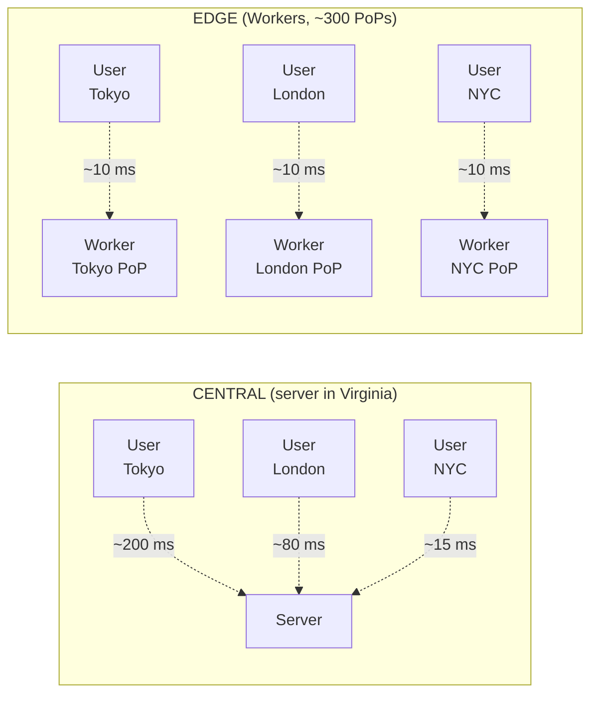
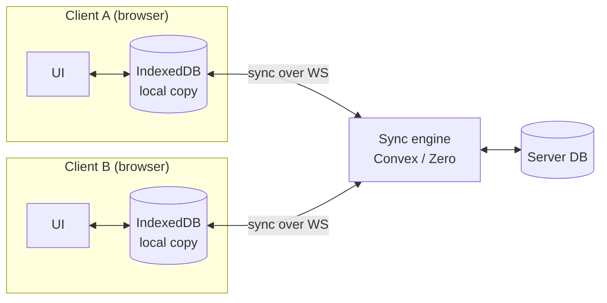
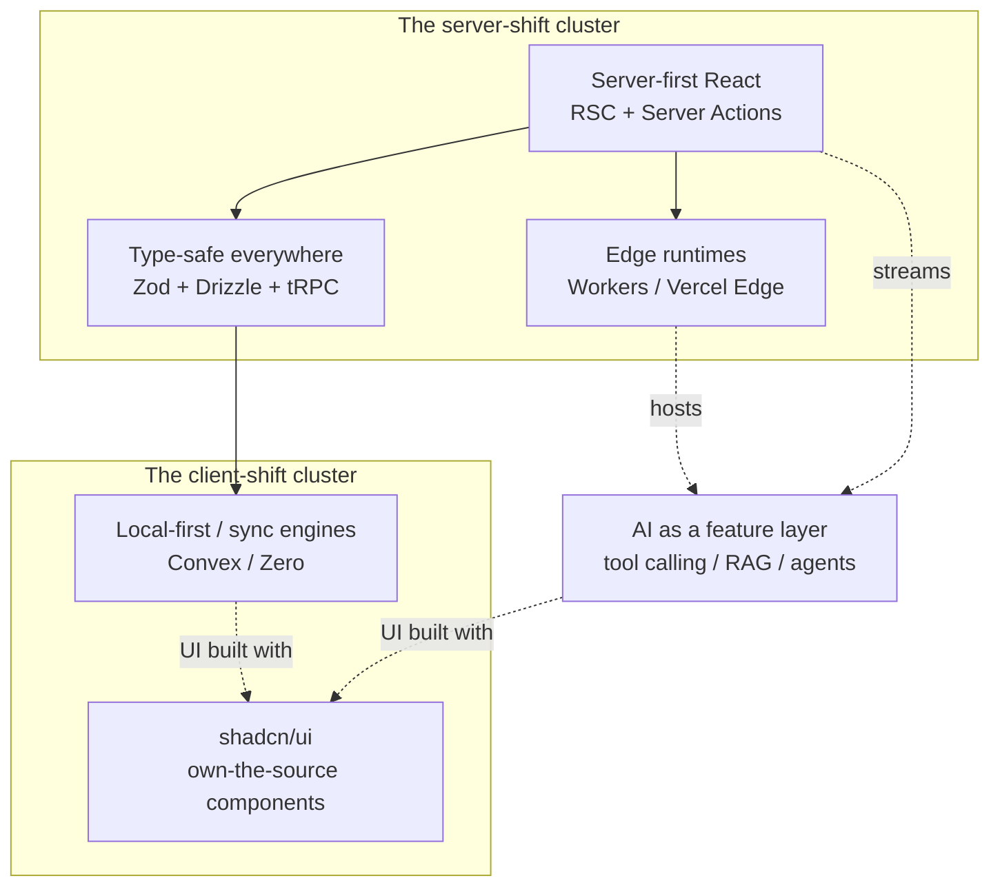

# Trends — Six 2026 Shifts

> **In one line:** Six directional shifts that reshape how 2026 web apps are built. Not tools to adopt — patterns to recognise.

## Server-first React

React was originally a client-side library — you shipped JavaScript to the browser, the browser built the page. That model dominated from 2014–2022. The cost: huge JS bundles, slow first paints, code that ran twice (once on server for SEO, once on client for interactivity).

**React Server Components** (RSC) flip this. Components run on the server by default; they can talk directly to your database, fetch from APIs without spinning up a fetch in the browser, and ship zero JavaScript to the client. You opt specific components *in* to the client (with the `"use client"` directive) when you actually need interactivity (a button, a form, animation state).

The other half is **Server Actions** — functions you declare on the server but call from the client like normal functions. No need to set up a REST endpoint, no need to write fetch code. The framework wires it up. You're already using Next.js 15/16, where this is the default. Most code in 2026 Next.js tutorials assumes it.

:::info[Prerequisite knowledge]
What HTTP is, what React components are, what "props" are (data passed into a component), what a function call is. Helpful: knowing what fetch is, what an API endpoint is, what hydration is.
:::

→ See also: [SSR](/docs/foundations/ssr), [Frontend Frameworks](/docs/stack/frontend-frameworks)

## AI as a feature layer

For 30 years, an app was: UI ↔ business logic ↔ database. The new layer is: UI ↔ business logic ↔ *LLM* ↔ database. The model isn't the product — it's a function call inside your normal app. Four patterns matter:

1. **Plain completion**: send text, get text back. ChatGPT, but in your app.
2. **Tool calling**: the model can decide to call functions you provide ("search the database," "send an email," "run this code"). You write the function; the model picks when to use it.
3. **RAG** (Retrieval-Augmented Generation): before asking the LLM, you fetch relevant snippets from your own data (using embeddings + a vector DB) and stuff them into the prompt. Lets the model "know" things outside its training data without retraining.
4. **Agents**: a loop where the model takes an action, observes the result, decides what to do next, repeats. Tool calling + state + a goal. Most "AI agents" are this.

**MCP** (Model Context Protocol) is a new standard for how models talk to tools — a USB-C for AI tools. If a service exposes MCP, any compatible AI client can use it without custom integration code.

:::info[Prerequisite knowledge]
What an API is, what JSON is, what a function signature is (the name of a function plus the kinds of arguments it takes). Helpful: basic understanding of how ChatGPT-style models work — text in, text out.
:::

→ See also: [AI Layer chapter](/docs/ai), [AI Infrastructure](/docs/stack/ai-infrastructure)

## Type-safe everywhere

TypeScript has been mainstream for years. The 2026 trend is pushing types *through the boundaries* of your system — past the front-of-the-server, into the database, across network calls, all the way to user input.

- **Zod**: a runtime validator. You describe what data should look like (`z.object({ email: z.string().email() })`) and Zod checks real values against that description AND derives a TypeScript type from it for free. Used at every boundary where data comes from outside your code (user input, API responses, env vars).
- **Drizzle**: a TypeScript ORM. Your database schema is TypeScript code; queries are written like method chains; the type checker catches typos in column names before you ever run the query.
- **tRPC**: lets you call functions on your server from the client as if they were local functions, with full TypeScript types flowing across. No more "I changed the API and now the frontend is broken at runtime."

:::info[Prerequisite knowledge]
What TypeScript is, what a "type" is in TS, the difference between compile-time and runtime errors.
:::

→ See also: [Languages](/docs/stack/languages), [APIs](/docs/stack/apis)

## Edge runtimes

Traditional backend code runs on one server (or a few) in a single data centre — say, Virginia. A user in Tokyo pays 200ms of round-trip time just to reach it. **Edge** runtimes run your code in 200+ locations around the world; the user's request hits the nearest one, ~10ms away.

The trade-off: edge runtimes are stripped-down JavaScript environments. They don't have the full Node API. You can't run heavy native libraries, you can't open a long-lived TCP connection. Within those limits — perfect for APIs, auth, redirects, and small fast endpoints.

Three you'll hear about: **Cloudflare Workers** (the biggest network, V8 isolates, generous free tier), **Vercel Edge Functions** (tightly integrated with Next.js deploys), **Bun** (a Node-compatible runtime that's faster but not strictly "edge").

> **Reading this diagram:** Same code, different deploy model. Central = one location, far for most users. Edge = many locations, near everyone.

:::info[Prerequisite knowledge]
What a server is, what Node.js is, what latency is (the delay between sending a request and getting a response), what a CDN is (content delivery network — same idea as edge, but for static files).
:::

→ See also: [CDNs and the Edge](/docs/foundations/cdn-and-edge), [Hosting](/docs/stack/hosting)

## Local-first / sync engines

A standard web app stores data on the server and the client just reads/writes via API calls. If the network's slow, the UI is slow. If you're offline, the app's dead.

A **local-first** app keeps a copy of the data on the client (in the browser's storage) and syncs it with the server in the background. The UI is instant — every action writes to the local copy first, then the sync engine propagates changes to other clients and the server.

You're not building this from scratch. Frameworks like **Convex**, **Zero** (by Rocicorp, makers of Replicache), **Triplit**, and **InstantDB** bundle the database, the sync protocol, the offline storage, and the conflict resolution into one tool. You write data-shape definitions; they handle the rest.

> **Reading this diagram:** UI reads/writes the local copy instantly. Sync engine propagates changes to peers and the server in the background.

:::info[Prerequisite knowledge]
What REST APIs are, what WebSockets are (persistent two-way connections, used for live updates), what optimistic UI is (updating the screen before the server confirms — assumes success).
:::

→ See also: [Databases](/docs/stack/databases)

## shadcn/ui

For years, building a styled component (a button, a dialog, a dropdown) meant installing a UI library (Material UI, Chakra, Ant Design) — you'd import their `<Button>`, accept their styles, and live with their bugs. Customising was painful.

**shadcn/ui** inverts this. It's not a library. It's a registry of well-built React components that you copy into your own project. You own the source. Want to change the spinner colour? Edit the file. Want to add a prop? Add it. No upgrades to fight with, no version mismatches.

The components are built on **Radix UI** primitives (which handle accessibility, keyboard nav, focus management) and styled with **Tailwind CSS**. The CLI tool reads your `components.json` config and pastes new components in when you ask.

:::info[Prerequisite knowledge]
What a React component is, what npm is, what Tailwind CSS is (utility-first CSS framework — you compose styles by stringing classes).
:::

→ See also: [Styling](/docs/stack/styling)

## How the six trends interrelate

> **Reading this diagram:** Server-first React, edge, and type-safety reinforce each other (one stack, one type system, runs everywhere). Local-first and shadcn/ui mostly affect the client. AI cuts across both — it lives on the edge but renders in the UI.

## Common mistakes

:::caution[Where people commonly trip up]
- **Treating "trend" as "tool to adopt this week."** These are *patterns to recognise* — the shapes 2026 codebases take. Tier 1/2/3 pages tell you what to actually adopt. Reading the trends page and immediately rewriting a project is the wrong response.
- **Defaulting to client components in App Router.** The Next.js App Router defaults to *server* components. Sprinkling `"use client"` at the top of every file because "that's what we used to do" defeats the whole point — you ship JS for things that didn't need it. Add `"use client"` only when the component genuinely needs state, effects, or browser APIs.
- **Picking edge for everything.** Edge runtimes are stripped-down — no full Node API, no long-lived TCP, limited CPU per request. Cron jobs, video processing, anything that opens a database pool, anything using a native dependency: keep on Node. Edge is for *small fast endpoints*, not "all backend code."
- **Confusing local-first with "client-side."** A client-side app stores data only in the browser and loses it on cache clear. A local-first app keeps a synced copy locally AND has the server as the source of truth. Don't reach for Convex/Zero on a one-user form — the complexity only pays off when you have multiplayer, offline, or collaborative needs.
:::

## Page checkpoint

<Quiz id="trends-page" title="Did the 2026 trends stick?" sampleSize={3}>

<Question
  prompt="In Next.js App Router with React Server Components, what is the DEFAULT for a new component file?"
  options={[
    { text: "Client component — it runs in the browser unless you mark it server" },
    { text: "Server component — it runs on the server unless you add &quot;use client&quot;" },
    { text: "Both — every component runs on both sides automatically" },
    { text: "Static — components are pre-rendered at build time" }
  ]}
  correct={1}
  explanation="In the App Router, components are server components by default. You opt specific components into the client by adding the &quot;use client&quot; directive at the top of the file when you need state, effects, or event handlers."
  revisit={{ to: "/docs/roadmap/part-2-modern-stack/trends#server-first-react", label: "Server-first React" }}
/>

<Question
  prompt="In the &quot;AI as a feature layer&quot; pattern, what is the model's role in the architecture?"
  options={[
    { text: "It replaces the database — the model stores all the app's data" },
    { text: "It replaces the business logic — the model decides every user-facing action" },
    { text: "It's a function call inside your normal app — UI ↔ logic ↔ LLM ↔ database" },
    { text: "It runs the frontend — the model generates HTML on each request" }
  ]}
  correct={2}
  explanation="The trend is that the model is a feature layer slotted into a normal app, not the product itself. Your app still has UI, business logic, and a database — the LLM is a function call (often via tool calling, RAG, or an agent loop) that sits alongside them."
  revisit={{ to: "/docs/roadmap/part-2-modern-stack/trends#ai-as-a-feature-layer", label: "AI as a feature layer" }}
/>

<Question
  prompt="You have a backend endpoint that opens a long-lived database connection, runs ffmpeg on uploaded video, and writes to disk. Edge or Node runtime?"
  options={[
    { text: "Edge — to minimise latency for users" },
    { text: "Edge — all 2026 backends should be edge" },
    { text: "Node — edge runtimes don't support long-lived TCP, native binaries like ffmpeg, or filesystem APIs" },
    { text: "Either — they're functionally identical" }
  ]}
  correct={2}
  explanation="Edge runtimes are stripped-down JavaScript environments. They don't have the full Node API, can't run heavy native libraries (ffmpeg), and can't hold long-lived TCP connections. Edge is for small fast endpoints; this workload belongs on Node."
  revisit={{ to: "/docs/roadmap/part-2-modern-stack/trends#edge-runtimes", label: "Edge runtimes" }}
/>

</Quiz>
