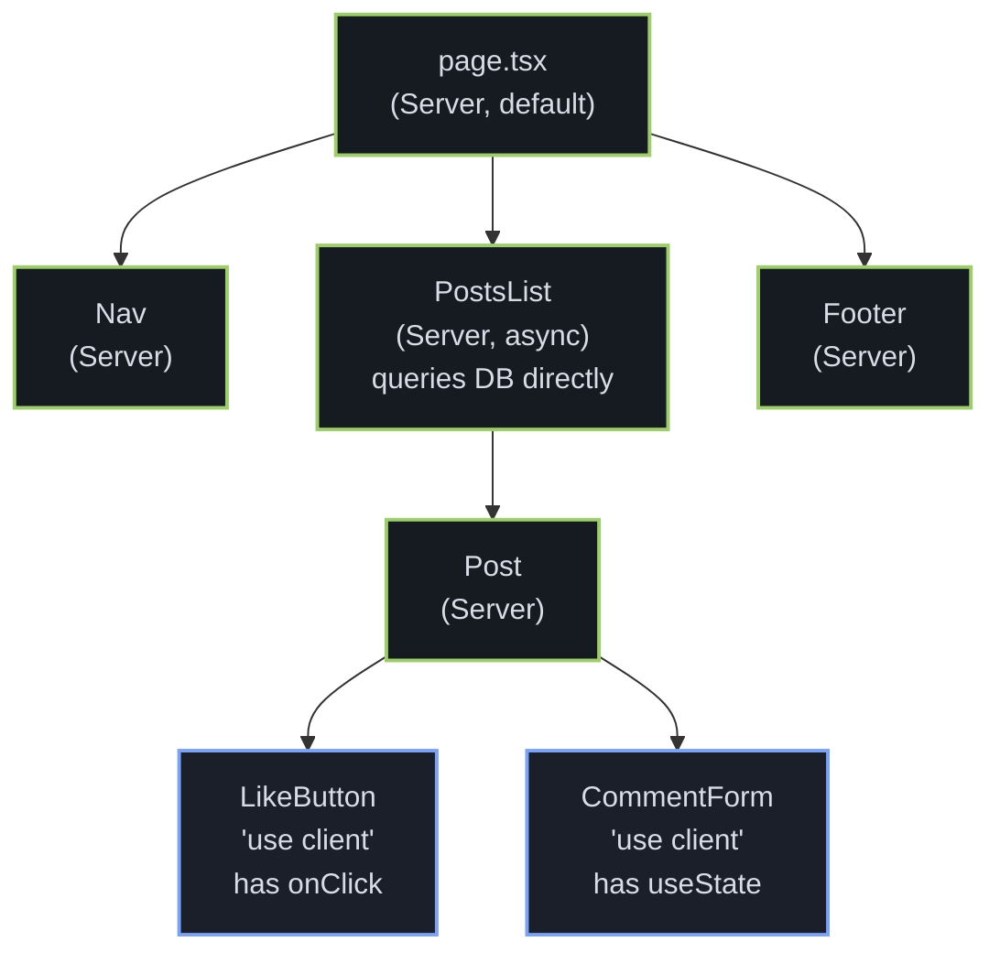
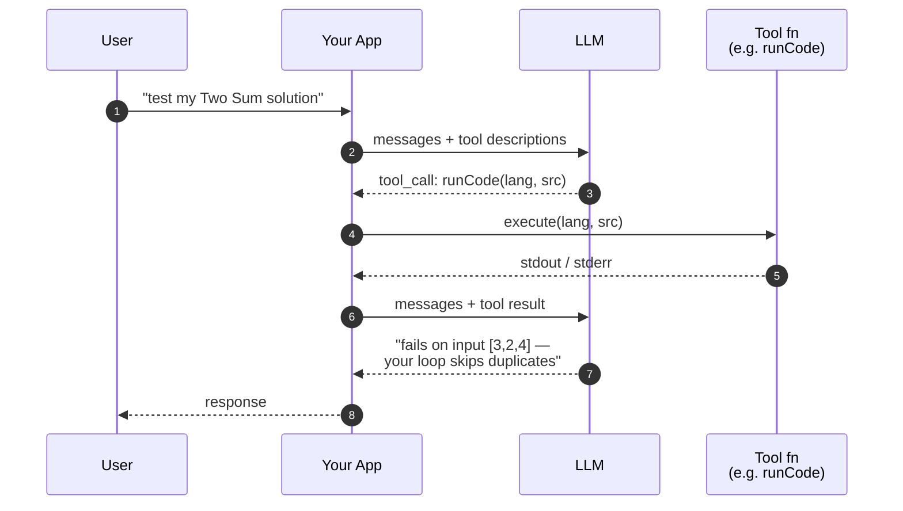
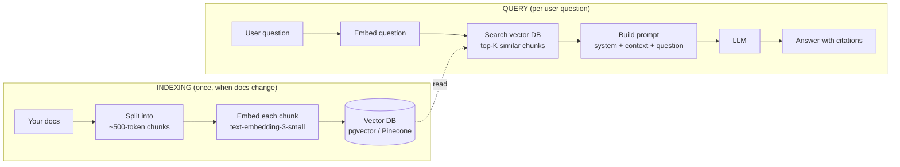

# Tier 1 — Adopt Now

> **In one line:** These six are mature, well-supported, and you'll regret not using them.

## Drizzle ORM + Zod

### What it is

**Drizzle** is a TypeScript-first ORM (Object-Relational Mapper — see Foundations). You describe your database tables in TypeScript, and Drizzle gives you a typed query builder. It generates SQL under the hood, but you never write raw SQL strings.

**Zod** is a runtime validator. You describe a "shape" — what fields an object should have, what types they should be — and Zod gives you back a checker function plus a TypeScript type, both derived from the same definition.

Together they cover the two type-safety gaps in most apps: *data coming out of the database* (Drizzle) and *data coming in from users or external APIs* (Zod).

### Why it matters for you

Your `all-in-one-URL` backend uses `psycopg2-binary` — raw SQL strings interpolated into Python code. That works, but it's the same pattern that produces SQL-injection bugs, typo-driven runtime errors, and "I renamed a column and don't know what broke." Drizzle would make every query a TypeScript expression the compiler verifies.

### Prerequisites

- Comfortable with TypeScript basics (types, interfaces, generics at a surface level).
- You know what a database table is and what a row, column, and primary key are.
- You've written at least one SQL `SELECT` by hand at some point — you don't need to be a SQL wizard, but reading the generated queries helps.
- You understand the difference between *compile-time* and *runtime*.

### How it looks

```ts
// schema.ts — describe your tables in code
import { pgTable, serial, text, timestamp } from "drizzle-orm/pg-core";

export const users = pgTable("users", {
  id: serial("id").primaryKey(),
  email: text("email").notNull().unique(),
  createdAt: timestamp("created_at").defaultNow(),
});

// query.ts — every query is a typed expression
const user = await db.select().from(users).where(eq(users.email, input));
// user is typed as { id: number; email: string; createdAt: Date }[]
```

And Zod validating the input first:

```ts
import { z } from "zod";

const CreateUser = z.object({
  email: z.string().email(),
  age: z.number().int().min(13),
});

// at the boundary
const parsed = CreateUser.parse(req.body); // throws if invalid
// parsed is typed as { email: string; age: number }
```

### First step

Rewrite one endpoint of `all-in-one-URL` in TypeScript using Drizzle + Zod. Start with the `/health` or a tiny read endpoint. Keep the rest of the Python backend running side by side.

→ See also: [ORMs](/docs/stack/orms), [Languages](/docs/stack/languages)

## shadcn/ui (formal adoption)

### What it is

A CLI tool + a registry of unstyled, accessible React components. Run `npx shadcn@latest add button` and a `button.tsx` file appears in your project's `components/ui/` folder. You own it. You change it like any other file.

Internally each component wraps a **Radix UI** primitive (Radix handles the hard parts: keyboard navigation, focus traps, ARIA attributes, animation lifecycles) and applies **Tailwind** classes for styling. Variants are managed by **class-variance-authority** (CVA) — a small library that lets you define a base style + a set of named modifiers.

### Why it matters for you

Your `all-in-one-URL/ui` already uses the building blocks — `@radix-ui/react-slot`, `class-variance-authority`, `clsx`, `tailwind-merge`. You're hand-rolling what shadcn standardises. Adopting shadcn formally means: (a) a CLI manages new components, (b) you get the well-tested Radix-based defaults instead of writing your own, (c) reusing the same components in `personal-site` and `solomock` is trivial.

### Prerequisites

- You know what a React component is.
- You've used Tailwind classes (`className="px-4 py-2 bg-blue-500"`).
- You've run an `npx` command before (npx runs a one-off npm package without permanently installing it).
- You understand what "accessibility" (a11y) is at a basic level — making apps usable with a keyboard, with a screen reader, by people who don't see colour the same way.

### How it looks

```bash
# 1. one-time setup in any Next.js / Vite + React project
npx shadcn@latest init

# 2. add components as you need them
npx shadcn@latest add button
npx shadcn@latest add dialog
npx shadcn@latest add dropdown-menu
```

```ts
// 3. import like any local component
import { Button } from "@/components/ui/button";
```

Every file landed in your repo. To customise the button's hover colour, you open `components/ui/button.tsx` and edit it. There's no "library version" to upgrade.

### First step

Run `npx shadcn@latest init` on `personal-site`. Add `button`, `card`, and `dialog`. Swap one existing button for the shadcn one and confirm nothing breaks.

→ See also: [Styling](/docs/stack/styling)

## React Server Components + Server Actions

### What it is

A way of writing React that splits components into two flavours:

- **Server components** (the default in Next.js App Router) run on the server only. They can be `async`, can talk to the database directly, can read files, can keep secrets. They produce HTML and a serialised description of what to render. They *cannot* use hooks like `useState` or event handlers like `onClick`.
- **Client components** (marked with `"use client"` at the top of the file) run in both places: on the server to produce initial HTML, then in the browser where they become interactive. These can use state, effects, event handlers.

**Server Actions** are functions tagged with `"use server"`. You can call them from a client component as if they were local functions; Next.js secretly turns the call into an HTTP request and runs the function on the server. They're typically used to handle form submissions and mutations.

### Why it matters for you

Your `solomock` project has `app/api/session/route.ts` — a manual REST endpoint you fetch from the client. With Server Actions, you'd just define a function in a server module and call it from the client component directly. Less boilerplate, fewer files, types flow end-to-end.

Your `personal-site` already uses RSC for the static parts and `ssr: false` dynamic import for the `ContactForm`. That's the right pattern — but going deeper means understanding why some things must be client-only (browser extensions, hydration mismatches) and most things shouldn't be.

### Prerequisites

- You know what a React component is.
- You've used `useState` at least once.
- You know what "fetching data" means — calling an API to get data, usually with `fetch` or `axios`.
- You understand "hydration" — see [SSR](/docs/foundations/ssr).
- Helpful: you've written a form with an `onSubmit` handler.

### How it looks



> **Reading this diagram:** Green = server-only (zero JS shipped). Blue = client (interactive, ships JS). Default is server; you opt in to client.

```tsx
// app/posts/page.tsx — a server component, the default
import { db } from "@/lib/db";

export default async function PostsPage() {
  const posts = await db.select().from(postsTable); // direct DB access
  return (
    <ul>
      {posts.map(p => <li key={p.id}>{p.title}</li>)}
    </ul>
  );
}
```

```ts
// app/posts/actions.ts — a server action
"use server";
import { db } from "@/lib/db";

export async function createPost(formData: FormData) {
  const title = formData.get("title") as string;
  await db.insert(postsTable).values({ title });
}
```

```tsx
// app/posts/NewPostForm.tsx — a client component using the action
"use client";
import { createPost } from "./actions";

export function NewPostForm() {
  return (
    <form action={createPost}>
      <input name="title" />
      <button>Create</button>
    </form>
  );
}
```

### First step

In `solomock`, convert `app/api/session/route.ts` into a server action. Keep the same logic — minting an ephemeral OpenAI client_secret — but expose it via a "use server" function and call it from the React component directly.

→ See also: [Frontend Frameworks](/docs/stack/frontend-frameworks), [SSR](/docs/foundations/ssr)

## AI: tool calling + RAG

### What it is

**Tool calling** (also called "function calling"): you give the LLM a JSON description of functions it could call, with their names, parameters, and what they do. The model can either reply with normal text, OR it can reply with a structured request like "please call `searchDatabase('two sum')`." Your code runs that function and feeds the result back into the model, which then continues.

**RAG** (Retrieval-Augmented Generation): a pipeline that injects relevant snippets from your own data into the LLM's prompt at query time. Steps:

1. Pre-process: split your documents into chunks (~500 tokens each).
2. For each chunk, compute an **embedding** (a list of ~1500 numbers) using an embedding model (e.g. OpenAI's `text-embedding-3-small`). Store the chunk + embedding in a vector database.
3. At query time: embed the user's question, find the K most similar chunks in the vector DB, paste them into the prompt as context.
4. Ask the LLM to answer using the provided context.

RAG lets the model "know" data outside its training set, without retraining the model — which would cost millions.

### Why it matters for you

Your `solomock` only does voice + screen-watching. Two clear upgrades:

- **Tool calling**: give the interviewer LLM a `run_code(language, source)` tool. It can actually execute the user's solution against test cases mid-interview, then react to the output. Much more like a real interviewer.
- **RAG**: index your `web-dev-tutorial` docs. Build a small chatbot that lets readers ask "how do I deploy to Render?" and answers using actual snippets from your guide.

### Prerequisites

- You know what an HTTP request is and how to call an API with `fetch` or a client SDK.
- You know what JSON is.
- You've made at least one call to an LLM API (OpenAI, Anthropic, etc.) and got a text response.
- For RAG: comfortable with the concept of "this list of numbers represents the meaning of this text" (embeddings — see [AI Layer chapter](/docs/ai)).
- Helpful: basic familiarity with cosine similarity or "distance between vectors" — but you don't need the math, the libraries handle it.

### How tool calling looks



> **Reading this diagram:** The LLM doesn't run your code. It asks your app to run it, then reasons over the result.

```ts
// 1. you define tools the model can call
const tools = [{
  type: "function",
  function: {
    name: "run_code",
    description: "Execute a code snippet and return stdout/stderr",
    parameters: {
      type: "object",
      properties: {
        language: { type: "string", enum: ["python", "javascript"] },
        source: { type: "string" },
      },
      required: ["language", "source"],
    },
  },
}];

// 2. you call the model with these tools attached
const response = await openai.chat.completions.create({
  model: "gpt-4o",
  messages: [...history],
  tools,
});

// 3. if the model picked a tool, response includes a tool_calls array
if (response.choices[0].message.tool_calls) {
  for (const call of response.choices[0].message.tool_calls) {
    const args = JSON.parse(call.function.arguments);
    const result = await runCode(args.language, args.source);
    // feed result back into the conversation
  }
}
```

### How RAG looks (conceptually)



> **Reading this diagram:** RAG = look stuff up first, then ask the LLM. The model "knows" your data without ever being retrained.

```ts
// indexing pass — run once when content changes
for (const chunk of chunks) {
  const embedding = await openai.embeddings.create({
    model: "text-embedding-3-small",
    input: chunk.text,
  });
  await vectorDB.insert({ text: chunk.text, vector: embedding.data[0].embedding });
}

// query pass — run per user question
const qEmbed = await openai.embeddings.create({ model, input: question });
const hits = await vectorDB.search(qEmbed.data[0].embedding, { k: 5 });
const context = hits.map(h => h.text).join("\n---\n");

const answer = await openai.chat.completions.create({
  model: "gpt-4o",
  messages: [
    { role: "system", content: `Answer using this context:\n${context}` },
    { role: "user", content: question },
  ],
});
```

### First step

Pick *one*. Either: add a `run_code` tool to solomock (use a sandboxing service like e2b or Modal for execution) — or: build a 50-line RAG over your `web-dev-tutorial` markdown using `pgvector` (Postgres extension) and the OpenAI embedding API. The RAG one is simpler to start with.

→ See also: [AI Layer chapter](/docs/ai), [AI Infrastructure](/docs/stack/ai-infrastructure)

## Vitest + Playwright

### What it is

Three layers of testing:

- **Unit tests**: test one function in isolation. "Given input X, this function should return Y." Fast (milliseconds), narrow scope.
- **Integration tests**: test that several pieces work together. "When I call this API route, it should write a row to the DB."
- **End-to-end (E2E) tests**: drive a real browser and click through your app. "User loads homepage, clicks Sign Up, fills the form, sees the dashboard." Slow (seconds-to-minutes), broad scope.

**Vitest** is the modern test runner for JavaScript/TypeScript projects — drop-in compatible with the Jest API (the older standard) but much faster because it uses Vite under the hood. Good for unit + integration.

**Playwright** is a browser automation library by Microsoft. It launches a real Chromium/Firefox/WebKit, navigates pages, clicks elements, takes screenshots. Good for E2E.

### Why it matters for you

None of your six projects has tests. That's fine while you're learning — but for anything you'd put on a resume or ship to users, a smoke test (does the homepage load and not crash?) is the difference between catching a bug pre-deploy vs. learning about it from a user. Adding even one test per project would massively improve your shipping confidence.

### Prerequisites

- You can write a function.
- You understand what an **assertion** is — a statement that says "this should be true; if it isn't, fail the test." Like `expect(2 + 2).toBe(4)`.
- You understand what a **CI** is (Continuous Integration — see Foundations). Tests are most useful when they run automatically on every code change.
- For Playwright: you've used your browser's DevTools (inspect element, console) before.

### How a Vitest unit test looks

```ts
// problems.test.ts
import { describe, it, expect } from "vitest";
import { findProblem } from "./problems";

describe("findProblem", () => {
  it("returns the problem when slug exists", () => {
    const p = findProblem("two-sum");
    expect(p?.title).toBe("Two Sum");
  });

  it("returns undefined when slug is missing", () => {
    expect(findProblem("does-not-exist")).toBeUndefined();
  });
});
```

### How a Playwright E2E test looks

```ts
// e2e/homepage.spec.ts
import { test, expect } from "@playwright/test";

test("homepage loads and shows hero", async ({ page }) => {
  await page.goto("http://localhost:3000");
  await expect(page.getByRole("heading", { level: 1 })).toBeVisible();
  await expect(page).toHaveTitle(/To Yin Yu/);
});

test("contact form submits", async ({ page }) => {
  await page.goto("http://localhost:3000#contact");
  await page.getByLabel("Name").fill("Test User");
  await page.getByLabel("Email").fill("a@b.com");
  await page.getByLabel("Message").fill("hello");
  await page.getByRole("button", { name: "Send" }).click();
  await expect(page.getByText("Thanks")).toBeVisible();
});
```

### First step

Add one Playwright test to `personal-site`: "homepage loads, hero renders, no console errors." Wire it into a GitHub Action so it runs on every push. That's the smallest setup that gives real value.

→ See also: [Testing in the lifecycle](/docs/lifecycle/testing)

## Sentry + PostHog

### What it is

Two categories of **observability** tools — software that tells you what's happening in your live app.

- **Sentry**: error tracking. When your app crashes — anywhere, on any user's browser, on your server — Sentry captures the error, the stack trace, the browser/OS, the user's actions leading up to it, and emails or Slacks you. Without it, you only learn about bugs from angry users.
- **PostHog**: product analytics + session replay + feature flags. It tells you which pages users visit, what they click, where they drop off, and lets you watch a recording of any user's session.

A "source map" is a file that maps your minified, bundled production JavaScript back to your original source code. Sentry uses source maps so error stack traces show `src/components/Hero.tsx:42` instead of `a.b.c at 7,2389`.

### Why it matters for you

Your `personal-site`, `roofing-site`, and `all-in-one-URL` are public and have zero error tracking or usage analytics. You don't know if someone's contact form ever errors, or whether the URL shortener handles the URL formats people actually paste. Sentry + PostHog free tiers are generous; both are 10-minute integrations.

### Prerequisites

- You know what an "error" is in code — an exception, a crash.
- You know what a stack trace is — the chain of function calls leading to an error.
- You've used `console.log` for debugging.
- For PostHog: you understand what a "page view" is and what "user funnel" means (a sequence of steps you hope users complete).

### How it looks

```bash
# install — for a Next.js project
npx @sentry/wizard@latest -i nextjs
```

```ts
// after the wizard, your code is auto-instrumented.
// to track a specific issue manually:
import * as Sentry from "@sentry/nextjs";

try {
  await doSomethingRisky();
} catch (err) {
  Sentry.captureException(err, { extra: { userId, action: "submit" } });
}
```

```ts
// PostHog — track a custom event
import posthog from "posthog-js";

posthog.capture("contact_form_submitted", { source: "homepage" });
```

### First step

Drop Sentry into `all-in-one-URL/ui` via the wizard. Force an error (throw inside a button handler), confirm it shows up in your Sentry dashboard with a useful stack trace.

→ See also: [Observability tools](/docs/stack/observability-tools), [Observability in lifecycle](/docs/lifecycle/observability)
