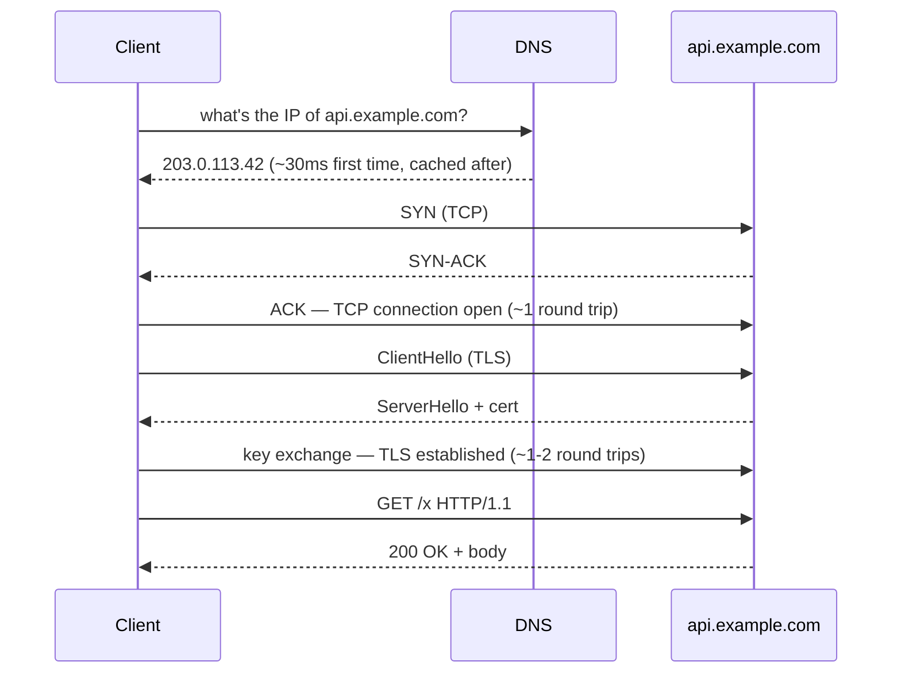

---
id: cs-fundamentals
title: Computer-Science Fundamentals
sidebar_position: 2
sidebar_label: CS fundamentals
description: Big-O, N+1, the HTTP lifecycle, concurrency, closures, and database internals — the layer under every framework.
---

# Computer-Science Fundamentals

> **In one line:** The vocabulary every senior engineer uses without thinking. None of it changes with framework cycles.

The layer under every framework. You don't need a CS degree, but you do need to actively go looking — frameworks are built to hide this from you. Six concepts that pay back every year you do this job.

## 1. Big-O: why a nested loop hurts later

Big-O notation describes how an algorithm's work grows as input grows. `O(n)` = double the input, double the work. `O(n²)` = double the input, *quadruple* the work. `O(1)` = same work no matter the size. The trap: code with bad complexity feels fine on small inputs and quietly breaks at scale.

```ts
// O(n²) — for every user, scan every user, looking for matches
function findDuplicateEmails(users: User[]) {
  const dupes: string[] = [];
  for (const a of users) {
    for (const b of users) {
      if (a.id !== b.id && a.email === b.email) dupes.push(a.email);
    }
  }
  return dupes;
}
// 1,000 users → 1,000,000 comparisons. 10,000 users → 100,000,000. Frozen UI.

// O(n) — single pass with a Set (hash-based, O(1) lookup)
function findDuplicateEmails(users: User[]) {
  const seen = new Set<string>();
  const dupes: string[] = [];
  for (const u of users) {
    if (seen.has(u.email)) dupes.push(u.email);
    seen.add(u.email);
  }
  return dupes;
}
// 10,000 users → 10,000 lookups. Instant.
```

The killer move: any time you see a loop inside a loop, ask whether a `Set`, `Map`, or a single sorted pass would replace it.

## 2. The N+1 query: the database version of the same trap

Same shape as O(n²), but the inner "operation" is a network round trip to the database — so the cost is much worse than CPU instructions.

```ts
// BAD — 1 query for posts, then N queries for authors
const posts = await db.select().from(postsTable);
for (const p of posts) {
  p.author = await db.select().from(users).where(eq(users.id, p.authorId));
}
// 100 posts → 101 round trips → ~1 second of latency from network alone

// GOOD — one query, one round trip
const postsWithAuthors = await db
  .select()
  .from(postsTable)
  .leftJoin(users, eq(postsTable.authorId, users.id));
```

ORMs love to hide this. The signature is: a loop over query results that calls `.find()`, `.select()`, or `.where()` inside the loop. Always reach for a `JOIN` or an `IN (?)` batch query instead.

## 3. The HTTP lifecycle no tutorial shows you

When `fetch("https://api.example.com/x")` runs, here's what actually happens before your code sees a byte of response:



*Round trips are the unit of cost. A user 200ms away pays ~600ms before your handler even runs.*

This is why CDNs exist (cache the response near the user), why HTTP/2 multiplexing matters (reuse one connection for many requests), and why edge runtimes are fast (the round trip is short).

Status codes worth knowing cold:

| Code | Meaning | When you see it |
|------|---------|-----------------|
| 301 / 302 | Permanent / temporary redirect | Search engines treat them differently — pick deliberately |
| 400 | Bad request (client's fault) | Malformed JSON, invalid params |
| 401 / 403 | Not authenticated / not authorised | 401 = "log in"; 403 = "logged in, but not allowed" |
| 404 | Not found | The resource doesn't exist *or* you don't have permission to know it exists |
| 409 | Conflict | Duplicate insert, optimistic-lock failure |
| 500 | Your server crashed | Unhandled exception in your code |
| 502 / 504 | Bad gateway / upstream timeout | Your reverse proxy can't reach the upstream, or it didn't reply in time — often a sign of a slow DB query or a crashed upstream |
| 503 | Service unavailable | Server is up but refusing — usually rate limiting or a deploy in progress |

## 4. Concurrency: the race condition you'll write in JavaScript

"JavaScript is single-threaded" means one CPU instruction at a time. It does *not* mean you can't have race conditions. Every `await` is a suspension point where other code runs.

```ts
let balance = 100;

async function withdraw(amount: number) {
  const current = balance;          // 1. read
  await checkFraud(amount);          // 2. ⚠ suspend — other withdraw() calls run here
  balance = current - amount;        // 3. write using the STALE current
}

await Promise.all([withdraw(50), withdraw(50), withdraw(50)]);
// balance === 50, not -50. Two withdrawals silently disappeared.
```

Anything you read *before* an `await` and use *after* may be stale. Fixes: do the operation atomically in the database (`UPDATE balance = balance - ? WHERE id = ?` is one atomic statement), use a lock, or restructure so the read+write don't span an await.

## 5. Closures and stale captures

A closure is a function that remembers the variables from where it was created. The bug is what it remembers — and what it doesn't.

```js
// Classic — `var` is function-scoped, all three closures share the same `i`
for (var i = 0; i < 3; i++) {
  setTimeout(() => console.log(i), 100);
}
// logs 3, 3, 3

// `let` is block-scoped, each iteration gets a fresh `i`
for (let i = 0; i < 3; i++) {
  setTimeout(() => console.log(i), 100);
}
// logs 0, 1, 2
```

This is the same mechanism behind React's "stale closure" bug: a `useEffect` captures the value of a state variable when it ran; if the component re-renders and the effect doesn't re-run, the closure still holds the old value. Fix: include the variable in the dependency array, or use a `ref`.

## 6. Databases: indexes, transactions, isolation

An **index** is a sorted side-structure (usually a B-tree) that lets the DB find a row in `O(log n)` instead of scanning the table. Cost: every insert/update also updates the index. Rule of thumb: index columns you filter on (`WHERE`), join on, or sort by; don't index columns you only ever read.

A **transaction** groups statements so they all succeed or all roll back. Without one: "transfer $100 from A to B" can debit A and then crash before crediting B. With one: both happen, or neither does.

```ts
// Without a transaction — partial state if the second statement throws
await db.update(accounts).set({ balance: a.balance - 100 }).where(eq(accounts.id, a.id));
// 💥 process crashes here — money vanished
await db.update(accounts).set({ balance: b.balance + 100 }).where(eq(accounts.id, b.id));

// With a transaction — atomic
await db.transaction(async (tx) => {
  await tx.update(accounts).set({ balance: a.balance - 100 }).where(eq(accounts.id, a.id));
  await tx.update(accounts).set({ balance: b.balance + 100 }).where(eq(accounts.id, b.id));
});
```

**Isolation levels** decide what concurrent transactions can see of each other. Postgres defaults to *read committed*: you see other transactions' writes the moment they commit. *Serialisable* behaves as if transactions ran one at a time. Most production bugs are someone assuming serialisable behaviour while running on read committed (e.g., "I read the balance, then wrote a new balance — but someone else wrote between my read and write").

The single most useful skill for backend work: read `EXPLAIN ANALYZE` output. It shows which indexes Postgres used, which it scanned sequentially, and where the time went. Five minutes with `EXPLAIN` finds bugs ten hours of staring at code wouldn't.

## Why this matters for you

Drizzle hides SQL. Next.js hides HTTP. React hides the DOM. When something breaks at a layer the framework hides, you need to know the layer exists. Every one of the six concepts above will eventually surface in your projects: SoloMock's transcript saving (transactions), the URL shortener (indexes on the slug column), the contact form retry behaviour (idempotency, next section), an interview LLM call that pauses mid-async (concurrency).

:::info[Where this connects in the stack]
The type system you use to model your domain ([Languages](/docs/stack/languages)) is what makes most of these concepts *legible* in code — a `Set<string>` vs a nested loop, an `await` you can actually see, a transaction wrapped in a typed `tx` callback. Picking a language with a sharp type system isn't a fashion choice; it's how you keep these fundamentals visible at the surface.
:::

## How to practice

One book per year in this category. *Designing Data-Intensive Applications* (Kleppmann) is the canonical backend one — wait until one of your backends has felt the pain before tackling it. Before then: CS50 (Harvard's free intro), Stanford's Algorithms course on Coursera, or the Postgres docs on indexes and EXPLAIN. *High Performance Browser Networking* by Ilya Grigorik (free online) for the HTTP/TCP/TLS layer.

## First step

Next time you write a Drizzle query, log the actual SQL (Drizzle has a query logger built in) and run `EXPLAIN ANALYZE` on the result against your real data. Do this ten times across your projects. The abstraction stops being opaque, and you'll spot two or three missing indexes immediately.

## Common mistakes

:::caution[Where people commonly trip up]
- **Reaching for Big-O before measuring.** "This *might* be slow on 10k rows" turns into a week refactoring code that runs on 50 rows in production. Measure first (a `console.time`, an `EXPLAIN ANALYZE`, a Sentry latency trace), optimise only the lines the numbers point at.
- **Confusing "I've read about N+1" with "I can spot it in the wild."** The bug almost never looks like a literal `for` loop with `await db.query` inside — it hides behind ORM lazy-loaders, GraphQL field resolvers, and `.map(p => fetchAuthor(p))`. Log the actual SQL from your ORM in dev; if you see the same query shape 50 times for one page load, you've found one.
- **Assuming "JavaScript is single-threaded" means race-free.** Every `await` is a suspension point — values you read *before* the await can be stale when you write them *after*. Do compound read-modify-write operations atomically in the DB, or wrap them in a transaction.
- **Treating indexes as free.** Indexing every column slows writes, balloons disk usage, and confuses the query planner. Index columns you actually filter, join, or sort on, and check with `EXPLAIN ANALYZE` that the index is being used — not just that it exists.
:::

## Page checkpoint

<Quiz id="cs-fundamentals-page" title="Did CS fundamentals stick?" sampleSize={3}>

<Question
  prompt="When does an O(n²) algorithm actually become a problem in practice?"
  options={[
    { text: "Immediately — O(n²) code is always wrong and should be rewritten" },
    { text: "Only when n is large enough that the squared term dominates — small n is usually fine, but the cliff is sharp once you cross it" },
    { text: "Never on modern hardware — CPUs are fast enough that complexity doesn't matter" },
    { text: "Only when the inner loop touches the database" }
  ]}
  correct={1}
  explanation="O(n²) on 50 items is 2,500 ops — instant. On 10,000 items it's 100,000,000 ops — the UI freezes. The danger is that the code feels fine in dev and silently breaks at production scale. Measure on realistic data."
  revisit={{ to: "/docs/roadmap/part-3-beyond/cs-fundamentals#1-big-o-why-a-nested-loop-hurts-later", label: "Big-O: when nested loops hurt" }}
/>

<Question
  prompt="What's the telltale signature of an N+1 query bug?"
  options={[
    { text: "A single query that returns more than 1,000 rows" },
    { text: "A loop over query results where each iteration triggers another query (often hidden behind an ORM lazy-load or a `.map(x => fetch...)`)" },
    { text: "Any query that uses a JOIN" },
    { text: "A query that takes more than 100ms by itself" }
  ]}
  correct={1}
  explanation="N+1 = 1 query to get a list, then N more queries (one per item) to load related data. The fix is a JOIN or an IN(?) batch. The bug usually hides behind ORM lazy-loaders or per-item `await`s in a loop — log the actual SQL to spot it."
  revisit={{ to: "/docs/roadmap/part-3-beyond/cs-fundamentals#2-the-n1-query-the-database-version-of-the-same-trap", label: "The N+1 query trap" }}
/>

<Question
  prompt="Before your HTTP handler runs on a first request to a new host, which round-trips have already happened?"
  options={[
    { text: "None — the request goes straight to the server" },
    { text: "Just DNS" },
    { text: "DNS lookup, TCP handshake, and TLS handshake — each a network round-trip before the first HTTP byte is sent" },
    { text: "Only the TLS handshake; DNS and TCP are negligible" }
  ]}
  correct={2}
  explanation="DNS, TCP, and TLS each cost a round-trip before HTTP can even start. On a 200ms-RTT network, that's roughly 600ms of overhead before your code runs. This is why CDNs, HTTP/2 multiplexing, and edge runtimes matter so much."
  revisit={{ to: "/docs/roadmap/part-3-beyond/cs-fundamentals#3-the-http-lifecycle-no-tutorial-shows-you", label: "The HTTP lifecycle" }}
/>

</Quiz>

---

→ Next: [Engineering Judgment](/docs/roadmap/part-3-beyond/engineering-judgment) · [Back to Part III overview](/docs/roadmap/part-3-beyond)
