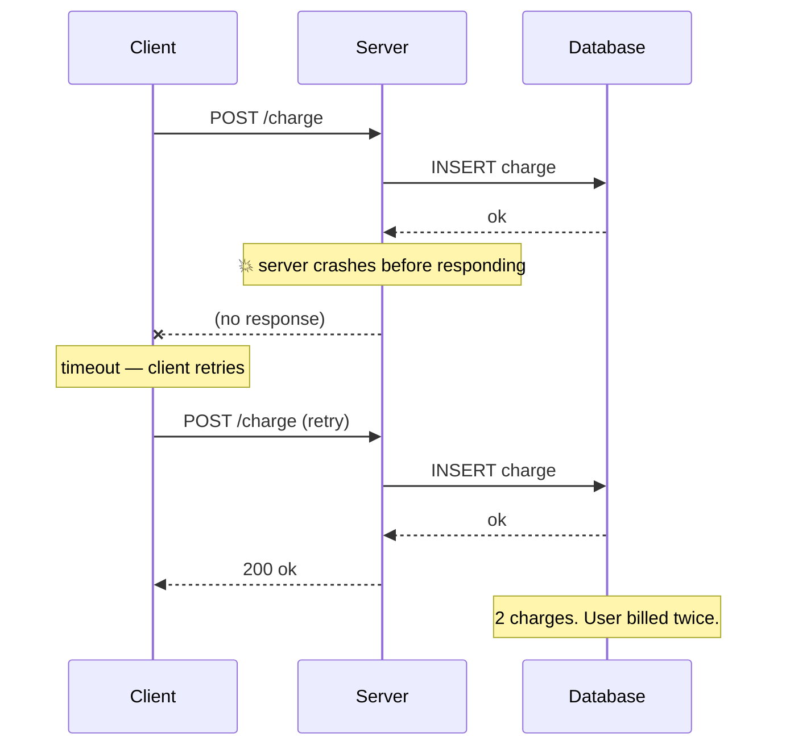

---
id: systems-thinking
title: Systems Thinking
sidebar_position: 4
sidebar_label: Systems thinking
description: Failure modes, idempotency, observability, caching, and zero-downtime migrations — treating your code as a thing that runs in a real environment.
---

# Systems Thinking

> **In one line:** Treating your code as a thing that runs in a real environment, not a thing that executes in your head.

The unifying question is always *"what happens if X?"* — where X is the unexpected, the failed, the simultaneous, the retried.

:::info[Where this lives in the rest of the guide]
The patterns on this page show up everywhere production code does:

- The end-to-end picture of how requests, services, and data move through real systems lives in [Enterprise workflow](/docs/enterprise).
- The instrumentation side — actually seeing what's happening — is covered in [Observability (lifecycle)](/docs/lifecycle/observability).
- For a structured way to compare architectures along the trade-offs this page describes, see [Comparison](/docs/comparison).
:::

## 1. Failure modes: every operation can break in three places

A network call is not "success or error." It's "succeeded and you know it, succeeded but you don't know it, or failed." That middle case is where most production bugs live.



*The DB committed the first charge before the server died. The client never knew. The retry duplicated it.*

This shape repeats everywhere. Any non-trivial mutation should be designed assuming it might run twice.

## 2. Idempotency: making retries safe

An operation is **idempotent** if running it twice has the same effect as running it once. Reads are naturally idempotent. Writes are not — unless you design them to be.

```ts
// NOT idempotent — retry double-charges the customer
await stripe.charges.create({ amount: 5000, customer: "cus_123" });

// Idempotent — Stripe deduplicates by the key. Safe to retry.
await stripe.charges.create(
  { amount: 5000, customer: "cus_123" },
  { idempotencyKey: "order-789-charge" }
);
```

Three common patterns to make your own operations idempotent:

- **Unique constraint + ON CONFLICT**: `INSERT ... ON CONFLICT DO NOTHING`. Second insert with the same key is a no-op.
- **State-machine guards**: `UPDATE orders SET status='paid' WHERE id=? AND status='pending'`. The second call finds no row in 'pending' and silently does nothing.
- **Idempotency key table**: store the (request_id, response) pair on first call; second call with the same request_id returns the cached response without re-executing.

Anywhere money, email, or external side effects are involved: assume the operation might run twice and design accordingly.

## 3. The observability mental model: three pillars

Sentry and PostHog are the tools; the model behind them is what matters.

- **Logs**: discrete events with context. "User 42 clicked checkout at 14:23." Useful for debugging a specific issue after the fact. Cheap to write, expensive to query at scale.
- **Metrics**: aggregated numbers over time. "p95 API latency was 230ms over the last 5 minutes." Cheap to query, lose individual context. Use for dashboards, alerts, SLOs.
- **Traces**: the full tree of operations triggered by one request — "this request → 3 DB queries → 1 external API call → 2 cache hits, here's the time spent in each." The right tool when you want to know *why* a request was slow.

Two ideas worth Googling once: **SLO** (service-level objective — "99.9% of requests under 500ms over 30 days") and **cardinality** (how many distinct values a metric label can have; high cardinality blows up your bill — e.g. tagging metrics by user_id is almost always wrong).

Default logging hygiene: log on entry and exit of any operation that touches the network; include a request ID that flows through; never log secrets or PII.

:::tip[Tooling pointer]
The full lifecycle view — from `console.log` to structured logs to traces with Sentry/PostHog/OpenTelemetry — is in [Observability (lifecycle)](/docs/lifecycle/observability). This section is the mental model; that one is the wiring.
:::

## 4. Caching: the part that bites

The famous quote: *"There are only two hard things in computer science: cache invalidation and naming things."* The hard part of caching isn't the cache — it's knowing when the cached value is wrong.

Three failure modes worth knowing the names of:

- **Stale data**: you updated the source but forgot to invalidate the cache. Users see the old value. Most common in CDN-cached pages after a fix-and-redeploy.
- **Cache stampede**: the cache for a hot key expires at exactly 12:00:00. The next 1,000 requests all miss simultaneously, all hit the database, the database falls over. Fix: jitter the expiry, or use a "single-flight" pattern (only one request rebuilds the cache; others wait).
- **Cache poisoning**: a request with user-controlled inputs gets cached under a key that includes those inputs. An attacker pollutes the cache so other users see bad data. Always think about what's in the cache key.

Caching layers, fastest to slowest:

| Layer | Latency | When to use |
|-------|---------|-------------|
| In-process (a JS `Map`) | ~microseconds | Expensive function, same instance reuses result |
| Redis / Memcached | ~0.5ms | Shared across instances; sessions; rate-limit counters |
| HTTP cache (CDN) | ~10ms | Static assets; public, identical-for-all responses |
| Browser cache | ~0ms | Files the user has downloaded before |

Default: don't cache. Add caching only when measurements show a specific operation is slow. A wrongly-cached page is worse than a slow page.

## 5. Zero-downtime schema migrations: expand & contract

A migration that drops or renames a column will break any code still reading the old shape. If old and new code run simultaneously (which they do during any rolling deploy), you crash. The pattern that works is **expand then contract**.

Renaming `users.full_name` to `users.display_name` with zero downtime:

1. **Expand**: `ALTER TABLE users ADD COLUMN display_name TEXT`. Old code is untouched.
2. **Dual-write**: deploy code that writes to *both* `full_name` and `display_name` on every update. Reads still use `full_name`.
3. **Backfill**: `UPDATE users SET display_name = full_name WHERE display_name IS NULL`, in batches.
4. **Switch reads**: deploy code that reads `display_name`. Writes are still dual.
5. **Stop writing the old column**: deploy code that only writes `display_name`.
6. **Contract**: `ALTER TABLE users DROP COLUMN full_name`.

Each step is independently deployable and reversible. A "rename column" migration that does all of this in one go will work fine on your laptop and break in production the moment two app instances run different versions during a deploy.

:::note[How this fits with the enterprise model]
"Expand & contract" is what makes [enterprise-grade deploys](/docs/enterprise) actually work — the same pattern shows up in API versioning, feature flags, and data backfills. It's the load-bearing technique behind "ship to production every day without taking the site down."
:::

## Why this matters for you

Every project you've built has a "what if X?" you haven't asked yet. SoloMock saving the transcript: what if the LLM call succeeds, the DB save fails, the user reloads — does the transcript exist or not? URL shortener: what if two users submit the same long URL simultaneously, both get assigned the same random slug — what happens? Contact form: what if the user double-clicks Send, the first request succeeds but the response is slow — do they see two confirmations, no confirmation, or one? You don't have to fix all of these. You have to *notice* them.

## How to practice

For every mutation you write, list three things that could fail: the network, the database, the user. For each, ask what the user sees. The Google *SRE* book (free online) is the canonical resource; chapters 1, 3, 4, and the postmortem chapter are the highest-leverage reading. Watch any "X outage postmortem" talk on YouTube — Cloudflare, GitHub, and AWS all publish thorough ones. The patterns repeat across every outage in the industry.

## First step

Pick the transcript-save in SoloMock. Write four lines:

1. What if the LLM call succeeds but the DB save fails?
2. What if the user clicks Save twice within 300ms?
3. What if the DB save succeeds but the user's network drops before the response arrives, and they retry?
4. What if two browsers are open and both save at once?

Then fix whichever answer scares you most. You'll have written your first idempotent mutation.

---

→ Next: [Security beyond HTTPS](/docs/roadmap/part-3-beyond/security) · [Back to Part III overview](/docs/roadmap/part-3-beyond)
