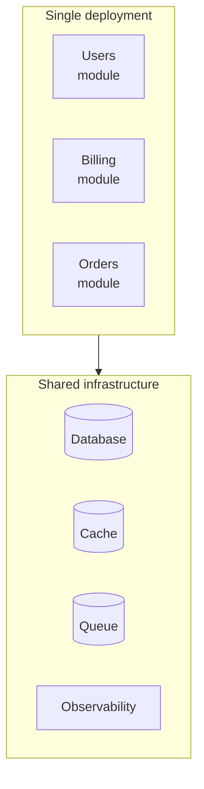

# Phase 4: Architecture & Technical Design

> **In one line:** Decide *how* to build it — language, framework, database, hosting, system structure. These are the decisions you'll pay for (or benefit from) for years.

:::tip[In plain English]
Architecture is the technical version of design. Just like you wouldn't start framing a house before knowing how many floors it has, you shouldn't start coding before knowing what stack you're using, where your data lives, and how the parts connect. The catch: architecture decisions get progressively harder to reverse as you build. Choose deliberately.
:::

## What architecture covers

- **Stack selection** — Languages, frameworks, databases, services.
- **System decomposition** — Monolith vs microservices, which services exist.
- **Data model** — Schema, relationships, indexing strategy.
- **API design** — REST/GraphQL/tRPC, endpoint shapes, versioning strategy.
- **Auth strategy** — How users prove identity, how permissions work.
- **Hosting model** — Where it runs, how it scales.
- **External integrations** — Stripe, SendGrid, third-party APIs.
- **Observability** — Logging, monitoring, alerting.
- **Security posture** — Encryption, secrets management, threat model.
- **Performance budgets** — Page load targets, API latency SLOs.

## Architecture decisions are hard to reverse

Stack choices have wildly different reversibility — and you should spend deliberation proportional to that cost:

| Decision               | Cost to Reverse              |
|------------------------|------------------------------|
| Color of a button      | Minutes                      |
| Frontend framework     | Weeks to months              |
| Backend language       | Months                       |
| Database technology    | Months to years              |
| Cloud provider         | Years                        |
| Programming paradigm   | Years (and team turnover)    |

Don't agonize for weeks over button styling. Do agonize for weeks before committing to a new programming language.

## RFCs and ADRs

At larger companies, significant decisions are documented:

- **RFC (Request for Comments)** — A written proposal describing a change, its motivation, alternatives considered, trade-offs, and implementation plan. Reviewed by peers before approval.
- **ADR (Architecture Decision Record)** — A short record of an architectural decision — context, options, decision, consequences. Lives in the codebase so future engineers understand *why* things are the way they are.

Even solo developers benefit from writing brief ADRs. "I chose Postgres over MongoDB because..." — written down, you'll remember the reasoning a year later.

## The modular monolith pattern

The dominant 2026 architectural recommendation for small-to-medium teams: build a **modular monolith** (one process, deployed as one unit, internally organized into clearly-bounded modules).

> **Reading this diagram:** Three modules live inside a *single* process (top box) but talk to one set of shared infrastructure (bottom box). Internally organized as if it were many services, but deployed as one. You get the simplicity of monolith operations with the structure of microservices. If you eventually need to split, the module boundaries become service boundaries.

The trap is going microservices too early — distributed systems are hard to debug, slow to develop in, and bring operational overhead most small teams can't justify.

:::info[Highlight: when to actually split into services]
You should split a monolith into multiple services *only* when at least one of these is true:

1. **Different teams own different parts** — and the coupling is slowing them down.
2. **Different parts have wildly different scaling needs** — e.g., one part needs 100× the compute.
3. **Different parts have different security or compliance requirements** — e.g., the payments code needs PCI compliance and you want to isolate it.

If none of these apply, you don't need microservices yet. **"Microservices because I read a blog post about Netflix" is one of the most expensive mistakes in modern web dev.**
:::

## Common patterns (mostly: don't reach for them too early)

- **Layered architecture:** Presentation → Application → Domain → Persistence.
- **Hexagonal / Ports & Adapters:** Business logic at the core, external systems (DB, HTTP, queues) as adapters.
- **Event-driven:** Components communicate via events; loose coupling, async.
- **CQRS:** Separate write and read models.
- **Event sourcing:** Store every state change as an event; current state derived by replay.

Most apps don't need these patterns explicitly. A good monolith with a clean module structure is sufficient for the vast majority of projects.

## Common anti-patterns

- **Resume-driven development:** Choosing tech because it looks good on a resume.
- **Hype-driven development:** Adopting tech because it's trending.
- **Cargo-cult architecture:** Copying patterns from Google/Netflix without their scale or team.
- **Architecture astronautics:** Multi-month design phases that ship nothing.
- **Big rewrites:** Throwing away working code to rebuild from scratch. Almost always disastrous.

:::note[Worked example: a sensible 2026 default architecture for a beginner]
- **Frontend + backend:** Next.js (full-stack, deployable to Vercel as one thing).
- **Database:** Postgres on Supabase, Neon, or Railway (free tier).
- **Auth:** Clerk or Supabase Auth.
- **Hosting:** Vercel (free tier).
- **Total architecture diagram:** one box that says "Next.js," one arrow pointing to "Postgres."

This stack scales from "weekend project" to "thousands of paying customers" without needing to be rewritten. **Boring. Effective. Recommended.**
:::

## Common mistakes

:::caution[Where people commonly trip up]
- **Conflating "modular" with "microservice."** Beginners hear "decompose your system" and immediately reach for separate repos and HTTP calls between them. A modular *monolith* gives you the same module boundaries with none of the distributed-systems pain — same process, same deploy, same debugger.
- **Choosing the database last.** Stack pickers obsess over framework choice and then default to whatever DB the tutorial used. The database is the hardest thing to swap later (years, not weeks). Decide whether your data is relational, document, or graph-shaped *before* you choose Next.js vs Remix.
- **Skipping the ADR because "I'll remember why I picked this."** You won't. Six months from now, you (or a teammate) will see the choice, assume it was arbitrary, and want to redo it. A four-paragraph ADR per significant decision pays for itself the first time someone asks "wait, why aren't we using X?"
- **Designing the architecture for the team you wish you had.** Service meshes, event buses, and CQRS pay off with 50 engineers. With 3 engineers, every layer is overhead someone has to maintain at midnight. Pick the architecture your *current* team can operate, not the one in the conference talk.
- **Treating "we'll just use Kubernetes" as a no-op.** k8s is a full-time job's worth of operational surface area. Unless you have a dedicated platform person or your scale truly demands it, a Vercel/Railway/Fly deploy is faster, cheaper, and lets the team focus on the product.
:::

## Page checkpoint

<Quiz id="lifecycle-architecture-page" title="Did architecture stick?" sampleSize={3}>

<Question
  prompt="Why does the page urge you to deliberate more carefully over architecture decisions than over feature decisions?"
  options={[
    { text: "Architects get paid more than designers" },
    { text: "Architecture decisions get progressively harder to reverse — language and database choices can take years to undo" },
    { text: "Frameworks require legal approval before adoption" },
    { text: "Architectural decisions are tracked by external auditors" }
  ]}
  correct={1}
  explanation="The page's reversibility table makes the point: button color costs minutes to reverse, but a database choice can cost years. Spend deliberation proportional to reversibility."
  revisit={{ to: "/docs/lifecycle/architecture#architecture-decisions-are-hard-to-reverse", label: "Reversibility table" }}
/>

<Question
  prompt="When does the page say it's actually worth splitting a monolith into microservices?"
  options={[
    { text: "Whenever the codebase exceeds 10,000 lines" },
    { text: "As soon as you have paying customers" },
    { text: "When different teams own different parts, scaling needs diverge wildly, or compliance requires isolation" },
    { text: "Before launch, because retrofitting microservices is impossible" }
  ]}
  correct={2}
  explanation="The page's three triggers are team ownership friction, wildly divergent scaling needs, and isolation for compliance. Splitting earlier is 'microservices because Netflix' — one of the most expensive mistakes in modern web dev."
  revisit={{ to: "/docs/lifecycle/architecture#the-modular-monolith-pattern", label: "When to split into services" }}
/>

<Question
  prompt="What's an ADR (Architecture Decision Record), as described on the page?"
  options={[
    { text: "A legal contract between dev teams" },
    { text: "A short record of an architectural decision — context, options, decision, consequences — that lives in the codebase" },
    { text: "An automated linter rule that enforces architecture patterns" },
    { text: "A type of unit test for service boundaries" }
  ]}
  correct={1}
  explanation="ADRs preserve the 'why' behind architectural choices so future engineers (often future-you) understand the reasoning. The page recommends them even for solo developers."
  revisit={{ to: "/docs/lifecycle/architecture#rfcs-and-adrs", label: "RFCs and ADRs" }}
/>

<Question
  prompt="Which of these is flagged as an architecture anti-pattern?"
  options={[
    { text: "Writing an ADR before committing to a database" },
    { text: "Choosing tech because it'll look good on your resume" },
    { text: "Defaulting to a modular monolith for a small team" },
    { text: "Picking boring, proven tools for a beginner project" }
  ]}
  correct={1}
  explanation="Resume-driven development picks tech for the engineer's career, not the project's needs. The page also calls out hype-driven and cargo-cult variants for the same reason."
  revisit={{ to: "/docs/lifecycle/architecture#common-anti-patterns", label: "Architecture anti-patterns" }}
/>

</Quiz>

## What's next

→ Continue to [Phase 5: Environment Setup](./environment-setup) where we set up the workshop — runtimes, editors, version control, linters, secrets, the boring stuff that makes building possible.
