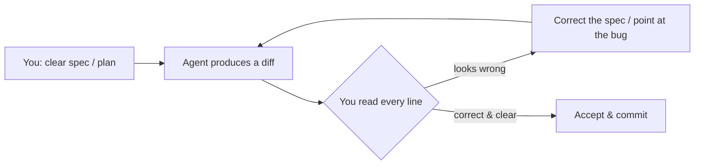

# Working with Coding Agents

> **In one line:** AI coding agents write most of the code now, so the job shifts from *typing* to *directing and reviewing*. The durable skill underneath all the tooling is the **review-the-diff loop**: you specify the change, the agent produces a diff, and you read every line before it lands.

:::tip[In plain English]
A **coding agent** is an AI that doesn't just autocomplete a line — it reads your codebase, edits multiple files, runs commands, and iterates toward a goal you describe (Claude Code, Cursor's agent, and others). Used well, one engineer ships far more. Used badly, you accumulate code nobody understands until it breaks at 2 a.m. The difference is almost entirely *how you direct and check the agent* — and that part barely changes as the tools do.
:::

:::note[Why this lesson is principle-led (and will age well)]
The specific tools, model names, and UI here will change fast. So this lesson teaches the **habits** — spec-first, review-the-diff, rules files — not button-clicks. The names are stamped "as of mid-2026"; the workflow is the durable part. You met the *tools* in [Editors & AI Assistants](/docs/stack/editors-ai); this is the *workflow*.
:::

## The one durable skill: review the diff

Everything else in this lesson is in service of one habit. An agent's output is a **diff** — a set of changes to your files. Your core job is to **read that diff as carefully as you'd review a teammate's pull request**, *before* it merges into your work.



Why this is the skill that survives every tool change: models get better, but they remain *confident even when wrong*, and they can't know your intent, your edge cases, or your production constraints. A plausible-looking lie takes two seconds to accept and hours to debug later. The engineer who reads the diff catches it; the one who rubber-stamps it ships it.

**What to read for, in priority order:** error handling and edge cases, anything touching **money, auth, or deletion**, security (injection, secrets, permissions), and whether the change matches your codebase's existing patterns. Speed-read the boilerplate; *slow down* on those.

:::caution[The trap: "looks right" is not "is right"]
Agent output is fluent by construction — it always *looks* like good code. Fluency is not correctness. If you can't explain *why* a diff is correct, you are not done reviewing it. "The agent is usually right" is how a subtle auth bug reaches production.
:::

## Spec-first / plan-first prompting

The quality of the diff is set before the agent writes a line — by how well you specified the work. Vague in, vague out.

- **Describe the outcome and the constraints, not just the task.** "Add rate limiting" is weak. "Add rate limiting to `POST /api/invite` — 5 requests/min per user, return 429 with a `Retry-After` header, use the existing Redis client in `lib/redis.ts`, add a test" is a spec the agent can hit.
- **Ask for a plan before the code on anything non-trivial.** Have the agent lay out *what* it will change and *why* first; you correct the plan (cheap) instead of correcting a 12-file diff (expensive). This is the single highest-leverage habit for larger tasks.
- **Point at examples.** "Follow the pattern in `users.service.ts`" anchors the agent to *your* conventions instead of generic ones.
- **Work in small, reviewable steps.** A diff you can actually read beats a giant one you'll skim. Break a big feature into a sequence of small specs.

> **The mental model:** you are the tech lead; the agent is a fast, eager junior with no memory of your project and no judgment about your priorities. Give it the context and constraints a good junior would need — then review its work like a good lead would.

## Rules files: make the agent idiomatic to *your* repo

Out of the box, an agent writes idiomatic *generic* code, not idiomatic *yours*. **Rules files** are project files that feed the agent standing context every time — your stack versions, conventions, do's and don'ts — so you're not re-typing them each prompt.

- **`CLAUDE.md`** (Claude Code) / **`AGENTS.md`** (an emerging cross-tool convention) — a Markdown file at the repo root describing the project: how to build and test, the architecture, key commands, conventions to follow, and gotchas to avoid.
- **`.cursor/rules/*.mdc`** (Cursor) — scoped rule files; some always apply, others attach only to matching paths (e.g. a rule that applies just to `**/*.test.ts`).

```markdown
<!-- CLAUDE.md (excerpt) -->
## Stack
- Next.js 16 (App Router), TypeScript strict, Drizzle ORM, Postgres.

## Conventions
- Server Components by default; add "use client" only at interactive leaves.
- All DB access goes through `lib/db/` — never import the client directly in a route.
- Validate every API input with Zod before use.

## Commands
- Test: `npm test`   ·   Lint: `npm run lint`   ·   Typecheck: `npm run typecheck`

## Don't
- Don't add a dependency without flagging it.
- Don't touch `auth/` without explicitly calling it out.
```

A good rules file is the difference between every suggestion drifting from your style and the agent fitting in like it read your onboarding doc. Keep it short and current — a stale rules file teaches the agent the wrong thing.

## Parallel and background agents

As of mid-2026, agents increasingly run **in the background** and **in parallel** — kicked off on a task and checked on later, sometimes several at once (on separate branches or worktrees), rather than watched line-by-line.

This is a real multiplier, but it changes *where* your attention goes, not *whether* it's needed:

- **Give each background agent a crisp, self-contained spec** — you won't be there to course-correct mid-run.
- **Isolate their work** (separate branches/worktrees) so parallel agents don't collide.
- **The review step doesn't shrink — it batches.** Three agents producing three diffs means three diffs to review with the same care. Parallelism multiplies *output*; it does not remove the *gate*. If anything, it raises the value of fast, disciplined review.

## Agent-assisted code review (and its limit)

Agents are genuinely useful on the *other* side of the diff too: ask one to **review a pull request** — summarize the change, flag risky spots, check for missing tests or error handling. This catches a real class of issues fast and is worth wiring into your flow.

But hold the line on what it is: a **first-pass filter, not the final gate**. Two AIs reviewing each other's code is not code review. A human who understands the system still reads the diff before it lands — especially for the money/auth/deletion paths. The agent widens the net; it doesn't replace the judgment.

## Common mistakes

:::caution[Where people commonly trip up]
- **Accepting diffs you didn't read.** The whole skill is reading the diff. If you merge agent output you can't explain, you're shipping code you can't debug. Slow down on error handling, edge cases, and anything touching money, auth, or deletion.
- **Vague prompts, then blaming the agent.** "Build the dashboard" gets you a generic guess. Spec the outcome, the constraints, and the patterns to follow; ask for a plan first on anything non-trivial.
- **Skipping the rules file.** Without `CLAUDE.md` / `AGENTS.md` / `.cursor/rules`, every suggestion drifts from your conventions and you re-type the same context all day. Write the file once; keep it current.
- **Letting an agent do work you can't verify.** "Migrate the auth system" while you watch a video is how outages happen. Use high-autonomy agents for changes whose diff you can actually judge; stay hands-on for the rest.
- **Treating parallel agents as 'fire and forget.'** More agents means more diffs to review, not fewer. The output scales; the review gate doesn't disappear — it batches.
- **Using AI review as a substitute for human review.** It's a fast first pass. A human who understands the system still has to approve the diff before it merges.
:::

## Page checkpoint

<Quiz id="lifecycle-coding-agents-page" title="Did working with coding agents stick?" sampleSize={2}>

<Question
  prompt="What's described as the one durable skill that survives every change in AI coding tools?"
  options={[
    { text: "Memorizing each agent's keyboard shortcuts" },
    { text: "Reviewing the diff — reading every line the agent produced, as carefully as a teammate's PR, before it lands" },
    { text: "Always using the largest available model" },
    { text: "Typing prompts faster than everyone else" }
  ]}
  correct={1}
  explanation="Tools and models change; agents stay confident even when wrong and can't know your intent. The engineer who reads the diff catches the plausible-looking bug before it ships. That review habit is the durable core."
  revisit={{ to: "/docs/lifecycle/working-with-coding-agents#the-one-durable-skill-review-the-diff", label: "Review the diff" }}
/>

<Question
  prompt="Why ask a coding agent for a plan BEFORE it writes the code on a non-trivial task?"
  options={[
    { text: "It makes the agent run faster" },
    { text: "Correcting a short plan is cheap; correcting a large multi-file diff after the fact is expensive — you steer intent before code is written" },
    { text: "Plans are required by the MCP protocol" },
    { text: "It lets you skip reviewing the diff afterward" }
  ]}
  correct={1}
  explanation="A plan surfaces the agent's intended changes while they're still cheap to redirect. You fix the approach in a sentence instead of untangling a 12-file diff — the highest-leverage habit for larger tasks. (You still review the final diff.)"
  revisit={{ to: "/docs/lifecycle/working-with-coding-agents#spec-first--plan-first-prompting", label: "Spec-first prompting" }}
/>

<Question
  prompt="What's the purpose of a rules file like CLAUDE.md, AGENTS.md, or .cursor/rules/*.mdc?"
  options={[
    { text: "To store your API keys for the agent" },
    { text: "To give the agent standing project context every prompt — stack versions, conventions, commands, do's and don'ts — so its output is idiomatic to your repo, not generic" },
    { text: "To disable the agent's ability to edit files" },
    { text: "To replace the need to review the diff" }
  ]}
  correct={1}
  explanation="Out of the box an agent writes generic-idiomatic code. A rules file feeds it your conventions and constraints every time, so suggestions stop drifting from your style — and you stop re-typing the same context."
  revisit={{ to: "/docs/lifecycle/working-with-coding-agents#rules-files-make-the-agent-idiomatic-to-your-repo", label: "Rules files" }}
/>

<Question
  prompt="Running three background agents in parallel multiplies your output. What does it NOT change?"
  options={[
    { text: "The need to review each agent's diff with the same care — parallelism batches the review, it doesn't remove the gate" },
    { text: "The model the agents use" },
    { text: "The programming language of the project" },
    { text: "The need for a rules file" }
  ]}
  correct={0}
  explanation="Three agents producing three diffs is three diffs to review. Parallelism scales the work produced; it does not remove the human review gate — if anything it raises the value of disciplined, fast review."
  revisit={{ to: "/docs/lifecycle/working-with-coding-agents#parallel-and-background-agents", label: "Parallel agents" }}
/>

</Quiz>

## What's next

→ Continue to [Phase 7: Testing](./testing) where we prove the code — yours and the agent's — actually works, and stays working as it changes.
