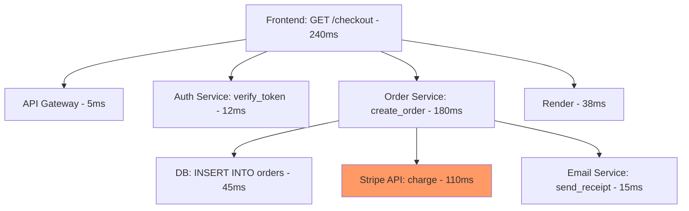

---
id: observability
title: 'Phase 11: Observability'
sidebar_position: 11
sidebar_label: 10. Observability
description: Know what your software is doing in production, especially when it's misbehaving. Logs, metrics, traces, error tracking, alerting.
---

# Phase 11: Observability

> **In one line:** Observability is your software's *senses* in production. Without it, you only know things broke when angry users tell you.

:::tip[In plain English]
Once your code is running in production, you can't just open the file and see what's happening. You need to *instrument* the code to emit signals — logs (text records), metrics (numbers over time), and traces (per-request follow-along). Then you collect those signals somewhere and look at them when things break. That whole practice is called **observability**.
:::

## The three pillars

### Logs — text records of events

```
2026-05-20T14:23:11Z INFO  user.signup.success user_id=42 duration=187ms
2026-05-20T14:23:15Z ERROR payment.charge.failed user_id=42 reason=insufficient_funds
```

### Metrics — numerical measurements over time

```
http.requests.count (per second)
http.requests.duration.p95 (95th percentile latency)
database.connections.active
queue.depth
```

### Traces — follow a single request through every service

A **trace** is a tree of timed *spans*. Each span is one piece of work (a function call, an HTTP request, a DB query) with a start time and duration. Together they show *where the time went* for a single user request.



> **Reading this trace:** The root span (`GET /checkout`) took 240ms. The most expensive child by far is `Stripe API: charge` at 110ms (highlighted orange) — that's where you'd optimize first. Traces turn vague "the checkout page feels slow" complaints into a quantified, line-by-line answer.

## Additional layers (in 2026)

| Layer                | What it does                                                       |
|---------------------|--------------------------------------------------------------------|
| **Error tracking**   | Sentry catches exceptions, deduplicates, alerts.                  |
| **Uptime monitoring**| External pings of your endpoints (Better Stack, Checkly, Pingdom).|
| **Real User Monitoring (RUM)** | Measures actual users' performance (Vercel Analytics, Sentry, Datadog RUM). |
| **Synthetic monitoring** | Automated test traffic from multiple regions.                |
| **Product analytics** | What are users actually doing? (PostHog, Mixpanel, Amplitude.)   |
| **Session replay**   | Watch recordings of user sessions to debug (LogRocket, PostHog).  |
| **Feature flag analytics** | Which features are used, by whom (PostHog, Statsig, LaunchDarkly). |
| **AI/LLM observability** | Track prompts, costs, latency (Langfuse, Helicone, Braintrust). |

## SLIs, SLOs, and SLAs

Mature teams quantify reliability:

- **SLI (Service Level Indicator):** What you measure. *Example: 99.5% of requests return 2xx within 200ms.*
- **SLO (Service Level Objective):** Your internal target. *Example: 99.9% over 30 days.*
- **SLA (Service Level Agreement):** Contractual promise to customers. Usually less strict than SLO so you have margin.

**Error budget:** If your SLO is 99.9% and you've been at 99.85% this month, you've burned through your budget — pause feature work and improve reliability.

## Alerting

You want to know about problems *before* users complain. Modern alerting:

- **Alert on symptoms, not causes.** "Latency exceeded 500ms" tells you something is wrong; "CPU exceeded 80%" might be fine.
- **Alert on user impact.** If users aren't affected, it can wait.
- **Tunable thresholds.** Adjust as you learn what's actually broken.
- **Runbooks linked to alerts.** When pager goes off, on-call engineer needs to know what to do.
- **On-call rotations.** Tools: PagerDuty, Opsgenie, Incident.io, Better Stack.

:::note[Worked example: minimum observability for a beginner project]
You don't need Datadog and OpenTelemetry on day one. The minimum-viable observability stack for a beginner deploying to Vercel:

1. **Sentry** (free tier) — catches every exception with full stack trace and request context.
2. **Vercel Analytics** (free with Vercel) — page views, Core Web Vitals, basic user behavior.
3. **Better Stack** (free tier) — uptime monitor + log aggregation.

Five minutes of setup. Once you have these three, you'll know within minutes when your site is broken, what broke it, and whether real users hit the bug.
:::

## Observability in 2026

The standard practice: instrument with **OpenTelemetry** (vendor-neutral standard), send to whichever backend you prefer (Datadog, Honeycomb, Grafana, etc.). This avoids vendor lock-in.

Smaller projects: just **Sentry + Better Stack + PostHog** is often enough.

:::info[Highlight: logs vs metrics vs traces — when to use which]
A simple rule of thumb:

- **Use logs** when you want to know *what happened* (a specific event with details).
- **Use metrics** when you want to know *how often / how fast* (aggregated over time).
- **Use traces** when you want to know *why a single request was slow* (broken down by step).

Most production issues need all three. A spike in error metrics tells you *something* is wrong; logs tell you *what* the error is; traces tell you *which step caused it*. Together, they tell the whole story.
:::

## Common anti-patterns

- **Logging everything:** Floods storage and makes finding signal impossible.
- **No alerting:** Discover problems via customer support tickets.
- **Alert fatigue:** So many false alerts that real ones get ignored.
- **Logs without context:** Can't tell which user, which request, which trace.
- **No correlation IDs:** Can't follow a request across services.

## Common mistakes

:::caution[Where people commonly trip up]
- **Confusing "monitoring" with "observability."** Monitoring tells you the dashboards you set up in advance; observability lets you ask new questions about a problem you didn't predict. If every investigation requires shipping new code to add a log, you have monitoring, not observability.
- **Logging the entire request body.** It feels useful until the day a user's password, JWT, or PII shows up in your log search box. Log identifiers and the small set of fields you actually need; everything else is a leak waiting to happen.
- **Treating `console.log` as production observability.** Vercel/Cloudflare will show you those logs for about an hour and then they're gone, ungrouped, untraceable. Pipe through a real ingest (Better Stack, Axiom, Logflare) with a `requestId` on every line so you can correlate after the fact.
- **Alerting on causes instead of symptoms.** "CPU at 80%" or "queue depth at 1000" might be totally fine under your normal load. "p95 latency over 800ms" or "error rate above 1%" are user-visible. Alert on what users feel, debug down to causes.
- **Skipping observability for LLM features.** AI features fail in new ways — silent quality regressions, slow upstream APIs, surprise cost spikes. Standard APM tools miss this. Wire up Langfuse, Helicone, or Braintrust from day one if any part of your product calls a model.
:::

## Page checkpoint

<Quiz id="lifecycle-observability-page" title="Did observability stick?" sampleSize={2}>

<Question
  prompt="The page's rule of thumb for the three pillars. Which signal best answers 'why was this single request slow?'"
  options={[
    { text: "Logs — text records of events" },
    { text: "Metrics — numerical measurements over time" },
    { text: "Traces — a tree of timed spans showing where the time went for one request" },
    { text: "Uptime monitors" }
  ]}
  correct={2}
  explanation="Traces break a single request into spans so you can see exactly which step burned the time. Logs answer 'what happened' and metrics answer 'how often or how fast' in aggregate."
  revisit={{ to: "/docs/lifecycle/observability#observability-in-2026", label: "Logs vs metrics vs traces" }}
/>

<Question
  prompt="What's the difference between an SLO and an SLA, as described on the page?"
  options={[
    { text: "They're the same thing with different spellings" },
    { text: "SLO is your internal target; SLA is the contractual promise to customers, usually less strict than the SLO" },
    { text: "SLA is internal; SLO is what you promise customers" },
    { text: "SLOs are for backends; SLAs are for frontends" }
  ]}
  correct={1}
  explanation="You keep the SLA looser than the SLO so you have margin. If you're hitting the internal target, you're comfortably ahead of what customers were promised."
  revisit={{ to: "/docs/lifecycle/observability#slis-slos-and-slas", label: "SLIs, SLOs, SLAs" }}
/>

<Question
  prompt="What's the page's main rule for designing good alerts?"
  options={[
    { text: "Alert on everything so nothing is missed" },
    { text: "Alert on symptoms with user impact, not on underlying causes that might be fine" },
    { text: "Alert only the most senior engineer" },
    { text: "Alert by email — pages are too intrusive" }
  ]}
  correct={1}
  explanation="'CPU at 80%' might be totally normal. 'Latency over 500ms' tells you something users feel. Alerting on symptoms keeps the signal-to-noise ratio sane."
  revisit={{ to: "/docs/lifecycle/observability#alerting", label: "Alerting" }}
/>

<Question
  prompt="Which observability stack does the page recommend as a minimum-viable starting point for a beginner on Vercel?"
  options={[
    { text: "A full Datadog + OpenTelemetry deployment from day one" },
    { text: "Sentry for errors, Vercel Analytics for web vitals, Better Stack for uptime and logs" },
    { text: "Just console.log statements in production" },
    { text: "A self-hosted Grafana cluster" }
  ]}
  correct={1}
  explanation="The Sentry + Vercel Analytics + Better Stack trio takes about five minutes to wire up and covers errors, real-user performance, and uptime. Enterprise-grade observability can wait."
  revisit={{ to: "/docs/lifecycle/observability#alerting", label: "Minimum viable observability" }}
/>

</Quiz>

## What's next

→ Continue to [Phase 12: Maintenance & Iteration](./maintenance) where we cover the longest phase by far — the years of work after launch.
