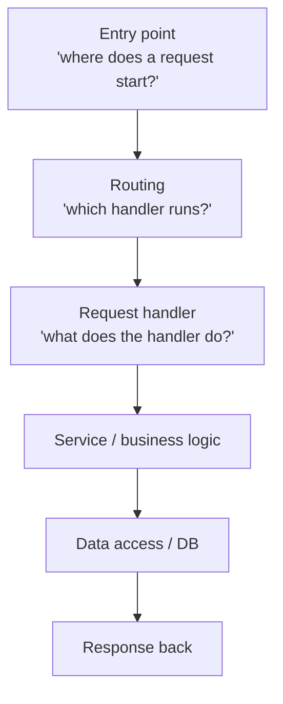

# Reading code: onboarding to a new codebase

> **In one line:** Reading code is a learnable skill that most curricula skip — the techniques (start at the entry point, follow the request, read tests as documentation, ignore the noise) compress weeks of "what is going on here" into days of confident navigation.

:::tip[In plain English]
Most engineers spend years writing code and almost zero time being *taught* to read it. So they read like they write — top to bottom, file by file — which doesn't scale to a million-line codebase. Senior engineers don't read everything. They navigate: enter at the front door, follow one request through, ignore the rest. They read tests as the spec. They look at git history to understand *why*. They build a mental map *before* trying to remember details. This page is the playbook.
:::

You'll use this material on your first day at every new job, when contributing to open source, when inheriting a project, and when debugging an unfamiliar part of your own codebase. It's worth practicing.

## The wrong way

The default approach when handed a new repo: open the README, then start reading files alphabetically. By file 30 you've forgotten file 5. You're trying to load 100 KB of unrelated detail into working memory and your brain is rejecting it.

This doesn't scale past ~5 files. The codebase has 5000. You need a different strategy.

## The right way: top-down + outside-in

The mental model:



You read **outside-in**: start at the user's entry point (`main.go`, `app/page.tsx`, `index.js`), follow what happens to a single concrete request, ignore everything else.

You can navigate the entire codebase by repeatedly answering "where does this call go next?" In an editor with go-to-definition, this is keystrokes. You build understanding *along the request's path* — the spine of the codebase — without trying to memorize side branches.

## The 30-minute first pass

The first half-hour with a new codebase:

1. **Read the README.** Skim, don't memorize. Note the run/test commands.
2. **Run the project.** `npm install && npm run dev` (or equivalent). Visit `localhost:3000`. See it work. Five minutes of "yes the thing exists and runs" anchors everything else.
3. **Look at the file tree.** Don't open files yet. Just notice: how is it organized? What top-level dirs? What's the framework? What patterns name suggest (`controllers/`, `models/`, `routes/`, `pages/`, `app/`)?
4. **Read `package.json` (or equivalent).** What dependencies? Tells you a lot: ORM (Prisma, Drizzle), framework (Next, Remix), test runner (Vitest, Jest), state library, AI SDK.
5. **Read 1 test file.** Tests are executable docs. Pick the most central-looking one. You'll learn the public API.

End of first 30 minutes: you can hold the codebase in mind at a high level. You don't know details; you know shape.

## The second 30 minutes: follow one request

Pick a real, simple flow. "User logs in." Follow it end-to-end:

1. **Find the entry point.** Maybe `app/login/page.tsx`.
2. **Read the page**. Identifies a form. Form submits to `/api/login`.
3. **Find the API handler.** `app/api/login/route.ts`. Read it.
4. **Follow what it calls.** Maybe `verifyPassword(...)` in `services/auth.ts`.
5. **Follow what that calls.** Maybe a DB query in `db/users.ts`.
6. **Read the schema.** `db/schema.ts` or `prisma/schema.prisma`. See the `User` table.

You've now traversed one route from URL to DB. You understand:
- The framework's routing convention.
- How auth works.
- The DB layer's abstraction.
- The error-handling pattern.

That's a *lot* of structural knowledge for an hour. And you can repeat — follow checkout, follow signup, follow a different endpoint. Each pass reinforces and extends the mental model.

## Read git history, not just code

The code tells you *what*. Git tells you *why* and *when*.

- **`git log -- <file>`**: who's touched this file, what messages.
- **`git blame <file>`**: who wrote each line, in what commit, with what message.
- **`git log -p <file>`**: the full diff of every change. Slower; reveals intent.
- **`git log --all --grep='regex'`** — find commits whose message matches a pattern.

When you see weird-looking code:

> "Why is there a 500ms timeout here?"

`git blame` the line → commit "Fix race with slow upstream (PR #1423)." Read the PR. Now you know.

Without history, that timeout looks arbitrary. With history, it's a fence with a reason. (Chesterton's fence: don't remove things you don't understand.)

## Read tests as documentation

The test file for a module tells you:
- The public API (what's exported, what's called).
- Expected behavior (assertions = the spec).
- Edge cases (cases the author thought worth testing).
- Dependencies (what's mocked = what's external).

Often tests are clearer than the implementation, especially if the implementation is dense or generated.

For a class or function:
1. Open the file.
2. Open the test file *first*.
3. Read assertions. Now you know what it's supposed to do.
4. *Then* read the implementation. You're checking your model against the code.

## What to skip

Most of a codebase is noise — not bad, just irrelevant to your current goal:

- **`node_modules/` / `vendor/`** — read only when debugging into a library.
- **Generated code** — `*.gen.ts`, `dist/`, compiled output.
- **Config files** — read when needed (don't pre-load every `.eslintrc`).
- **Old migrations** — useful when needed, otherwise ignored.
- **Helpers and utils** unless they show up on your request path.
- **Type definitions for libraries** — the docs are clearer.

The skill is *aggressive ignoring*. The most experienced engineers read less code than juniors, not more — they're better at deciding what's worth their attention.

## Build a "what does what" map

After a few hours, write down your model of the codebase:

```
Auth:
- entrypoint: middleware.ts → checks session cookie
- session: in db, table 'sessions', validated via verifySession()
- pages requiring auth: anything under /app/(protected)/

API:
- Next.js route handlers in app/api/
- Each route: validates input (zod), calls a service function, returns JSON
- Errors: throwApiError() → standardized response

Data:
- Drizzle ORM, schema in db/schema.ts
- Connection pooled via lib/db.ts
- Queries in services/, not in route handlers
```

This isn't a deliverable. It's a private cheat sheet. As you learn more, it grows. After two weeks, you have a map; after two months, you can navigate without it.

## Read the boundaries

Every codebase has **internal** abstractions and **external** boundaries. The external boundaries are usually the highest-value thing to read first:

- **HTTP API endpoints** — what the world can call.
- **DB schema** — what the world is.
- **Public CLI commands** — for CLI tools.
- **Component library / design system exports** — for frontend.
- **3rd-party API integrations** — Stripe, OpenAI; what we send, what we get.

Once you understand the boundaries, the internals are "stuff that turns boundary inputs into boundary outputs." Easier to navigate.

## Run the debugger

When code is dense or generated and reading isn't working, **breakpoint and step**.

Set a breakpoint in the request handler. Hit the endpoint. Step through. Inspect every variable. You'll see the actual control flow, the actual data shapes. Five minutes of stepping often beats an hour of reading.

Especially useful for:
- Codebases with heavy meta-programming (decorators, codegen).
- Async flows where the code doesn't read linearly.
- Library internals you're calling into.

## Talk to the humans

Code answers "what does this do." Humans answer "*why was it built this way*?"

- **Find the person who wrote the file** (git blame). Ask them.
- **Find the on-call / domain expert** for the area. 10 minutes of their time saves hours of yours.
- **Ask in the team channel.** "Is there a doc on how X works?" Often there is — or someone says "no, but here's the verbal explanation."

Asking is socially expensive (you don't want to be the person bothering everyone) but informationally cheap (humans compress context faster than docs do). Calibrate: ask after a real attempt; come with a specific question.

## Specific tactics by codebase shape

### Monorepo

- Pick *one* package. Onboard to that first.
- Read the workspace config (`pnpm-workspace.yaml`, `turbo.json`, `nx.json`) to understand inter-package deps.
- Use `turbo run` or `nx graph` to see the dependency graph.

### Microservices

- Pick *one* service that owns the feature you're touching.
- Read its API contract; read the service it calls; depth-first.
- The API gateway / BFF is often the best entry point for navigation.

### Legacy

- Don't try to read everything. Focus on the part you need to change.
- Build a regression test before changing anything (characterization testing — see [Working with legacy code](./legacy-code)).
- Accept that some parts will remain magic for a while. That's fine.

### Open source

- Read the CONTRIBUTING.md.
- Find a "good first issue" — usually well-scoped, well-described.
- Check existing PRs to understand the code review norms.
- The maintainers' GitHub discussions / issues often hold the design rationale.

## When stuck

A few escalation patterns when you're spinning:

1. **Re-read the README and architecture docs.** You might have skimmed past something.
2. **Pair with someone.** Real-time question/answer compresses understanding.
3. **Document your confusion.** Write down "I don't understand X." Often the act of writing clarifies, or you realize you need to ask a specific thing.
4. **Skip and come back.** Working on something else for an hour can let your subconscious chew. Real.
5. **Ask AI** with the relevant code pasted in. Modern LLMs are excellent at "what is this function doing." Use as a second opinion, not gospel.

## What this gives you

Engineers who can read code well:
- Onboard in days, not months.
- Confidently estimate work in unfamiliar areas.
- Find bugs in code others wrote.
- Contribute to open source.
- Review PRs meaningfully across the whole codebase.

It's *the* compounding skill. Every codebase you read makes the next one easier.

## Common mistakes

:::caution[Where people commonly trip up]
- **Trying to read alphabetically by filename.** A codebase isn't a book; read by control flow, not by directory order.
- **Memorizing without understanding.** Try to *use* the code (run it, test it, modify a line). Hands-on builds understanding faster than reading.
- **Not running the project.** "I'll read first, then run." Run it. Five minutes of seeing the thing work anchors hours of reading.
- **Ignoring tests.** Tests are the spec. Often clearer than the implementation. Read them.
- **Treating the codebase as immutable knowledge.** Code rots; old comments lie. Trust what `git log -p` shows recently over what an old README claims.
- **Refusing to ask.** Ten minutes with the original author beats two days of guesswork. Bring a specific question after a real attempt.
- **Reading dependencies as deeply as your own code.** You don't need to understand React's reconciler to ship a feature. Read library *docs*; read library *source* only when debugging.
- **No notes.** A week later you've forgotten everything. Keep a private "what I learned today" file; revisit it weekly.
- **Stepping through every line in the debugger.** Set a breakpoint at the suspect spot; check state; don't step through 5000 lines of framework internals.
- **Treating the codebase's conventions as wrong because they differ from yours.** Could be wrong; could be a constraint you don't see yet. Reserve judgment until you understand.
:::

## Page checkpoint

<Quiz id="lifecycle-reading-code-page" title="Did reading code stick?" sampleSize={2}>

<Question
  prompt="What's the recommended approach when reading a large unfamiliar codebase for the first time?"
  options={[
    { text: "Read every file in alphabetical order" },
    { text: "Outside-in: start at the user's entry point (a URL → handler → service → DB), follow *one* concrete request end-to-end via go-to-definition, ignore everything off the path. Builds a mental spine before you try to hold details" },
    { text: "Memorize the directory structure first" },
    { text: "Read the docs and never look at code" }
  ]}
  correct={1}
  explanation="Outside-in traversal: enter at the front door, follow one request to the back, ignore branches. You can navigate the entire app in a few hours this way. Reading alphabetically guarantees you'll forget by file 30."
  revisit={{ to: "/docs/lifecycle/reading-code#the-right-way-top-down--outside-in", label: "Outside-in reading" }}
/>

<Question
  prompt="A team encounters a 500ms timeout in code with no comment. They're tempted to remove it as 'arbitrary.' What's the right move first?"
  options={[
    { text: "Remove it; if anything breaks, add it back" },
    { text: "`git blame` the line; find the commit; read the commit message and the linked PR. Often the rationale is there ('fixes flaky race with slow upstream'). Chesterton's fence — don't remove what you don't understand the purpose of" },
    { text: "Increase it to 5000ms" },
    { text: "Wrap it in a try/catch" }
  ]}
  correct={1}
  explanation="Code is half the story; git history is the rest. Most 'weird' code has a reason in the commit message. Read history before deleting things you don't understand."
  revisit={{ to: "/docs/lifecycle/reading-code#read-git-history-not-just-code", label: "Git history" }}
/>

<Question
  prompt="An engineer struggles to understand a complex async function. They've read it three times. What's a high-leverage move?"
  options={[
    { text: "Read it more times" },
    { text: "Set a breakpoint in the function, run a real request, step through with inspection of all variables. Five minutes of seeing actual values often beats an hour of static reading — especially for async/meta-programmed/generated code" },
    { text: "Rewrite the function" },
    { text: "Skip it" }
  ]}
  correct={1}
  explanation="Static reading has limits — debuggers let you see real control flow and real data. Especially valuable for async code (where execution doesn't read linearly) and library-heavy code (where understanding requires seeing it run)."
  revisit={{ to: "/docs/lifecycle/reading-code#run-the-debugger", label: "Use the debugger" }}
/>

<Question
  prompt="Why are tests a particularly good entry point when learning a new codebase?"
  options={[
    { text: "Tests are smaller files" },
    { text: "Tests document the public API (what's used), the expected behavior (assertions = spec), the edge cases (what the author considered worth testing), and the dependencies (what's mocked). Often clearer than the implementation, especially for dense or generated code" },
    { text: "Tests are always up to date" },
    { text: "Tests have more comments" }
  ]}
  correct={1}
  explanation="Tests are executable specs. They show you what the code does without making you parse the implementation. Read them before (or alongside) the source."
  revisit={{ to: "/docs/lifecycle/reading-code#read-tests-as-documentation", label: "Tests as docs" }}
/>

</Quiz>

## What's next

→ Continue to [Working with legacy code](./legacy-code).
