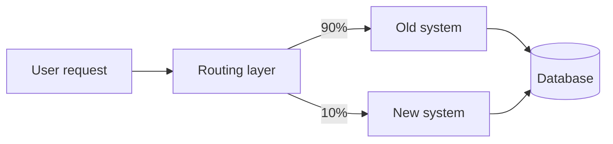

# Working with legacy code: the strangler fig and friends

> **In one line:** Legacy code is *valuable* code (it's in production, generating revenue) that's also *risky* to change (no tests, dense, unfamiliar) — and the techniques to safely modify it (characterization tests, strangler fig pattern, branch by abstraction) let you migrate incrementally instead of betting the company on a rewrite.

:::tip[In plain English]
"Legacy" doesn't mean bad. It means *important and old.* The code runs the business; the original authors are gone; the tests are sparse; the conventions are dated. The temptation is to rewrite — and the graveyard of three-year rewrites that never shipped is enormous. The professional move is to wrap the legacy with tests that pin its current behavior, then strangle it gradually: build new functionality alongside the old, route traffic over time, retire the old when nothing uses it. This page is that playbook.
:::

Working with legacy is most of senior engineering. Greenfield projects are exciting but rare; production engineering is mostly evolving systems people built years ago for reasons you don't yet understand.

## The "we should just rewrite it" trap

The universal junior instinct on encountering legacy: "this is bad, let's rewrite it."

The universal senior response: "show me the rewrite plan that's actually shipped this in a startup-scale window without losing customers."

Rewrites usually fail because:

- **They take longer than estimated.** Always. The original encodes years of edge cases and customer-specific quirks; rediscovering them takes years.
- **The business doesn't stop.** While you're rewriting, the old system is also adding features. You're chasing a moving target.
- **Knowledge loss.** The "ugly code" is often a hard-won fix for a real bug. Rewriting drops the fix.
- **Trust loss.** Two years in with no new features and bugs in the partial replacement, the team is demoralized and management is asking "why did we do this?"

Joel Spolsky's "Things You Should Never Do, Part I" (Netscape's rewrite, 2000) is still cited because it's still right. The 2026 corollary: even with AI assistance, rewrites of meaningful systems remain longer and riskier than incremental migration.

The mature path: **strangler fig**.

## The strangler fig pattern

A strangler fig (the tree) grows around an existing host, gradually replacing it. In code:

1. **Identify a slice** of the legacy system (one endpoint, one feature).
2. **Build the new version alongside** — same interface, different implementation.
3. **Route a small percentage of traffic** to the new version. Compare results.
4. **Expand traffic** as confidence grows.
5. **Retire the old code** once nothing uses it.
6. **Repeat** with the next slice.



Properties:
- **Each slice is small** — days, not months.
- **Both systems run in production**, side by side.
- **You can pause or rollback** at any percent.
- **You ship features the whole time** — new code in the new system, fixes in either as needed.
- **The old system keeps making money** while you replace it.

Real-world examples:

- **GitHub** migrated from Rails monolith to microservices over many years, never had a "rewrite week."
- **Shopify** continuously evolves their Rails monolith with strangler patterns instead of cleansheet rewrites.
- **Netflix** moved from monolith to microservices over a multi-year strangler migration.

The pattern is universal because the problem is universal.

## Characterization tests: pinning current behavior

Before you change anything in legacy code, you need to know what it does. The code is the *spec* — but the code may also have bugs, and your job isn't to fix them yet (one risky change at a time).

**Characterization tests** capture current behavior without judging whether it's correct.

```typescript
// Pin what the function returns today
test('legacy calculateTax behavior, May 2026', () => {
  expect(calculateTax({ subtotal: 100, region: 'US-CA' })).toEqual({
    tax: 8.5,
    total: 108.5,
    method: 'standard',
  });
  expect(calculateTax({ subtotal: 100, region: 'US-OR' })).toEqual({
    tax: 0,
    total: 100,
    method: 'standard',
  });
  // ... 30 more cases capturing the existing input → output mapping
});
```

These tests aren't "right" or "wrong" — they're a *fence*. If you change the code and these tests still pass, you haven't changed observable behavior. If they fail, you've changed something (intended or not). Either way, you have a signal.

Sources for characterization test cases:
- **Production logs / traces** — sample real inputs and outputs.
- **Examples from old bug reports** — these are battle-tested cases.
- **Domain expert interviews** — "give me 5 examples of how this *should* work."
- **Boundary values** — empty input, max input, special characters, etc.

Aim for ~30-100 cases covering the visible behavior. Not exhaustive; representative.

## Boy Scout Rule (the cumulative cleanup)

> "Always leave the campground cleaner than you found it." — Robert C. Martin

Don't fix the whole legacy in one PR. Don't ignore it forever either. **Touch a file → leave it slightly better than you found it.**

- Rename one confusing variable.
- Extract one function.
- Add one test.
- Fix one comment.
- Remove one piece of dead code (after verifying it's actually dead).

Over months, the cumulative effect is enormous. Over years, the code is unrecognizable in a good way.

The rule's discipline:
- **No mega-cleanup PRs.** They're high risk, hard to review.
- **Touch only what you're already changing.** Random cleanup is scope creep.
- **One refactor per PR.** Mixing "refactor" and "feature" in one PR is unreviewable.

## Branch by Abstraction

Sometimes the strangler-fig slice is too small (changing one method, not one endpoint). **Branch by Abstraction** is the per-method version:

1. Introduce an abstraction (interface, function pointer) over the current implementation.
2. Add a new implementation behind the same abstraction.
3. Toggle between them with a flag.
4. Migrate callers / data over time.
5. Remove the old implementation.

Example: switching from in-house password hashing to bcrypt.

```typescript
// Step 1: extract an interface
interface PasswordHasher {
  hash(p: string): Promise<string>;
  verify(p: string, h: string): Promise<boolean>;
}

// Step 2: existing impl
class LegacyHasher implements PasswordHasher { /* old md5+salt stuff */ }

// Step 3: new impl
class BcryptHasher implements PasswordHasher { /* bcrypt */ }

// Step 4: factory with flag
function getHasher(): PasswordHasher {
  return process.env.USE_BCRYPT === '1' ? new BcryptHasher() : new LegacyHasher();
}

// Step 5: gradually migrate
//   - new users get bcrypt
//   - on login, if user has legacy hash, verify with legacy, then re-hash with bcrypt
//   - over time, all users get bcrypt; legacy code can be removed
```

Behavior never breaks during migration. Each step is small. You can roll back the flag at any point.

## The dual-write / dual-read migration

For data migrations:

1. **Dual-write**: every write goes to both old and new schema.
2. **Backfill**: a job copies all old data to new schema.
3. **Verify**: a job compares old vs new; alerts on diffs.
4. **Dual-read with primary swap**: reads start hitting new (with fallback to old on miss); becomes new-primary, old-fallback.
5. **Single-read on new**: stop reading old.
6. **Stop writing old**: stop writing old; new is sole source.
7. **Drop old**: after a verification window, delete old.

Each step is reversible. At every point, the system is operating; you can pause or rewind. The Stripe / Shopify / GitHub data migrations all roughly follow this pattern.

## When you genuinely *do* need to rewrite

Sometimes the strangler fig isn't viable:

- **The tech is dead.** Adobe Flash, IE-only, end-of-lifed language.
- **The platform you're on is shutting down** with a hard deadline.
- **Compliance requirement** that the old can't meet.
- **Security mandate** for an architecture incompatible with the old (zero trust, post-quantum crypto migration).
- **Acquisition / merger** demands a single consolidated system.

Even then: aim for **incremental** rewrite. Replace one bounded context at a time, not the whole thing. Many rewrites that *had* to happen still did so via strangler patterns.

## Specific anti-patterns to fix

Things you'll repeatedly see in legacy and want to address (incrementally):

| Smell | Incremental fix |
|-------|-----------------|
| 5000-line file | Extract one cohesive piece into its own module |
| `untilFunc(args, callback, anotherCallback, errorCb, doneCb)` | Wrap in a Promise-based API; deprecate the callback version |
| Globals everywhere | Introduce a config/context object; replace globals one call site at a time |
| Magic numbers and strings | Named constants; one PR per category |
| Inconsistent error handling | Standardize on a wrapper; migrate one module at a time |
| Tests use real production DB | Migrate to a test DB or transactions; one test file at a time |
| Logging via `console.log` | Introduce a logger; replace one module at a time |
| Mixed sync and async APIs | Make all async at the boundary; convert one call site at a time |
| `any` types | Tighten to real types; one file at a time |
| No structure | Adopt convention (controllers/services/data); move one feature at a time |

The discipline is *each one is its own PR*. Big-bang refactors get rejected; one-PR-per-change ships.

## When in doubt, ask production

The legacy code may not match the spec — *but production behavior is real*. Customers depend on it.

If you're unsure whether a behavior is "correct" or "bug":
- Check logs for how often it fires.
- Check customer support tickets — anyone complaining about it?
- Talk to product / business — is the behavior depended on?
- If unknown and removed → wait for the customer to complain. (Risky but sometimes the only way.)

Bugs that are "load bearing" — customers built workflows around the bug — are a special legacy hazard. Fixing them silently breaks the workflows. Coordinate with product + customer success.

## Documentation as you go

Every time you understand a piece of legacy, write a paragraph. In `docs/`, in the repo:

```markdown
# Order processing

The order flow goes through `orderProcessor.processOrder()` which:
1. Validates inventory via `inventoryService.check()`.
2. Reserves inventory (5-min hold).
3. Creates a Stripe PaymentIntent.
4. On payment success webhook, finalizes the order.

The mysterious 30-second timeout in step 3 exists because the
Stripe API was timing out under load during peak Black Friday 2023;
the timeout + retry was the fix. See commit abc123 for context.
```

Each note saves the next person hours. Over a year, your team's collective context goes from "only Bob knows" to "anyone can read."

## Don't be a martyr

Legacy work is grinding. Burnout risk is real.

- **Pace yourself.** 4 hours of legacy + 4 hours of new feature beats 8 hours of legacy.
- **Celebrate small wins.** "Migrated 3 endpoints this week" matters.
- **Document the progress.** A migration tracker keeps morale up and informs leadership.
- **Have a finish line per quarter.** Open-ended legacy work demoralizes; "by Q3 we will have migrated X" gives shape.

Legacy modernization is a multi-year project. Treat it like a marathon, not a sprint.

## Common mistakes

:::caution[Where people commonly trip up]
- **Big-bang rewrite.** Two years in, no shipped value, project canceled. Almost universal failure mode. Strangler fig instead.
- **No characterization tests before changes.** You changed the code; you broke a corner case; you don't know because you have no baseline. Pin behavior first.
- **Mixing refactor + feature in one PR.** Reviewer can't tell what's "new behavior" vs "renaming." Always split.
- **Treating ugly code as obviously wrong.** Maybe it's a hard-won bug fix. Git blame the weird code; understand before deleting.
- **Underestimating production dependencies.** "This endpoint isn't used" — and then you discover the bank's batch job calls it weekly. Audit access logs over a 90-day window.
- **No flag / rollback path on the new version.** New code goes live, breaks, can't revert. Always flag; always test rollback before you need it.
- **Removing the old too fast.** The strangler fig pattern needs the new to *prove itself* in production for weeks before you remove the old. Don't be the team that deleted the old, then discovered the new mishandles 5% of cases.
- **No telemetry on the migration.** "Are we 50% migrated? 80%?" If you can't answer, you can't ship. Track the percent in a dashboard.
- **Trying to refactor everything at once because 'we're in the file anyway.'** Stick to the slice. Note other things for later PRs.
- **No buy-in from leadership.** They want feature X; you want to refactor Y. Without a shared agreement that legacy work matters, you'll be pulled off. Make the case with numbers: incident rate, on-call pain, dev velocity drag.
- **Solo cowboy work.** Migration of any size needs at least two people. The bus factor is too high to do alone.
- **Believing the rewrite is "almost done" for months.** It isn't. The last 10% always takes 50% of the time. Build to ship incrementally.
:::

## Page checkpoint

<Quiz id="lifecycle-legacy-code-page" title="Did legacy code stick?" sampleSize={3}>

<Question
  prompt="Why does the 'just rewrite it' approach to legacy code so often fail?"
  options={[
    { text: "Modern languages aren't powerful enough" },
    { text: "Rewrites take longer than estimated (the original encodes years of edge-case fixes), the business doesn't stop adding features to the old system during the rewrite, knowledge is lost, and trust erodes when nothing ships for 2 years. Strangler fig (incremental replacement) avoids all four failure modes" },
    { text: "Rewrites are bug-free but boring" },
    { text: "Developers prefer adding features" }
  ]}
  correct={1}
  explanation="The rewrite graveyard is enormous. Original code has years of fixes for edge cases nobody documented; rediscovering them takes years. Meanwhile the original keeps moving and your replacement keeps slipping. Strangler fig is the proven pattern."
  revisit={{ to: "/docs/lifecycle/legacy-code#the-we-should-just-rewrite-it-trap", label: "Why rewrites fail" }}
/>

<Question
  prompt="A team is about to modify a complex 200-line function with no tests. What's the right first step?"
  options={[
    { text: "Rewrite it cleaner immediately" },
    { text: "Write characterization tests that pin its current behavior (input → output, including edge cases). These tests don't judge whether the behavior is 'right' — they're a fence so that when you change the code, you can tell whether you accidentally changed something. Refactor only with the safety net in place" },
    { text: "Wrap it in try/catch" },
    { text: "Delete the function" }
  ]}
  correct={1}
  explanation="Characterization tests capture observed behavior, not 'correct' behavior. They're the safety net for any change. Source the cases from real logs, bug reports, boundary values. Then refactor or modify with confidence."
  revisit={{ to: "/docs/lifecycle/legacy-code#characterization-tests-pinning-current-behavior", label: "Characterization tests" }}
/>

<Question
  prompt="A team wants to replace their in-house password hashing with bcrypt. How does Branch by Abstraction handle this?"
  options={[
    { text: "Stop the world and rewrite everything in one weekend" },
    { text: "Introduce an interface (`PasswordHasher`), wrap the old implementation behind it, write a new bcrypt implementation behind the same interface, route via a feature flag. New users get bcrypt; existing users migrate to bcrypt on next login. Each step is small, reversible, and behavior stays correct throughout" },
    { text: "Tell users to reset their passwords" },
    { text: "Hash both old and new on every login forever" }
  ]}
  correct={1}
  explanation="Branch by Abstraction is the per-method strangler fig. Abstract the swap point, build the new behind the same interface, route via flag, migrate, remove the old. Each step is reversible and tested in production."
  revisit={{ to: "/docs/lifecycle/legacy-code#branch-by-abstraction", label: "Branch by Abstraction" }}
/>

<Question
  prompt="What's the 'Boy Scout Rule' as applied to legacy code?"
  options={[
    { text: "Never modify legacy code" },
    { text: "Always leave the code slightly better than you found it — small cleanups in the files you're already touching: rename one variable, extract one function, add one test. Over months, cumulative effect transforms the codebase without big-bang PRs" },
    { text: "Rewrite a file every week" },
    { text: "Add comments everywhere" }
  ]}
  correct={1}
  explanation="The discipline: small improvements in the files you're already touching, never mega-cleanup PRs. One refactor per PR. Years of this and the codebase is unrecognizable in a good way — without ever having a 'rewrite phase.'"
  revisit={{ to: "/docs/lifecycle/legacy-code#boy-scout-rule-the-cumulative-cleanup", label: "Boy Scout Rule" }}
/>

</Quiz>

## What's next

→ Continue to [Estimation & planning](./estimation).
