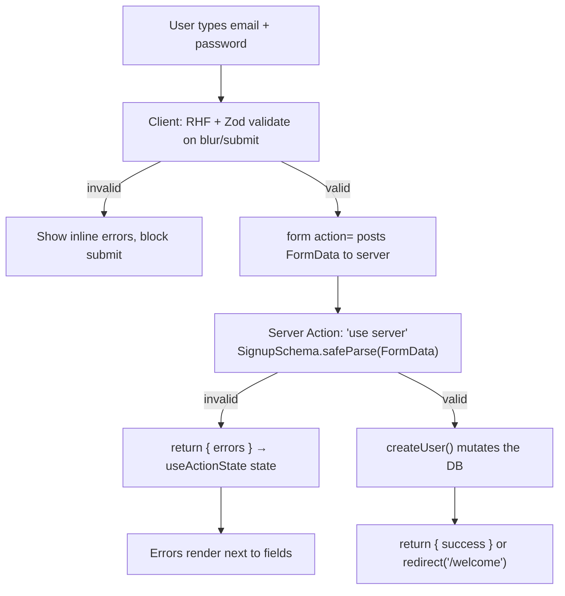

# Forms & Server Actions

> **In one line:** A form collects input, validates it, and sends it to the server to change something. The modern pattern wires a real `<form>` directly to a *server action* — one function that runs on the server, validates, mutates, and returns errors — so it works even before JavaScript loads.

→ **Going deeper:** forms lean heavily on the two-kinds-of-state idea — [State Management](/docs/stack/state-management) covers where form state sits versus server and client state.

:::tip[In plain English]
Most of a real app is *forms*: sign-up, login, checkout, "leave a comment," "edit your profile." A form has three jobs:

1. **Collect** what the user types.
2. **Validate** it — both in the browser (fast, friendly) *and* on the server (the only check you can trust).
3. **Submit** it to the server to actually *do* something (create the account, save the comment).

Beginners often build forms by hand with a tangle of `useState` and `fetch`. The 2026 approach is two well-worn tools: **React Hook Form + Zod** for the input/validation layer, and **Server Actions** (React 19 / Next.js 16) for the submit-and-mutate layer. This page teaches both, then traces one sign-up form all the way through.
:::

## Terms, defined once

- **Controlled input** — A form field whose value lives in React state. React is the single source of truth; every keystroke updates state and re-renders. `value={x}` + `onChange`.
- **Uncontrolled input** — A field that keeps its own value in the DOM. You read it only when you need it (on submit), via a `ref` or the form's `FormData`. The browser is the source of truth.
- **`FormData`** — A built-in browser object holding a form's field names and values. A plain HTML form submit produces one automatically; server actions receive it directly.
- **Schema** — A declared description of what valid data looks like (e.g. "email must be an email; password ≥ 8 chars"). With **Zod**, the schema *is* the validation and *generates* the TypeScript type.
- **Server Action** — A function that runs **only on the server**, callable from a form or a component without you writing a separate API route. Marked with the `"use server"` directive.
- **Progressive enhancement** — The form works with plain HTML first (no JS), then gets *better* when JavaScript loads (inline errors, no full-page reload). It never *requires* JS to function.
- **Optimistic update** — Showing the result immediately — before the server confirms — then reconciling when the real response arrives. Makes the UI feel instant.

## Controlled vs uncontrolled inputs

This is the first fork every form hits. Take a single text field.

**Controlled** — value lives in React state:

```tsx
function NameField() {
  const [name, setName] = useState('');
  return <input value={name} onChange={(e) => setName(e.target.value)} />;
}
```

Every keystroke runs `setName`, re-renders the component, and re-paints the input from state. You always know the current value, and you can react to it live (character counters, instant validation). The cost: a render per keystroke, and you wire `value` + `onChange` on every field.

**Uncontrolled** — value lives in the DOM, read on demand:

```tsx
function NameField() {
  const ref = useRef<HTMLInputElement>(null);
  // read ref.current.value only when you submit
  return <input ref={ref} defaultName="" />;
}
```

No re-render per keystroke; you grab the value at submit time. Less code, faster, but you can't easily react to the value as it changes.

:::info[Why React Hook Form wins here]
Hand-rolling controlled inputs for a 12-field form means 12 `useState`s, 12 `onChange`s, and a re-render of the whole form on every keystroke. **React Hook Form (RHF)** uses *uncontrolled* inputs under the hood (refs) for performance, but gives you a controlled-feeling API. You get the speed of uncontrolled with the convenience of controlled — which is why it's the default in 2026.
:::

## React Hook Form + Zod — the validation layer

You met this pairing briefly in [State Management](/docs/stack/state-management#form-state). Here's the full picture.

**Zod** declares one schema. That schema does triple duty: runtime validation, the TypeScript type, and (via a *resolver*) the form's field-level errors.

```tsx
import { useForm } from 'react-hook-form';
import { zodResolver } from '@hookform/resolvers/zod';
import { z } from 'zod';

const SignupSchema = z.object({
  email: z.string().email('Enter a valid email'),
  password: z.string().min(8, 'At least 8 characters'),
});

// One line gives you the TypeScript type for free:
type SignupValues = z.infer<typeof SignupSchema>;

function SignupForm() {
  const {
    register,
    handleSubmit,
    formState: { errors, isSubmitting },
  } = useForm<SignupValues>({ resolver: zodResolver(SignupSchema) });

  const onSubmit = (values: SignupValues) => {
    // values is fully typed and already validated
  };

  return (
    <form onSubmit={handleSubmit(onSubmit)}>
      <input {...register('email')} />
      {errors.email && <span role="alert">{errors.email.message}</span>}

      <input type="password" {...register('password')} />
      {errors.password && <span role="alert">{errors.password.message}</span>}

      <button type="submit" disabled={isSubmitting}>Sign up</button>
    </form>
  );
}
```

> **In English:** `register('email')` connects the input to RHF using the field name as the key (no `value`/`onChange` needed). On submit, `handleSubmit` runs the `zodResolver`, which validates the values against `SignupSchema`. Any failures land in `errors`, keyed by field name, so you render the message right next to the offending input. `isSubmitting` flips to `true` while your submit handler runs — wire it to the button's `disabled` so users can't double-submit. The `role="alert"` makes a screen reader announce the error the moment it appears.

### Async / server-side validation

Some rules can't be checked in the browser — "is this email already taken?" only the server knows. Zod supports **async refinements**:

```tsx
const SignupSchema = z.object({
  email: z.string().email(),
  password: z.string().min(8),
}).refine(
  async (data) => !(await emailTaken(data.email)),
  { message: 'That email is already registered', path: ['email'] },
);
```

> **In English:** `.refine()` adds a custom rule. Because the check is `async` (it calls the server), Zod awaits it during validation, and `path: ['email']` attaches the failure to the email field so it renders in the right place. The key principle below: **the browser check is a courtesy; the server check is the law.** Never trust client-side validation alone — a malicious user can bypass your JavaScript entirely.

## Server Actions — the modern mutation pattern

Before Server Actions, submitting a form meant: write an API route (`/api/signup`), `fetch` it from the client with `JSON.stringify`, parse the response, handle errors by hand. Server Actions collapse that into **one function**.

A **Server Action** is a function marked `"use server"`. You can pass it straight to a form's `action` prop. React serializes the submit into `FormData`, calls your function *on the server*, and you mutate the database directly — no API route, no `fetch`, no client/server contract to keep in sync.

```tsx
// app/actions.ts
'use server';

import { SignupSchema } from './schema';

export async function signup(prevState, formData: FormData) {
  // 1. Validate on the server (the trustworthy check)
  const parsed = SignupSchema.safeParse({
    email: formData.get('email'),
    password: formData.get('password'),
  });
  if (!parsed.success) {
    // Return field errors back to the form
    return { errors: parsed.error.flatten().fieldErrors };
  }

  // 2. Mutate (create the user, hash the password, etc.)
  await createUser(parsed.data);

  // 3. Return success (or redirect)
  return { success: true };
}
```

> **In English:** `'use server'` at the top marks every export as a server function. `safeParse` validates without throwing — `parsed.success` tells you whether it passed, and `.flatten().fieldErrors` gives you a `{ email: [...], password: [...] }` object that maps cleanly back onto the form. Notice the schema is the *same* Zod schema the client uses — one source of truth, validated on both sides.

### Wiring it up: `useActionState` and `useFormStatus`

Two React 19 hooks connect the form to the action:

- **`useActionState`** — Calls your action and tracks its return value (`state`) plus a `pending` flag. It's how you read back the server's errors or success.
- **`useFormStatus`** — Read from *inside* a child component (e.g. a submit button) to know whether the parent form is currently submitting. Lets you build a reusable `<SubmitButton>` that disables itself.

```tsx
// app/signup-form.tsx
'use client';

import { useActionState } from 'react';
import { useFormStatus } from 'react-dom';
import { signup } from './actions';

function SubmitButton() {
  const { pending } = useFormStatus();
  return <button disabled={pending}>{pending ? 'Creating…' : 'Sign up'}</button>;
}

export function SignupForm() {
  const [state, formAction] = useActionState(signup, { errors: {} });

  return (
    <form action={formAction}>
      <input name="email" />
      {state.errors?.email && <span role="alert">{state.errors.email[0]}</span>}

      <input name="password" type="password" />
      {state.errors?.password && <span role="alert">{state.errors.password[0]}</span>}

      <SubmitButton />
    </form>
  );
}
```

> **In English:** `useActionState(signup, initialState)` returns the latest `state` returned by the action and a `formAction` you hand to `<form action={...}>`. When the form submits, React posts the `FormData` to `signup` on the server, and whatever it returns becomes the new `state` — that's how server errors surface in the UI. `<SubmitButton>` calls `useFormStatus()` to read the form's `pending` state without prop-drilling. Crucially, because the form uses the native `action` attribute, **it submits even with JavaScript disabled** — that's progressive enhancement, for free.

### Optimistic updates

For things that almost always succeed (liking a post, adding a comment), don't make the user wait. **`useOptimistic`** shows the result instantly, then reconciles:

```tsx
'use client';
import { useOptimistic } from 'react';

function Comments({ comments, addComment }) {
  const [optimistic, addOptimistic] = useOptimistic(
    comments,
    (state, newComment) => [...state, { ...newComment, pending: true }],
  );

  async function action(formData: FormData) {
    const text = formData.get('text') as string;
    addOptimistic({ text });        // show it immediately
    await addComment(formData);     // server action confirms (or the UI rolls back on error)
  }

  return (
    <>
      {optimistic.map((c) => (
        <p key={c.text} style={{ opacity: c.pending ? 0.5 : 1 }}>{c.text}</p>
      ))}
      <form action={action}>
        <input name="text" />
        <button>Post</button>
      </form>
    </>
  );
}
```

> **In English:** `useOptimistic` keeps a *temporary* version of the list with the new comment added (dimmed via `pending`). The user sees their comment instantly. When the server action resolves, React replaces the optimistic state with the real data; if the action throws, the optimistic entry is discarded and the UI reverts automatically.

## Worked example, traced: a sign-up form end to end

Let's follow one submission through every stage.



Trace, step by step, for input `email: "ada@"`, `password: "12345"`:

1. **Type & blur.** RHF runs `zodResolver`. Zod sees `"ada@"` fails `.email()` and `"12345"` fails `.min(8)`. `errors.email.message = "Enter a valid email"`, `errors.password.message = "At least 8 characters"`. Both render in red under their fields. Submit is blocked client-side.
2. **User fixes input** to `email: "ada@site.com"`, `password: "averylongpass"`. Client validation passes. The native `<form action={formAction}>` submits the `FormData`.
3. **Server Action fires.** On the server, `signup` calls `SignupSchema.safeParse(...)`. Now an *async* refinement runs `emailTaken("ada@site.com")` against the database. Suppose it returns `true`.
4. **Server returns errors.** `parsed.success` is `false`; `signup` returns `{ errors: { email: ["That email is already registered"] } }`. `useActionState` updates `state`, and the email field now shows the server's message — *even though the client thought the input was fine.* This is the server-error-surfacing pattern in action.
5. **User picks a new email**, resubmits. `safeParse` passes, `createUser` writes the row, the action returns `{ success: true }` (or `redirect('/welcome')`). Done — and the whole flow worked without a single hand-written API route or `fetch` call.

## Why it matters

Forms are where users *change* your app's data, which makes them the highest-stakes surface you build: a broken form is a lost signup, a lost sale, or a security hole. The Server Actions pattern matters because it (1) removes the boilerplate (no API route + `fetch` + JSON plumbing), (2) keeps **one** validation schema running on both client and server, and (3) is **progressively enhanced**, so the form still works on a flaky connection or before JS hydrates. Knowing this pattern cold is table stakes for a Next.js job in 2026.

## Common mistake

:::caution[Where people commonly trip up]
- **Trusting client-side validation.** RHF + Zod in the browser is for *fast feedback*, not security. A user can disable JS or hit your action directly. **Always** re-validate inside the server action with the same schema — the server check is the only one that counts.
- **Reaching for `useState` + `fetch` + a hand-written API route in 2026.** That's the pre-2024 pattern. For mutations in Next.js, a server action is less code, type-safe, and progressively enhanced. Write the API route only when a *third party* needs the endpoint.
- **Duplicating the schema.** Writing one Zod schema for the form and a different ad-hoc check on the server guarantees they drift. Define the schema once (a shared file), import it in both the RHF resolver and the server action.
- **Forgetting the `pending` / `isSubmitting` state.** Without disabling the button while the action runs, users double-click and you create two accounts. Wire `useFormStatus().pending` (or RHF's `isSubmitting`) to the button's `disabled`.
- **Optimistic updates with no rollback.** `useOptimistic` reverts automatically *if the action throws* — but if your action swallows the error and returns "success," the bad state sticks. Let failures throw (or return an error the UI checks) so the optimistic entry rolls back.
- **Mismatched field `name`s.** Server Actions read `formData.get('email')` by the input's `name` attribute, not RHF's `register` key. If the `name` doesn't match what the action expects, you'll read `null`. Keep them identical.
:::

## Page checkpoint

<Quiz id="stack-forms-server-actions-page" title="Did forms & server actions stick?" sampleSize={3} passingScore={2}>

<Question
  prompt="Why must you re-validate form input inside the server action even though React Hook Form + Zod already validated it in the browser?"
  options={[
    { text: "Server validation is faster than client validation" },
    { text: "Client-side validation can be bypassed (JS disabled, direct calls), so only the server check is trustworthy" },
    { text: "Zod schemas don't run in the browser" },
    { text: "It's required to generate the TypeScript types" }
  ]}
  correct={1}
  explanation="Browser validation is a courtesy for fast feedback. A user can disable JavaScript or call your action directly, so the server-side check with the same schema is the only one you can trust. Reuse the one Zod schema on both sides."
  revisit={{ to: "/docs/stack/forms-server-actions#async--server-side-validation", label: "Async / server-side validation" }}
/>

<Question
  prompt="What does marking a function with the 'use server' directive and passing it to a form's action prop give you that the old API-route + fetch pattern did not?"
  options={[
    { text: "Automatic database backups" },
    { text: "A mutation function callable directly from the form — no API route, no fetch, and it works before JavaScript loads (progressive enhancement)" },
    { text: "Client-side-only execution for speed" },
    { text: "Built-in CSS styling for the form" }
  ]}
  correct={1}
  explanation="A Server Action is a server-only function you hand straight to the form. React posts the FormData to it — no hand-written API route or fetch — and because it uses the native form action attribute, the form submits even with JS disabled."
  revisit={{ to: "/docs/stack/forms-server-actions#server-actions--the-modern-mutation-pattern", label: "Server Actions" }}
/>

<Question
  prompt="In the React 19 form pattern, what are `useActionState` and `useFormStatus` each for?"
  options={[
    { text: "Both manage global app state like Zustand" },
    { text: "`useActionState` tracks the action's return value (e.g. server errors) and pending flag; `useFormStatus` reads the form's pending state from inside a child like a submit button" },
    { text: "`useActionState` styles the form; `useFormStatus` validates it" },
    { text: "They replace Zod schemas entirely" }
  ]}
  correct={1}
  explanation="useActionState wires the action to the form and exposes the latest returned state (so server errors surface) plus pending. useFormStatus lets a child component (like a reusable SubmitButton) read whether the parent form is submitting, without prop-drilling."
  revisit={{ to: "/docs/stack/forms-server-actions#wiring-it-up-useactionstate-and-useformstatus", label: "useActionState & useFormStatus" }}
/>

<Question
  prompt="What does an optimistic update (e.g. via `useOptimistic`) do?"
  options={[
    { text: "It validates the form twice for safety" },
    { text: "It shows the expected result immediately, before the server confirms, then reconciles (or rolls back) when the real response arrives" },
    { text: "It caches server data so you never refetch" },
    { text: "It disables the submit button while the action runs" }
  ]}
  correct={1}
  explanation="Optimistic updates make the UI feel instant by rendering the expected outcome right away, then replacing it with the real server result — or rolling back automatically if the action throws."
  revisit={{ to: "/docs/stack/forms-server-actions#optimistic-updates", label: "Optimistic updates" }}
/>

</Quiz>

## What's next

→ Continue to [Design Systems & Storybook](./design-systems-storybook) — how teams build the reusable, accessible components your forms (and everything else) are made of.
